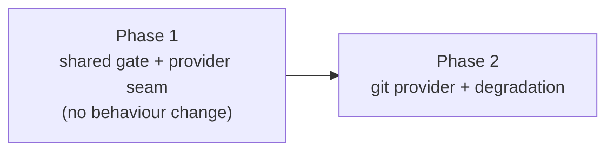

# Phased plan - A git-worktree fallback provider for Workflow check leases

## Source

- Approved plan: [`plan.md`](plan.md) (rendered: [`plan.html`](plan.html))
- Phase 1: [`phase-1-shared-gate-and-provider-seam.md`](phase-1-shared-gate-and-provider-seam.md)
- Phase 2: [`phase-2-git-provider-and-degradation.md`](phase-2-git-provider-and-degradation.md)

## Incorporated human decisions

| Decision | Selected | Consequence for the phases |
| --- | --- | --- |
| Behaviour when treehouse is absent | **Git worktree fallback** | The gate keeps gating. A pre-flight returning `unavailable` was rejected because it ships a silent-pass window; the phased variant of that was rejected for the same reason. |
| Which halves of the gate a check asks | **Binary half only (`hasBin`)** | `pool.ts` exposes `treehouseInstalled()` **and** `poolAvailableFor()`. A check asks the first; dispatch asks the second. A repository with no `treehouse.toml` keeps today's behaviour. |
| Extra scope | **Core fix + the README `max_trees` drift** | The "provider call" mislabelling and the silent opt-in question are filed separately and are explicit non-goals in both phases. |

## What the investigation established

The defect is measured, not inferred - `test/workflow-check-degradation.test.ts` already exists in the
worktree and currently **passes by proving the bug**:

| Path, on one machine with only `treehouse` stripped from PATH | Result |
| --- | --- |
| `provisionWorktree` | `provider: "git"` - degrades, isolation intact |
| A check whose command would have exited 0 | `kind: "infrastructure"` - cannot run |
| An unsupported platform, by contrast | `kind: "unavailable"` - recorded and passes |

Findings that shaped the boundaries:

- `dispatcher.ts:773` is the **only** `hasBin(TREEHOUSE_BIN)` in the codebase, and neither it nor
  `isTreehouseRepo` appears anywhere under `src/server/workflows/`.
- `MAX_INFRA_ATTEMPTS = 3` (`engine.ts:49`); exhaustion at `engine.ts:1133-1145` sets the submission
  `failed` and the run `blocked`/`infrastructure_error` with **no receipts**, and `manager.ts:2481`
  makes the Inspector refuse to touch a blocked run. The run stalls until a human intervenes.
- **Scope correction against the source plan's first draft:** `treehouse get` *succeeds* in a
  repository with no `treehouse.toml`, creating a pool from defaults (verified against v2.1.1). So the
  missing `treehouse.toml` case is **not** part of this defect, which is what makes the binary-half-only
  decision coherent rather than a compromise.
- `WorktreeProvider = "treehouse" | "git"` already exists (`src/shared/types.ts:1386`) and
  `teardownWorktree` already branches on it. No new union is introduced.
- `reapPool` early-returns for a non-treehouse repo (`pool.ts:608`), and every current `withPoolLock`
  caller is a genuine pool operation. Both verified, both load-bearing for Phase 2's design.

## Phases

| # | Phase | Delivers | Behaviour change |
| --- | --- | --- | --- |
| 1 | [Shared gate and provider seam](phase-1-shared-gate-and-provider-seam.md) | Two named predicates in `pool.ts`, `hasBin` moved to `util/exec.ts`, the `provider` column migration, and `CheckTreeProvider` with the pool as its only implementation | **None, by design** |
| 2 | [Git provider and degradation](phase-2-git-provider-and-degradation.md) | `GitCheckTreeProvider`, acquire-time selection on `treehouseInstalled()`, `CHECK_WORKTREES_DIR`, the flipped regression test, README | A check gate runs without treehouse |

## Dependency graph

```
Phase 1  ──►  Phase 2
```



Direct prerequisites:

- **Phase 1:** none.
- **Phase 2:** Phase 1.

## Concurrency

**None. These phases are strictly serial**, and that is a finding rather than a shortcut. Both edit
`src/server/workflows/check-lease.ts` substantially - Phase 1 restructures it behind an interface and
Phase 2 adds a second implementation plus the selection - so running them concurrently would conflict
in the one file whose ownership rules this whole subsystem exists to protect.

Splitting further was considered and rejected: any smaller unit either leaves a dead surface (an
interface with no caller) or a temporary second source of truth (a provider column nothing writes).

## Merge order

1. Phase 1
2. Phase 2

## Cross-phase contracts

Established by Phase 1, consumed by Phase 2, and **not** to be changed by Phase 2:

- `treehouseInstalled()` and `poolAvailableFor(repoRoot)` in `src/server/pool.ts`; `hasBin` in
  `src/server/util/exec.ts`, kept distinct from `onPath`.
- `CheckTreeProvider` as the only route from `CheckLeaseManager` to a tree, with `acquire`,
  `ownership`, `handBack`, `withLock`.
- `CheckLeaseRow.provider`, `NOT NULL DEFAULT 'treehouse'`, **authoritative on release and never
  re-probed** from the current machine.
- The four-way mapping in `resolveLocked` - unreadable / gone / held-by-another / ours - preserved
  verbatim along with its comments.
- Unconditional pinning for both providers; `LIVE_STATES`-scoped partial indexes untouched;
  `reapPool`'s early return untouched.

## Final verification strategy

Phase 1 is verified by the **absence** of change: every existing check, pool, and dispatch suite must
pass untouched, and `test/workflow-check-degradation.test.ts` must still assert
`kind: "infrastructure"`. That suite is the phase's own no-op proof.

Phase 2 flips that same suite into the regression test and adds the pinning, no-leak,
provider-authoritative, fail-closed, and adopted-split cases. It also runs `npm run build && npm run
smoke` because it adds a runtime surface.

Neither phase carries an `e2e/` spec: there is no UI surface in this work. The separately filed
mislabelling fix is the one that does, and it carries its own.

Definition of done for the whole plan: with no `treehouse` installed, a configured check runs its
command in a worktree pinned to the captured commit and reports a real verdict; with `treehouse`
installed, nothing about the pool path changed; a repository with no `treehouse.toml` still takes a
pooled tree for its checks; and the README matches, `max_trees` included.

## Audit over the complete set

- Every source-plan requirement is owned by exactly one phase. The migration and the seam are Phase 1
  only; the git implementation, the selection, the tests, and the documentation are Phase 2 only.
- Every consumer follows its prerequisite: Phase 2's selection reads a column and an interface Phase 1
  created.
- Concurrency claims are honest - there are none, and the reason is recorded above rather than implied.
- The final state matches the source plan with no undocumented cleanup. The one deliberate residual -
  a `treehouse` row leaking until a vanished binary returns - is documented in the source plan, in
  Phase 2's scope, and pinned by a test, so it cannot be mistaken for an oversight later.
- Both explicit non-goals appear as non-goals in **both** phase files, because Phase 2 is where the
  temptation to fold them in is highest.
