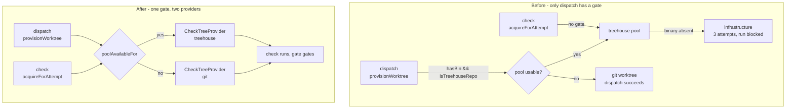

# A git-worktree fallback provider for Workflow check leases

## The defect

`provisionWorktree` treats the treehouse pool as a **fast path over an invariant it keeps either
way** - an agent never shares a working tree. On a machine with no `treehouse` binary it falls
through to a throwaway `git worktree` and the dispatch succeeds (`dispatcher.ts:773`, the
`hasBin(TREEHOUSE_BIN) && isTreehouseRepo(repoRoot)` gate).

A Workflow check reaches the pool through `CheckLeaseManager.acquireForAttempt`, and **no such gate
exists anywhere upstream of it**. `dispatcher.ts:773` is the only `hasBin(TREEHOUSE_BIN)` in the
codebase, and neither `hasBin` nor `isTreehouseRepo` appears anywhere under `src/server/workflows/`.

So a configured, authorized check gate cannot run at all on a machine without treehouse, and it
spends a bounded retry budget discovering that.

### Measured, not assumed

`test/workflow-check-degradation.test.ts` pins this. One machine, one opted-in repository, PATH
stripped of only the `treehouse` binary (`git` and `node` left reachable):

| Path | Result |
| --- | --- |
| `provisionWorktree` | `provider: "git"` - degrades, isolation intact |
| A check whose command **would have exited 0** | `kind: "infrastructure"` - cannot run |
| An unsupported platform, by contrast | `kind: "unavailable"` - recorded and **passes** |

The third row is what makes this a defect rather than a preference. The runtime already has a
"cannot run here, record it and pass" outcome and an unsupported platform uses it
(`check-runtime.ts:167-168`). The treehouse-absent path does not.

The operator-facing string today:

```
a worktree for the test check could not be prepared: the treehouse pool in <repo>
could not hand over a worktree for this check: treehouse get exited 1
 - treehouse said: spawn treehouse ENOENT
```

### What it costs

`MAX_INFRA_ATTEMPTS = 3` (`engine.ts:49`). Three attempts, 1s + 4s of backoff, then
`engine.ts:1133-1145`: the submission goes `failed`, the run goes `blocked` in phase
`infrastructure_error`, event `persona_infrastructure_exhausted`, and **no receipts are written**.
The run then stalls indefinitely - `manager.ts:2481` makes the Inspector refuse to touch a blocked
run. Only a manual retry or a resubmit revives it.

A permanent environmental fact is being fed through a ladder built for transient failure. Nothing
about a missing binary changes between attempt 1 and attempt 3.

### Scope correction

`treehouse get` **succeeds in a repository with no `treehouse.toml`**, creating a pool from
defaults - verified directly against treehouse v2.1.1. So a missing `treehouse.toml` does not
trigger this; only the **absent binary** does. (That the two halves disagree about what opting in
means is a real inconsistency, but it is a design question and is filed separately.)

## The decision

**Fall back to a plain `git worktree`, do not decline the gate.**

A check gate that stops gating is worse than one that stalls loudly: a silent pass tells the
operator their build is green when it never ran. Dispatch already proves the invariant is holdable
without treehouse. A check does not need a *pooled* tree - it needs an **isolated tree pinned to a
commit**, which `git worktree add --detach <path> <sha>` produces directly.

Rejected: a pre-flight that returns `unavailable`. It ships a silent-pass window on purpose.
Rejected: shipping the pre-flight first and the fallback later, for the same reason.

## Design

### One gate, shared

The root cause is that two call sites answered "is the pool usable here?" and only one of them
existed. Both halves of that question move into the module that already owns `isTreehouseRepo`, and
they are **named separately** rather than only as their conjunction:

```ts
// src/server/pool.ts
/**
 * Whether the pool binary is resolvable at all. This is the half that was missing on the check
 * path, and it is the ONLY half a check asks - see below.
 */
export async function treehouseInstalled(): Promise<boolean>;

/** The full dispatch gate: the binary is there AND this repository opted in. */
export async function poolAvailableFor(repoRoot: string): Promise<boolean>;
```

`dispatcher.ts:773` becomes `if (await poolAvailableFor(repoRoot))`; the check path asks
`treehouseInstalled()`. Keeping both in one module is the anti-drift change - without it the next
subsystem to want a worktree makes the same mistake a third time.

#### Decided: the check path asks the binary half only

**Adopted.** The gate has two halves - `hasBin(TREEHOUSE_BIN)` and `isTreehouseRepo(repoRoot)` - and
only the first is the defect. Had checks adopted the whole predicate, every repository with no
`treehouse.toml` would have stopped getting a pooled tree for its checks: a real behaviour change,
and one that silently answers the opt-in question filed separately below.

So this change fixes exactly the defect and nothing else. The cost is honest and small: "one gate"
is one *module* exposing two named predicates, and the reason a check asks only one of them must be
written down at both call sites, or a later reader will "tidy" them into the conjunction and ship
the deferred decision by accident.

The rejected alternative - both halves, so the two paths cannot drift by construction - is probably
where the opt-in question lands eventually. That is an argument for deciding it deliberately, in its
own change, not inside a bug fix.

`hasBin` is module-private in `dispatcher.ts` today. Move it to `src/server/util/exec.ts` beside
`onPath`, which is already documented as the other half of the same question. Do **not** merge the
two: `onPath` walks the filesystem, `hasBin` spawns `which`, and that file explains why both exist.

### A provider seam, not a second copy

`CheckLeaseManager` keeps its whole state machine. Only the four treehouse-specific operations move
behind an interface, resolved once per acquisition:

```ts
interface CheckTreeProvider {
  readonly kind: WorktreeProvider;                    // the EXISTING union, src/shared/types.ts:1386
  acquire(input: { repoRoot: string; attemptId: string; baseSha: string }):
    Promise<{ path: string; holderToken: string }>;
  /** Who holds this path now, read from the provider's own bookkeeping. */
  ownership(row: CheckLeaseRow): Promise<
    | { state: "unreadable"; reason: string }   // we failed to LOOK -> retryLater, no authorisation change
    | { state: "gone" }                         // already returned / not ours -> settle "returned"
    | { state: "held"; holder: string }         // compared against row.holderToken by the manager
  >;
  handBack(row: CheckLeaseRow): Promise<RunResult>;
  withLock<T>(repoRoot: string, fn: () => Promise<T>): Promise<T>;
}
```

`resolveLocked` keeps its exact shape and its three-way distinction - "could not look" versus
"already returned" versus "held by someone else" - and asks the provider instead of reaching for
`cli` directly. That distinction is load-bearing and documented at length in `check-lease.ts`; this
change must not blur it.

The manager keeps every state write (`settle`, `failedReturn`, `retryLater`). A provider that could
write `cleanup_state` would be a second source of truth for the lifecycle.

### The two implementations

| | `treehouse` | `git` |
| --- | --- | --- |
| `acquire` | `acquireLease` + `pin` (lease, then reset to the commit) | `git worktree add --detach <dir>/<attemptId> <sha>`, then `verifyHeadIs` |
| `ownership` | `treehouse status`, parsed, holder token compared | `git worktree list --porcelain`; **presence is ownership** |
| `handBack` | `treehouse return --force` | `git worktree remove --force` |
| `withLock` | `withPoolLock(repoRoot)` | pass-through |
| Branch to clean up | none (pool trees are detached/reset) | none (`--detach`) |

**Why presence is ownership for git, and a token is needed for the pool.** A pool *slot* is handed
out again and again, so a path alone says nothing about who holds it - hence `holder_token`. A check
git tree lives at a path derived from an `attemptId`, which is unique forever and never reused, so
if the path is a registered worktree it is ours by construction. This asymmetry is the reason
`ownership` returns a shape rather than a boolean, and it belongs in a comment.

`withLock` is a pass-through for git because there is no cross-process pool to serialize against and
`git` takes its own index lock; the in-process single-flight the `busy` set already provides is
sufficient. Confirm during implementation that nothing else depends on `withPoolLock` being taken on
every check acquisition.

Trees live under a new `CHECK_WORKTREES_DIR = join(STATE_DIR, "check-worktrees")`, deliberately
separate from `WORKTREES_DIR`, so no dispatch-side sweep can mistake a check tree for a task tree.

### Schema

```ts
addColumn(d, "workflow_check_leases", "provider", "TEXT NOT NULL DEFAULT 'treehouse'");
```

The default is not a guess. Every row that can exist before this migration was written by the
treehouse-only path, so `'treehouse'` is the historically accurate value. That is what keeps this
clear of the trap the table's own comment warns about - a nullable column whose NULL is
indistinguishable from a row written by a build that did not set it.

**The recorded provider is authoritative on release, always** - never re-probed from the current
machine. This is the entire reason the column exists: a row taken while treehouse was installed must
still be handed back to the pool after the operator uninstalls it, and a git row must not be handed
to `treehouse return` because the binary reappeared.

### Recovery, and one edge case worth stating

`reconcileOnStartup`, `resolveRecovered`, and `reclaimLeaked` need no logic change - they all route
through `releaseForAttempt`, which now selects the provider from `row.provider`.

A `treehouse` row on a machine where the binary has since vanished resolves `ownership` →
`unreadable` → `retryLater`: the row stays live, the pin stays, nothing is destroyed. That is
correct and is the existing fail-closed reading - we failed to look, so we have proven nothing, and
the tree may well still exist. It leaks one row until the binary returns. This is a deliberate
outcome, not an oversight.

Pinning stays **unconditional** for both providers. A pin is only ever a spare-list for the reaper,
and a git check path simply never appears in a pool status, so there is nothing to gain from making
the pin conditional and one more branch to get wrong.

## Flow



Both callers ask one predicate; the check acquires through whichever provider it names, records that
provider on the row, and releases through the recorded one.

## Tests

`test/workflow-check-degradation.test.ts` already exists and currently proves the bug. **Flip its
central assertion**: with no treehouse installed, the check must now run and pass. It becomes the
regression test.

Added cases:

- A git-provider tree is pinned to the captured commit, verified by the real `verifyPinnedBase` -
  the same standard the pool arm is already held to.
- A git-provider tree is removed after the check and its row reaches a terminal state; the suite's
  existing per-case leak assertion covers the rest.
- A `treehouse` row is released through treehouse even when the current machine would now choose
  git. The provider column is authoritative.
- A `treehouse` row with the binary gone resolves `retry`, keeps the row live, and keeps the pin.
- With the binary absent, dispatch and a check **both** fall back to git - the defect, closed.
- With the binary present and no `treehouse.toml`, dispatch takes a git worktree and a check still
  takes a pooled tree. This asserts the adopted split *deliberately*, so the deferred opt-in
  decision cannot be made by accident later; the case names why it is that way.
- An existing database with `workflow_check_leases` rows opens after the migration and backfills
  `provider = 'treehouse'`.

No `e2e/` spec: this change has no UI surface. (The mislabelling fix below does, and carries its
own.)

## Documentation

- `README.md:2922` says the repository's pool sets `max_trees` 16; `treehouse.toml:23` sets 32. Fix
  the number.
- `README.md:2920-2925` ("Checks share the treehouse pool with dispatch") gains what happens when
  treehouse is absent.

## Filed separately, deliberately not in this change

- **The "provider call" mislabelling.** A check attempt records a null runner and model on purpose -
  *"a check is not a model call, and stamping it with a provider it never used would put a fiction
  in front of whoever reads the run"* (`engine.ts:1000-1002`). Yet the operator sees **"Retry
  provider call"** (`WorkflowRuns.tsx:679`) and **"provider call failed"** (`run-model.ts:667`).
  Someone whose `npm test` gate could not get a worktree is told an LLM provider failed. This is a
  UI change and needs its own Playwright spec, so it does not ride along inside a bug fix.
- **The silent opt-in.** Checks create a treehouse pool for repositories with no `treehouse.toml`,
  where dispatch would use a plain worktree. Deciding what counts as opting in is a design call in
  its own right.

## Risks

- **The reaper.** Confirm `reapPool` early-returns for a non-treehouse repo (`pool.ts:608`) and that
  a pin holding a non-pool path is inert.
- **Mid-run provider change.** Installing or removing treehouse between a check's acquire and its
  release is exactly what the provider column absorbs; the release path must never re-probe.
- **`withPoolLock` pass-through.** Verify no other caller depends on that lock being taken for every
  check acquisition before making it provider-specific.
