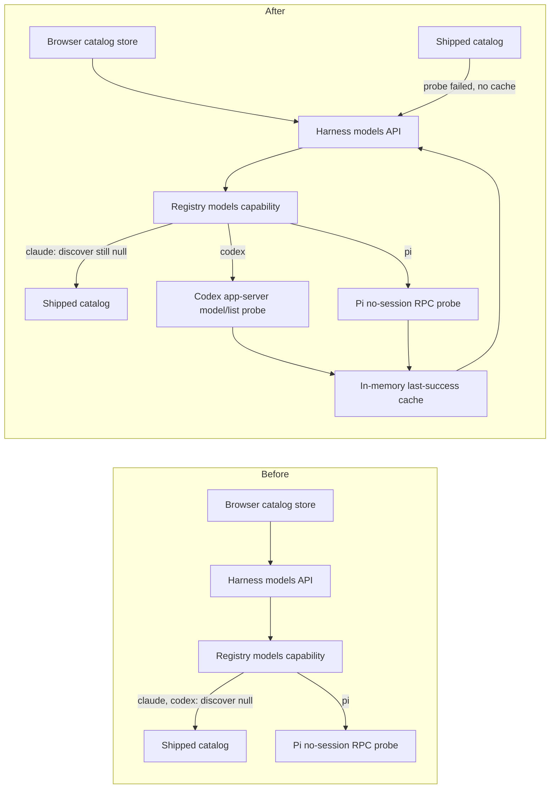

# Claude and Codex live model catalog proposal

Status: Approved for implementation of the Codex half. Claude discovery is deferred to a separate change.

Predecessor: [Pi live model catalog proposal](../pi-live-model-catalog/plan.md), which built the spine this plan fills in and explicitly deferred these two harnesses: "Dynamically sourcing Claude or Codex catalogs in the first change. They use the same harness contract but retain shipped results."

## Approved human decisions

- **Catalog scope:** Codex goes live now; Claude stays on its shipped rows. Codex's rows are wire-id shaped, schema-passing, and a strict superset of what ships today, so it carries no contract question. Claude's are account-shaped aliases, two of which `ModelIdSchema` rejects, so that question belongs to a change that can weigh the persisted vocabulary properly.
- **`ModelIdSchema` stays untouched** by this change.
- **Implementation follow-up:** implement the approved phase directly rather than scheduling phase tasks.

## Outcome

Mission Control should source Claude and Codex model choices from the CLI installation and account it will actually launch, the same way it already sources Pi's, while remaining usable when discovery is unsupported or fails. Selecting a model must continue to persist and launch a value the target CLI accepts.

## Why now

`MODEL_CATALOG` in `src/shared/model.ts` is hand-maintained, so a new Claude or Codex model reaches the picker only when someone edits that file and ships a build. That is already observably stale for Codex: the installed CLI offers six models and Mission Control offers four.

## Evidence

Measured on this machine, 2026-09-03, against `claude` 2.1.260 (with the installed `@anthropic-ai/claude-agent-sdk`) and `codex-cli` 0.146.0. Probe scripts were run outside the repository and are not committed.

### The spine already exists

| Piece | Location | State |
| --- | --- | --- |
| `ModelCatalogSpec { shipped, discover }` on every harness | `src/server/harness/types.ts:1129` | Built |
| Freshness, in-flight dedup, abort-on-stop, degraded-with-last-success | `src/server/harness/model-catalog-service.ts` | Built |
| `GET /api/harnesses/models?refresh=1` | `src/server/routes.ts:5622` | Built |
| Browser store with local/loading/ready/failed phases and degraded notices | `src/web/model-catalog.tsx` | Built |
| `discover` for Claude and Codex | `src/server/harness/index.ts:99,146` | `null` |

So this change is two adapters and two registry slots, not new architecture. `HarnessModelCatalogService.readOne` returns the shipped list without probing whenever `spec.discover` is null, which is why both harnesses can only ever report `source: "shipped"` today.

### Codex: a clean, verified discovery path

`model/list` exists in the app-server v2 protocol of the installed binary, confirmed by generating the bindings from that binary (`codex app-server generate-ts`).

- Handshake `initialize` 593ms cold, about 480ms total on a warm repeat. `model/list` itself 2ms.
- 6 visible rows, 8 with `includeHidden: true`. 6035-byte result payload, 14472 bytes of stdout across the whole probe, 0 bytes of stderr, `nextCursor: null`.
- No thread was started and no turn was run, so nothing was spent.
- Live rows: `gpt-5.6-sol` (`isDefault: true`), `gpt-5.6-terra`, `gpt-5.6-luna`, `gpt-5.5`, `gpt-5.4`, `gpt-5.4-mini`. **`gpt-5.4` and `gpt-5.4-mini` are absent from Mission Control's shipped Codex catalog.**
- All 6 ids pass `ModelIdSchema`.
- Each row carries `id`, `model`, `displayName`, `description`, `hidden`, `supportedReasoningEfforts`, `defaultReasoningEffort`, `inputModalities`, `serviceTiers`, `isDefault`, `upgrade`/`upgradeInfo`. On every row observed, `id` and `model` held the same string; two fields exist, so the adapter must pick one deliberately.
- No context-window field is reported, so `contextWindow` stays null for Codex rows.

### Claude: a verified path whose shape collides with a persisted contract

The Agent SDK exposes `supportedModels()`, and the rows also ride along on the initialize response as `SDKControlInitializeResponse.models`.

- `initializationResult()` 5874ms on a cold first run, then 1018ms, 1466ms and 1629ms warm. `supportedModels()` 0ms afterwards, because the data already arrived with the handshake. 5 rows, 1306 bytes.
- **No session file was created**: `~/.claude/projects/<probe-cwd-slug>` held 0 files before and after, so the Pi rule "never create a session during discovery" holds here too.
- **The cold 5874ms exceeds Pi's 5000ms timeout bound**, so that constant cannot simply be reused.
- The rows are account and picker shaped, not a wire-id catalog:

| `value` | `resolvedModel` | `displayName` |
| --- | --- | --- |
| `default` | `claude-sonnet-5` | Default (recommended) |
| `opus[1m]` | `claude-opus-5[1m]` | Opus (1M context) |
| `sonnet` | `claude-sonnet-5` | Sonnet |
| `haiku` | `claude-haiku-4-5-20251001` | Haiku |
| `opusplan` | `claude-sonnet-5` | Opus Plan Mode |

- **`opus[1m]` and `claude-opus-5[1m]` are rejected by `ModelIdSchema`** (verified by running the schema against them). `src/shared/model.ts:136` excludes `[1m]` markers deliberately, because these ids are pasted onto a command line.
- `opusplan` is a mode rather than a model, and `default` is an alias the organization resolves. Neither is a model id in the sense the rest of the app means.
- The live list does not include `claude-fable-5` or `claude-opus-4-8`, both of which the shipped catalog offers today. A naive cutover therefore **shrinks** the Claude picker and swaps wire ids for aliases.
- The handshake also returns `account` (email, organization, subscriptionType, apiProvider). None of it may reach the browser.

### What else moves

- `test/harness-model-catalog.test.ts:86-87` asserts `discover === null` for both harnesses. Those two lines are where the current decision is written down, and they are the pins that flip.
- `e2e/fixtures/fake-codex.mjs` answers unknown app-server methods with an empty result, so `model/list` needs a real case rather than silently returning nothing.
- `e2e/fixtures/fake-claude.mjs` answers every `control_request` subtype with a bare `{}`, so the handshake needs a `models` payload.
- `docs/models.md:79` currently states that Claude and Codex remain on shipped static rows.
- `src/server/harness/codex/pricing.ts` prices only `gpt-5.6-sol`, `gpt-5.6-terra`, `gpt-5.6-luna` and `gpt-5.5`, and `estimateStandardApiUsage` returns null for anything else. Making `gpt-5.4` and `gpt-5.4-mini` selectable means those sessions get no cost estimate until verified public rates are added. It degrades safely and must not be fixed by inventing prices.
- The vendored bindings say `codex-cli 0.145.0` while the installed binary is 0.146.0. Regenerating to add the new roots absorbs that version bump, so the diff has to be read rather than assumed empty.

## The deferred question: what the Claude picker shows

Resolved for now by deferring: **option D was adopted**, so Claude keeps its shipped rows and this change touches only Codex. The options below are retained because the question itself is still open and this table is the input to the follow-up change, not a record of a settled choice.

Codex needed no such decision - its rows are wire-id shaped, schema-passing, and strictly a superset of what ships today. Claude's are not, so this is a product choice equivalent to Pi's approved "mirror every model, grouped by provider".

| Option | What the picker shows | Cost |
| --- | --- | --- |
| **A. Mirror the aliases** | Default, Opus (1M context), Sonnet, Haiku, Opus Plan Mode; persist the alias | `opus[1m]` fails `ModelIdSchema`, so the persisted vocabulary must widen. `opusplan` and `default` are not models. A persisted alias silently changes meaning when the org default moves, which is a footgun for a task scheduled last week |
| **B. Resolve to wire ids** | Sonnet 5, Opus 5 (1M), Haiku 4.5, deduplicated from `resolvedModel` | Still hits `[1m]`. Collapses Default, Sonnet and Opus Plan Mode into one row, losing labels operators recognize. Still drops Fable 5 and Opus 4.8 |
| **C. Union live over shipped** | Everything shipped, plus any live row not already present, with live rows marked | Nothing currently selectable disappears and discovery becomes a signal rather than a replacement. The picker can still list a model this account cannot run, which is the mirror image of today's bug, so the distinction has to be visible |
| **D. Codex now, Claude later** | Codex goes live; Claude stays shipped | Ships the unambiguous half immediately and leaves the alias and `[1m]` question to a change that can weigh `ModelIdSchema` properly. Claude's staleness persists until then |

**Adopted: D, with C as the recommended shape for the follow-up.** Codex is a measured gap with a clean fix and no contract question. Claude forces a decision about `ModelIdSchema`, which governs persisted task and config values, and a persisted-vocabulary change deserves its own change rather than riding along with a catalog refresh. When Claude is picked up, option C is the starting recommendation because it cannot regress the picker.

## Changed request flow

Today, for Claude and Codex, the service short-circuits to the shipped table. After this change Codex joins Pi on a bounded probe subprocess, with the shipped table as fallback, and Claude keeps the short-circuit until the deferred question is answered.

Nothing downstream of choice production changes. `ModelIdSchema`, config and task persistence, and the `--model` launch path stay as they are, which is exactly what option A would have broken and what the adopted option preserves.

## Scope

### In scope

1. A Codex discovery adapter over `codex app-server` `model/list`, spawned through the same path the embedded driver already uses.
2. Regenerating the vendored app-server bindings with the two new roots, and reading the 0.145 to 0.146 diff.
3. Codex-specific measured bounds, in their own constant beside Pi's, since the two probes have different shapes and different measured costs.
4. Fake and Playwright coverage for the Codex adapter, and unit coverage for framing, mapping, bounds and every failure mode.
5. Documentation that matches the result, including replacing the sentence in `docs/models.md` that says these two stay static, and saying which of the two now discovers.

### Out of scope

- **Claude discovery**, deferred by the adopted decision above. The measurements stay in this document so the follow-up change starts from evidence rather than repeating the probe.
- Feeding live effort metadata into `levelsFor`. Both CLIs now report per-model effort (`supportedReasoningEfforts`, `supportedEffortLevels`), which would replace the hardcoded narrowing in `src/shared/harness-capabilities.ts:641`. That is a separate change. Note that Codex reports `ultra`, which is not in `THINKING_LEVELS`, so any mapping must drop unknown levels rather than fail.
- Adding pricing rows for newly discoverable Codex models. Prices must be verified, not inferred.
- Changing how selected models are persisted or passed to either CLI.
- Persisting discovered catalogs in SQLite.
- Widening `ModelIdSchema`. The adopted decision keeps it untouched.

## Implementation sequence

### Phase 1: Codex discovery

1. Add `v2/ModelListParams` and `v2/ModelListResponse` to `ROOTS` in `scripts/codex-app-server-bindings.mjs`, regenerate, and review the closure it pulls in (`Model`, `ReasoningEffortOption`, `ModelServiceTier`, `ModelUpgradeInfo`, `ModelAvailabilityNux`, `InputModality`, `ReasoningEffort`) along with the version bump.
2. Write the failing tests first, against a scripted transport with no `codex` on the machine, mirroring `test/pi-model-catalog.test.ts`: valid response, notifications arriving before the response, malformed JSON, wrong correlation id, timeout, oversized output, duplicate and unsafe ids, an empty list, a non-zero exit, and a paginated second page.
3. Implement `src/server/harness/codex/model-catalog.ts` reusing the existing app-server spawn and JSON-RPC client rather than adding a second spawn path, so the probe and the driver keep one resolver.
4. Map only allowlisted fields: `id` for the launch value, `displayName` for the label, `description` for the hint bounded to the existing limit, `inputModalities` filtered to text and image, reasoning derived from a non-empty effort list, `provider` and `contextWindow` null because Codex reports neither. Exclude `hidden` rows so the list matches the picker Codex itself shows. Follow `nextCursor` under a bounded page count.
5. Wire `discover` at `src/server/harness/index.ts:146` and flip the pin at `test/harness-model-catalog.test.ts:87`.
6. Teach `e2e/fixtures/fake-codex.mjs` to answer `model/list`, and add a Playwright spec proving a dynamically returned Codex model appears, can be selected, reaches the exact persisted id, survives reload, and falls back without losing a saved value.

### Phase 2: Documentation and gates

1. Rewrite the `docs/models.md` passage that says Claude and Codex stay static, so it says Codex discovers and Claude does not, when catalogs refresh, and what fallback means per harness.
2. Run the focused tests, then typecheck, lint, build, smoke, and the Playwright suite.

### Deferred: Claude discovery

Not part of this change. When it is picked up, the sequence is: resolve the presentation option, and if option A is selected settle `ModelIdSchema` and audit its consumers first; write failing tests against an injected fake query object covering rows returned, an aborted handshake, a handshake that never resolves, rows failing the id schema, alias and mode rows, and an empty list; implement `src/server/harness/claude/model-catalog.ts` on the existing `sdk-deps` seam with a streaming-input prompt that never yields, taking the rows off the handshake and aborting without sending a message; set the bound from the measured cold handshake with headroom; assert no `account` field can reach the browser; then wire `discover` at `src/server/harness/index.ts:99`, flip the pin at `test/harness-model-catalog.test.ts:86`, extend `e2e/fixtures/fake-claude.mjs` to return `models` from the handshake, and add the matching Playwright spec.

## Compatibility and safety rules

- Use the configured binary for each harness, including `MISSION_CLAUDE_BIN` and `MISSION_CODEX_BIN` overrides, through the existing single resolver.
- Never invoke a model, start a thread, start a turn, or create a session during discovery. Both probes were measured to satisfy this.
- Never expose raw vendor rows, account identity, subscription state, headers or credentials to the browser. Map an allowlist.
- Never load project-local settings while probing from an arbitrary repository.
- Apply a per-harness timeout, byte cap, row cap, id schema check and deterministic deduplication before returning any collection. The byte cap counts UTF-8 bytes; a code-unit count would admit roughly three times the stated size on non-ASCII text.
- Preserve the harness-default row and any saved off-catalog value, which the browser resolver already merges.
- Treat discovery as capability quality, not availability. A failed probe must never block dispatch.

## Verification

- Unit tests prove framing, allowlisted mapping, bounds, subprocess cleanup and fallback on every failure mode, with no agent binary present.
- Contract and HTTP tests prove registry ownership and response status for all three harnesses.
- Static React tests prove loading, live, fallback and retained-selection markup.
- Playwright proves the visible option to route to persisted value loop against the fakes.
- No test may invoke a real provider or spend model tokens.
- The Codex claim is verified by re-running the probe against the pinned binary after the bindings regenerate.

## Effort

| Phase | Size | What dominates |
| --- | --- | --- |
| Phase 1, Codex | Small to medium | Not the adapter, which mirrors Pi's. Reviewing the regenerated bindings diff across a version bump, and the failure-mode test matrix |
| Phase 2, docs and gates | Small | Playwright is the long pole in wall-clock terms |
| Deferred, Claude | Medium when picked up | The presentation decision and, under option A, the `ModelIdSchema` audit. The adapter itself is smaller than Codex's because the SDK seam already exists |

The deferred Claude work stays merge-aware against this change: it lands in a different adapter file, a different registry slot, a different fake and a different spec. The one thing this change should leave ready for it is a bounds constant that sits beside Pi's rather than pretending one number fits every harness.

## Claims and assumptions

- Verified, high confidence: the spine is built and only the two `discover` slots are null; Codex `model/list` returns six schema-passing rows in milliseconds after a sub-second handshake; the shipped Codex catalog is missing two models the CLI offers; Claude's rows arrive on the handshake, are alias shaped, create no session, and include two values `ModelIdSchema` rejects; the cold Claude handshake exceeds Pi's 5s bound.
- Verified, high confidence: `test/harness-model-catalog.test.ts:86-87`, both e2e fakes, and `docs/models.md:79` are the places the current decision is recorded.
- Verified during implementation: the shipped adapter returns the six live rows through the real binary, and the two failure shapes an operator can actually hit degrade in about 15ms with no hang - a binary that is not installed and one that exits without speaking the protocol both report `process_failed`, which the service turns into the shipped fallback. A Codex too old to know `model/list` answers JSON-RPC `-32601`, the only signal that maps to `unsupported`; that path is covered by unit tests rather than by an old binary.
- Verified during implementation: the end-to-end probe cost varies far more than the wire cost - 974ms, 1936ms, 2714ms and 4079ms across four consecutive runs, all spawn time. The bound was raised to 15s because of it; a bound sized to the 593ms handshake would have failed the slowest run.
- Still unverified: behavior when the operator is logged out of Codex. Not tested because doing so would have disturbed the operator's live login state. It reaches the same fallback as any other `rpc_failed`, but which problem code Codex returns is unconfirmed - which is why classification keys on the protocol's `-32601` alone and never on the message text, so an unmeasured credential failure cannot be reported as an old binary.
- Unverified, low impact: whether Codex's `id` and `model` fields ever diverge. They matched on all six rows. The adapter picks `id` and a test pins that choice.
- Found during implementation, fixed here: the browser gated its catalog notice and retry button on whether any row reported a provider, which was true only for Pi. Codex reports no provider per row, so its degraded state would have been silent and un-retryable. The gate now reads a declared `discoversModels` capability, kept in agreement with the server's `models.discover` by a test, in the same "one fact in two files" shape `runtimes` / `sdk` and `resumes` / `resume` already use.
- Deferred decision, blocking nothing in this change: the Claude presentation option above.
