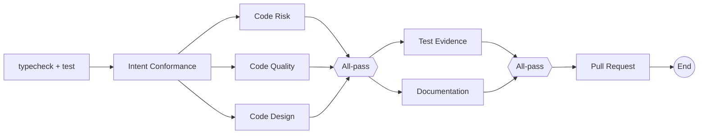

# A Code Design built-in Persona for No-Mistakes Review

Rendered as [`plan.html`](plan.html) beside this file, which carries the before/after stage
diagram.

## Decisions taken

Resolved in a dashboard plan review before implementation, and applied below rather than left as
alternatives:

| Decision | Adopted |
|---|---|
| Name | **Code Design Reviewer**, so the slug is the append-only `builtin:code-design-reviewer` |
| Placement | **Stage 3**, beside Code Risk Reviewer and Code Quality Judge |
| Gating | **Blocking, scoped to the submitted change** |
| Principles beyond the requested core | Encapsulation (tell-don't-ask, Law of Demeter); illegal states unrepresentable; explicit dependencies over hidden global state |
| Principles declined | YAGNI as a judged standard, coupling and layer direction, and naming at the seam |
| Follow-up | Implemented directly rather than phased - one commit, one pull request |

Declining YAGNI as a *standard* does not make over-abstraction free: the anti-overreach rule
forbidding a demanded abstraction for a single case stays, so the role cannot ask for a seam that
is not yet earned. What it does not do is fail a change for having one.

## What this adds

A sixth built-in review role, **Code Design Reviewer**, that judges whether the submitted change
meets a minimum design standard: appropriate abstractions, SOLID (single responsibility,
open/closed, interface segregation, dependency inversion), DRY, and composition over inheritance.
Liskov substitution is deliberately excluded: it is a subtyping contract, and a role that argues
for composition over inheritance has almost nothing to apply it to.

It ships alongside Code Risk Reviewer and Code Quality Judge in **No-Mistakes Review**, as a new
appended version 11. Versions 1 through 10 stay frozen and addressable, so every binding an
operator already holds keeps running the graph it was bound to.

## Why it is a separate role and not more prose in an existing one

The two roles it sits beside both refuse this work today, on purpose.

- **Code Risk Reviewer** says it outright: *"Do not infer a systemic flaw from code shape,
  duplication, or architectural preference alone"* and *"Do not demand a shared abstraction, a
  redesign, or a refactor as the price of passing."* Those rules are what keep it from becoming a
  taste gate, and they are marked non-softenable.
- **Code Quality Judge** raises structure only *"when it actively hides a defect"*, and is
  otherwise told not to fail for *"an equally valid alternative."*

So design is currently reviewed by nobody, and the fix is not to weaken either rule - it is a role
whose subject *is* code shape, with its own discipline about when shape is a defect.

The risk of that role is the whole reason the gating decision above was taken explicitly: a design
reviewer that gates on preference blocks correct work, and a repair loop that runs up to five
rounds turns that into five rounds of argument.

## The document

`personas/code-design-reviewer.md`, written in the register the other five use: what it judges, how
it decides, anti-overreach rules, pass and fail conditions, requested-change discipline. It states
nothing about output format or the review contract, which every Persona prompt already carries.

**What it judges.** The seams the change introduces or moves - where a responsibility lives, what
depends on what, what a caller has to know to use the code correctly, and whether a new case
extends an abstraction that already exists or grows a second one beside it. Design here is about
cost, not taste: a problem belongs in the verdict when it can be named as an edit a future change
will make in two places and miss in one, a fact that will drift out of agreement with its copy, a
caller broken by a change the abstraction was supposed to hide, or an extension that cannot be made
without reopening code that should have been closed.

**The standards**, each phrased as the observable symptom rather than the principle's name, so the
verdict cites code and not a label:

- *Appropriate abstraction* - at the level of the problem, hides what varies, leaks nothing callers
  must compensate for. The symptoms are a caller that has to know the mechanism to use the
  interface correctly, an abstraction bypassed for one of its own cases, and a third instance
  arriving with no seam to put it behind.
- *Single responsibility* - two unrelated reasons to edit the same function, module, or record.
- *Open/closed* - the extension was possible without editing the thing extended; or the change
  added the seam rather than the next branch of a conditional that keeps growing.
- *Interface segregation* - an implementation forced to satisfy members it has no meaning for, a
  stub supplied only to fill a contract, a consumer handed a whole record to read one field.
- *Dependency inversion* - a high-level rule reaching directly for a concrete backend, driver,
  transport, clock, or filesystem.
- *Don't repeat yourself* - the second copy of a fact that will drift, with the place the fact
  should live. Explicitly not similar-looking code that means two different things.
- *Composition over inheritance* - a subclass that overrides to disable, a base class that grows a
  flag for one descendant, a hierarchy standing in for a runtime strategy.
- *Encapsulation* - a caller reaching through two objects to reach a third, or a decision made
  outside the unit that owns every fact it depends on.
- *Illegal states* - a validated shape re-checked defensively at every later use, legal field
  combinations documented in prose rather than expressed in the shape, a primitive carrying a
  meaning its type does not.
- *Explicit dependencies* - new module-level mutable state, an import-time side effect, a function
  reaching for ambient configuration its callers cannot see or substitute.

**Anti-overreach rules**, non-softenable, mirroring Code Risk Reviewer's: the finding must be in
the submitted change or code it directly extends; name the concrete cost rather than the principle;
no abstraction demanded for a single case; no repository-wide refactor as the price of passing;
never style, formatting, naming preference, lint, types, or compilation; no restating a
correctness, security, performance, coverage, or documentation finding another role owns; and where
the repository states no placement rule, an equally valid alternative shape is a pass.

**Pass** naming the seams examined and where residual design debt sits. **Fail** with, per finding:
the file and line, the quoted code, the concrete cost, and the smallest repair that resolves it
inside the change's scope. A finding that challenges a deliberate author decision is titled
`Author decision needed: ...`, as Code Risk Reviewer already does.

## Wiring

`personas/code-design-reviewer.md` compiles into `builtin:code-design-reviewer` through
`npm run personas`. The slug is the durable half of that id and is append-only.

A new node id `nmr-code-design` joins `NO_MISTAKES_REVIEW_NODES`, and `NO_MISTAKES_REVIEW_V7` is
written out in full - the existing literals are a changelog, not a DRY opportunity, and a shared
stage array is one edit away from rewriting a graph that bindings are pinned to. Version 11 appends
with `sourceDraftRevision: 10`, the unchanged `completionPolicy: { kind: "none" }`,
`resumptionPolicy: "auto"`, and version 10's binding defaults. Node positions come from
`compileStages`, never typed by hand.

### Stage order, before and after

Version 10 is the same graph without `Code Design`. Both All-pass Joins route `fail` back to the
session for a repair round, which is unchanged.

## Cost

Stage 3 adds no wall-clock stage: three reviewers run in parallel on one submission where two did,
and aggregate into the existing depth join, so a failing design review arrives in the same repair
packet as a failing risk review rather than as a separate round. It adds one model call per review
round.

It sits there rather than ahead of the deep reviews because a design objection is not a cheap
gate - it costs a model call to reach either way, and gating on it first would delay risk feedback
on a change whose shape is merely arguable.

## Touchpoints

| File | Change |
|---|---|
| `personas/code-design-reviewer.md` | new document |
| `personas/README.md` | five persona sources becomes six |
| `src/server/workflows/builtin-personas.generated.ts` | regenerated by `npm run personas` |
| `src/server/workflows/builtin-workflows.ts` | `nmr-code-design`, `NO_MISTAKES_REVIEW_V7`, version 11, description |
| `tours/library.md`, `src/web/tour/content.generated.ts` | the No-Mistakes and binding stops name the stage members and the current version |
| `src/web/workflows/PersonaLibrary.tsx` | two comments that counted the shipped roles, now count-agnostic |
| `docs/workflows.md` | built-in Persona table, the compose paragraph, the stage description, the version history |
| `docs/inspector-and-shipping.md` | the stage-3 sentence |
| `test/builtin-personas.test.ts` | the role is in the catalog with its expected name, description, and scope rule |
| `test/builtin-personas-web.test.ts` | the library rails every shipped role rather than one named one |
| `test/builtin-workflows.test.ts` | version 11 nodes, shape, routes, snapshot freshness, and that appending it rewrote no earlier version |
| `test/workflows-http.test.ts`, `test/session-action-legacy-pr.test.ts` | version-count, served-version and current-version assertions |
| `e2e/specs/code-design-reviewer.spec.ts` | new spec: the read-only built-in carrying its scope rule, and stage 3's three members |
| `e2e/specs/workflow-session-action-evidence.spec.ts` | stage 3's expected membership |
| `e2e/specs/persona-rail.spec.ts` | four comments that counted the shipped roles |
| `e2e/README.md` | the new spec's evidence section |

## Verification

`npm run typecheck`, `npm run lint`, `npm test`, `npm run build`, `npm run smoke`, and
`npm run test:e2e`. The Persona rail and the No-Mistakes Review pipeline both change what a person
sees, so the e2e spec is required rather than optional.
