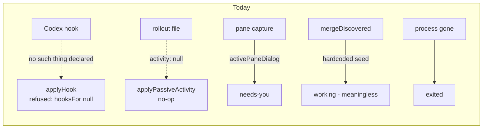
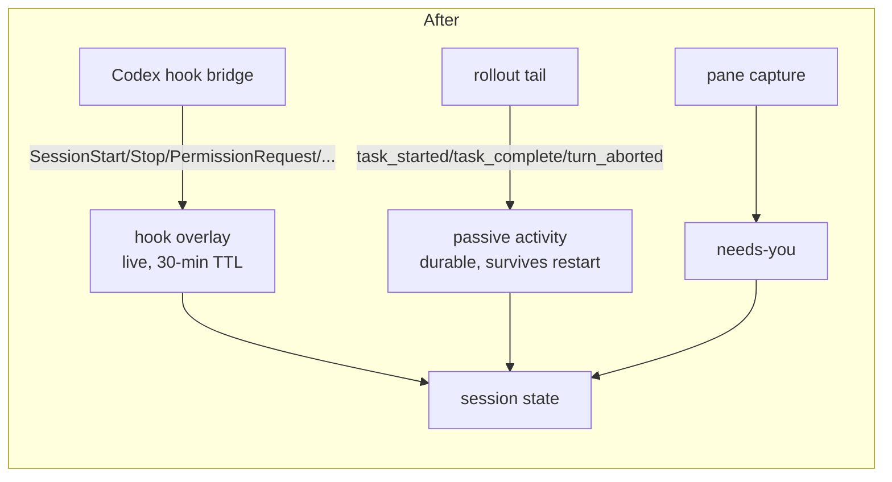

# Integrating Codex properly

> Historical implementation analysis. Current user-facing behavior is documented in
> [Foreman](../../foreman.md#foreman-auto-responder) and
> [Work queues](../../work-queues.md#work-queues-load-a-session-up-and-walk-away); capability
> ownership lives in `HARNESS_CAPABILITIES` and `HARNESSES`. The current cost contract is
> owned by the [unified Claude and Codex cost plan](../codex-cost-estimates/plan.md).

Codex is a registered harness with a card, a dispatch path and a model picker. Everything
past that is declared absent. This plan is about the fact that **most of those declarations
are false**, and about the order in which to make them true without shipping a lie.

## The finding, in one sentence

Of the eight capabilities `HARNESSES.codex` and `HARNESS_CAPABILITIES.codex` declare `null`,
**five are refutable against codex-cli 0.144.1 on this machine right now**, and the two
records exist precisely to stop a harness from silently doing nothing - so the nulls are not
a gap in the design, they are wrong data inside a design that works.

This is the same defect, in the same file, as the one the `tui` capability already fixed. The
guard that became `HARNESSES.codex.tui` said `agent !== "claude"` under a comment asserting
Codex "doesn't render these dialogs" - and because the guard skipped the parse, nothing ever
tested the claim. It was false. Every remaining `null` below was written under the same
condition: **no rollout file and no logged-in Codex had ever existed on the dev machine**, so
each was reasoned from the absence of evidence and then frozen by a passing test.

That condition no longer holds. `~/.codex/` now has an `auth.json`, three rollout files, and
a `codex` binary carrying the JSON Schema for every one of its hook events.

## Evidence

All captured on this machine, 2026-07-21, against `codex-cli 0.144.1`
(`/opt/homebrew/bin/codex`).

### A rollout carries turns

`src/server/harness/codex/transcript.ts:5-16` states a rollout carries runtime metadata "and
nothing that can be rendered as conversation". `src/shared/goal.ts:15-16` adds "No rollout
file has ever existed on this machine, so the extraction is unverified".

Record histogram over `~/.codex/sessions/2026/07/20/rollout-*.jsonl` (three files):

```
response_item / message               response_item / reasoning
response_item / custom_tool_call      response_item / custom_tool_call_output
event_msg / user_message              event_msg / agent_message
event_msg / task_started              event_msg / task_complete
event_msg / turn_aborted              event_msg / token_count
event_msg / thread_settings_applied   event_msg / thread_rolled_back
session_meta   turn_context   world_state
```

`parseRolloutMeta` (`rollout.ts:157-186`) reads **two** of those fifteen types and `continue`s
past the rest. The rollout is not metadata-only. The parser is.

Conversation is present in two parallel lanes, both complete:

- `event_msg/user_message` → `payload.message`, plus `images`, `local_images`, `text_elements`
- `event_msg/agent_message` → `payload.message`, `payload.phase` ∈ `commentary` | `final_answer`
- `response_item/message` → `payload.role` ∈ `developer` | `user` | `assistant`,
  `payload.content[].type` ∈ `input_text` | `output_text` with `.text`, and a stable
  `payload.id` on assistant turns
- tool calls: `response_item/custom_tool_call` (`name`, `input`, `call_id`, `status`) and
  `custom_tool_call_output` (`call_id`, `output`)

### A rollout carries an explicit turn lifecycle

`transcript.ts:63-64` says "a rollout's records aren't turns, so there is nothing to read an
idle/working state off". In fact it carries a lifecycle that is **strictly better than
Claude's**, which `harness/types.ts:45-56` documents as a heuristic biased toward `working`:

| record | fields |
|---|---|
| `event_msg/task_started` | `turn_id`, `started_at`, `model_context_window`, `collaboration_mode_kind` |
| `event_msg/task_complete` | `turn_id`, `completed_at`, `duration_ms`, `time_to_first_token_ms`, `last_agent_message` |
| `event_msg/turn_aborted` | `turn_id`, `reason`, `completed_at`, `duration_ms` |

The newest of the three answers `SessionActivityRead` outright. No inference, no tail
heuristic.

### A rollout carries a full token tier split and the rate limits

`src/shared/cost.ts:52-56` justifies `COST_UNSUPPORTED.codex` with "Codex keeps a single
`tokens_used` scalar in `~/.codex/state_5.sqlite`: no tier split, no cost, no per-model
breakdown." Verbatim from `event_msg/token_count.payload.info`:

```json
{"total_token_usage":{"input_tokens":27994,"cached_input_tokens":19968,
                      "output_tokens":316,"reasoning_output_tokens":20,"total_tokens":28310},
 "last_token_usage": {"input_tokens":14103,"cached_input_tokens":9984,
                      "output_tokens":176,"reasoning_output_tokens":0,"total_tokens":14279},
 "model_context_window":258400}
```

That is a tier split, per-turn *and* cumulative, and the per-model breakdown is
`turn_context.payload.model` which `rollout.ts:176` already parses. `rollout.ts:180-183`
reads `total_tokens` and `model_context_window` and discards the rest.

The same record carries a `rate_limits` block nobody reads:

```json
{"limit_id":"codex","primary":{"used_percent":2.0,"window_minutes":43200,
 "resets_at":1787160308},"secondary":null,"credits":{...},"plan_type":"free"}
```

`used_percent` + `resets_at` (epoch seconds) is exactly `RateLimitWindow`
(`shared/types.ts:134-139`), and `window_minutes` makes `projectRunway` computable without
the hardcoded `FIVE_HOUR_MS` / `SEVEN_DAY_MS`. `shared/types.ts:141-151` calls rate limits
"the one fact OpenTelemetry cannot supply … the entire reason the statusLine wrapper is still
in the design". **Codex writes them to disk.**

Separately: `COST_UNSUPPORTED` is imported nowhere. `grep -rn "COST_UNSUPPORTED" src/`
returns only its own declaration. The sentence it holds has never been shown to anybody.

### Codex has a first-class hook system, and it is Claude-shaped

`harness/index.ts:61-65` says "`hooks: null` is a statement, not a gap: Codex pushes nothing
at us." `todo/codex-instrumentation.md:63` records the hook config format as "not found in
CLI help", blocked at `:66-67` on Codex being logged out.

Extracted from the native binary
(`@openai/codex-darwin-arm64/vendor/aarch64-apple-darwin/bin/codex`):

- **Event vocabulary**: `SessionStart`, `UserPromptSubmit`, `PreToolUse`, `PostToolUse`,
  `PermissionRequest`, `PreCompact`, `PostCompact`, `SubagentStart`, `SubagentStop`, `Stop`.
- **Twenty embedded JSON Schemas**: `{event}.command.input` and `.output` for each.
- **`session-start.command.input`, verbatim, all seven `required`**: `cwd`,
  `hook_event_name`, `model`, `permission_mode`, `session_id`, `source`
  (`startup|resume|clear|compact`), `transcript_path`. Other events add `turn_id`,
  `agent_id`, `agent_type`, `tool_name`, `tool_input`, `tool_response`, `tool_use_id`,
  `prompt`, `last_assistant_message`, `stop_hook_active`.
- **Output contract is Claude's**: `continue`, `stopReason`, `suppressOutput`,
  `systemMessage`, `hookSpecificOutput`/`hookEventName`/`permissionDecision`/
  `additionalContext`; decisions `approve|block|allow|deny|ask`.
- **Config**: a `[hooks]` table in `config.toml` keyed by snake_case event name
  (`session_start`, `user_prompt_submit`, `pre_tool_use`, …), each a list of matcher groups
  (`matcher`, `hooks`, `enabled`, `trusted_hash`), each handler internally tagged
  `type` ∈ `command` | `prompt` | `agent` with `command`, `commandWindows`, `timeout`,
  `async`, `statusMessage`, `description`. Plugins ship the same as `hooks.json`.
- **`codex features list` reports `hooks  stable  true`.**
- Codex's own migrator translates `~/.claude/settings.json` hooks into `config.toml`. OpenAI
  treats the two formats as equivalent.

This clears the decision criterion in `todo/codex-instrumentation.md:104-107` outright -
*"hook reports session id + rollout path + cwd + lifecycle → build a Codex hook"* - with room
to spare. `PermissionRequest` is a **cleaner** signal than the one Claude gives us: it needs
none of the `isIdleNudge` heuristic that `claude/hooks.ts:44-84` spends forty lines
justifying.

### Codex has an MCP registration CLI

`harness-capabilities.ts:208-211` declares `mcp: null` because "registering with it is a
different CLI and a different config file, and nothing has been verified against one". The
CLI is `codex mcp add <NAME> [--env KEY=VALUE] -- <COMMAND>...`, with `list` / `get` /
`remove` beside it. That is the same shape as `claude mcp add`, minus the `-s <scope>` flag.

### The permission-mode claim is too strong

`harness-capabilities.ts:198-200` says Codex has "no permission-mode concept". Its hook
payload carries `permission_mode` with **exactly Claude's five-value enum** - `default`,
`acceptEdits`, `plan`, `dontAsk`, `bypassPermissions` - and the CLI takes
`-a/--ask-for-approval` and `-s/--sandbox` at launch.

What is genuinely true is narrower and is what `codex/tui.ts:40-43` already says: there is no
footer mode line to read and no Shift+Tab cycle to walk. "Cannot read or drive it from the
pane" is correct. "Has no such concept" is not, and the difference decides whether auto-mode
on dispatch can ever reach Codex.

### One thing did not reproduce, and it matters

A hook configured through `-c hooks.session_start=[{hooks=[{type="command",command="…"}]}]`
**parsed but never fired**. The config was accepted (a malformed shape errors loudly with
`invalid type: string …, expected struct HooksToml`), the turn ran to completion, and the
hook script was never executed.

The cause is almost certainly the trust store: `MatcherGroup` carries a `trusted_hash` field,
the binary holds the strings `"… hooks need review before they can run"` and `"Continue
without trusting (hooks won't run)"`, and there is a `--dangerously-bypass-hook-trust` flag
whose help text is *"Run enabled hooks without requiring persisted hook trust"*. Confirming
that requires running with the bypass flag, which was declined in this environment.

**Untrusted hooks fail silent.** That is the single most important operational fact in this
document and it shapes Phase 4: an installer that writes a correct `[hooks]` block and stops
there produces a Codex session that looks instrumented and reports nothing - which is worse
than today's honest `null`.

## Capability audit

| Capability | Declared | Reality | Verdict |
|---|---|---|---|
| `transcript.messages` | `null` | two complete conversation lanes | **false** |
| `transcript.passiveRead.activity` | `null` | explicit `task_started`/`task_complete`/`turn_aborted` | **false** |
| `hooks` | `null` | 10 events, Claude-shaped payload and output contract | **false** |
| `mcp` | `null` | `codex mcp add … -- <cmd>` | **false** |
| `COST_UNSUPPORTED.codex` | a sentence | full tier split + rate limits on disk | **false**, and the constant is dead code |
| `permissionModes` | `null` | no pane affordance, but the concept and the enum exist | **too strong** |
| `skills` | `null` | `~/.codex/skills`, a plugin skills system, a `skills_watcher` | **unmeasured** |
| `clearContext` | `null` | not measured against Codex's slash vocabulary | **unmeasured** |
| `workQueue` | `null` | composite of hooks + transcript, both refuted | **consequential** |
| `GOAL_UNSUPPORTED.codex` | a sentence | downstream of `transcript.messages` | **consequential** |
| `tui` | **not** `null` | correct | already fixed |
| `detect`, `bin`, `control` | present | correct | fine |
| `control.pastePlaceholder` | `null` | Codex renders no collapsed-paste placeholder | **correct** |

## What a Codex card actually is today

Three states, of which one is meaningless:

1. `working` - the hardcoded seed in `mergeDiscovered` (`registry.ts:498`, `:539`), never
   revised, because the hook overlay is refused (`registry.ts:638-639`) and the passive path
   opts out (`codex/transcript.ts:65`).
2. `needs an answer` - from `activePaneDialog`. The one signal Codex can prove today, and it
   works.
3. `exited` - process disappearance. Agent-agnostic.

And a set of downstream consequences, in rough order of how much they cost:

### Where a Codex card's state comes from

Today two of the three channels are closed by declaration, so the only live signal is the
pane:



After Phases 2 and 4 both closed channels open, and they cross-check rather than each being
trusted alone:



The two are complementary for the same reason they are for Claude: the overlay is live but
neither durable nor guaranteed, and the passive read is durable and works on sessions Mission
Control never launched.

## Design

### The ordering constraint that drives everything

Today the rollout↔session binding is `cwd` + nearest start time, and `rollout.ts:84-85`
admits "two Codex sessions in the same cwd can't be told apart more precisely than this".

**A mis-binding today costs a wrong model chip. After Phase 2 it shows one session's
conversation on another session's card**, and `transcript-stream.ts:80-92` tails the wrong
file live. That is the class of silent lie this whole capability system exists to prevent.

So identity is not a late polish item. **Phase 1 tightens the binding before anything reads
messages off it.**

There is a deterministic mechanism available that needs no cooperation from Codex: the
running `codex` process holds its rollout file **open**, so `lsof` names it exactly. The
daemon already batches `lsof` for exactly this kind of question - `discovery/proc-cwd.ts:20`
runs `lsof -a -d cwd -p <pids> -Fpn` on every tick - so this is one more field selector on an
existing call pattern, not a new subsystem.

### Phases

Each phase is independently shippable and independently useful. They are ordered by
(evidence quality × operator value) ÷ consent cost - which is why hooks, despite being the
headline finding, are **not** first: the passive path needs no install, no trust dance and no
operator decision, and it works on sessions Mission Control did not launch.

---

#### Phase 0 - Fixtures from real captures

Nothing below is written against a hand-authored record. Per CLAUDE.md: *"A capability is
null only after you point it at a real capture … and those fixtures are verbatim, never
hand-written."* The same rule binds the reverse direction.

- `test/fixtures/codex-rollouts.ts` - verbatim lines from the three real rollouts, covering
  every record type in the histogram above, redacted only for paths and content.
- `test/codex-rollout.test.ts` currently builds three synthetic types by hand (`:14-23`).
  Replace with the fixtures.
- Capture the `session-start.command.input` / `stop.command.input` schemas as fixtures too,
  for Phase 4.

**Done when**: no test in the Codex path asserts against a record shape nobody has observed.

---

#### Phase 1 - Bind the session to its rollout deterministically

- Add an open-file probe beside `discovery/proc-cwd.ts` (same batched-`lsof` shape) returning
  each Codex pid's open `…/sessions/**/rollout-*.jsonl`.
- `findRolloutForSession` prefers that answer; the cwd + start-time scan stays as the fallback
  for a session whose pid we cannot probe.
- Record the rollout's own `session_meta.payload.session_id` on the Session. It is the same
  UUID as the filename, and it is what Phase 4's hook will independently report - so the two
  paths can be cross-checked rather than trusted separately.

**Why first**: it is the precondition for Phase 2 being safe, and it also silently fixes the
model chip and context-% that are already wrong whenever two Codex sessions share a cwd.

**Test**: `codex-rollout-binding.test.ts` - two sessions in one cwd, distinct rollouts,
correct binding; and the fallback path when the probe returns nothing.

---

#### Phase 2 - Passive activity: make `working` mean something

The cheapest change on the list and the highest leverage per line.

- `codex/transcript.ts:65` - `passiveRead` already reads the tail via
  `readRolloutMeta` → `readTailLines(path, 128KB)`. Scan the same buffer for the newest of
  `task_started` / `task_complete` / `turn_aborted` and return a real `SessionActivityRead`.
  **Zero additional I/O** - same read, same loop as `parseRolloutMeta:165-186`.
- Mapping: `task_started` → `working`; `task_complete` / `turn_aborted` → `idle`;
  `lastActivity` from `completed_at` / `started_at`, else the record's `timestamp`.

This is precisely the channel `docs/plans/queue-hook-free-idle/plan.md` built - *"session
`state` has exactly one source (live hooks), and that source is neither durable nor
guaranteed"* - and the machinery is already agent-agnostic. Codex opts out by declaring
`activity: null`, not because anything is missing.

**Effect**: a quiet Codex card reads `idle` truthfully, survives daemon restarts, needs no
install and no consent. `settledIdle` starts working for Codex.

**Test**: `harness-transcript.test.ts` - activity read off the Phase 0 fixtures.

---

#### Phase 3 - Transcript messages, and the goal that follows

- `codex/transcript.ts:66` - `messages: jsonlMessages({ parse: codexToMessage, narration })`.
  The generic byte-windowing in `src/server/transcript.ts:96-195` is format-agnostic and needs
  nothing: rollouts are one JSON object per line and append-only, so `window`, `since`,
  `initial` and `appended` all work unchanged.
- `src/shared/goal.ts:20` → `null`, in the **same commit**;
  `harness-transcript.test.ts:60-70` pins that those two agree, by design.
- Delete the stale "No rollout file has ever existed on this machine" claim at `goal.ts:15-16`.

Three decisions the parser must make, all of which have a precedent in `claude/transcript.ts`:

1. **Pick one lane, not both.** The same user text appears as `event_msg/user_message.message`
   *and* as a `response_item` with `role:"user"`. Parsing both doubles every turn.
2. **Filter scaffolding.** `role:"developer"` records carry `<permissions instructions>`, the
   `/root` multi-agent preamble, `<multi_agent_mode>` and `<turn_aborted>`; `role:"user"`
   carries an `<environment_context>` block. This is what `claude/scaffolding.ts`
   `conversationText` already does at `claude/transcript.ts:126`.
3. **Ids.** Assistant `response_item`s have `payload.id`; user turns and every `event_msg`
   have none. Needs Claude's fallback (`${role}-${ts}-${text.length}`,
   `claude/transcript.ts:132`) or `mergeById` (`TranscriptPanel.tsx:408-413`) and the head/tail
   de-dupe (`transcript.ts:123`) misbehave.

**Narration**: `task_complete.payload.last_agent_message` and `agent_message` with
`phase:"commentary"`. There is no TodoWrite equivalent.

---

#### Phase 4 - The hook bridge

The payload exceeds the bar `todo/codex-instrumentation.md:104-107` set. Because
`HookIngestSchema` already carries `agent` (`protocol.ts:45`) and `applyHook` already
dispatches through `hooksFor` (`registry.ts:638`), **the pipeline needs zero changes**. The
work is a spec, a bridge and an installer.

- `src/server/harness/codex/hooks.ts` - a `HookSpec` beside `claude/hooks.ts`, declaring the
  event list and a `toState`:

  | Codex event | state |
  |---|---|
  | `SessionStart` | `idle` |
  | `UserPromptSubmit` | `working` (+ prompt text → Tier 1 goals) |
  | `PreToolUse` / `PostToolUse` | `working` |
  | `PermissionRequest` | `awaiting_input` |
  | `PreCompact` / `PostCompact` | `working` |
  | `SubagentStart` / `SubagentStop` | `working` |
  | `Stop` | `idle` |

  Note **there is no `SessionEnd`** and no `Notification`. `exited` stays discovery-driven,
  which already works; and `PermissionRequest` replaces the `isIdleNudge` heuristic with an
  unambiguous signal.
- A Codex bridge beside `hooks/harness-hook.mjs`. Payload field names are Claude's
  (`session_id`, `cwd`, `transcript_path`, `hook_event_name`), so most of it is the shared
  transport in `@shared/hook-bridge.mjs` already.
- **The installer is the hard part, and the trust store is why.** Writing a `[hooks]` block
  into `config.toml` is not sufficient - see "One thing did not reproduce" above. The
  installer must either persist a `trusted_hash`, or drive the app-server's
  `hooks/list` + `config/batchWrite` pair (which is how the TUI does it), and it must
  **verify a hook actually fired** before reporting success. An installer that writes config
  and declares victory gives us a session that claims instrumentation and reports nothing.
- `~/.codex/config.toml` becomes a third file in the "settings writers" contract in CLAUDE.md,
  alongside the three `~/.claude/settings.json` writers. The event list is declared **once**,
  on the harness, and both installers import it - the rule `harness-hooks.test.ts` already
  enforces for Claude.

**Consent**: this writes to the operator's `~/.codex/config.toml` and grants a hook execution
trust. That is a real consent boundary and should be an explicit opt-in in the integrations
installer, not a side effect of upgrading.

**Test**: `harness-hooks.test.ts` extended - the Codex event list is named once, `toState`
covers every declared event, and neither installer names an event itself.

---

#### Phase 5 - Cost and rate limits

- Correct the reason at `cost.ts:52-56`. It is factually wrong and should not be the reason
  anything stays off.
- Extend `parseRolloutMeta` to keep `input_tokens`, `cached_input_tokens`, `output_tokens`,
  `reasoning_output_tokens` and `last_token_usage`. Maps onto `SessionCost` 1:1 except
  `cacheWrite`, which has no counterpart and stays null.
- Parse `rate_limits` into `RateLimitWindow`. `window_minutes` makes the runway projectable
  without `FIVE_HOUR_MS` / `SEVEN_DAY_MS`.
- **`COST_UNSUPPORTED` is dead code - decide it.** Either wire it to a surface or delete it.
  A constant documenting a decision that nothing enforces is the thing the two-record design
  exists to prevent.

**Resolved later:** the [unified cost plan](../codex-cost-estimates/plan.md) owns the current
decision: exact known models use a versioned Standard API-rate snapshot, unknown models stay
token-only, and every priced Claude or Codex figure is qualified as an API-equivalent estimate.

---

#### Phase 6 - MCP registration and the ask channel

- `HARNESS_CAPABILITIES.codex.mcp` = `{ cli: "codex", serverName: "mission-control", … }`.
  `McpSpec.scope` is Claude's `-s <scope>` flag and Codex has no equivalent, so the spec needs
  a shape that admits both - the natural move is to make `scope` nullable rather than invent a
  Codex scope.
- `ask-channel.ts:215-216` - replace `if (agent !== "claude")` with the capability question.
  The flags themselves are Claude's (`--mcp-config`, `--append-system-prompt`); Codex's
  equivalents are `codex mcp add` (persistent) and `-c` overrides (per-invocation), so this is
  a real design decision, not a rename. **This is the biggest quality-of-life win for a
  dispatched Codex session** and should not be folded into Phase 4 silently.

---

#### Phase 7 - Re-measure the three unmeasured nulls

The lesson of `tui` is that a null written from absence of evidence is worth re-testing
against a real capture. Three qualify:

- **`permissionModes`** - narrow the claim. The hook payload's `permission_mode` and the
  CLI's `-a` / `-s` flags mean Codex *has* modes; what it lacks is a pane affordance to read
  or drive them. If `onDispatch` can be set at launch via `-a`, then auto-mode-on-dispatch
  reaches Codex and `autoModeUnsupportedWhy` needs a third sentence, not one of the two it
  has.
- **`skills`** - `~/.codex/skills/` exists, the binary has `SkillsListResponse`, a
  `skills_watcher` and `SkillsChangedNotification`. A watcher would mean Codex needs no
  reload command at all, which `SkillsSpec` currently cannot express (`reloadCommand` is
  required). Measure before declaring.
- **`clearContext`** - never measured against Codex's slash vocabulary.

Each is a spike with a capture, not a code change on spec.

---

#### Phase 8 - The consequential unlocks

**Status: shipped within the launch-scoped hook boundary.** This section records the
implementation plan that led there; the current contracts are linked at the top of this document.

- **`workQueue`** - its null is justified as "no hooks AND no readable transcript"
  (`harness-capabilities.ts:98-107`). Both halves fall. Note: after Phase 3 alone the
  sentence at `:237` becomes half-true and should be narrowed to the hook half rather than
  left standing.
- **Foreman** - `tickTargets` starts selecting Codex, which makes `promptHarness`'s Codex
  branch, the Codex-glyph menu parse and `classifyPending`'s `terminal-pane` branch reachable
  for the first time. All three are already written and already tested; nothing new is needed
  beyond the capability flip.
- **Backlog assign** - `agentIsFree`'s `hooksSeen` requirement is satisfiable after Phase 4.
  Fix `test/backlog-machine.test.ts:73` so the fixture stops asserting an impossible state.
- **Inspector adoption** - the `"hook"` route opens once `applyHook` accepts Codex ingest.
  Provenance rules do **not** loosen: `prCreated` (the hook matching the `gh pr create`
  command) is still the only hook-side proof, exactly as `inspector-adoption.test.ts` pins.
  This is the one place where "make Codex work like Claude" must not become "adopt more PRs".

---

### Bugs found on the way, worth fixing regardless

These are independent of every phase above and none needs a Codex decision.

1. **`src/shared/session.ts:175-178` documents a behaviour that does not happen** for Codex.
   Correct the comment or fix `tickTargets`; today they contradict each other.
2. **`test/backlog-machine.test.ts:358-363`** asserts a Codex assign path made unreachable by
   `hooksSeen`, passing only via an impossible fixture.
3. **`HarnessesPanel.tsx:135`** renders the raw `AgentType` id - "claude only" - beside
   `AUTO_LABEL`'s "Claude Code" on the same row. Two spellings of one harness; the id leaks
   into UI where everything else goes through `AGENT_IDENTITY`.
4. **`COST_UNSUPPORTED` is imported nowhere** (Phase 5).
5. **`codex/control.ts:24`** (`SETTLE_MS = 400`) and **`codex/tui.ts:36`**
   (`repaintTimeoutMs = 900`) are Claude measurements applied to Codex, self-documented as
   unverified. Measure them against 0.144.1.
6. **`shared/model.ts:113-118`** hand-maintains four `gpt-*` ids and nothing can detect them
   going stale - the only test checks they contain no shell metacharacters. A bad id is a
   *failed launch*, not a slower one. Consider validating against `~/.codex/models_cache.json`,
   which exists on disk.
7. **Reasoning effort is read but never set.** `rollout.ts:133-142` maps `effort` to a
   `ThinkingLevel` for the card; dispatch passes only `--model`. Codex's primary quality knob
   is unreachable from the dispatch modal.
8. **`DispatchModal.tsx:502-523` discloses nothing.** Whatever set of capabilities Codex ends
   up with, the modal is where the operator chooses, and it should say what changes.

## What this does not change

- **The SQLite veto stands.** `state_5.sqlite` remains off limits
  (`todo/codex-instrumentation.md:23-26`); the `state_5` / `logs_2` / `goals_1` suffixes are
  a migrating internal schema. Everything in this plan comes from rollout files, the hook
  contract, or the CLI. Nothing needs the DB.
- **`LLM_RUNNER_IDS` stays a separate axis.** Foreman, the Inspector and every background job
  still run on `claude` (`shared/llm.ts:33`). A Codex-only install has no Foreman regardless
  of harness capability. That is the runner axis and it is deliberately orthogonal - keep it
  out of this work.
- **`codex exec --json`, `app-server` and `mcp-server` stay unused as state channels.** They
  are full-fidelity, but only for sessions we spawn, and they change what the session *is* -
  headless or app-server-hosted rather than a TUI in a pane the operator can focus. Also
  `detect.ts:22-24` deliberately does not exclude `codex mcp-server` from discovery, so
  spawning one today puts a phantom card on the board.
- **`control.pastePlaceholder: null` stays null.** Codex renders no collapsed-paste
  placeholder. That one is correct.

## Open decisions

These need an answer before the phases they gate are built.

1. **Hook install consent.** Writing `~/.codex/config.toml` and persisting a hook trust hash
   is a heavier consent than symlinking a skills directory. Opt-in toggle in the integrations
   installer, or on by default with a disclosure?
2. **`costUsd` for Codex.** Resolved by the
   [unified cost plan](../codex-cost-estimates/plan.md): exact known models are priced from a
   versioned Standard API snapshot; unknown models remain token-only.
3. **`McpSpec.scope`.** Make it nullable for harnesses without a scope concept, or give Codex
   a synthetic one?
4. **Phase 2 vs Phase 4 shipping order.** Phase 2 is free and unblocks `settledIdle`; Phase 4
   is authoritative but needs consent. Ship Phase 2 alone first (recommended), or hold both
   until the hook lands so the state semantics change once?
5. **What Phase 8 turns on by default.** Resolved: Foreman can auto-respond only after a
   Mission Control-launched Codex session reports a hook. Operator-started sessions remain
   human-operated.

## Done means

Per CLAUDE.md, and none of these is a follow-up:

- **README** - Codex's capabilities are described in prose in several places that will become
  wrong phase by phase. Each phase updates it in the same change.
- **CLAUDE.md** - the "Harnesses (the agent axis)" section is currently the best written
  explanation of *why* Codex declares each null, and most of those paragraphs become false.
  In particular the sentences beginning "`HARNESSES.codex.transcript.messages` is null
  because a rollout carries metadata and no turns" and "`HARNESSES.codex.hooks` is null …
  Codex pushes nothing at us" must be rewritten, not deleted - the *reasoning pattern* they
  teach is correct and is what found this. Add `~/.codex/config.toml` to the settings-writers
  contract.
- **Tests** - named per phase above. `session-contracts.test.ts` and
  `harness-capabilities.test.ts` pin the records and will fail on each flip, which is the
  point.
- **`todo/codex-instrumentation.md`** - resolve and delete it. Its blocker is gone, its
  decision criteria are met, its front-runner option is chosen, and parts of it are already
  stale (it describes a `resolveTranscriptPath` that no longer exists and a rollout reader
  that was since built).

## Provenance

Every claim above was captured on 2026-07-21 against `codex-cli 0.144.1` on this machine:
three rollout files under `~/.codex/sessions/2026/07/20/`, the JSON Schemas embedded in the
`codex-darwin-arm64` native binary, `codex --help` / `codex exec --help` / `codex mcp --help`,
and one `codex exec --json` run that completed a turn and did **not** fire a configured hook.

The one claim that is **inferred rather than observed** is that hook trust is what suppressed
that hook. It is well-supported - `trusted_hash` on the matcher group, the review strings in
the binary, the existence of `--dangerously-bypass-hook-trust` - but confirming it needs one
run with that flag, which was declined in this environment. **Phase 4 should begin by
confirming it**, because if the cause is instead the TOML nesting, the installer's shape
changes.
