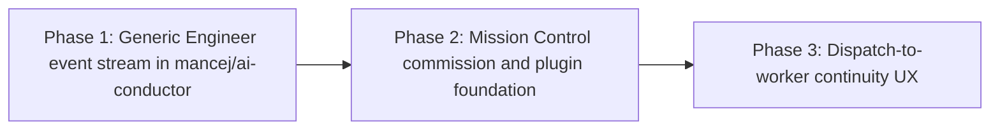

# Phased Plan: Conductor Planning Pipeline Continuity

**Source plan:** `docs/plans/conductor-planning-pipeline-continuity/plan.md`
**Status:** Ready to schedule
**Repository set:** Mission Control plus `/Users/jordan.mance/workspace/upstart/ai-conductor`
**Target fork for AI Conductor work:** `mancej/ai-conductor`

## Implementation outcome

Deliver one visible Pipeline commission from task dispatch through interactive AI Conductor DECIDE, spec handoff and merge, then through the daemon-created BUILD and SHIP run. AI Conductor contributes only reusable Engineer lifecycle events and replay on its existing event spine. Mission Control and its visualizer plugin own the personal integration, persistence, session binding, and UI.

## Incorporated human decisions

- The operator explicitly selected phased planning and scheduling on 2026-08-27.
- AI Conductor changes land on the operator's fork, not in an upstream implementation PR.
- Both Engineer-run and DECIDE step lifecycle events are required.
- AI Conductor extension points must remain product-neutral and use the existing event spine.
- Mission Control-specific state and translation remain in Mission Control and its existing plugin.
- The Pipeline meter must render immediately at dispatch, advance live during DECIDE, show the spec-merge gate, and continue automatically in a later provider worker session.
- A Skill/tool return is not sufficient proof of step completion. Accepted output or deterministic artifact reconciliation is required.

## Repository findings that shape the phases

1. AI Conductor currently dispatches `engineer` before normal plugin discovery and run lifecycle setup. Its visualizer interface is observer-only and cannot create events. `ai-conductor/src/conductor/src/index.ts:593-597`, `ai-conductor/src/conductor/src/types/plugin.ts:39-56`
2. AI Conductor already has the required reusable spine: `ConductorEventEmitter`, the closed `ConductorEvent` union, `EVENT_SINKS`, `EventPersister`, and visualizer lifecycle helpers. `ai-conductor/src/conductor/src/ui/events.ts`, `ai-conductor/src/conductor/src/types/events.ts`, `ai-conductor/src/conductor/src/engine/event-sinks.ts`, `ai-conductor/src/conductor/src/engine/event-persister.ts`, `ai-conductor/src/conductor/src/engine/visualizer-lifecycle.ts`
3. Deterministic Engineer commands already own worktree creation, land, handoff, and cleanup. These are the correct mechanical emission and reconciliation boundaries. `ai-conductor/src/conductor/src/engine/engineer-cli.ts:880-1156`
4. The existing AI Conductor authored ledger survives individual authoring worktrees, but stores only project/feature pairs. It is a nearby durability pattern, not a sufficient event replay contract. `ai-conductor/src/conductor/src/engine/engineer/authored-ledger.ts`
5. Mission Control's visualizer plugin already batches event delivery and retries without blocking the engine, but it resolves only implementation run identity and has a frozen per-event subscription list. `integrations/ai-conductor/mission-control/index.mjs`, `integrations/ai-conductor/mission-control/README.md`
6. Mission Control ingest currently accepts only events for provider runs already enumerated from worktrees. That intentionally rejects the pre-run Engineer lifecycle. `src/server/pipelines/ingest.ts`, `src/server/pipelines/types.ts`
7. Mission Control reserves `Task.pipelineRun` from raw intent before a final plan exists, while the Engineer SDK session intentionally has no `Session.pipeline`. `src/server/dispatcher.ts:856-966`, `src/server/pipelines/conductor/index.ts:349-409`
8. The Board phase meter requires a provider session/run join. It cannot render task-owned authoring progress. `src/web/components/layouts/SessionTile.tsx:277-283`
9. The provider reader currently normalizes worktrees even when `conduct-state.json` is absent, which is why an Engineer authoring directory can appear as a false all-pending run. `src/server/pipelines/conductor/index.ts:136-214`
10. The AI Conductor checkout is clean on `main`; `origin` is `mancej/ai-conductor` and `upstream` is `jstoup111/ai-conductor`. The Mission Control plan branch is separate and can attach that checkout as implementation scope or read-only context.

## Size estimate

Estimated non-test implementation work across all phases: **1,500-2,310 lines**.

Assumptions:

- 450-700 lines in AI Conductor for event contracts, durable Engineer-run reduction/replay, lifecycle loading, CLI/hook integration, and handoff reconciliation.
- 500-750 lines in Mission Control for schema, provider adapter, plugin envelope, ingest, reducer, and reconciliation.
- 450-700 lines in Mission Control for dispatch activation, session/run binding, Board/Console/Runs UI, and strict false-run correction.
- 100-160 lines of maintained product and integration documentation.
- Tests are excluded from the estimate and are expected to add roughly 1,000-1,500 lines.

## Why three phases

The total is well above 200 non-test lines and crosses two independently versioned repositories, a durable event contract, a SQLite migration, two delivery paths, session ownership, and visible browser behavior.

- Phase 1 must land alone because it creates a generic provider contract that is useful without Mission Control and safe for existing AI Conductor users. Combining it with Phase 2 would force one task to change two repositories even though the provider can remain fully operable without the consumer.
- Phase 2 isolates the high-risk compatibility foundation: schema migration, event validation, provider replay, plugin transport, and additive shared contracts. Combining it with Phase 3 would give one mid-tier executor a migration, ingest security boundary, polling/replay correctness, dispatch transaction, session correlation, and broad UI/E2E change in one PR. That is less reviewable and makes failures harder to localize.
- Phase 3 activates the user-visible contract only after its persistence and provider seams are merged. It remains a coherent vertical slice from dispatch through cards and Runs to the later worker.

No phase is test-only, documentation-only, or cleanup-only. Every phase ends with an operable repository.

## Phase graph

| Phase | Primary repository | Attached context | Direct dependency | Merge outcome |
| --- | --- | --- | --- | --- |
| [Phase 1: Generic Engineer lifecycle stream](phase-1-ai-conductor-engineer-events.md) | `/Users/jordan.mance/workspace/upstart/ai-conductor` | Mission Control, context-only | Planning session | Product-neutral events, replay, capability, and handoff identity on `mancej/ai-conductor` |
| [Phase 2: Commission and plugin foundation](phase-2-mission-control-commission-foundation.md) | Mission Control | AI Conductor, context-only | Phase 1 | Durable commission storage, provider/replay adapter, and additive plugin ingest contract |
| [Phase 3: Cohesive Pipeline UX](phase-3-mission-control-pipeline-continuity-ux.md) | Mission Control | AI Conductor, context-only | Phase 2 | Immediate card meter, live DECIDE progress, merge gate, and automatic later-session continuation |

## Concurrency and merge order

There is one execution group at each depth:

1. Phase 1 only.
2. Phase 2 after Phase 1 merges.
3. Phase 3 after Phase 2 merges.

No phases may run concurrently. Phase 2 consumes the exact event, capability, and replay contract from Phase 1. Phase 3 consumes the exact schema, reducer, and provider adapter from Phase 2.

## Cross-phase contracts

| Contract | Owner | Consumers may rely on |
| --- | --- | --- |
| `engineerLifecycleEventsV1` capability | Phase 1 | It is advertised only when create, event persistence, replay, and handoff identity are complete. |
| Engineer event identity | Phase 1 | `schemaVersion`, `engineerRunId`, optional opaque correlation id, repository, monotonic revision, and timestamp are stable. |
| Step completion meaning | Phase 1 | Completion is accepted or reconciled, never inferred solely from tool return. |
| Spec handoff payload | Phase 1 | Exact plan slug, branch, PR URL if present, and awaiting-merge meaning are available before worktree cleanup. |
| Commission persistence | Phase 2 | One commission per task, monotonic provider revision, bounded authoring ledger, and restart-safe projection. |
| Plugin envelope | Phase 2 | Existing run envelopes remain valid; Engineer identity is additive and validated separately. |
| Reconciliation | Phase 2 | Live push is latency; bounded provider replay restores correctness. |
| UI view model | Phase 3 | Commission and provider run use one shared phase/status derivation without changing session composer authority. |

## Publication and task scheduling contract

- The source plan, this index, both HTML renderings, and all phase files are committed and pushed on the current Mission Control planning branch before any implementation task is created.
- Every phase task depends on this planning session so it remains backlogged until the planning PR merges and the referenced paths exist on the default branch.
- Phase 1 targets `/Users/jordan.mance/workspace/upstart/ai-conductor` and attaches this Mission Control checkout as context-only.
- Phases 2 and 3 target Mission Control and attach `/Users/jordan.mance/workspace/upstart/ai-conductor` as context-only.
- Phase 2 depends directly on the Phase 1 task. Phase 3 depends directly on the Phase 2 task.
- Every implementation task opens a PR only in its primary repository. The context-only repository must not be changed.

## Final verification strategy

1. Phase 1 proves generic event and replay correctness in AI Conductor, including existing Engineer, inline, daemon, and visualizer compatibility.
2. Phase 2 proves Mission Control migration, ingest, plugin, reducer, and replay behavior without activating a partial UI.
3. Phase 3 reproduces the original user-visible gap in the built browser, then proves immediate rendering, live DECIDE advancement, handoff, merge, later-worker attachment, restart recovery, and layout quality.
4. The final cross-repository fixture pins the capability name, event family, identity fields, revisions, handoff payload, and additive plugin envelope from both sides.

## Cross-phase audit record

- 2026-08-27, initial decomposition: moved all AI Conductor event authority into Phase 1 and all Mission Control semantics into Phases 2-3. No Mission Control field is required in core.
- 2026-08-27, identity audit: the raw intent slug is not used as end-to-end identity. Commission id, Engineer run id, and final provider slug remain distinct and explicitly mapped.
- 2026-08-27, recovery audit: live plugin push and durable replay are complementary. No phase treats the in-memory plugin buffer as durable truth.
- 2026-08-27, activation audit: Phase 2 lands additive dormant infrastructure. Phase 3 is the only phase that replaces current dispatch/card behavior, preventing a partially supported UX from shipping between phases.
- 2026-08-27, repository audit: Phase 1 changes only the fork. Phases 2-3 change only Mission Control. Every cross-repository attachment is marked context-only.
