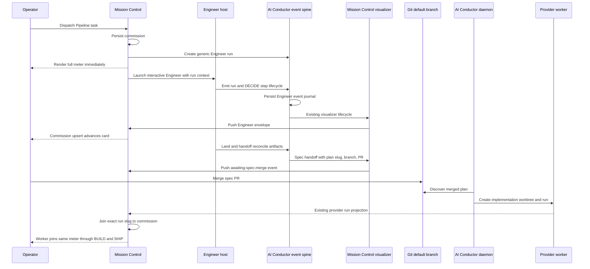

# Conductor Planning Pipeline Continuity

**Status:** Approved for phased implementation on 2026-08-27
**Repositories:** Mission Control and the `mancej/ai-conductor` fork
**Related upstream intake:** `jstoup111/ai-conductor#1975`
**Outcome:** A Pipeline task is visible from dispatch through interactive DECIDE, the spec-merge gate, BUILD, and SHIP, even when different sessions and worktrees perform those parts.

## Answer

Create a durable Mission Control **Pipeline commission** at dispatch, then feed it from product-neutral Engineer lifecycle events emitted by AI Conductor and transported by Mission Control's existing visualizer plugin.

The commission is the stable Mission Control identity for the whole idea-to-shipment lifecycle. It renders on the first Engineer card before a provider worktree or `conduct-state.json` exists. AI Conductor owns a separate generic Engineer run identity and emits structured run, step, and handoff events through its existing `ConductorEventEmitter` spine. The Mission Control plugin translates those events into the commission projection. When handoff reports the exact plan slug, branch, and spec PR, Mission Control binds that future run to the commission. After merge, the daemon-created implementation worktree is discovered normally and any worker session correlated to it automatically joins the same commission.

The intended lifecycle is:

1. Pipeline task dispatch creates and persists the commission, so the full meter renders immediately with every step pending.
2. The Engineer host remains interactive while generic AI Conductor events advance SETUP, UNDERSTAND, and DECIDE.
3. Successful handoff moves the commission to **Awaiting spec merge** and records the exact final plan slug, branch, and PR URL.
4. After merge, ordinary AI Conductor daemon discovery creates the implementation run. Mission Control joins that run to the stored commission by its exact provider-owned slug.
5. A later provider worker session inherits the same commission automatically and continues the meter through BUILD and SHIP.

This supersedes the earlier proposed Mission Control-specific checkpoint MCP and the earlier plugin-only interpretation. A visualizer cannot invent events or load itself around a host workflow. AI Conductor therefore needs small, product-neutral lifecycle and replay extension points. Mission Control remains the sole owner of commission semantics, task/session binding, projection, and UI.

## Decisions incorporated from review

- Implement the AI Conductor portion on the user's `mancej/ai-conductor` fork. Do not open an upstream implementation PR as part of these phases.
- Track upstream product intent through `jstoup111/ai-conductor#1975`, but keep the fork implementation independently reviewable.
- Emit both Engineer-run lifecycle events and DECIDE step lifecycle events.
- Use the existing Conductor event spine and plugin system. Do not add a parallel telemetry channel.
- Keep event names and payloads product-neutral. AI Conductor must not contain Mission Control commission rules, task ids, routes, or UI vocabulary.
- Keep the existing Mission Control visualizer plugin as the integration boundary. It may add optional fields to its frozen envelope and translate generic events into Mission Control state.
- Do not treat a Skill or tool invocation as proof of completion. It may establish start. Completion comes from accepted output, deterministic artifact validation, or land-time reconciliation.
- Persist or replay Engineer events so a missed live push or Mission Control restart does not permanently erase DECIDE state.
- Do not write DECIDE state into implementation `conduct-state.json`. That file continues to represent the daemon implementation run after merge.
- Preserve the existing interactive Engineer composer and provider-driven worker composer behavior.

## Why the current behavior has a gap

The current implementation joins three different identities too early:

- Mission Control reserves `Task.pipelineRun` from the raw intent before the final plan slug exists. `src/server/dispatcher.ts:856-887`, `src/server/pipelines/conductor/index.ts:349-409`
- The managed Engineer is an interactive Agent SDK session, so `Session.pipeline` is intentionally null. `src/server/dispatcher.ts:889-966`
- The card meter renders only when a provider-driven session has both a `Session.pipeline` link and an observed `PipelineRun`. `src/web/components/layouts/SessionTile.tsx:277-283`
- AI Conductor dispatches `engineer` before ordinary plugin discovery and run lifecycle setup. `ai-conductor/src/conductor/src/index.ts:593-597`, `ai-conductor/src/conductor/src/index.ts:1211-1296`
- Current visualizer plugins receive only a `ConductorEventEmitter` and can subscribe only to events the host emits. `ai-conductor/src/conductor/src/types/plugin.ts:39-56`
- The interactive Engineer workflow performs DECIDE in the Claude or Codex host, while the implementation daemon creates `.pipeline/conduct-state.json` only after a plan reaches the default branch.
- Mission Control currently admits an authoring worktree as a run when it merely contains `.pipeline/`, then fills absent steps with `pending`. `src/server/pipelines/conductor/state.ts:515-567`, `src/server/pipelines/conductor/normalize.ts:80-107`

In the live `Add health check endpoint` example, accepted DECIDE artifacts existed while `.pipeline/conduct-state.json` did not. A five-second refresh could only reread the same absence, so the UI kept every phase pending. After merge, the implementation run verifies the committed DECIDE artifacts and fast-forwards them, which makes the UI appear to jump over planning.

## Ownership model

| Concern | Authority | Consumer |
| --- | --- | --- |
| Engineer run and step event definitions | AI Conductor | Visualizers, event persistence, diagnostics |
| Canonical step order, tier/track skips, artifact acceptance | AI Conductor | Mission Control frozen display copy |
| Engineer event journal and replay cursor | AI Conductor | Mission Control provider adapter |
| Pipeline commission id, initiating task, retention | Mission Control | Task/session cards, Runs, SSE |
| Mapping one Engineer run to one commission | Mission Control provider adapter | Commission projection |
| Mission Control envelope and HTTP transport | Mission Control visualizer plugin | Mission Control ingest route |
| Spec merge truth | GitHub/default branch and later provider run discovery | Commission lifecycle |
| Implementation step state, halts, PR, and cost | Existing AI Conductor run state | Existing Mission Control run projection |
| Session composer and process behavior | Mission Control session registry | Board and Console |

Mission Control never writes AI Conductor state. Any provider mutation uses a sanctioned AI Conductor CLI or library surface. AI Conductor never imports Mission Control concepts.

## AI Conductor extension contract

### Generic Engineer run identity

Add a stable, opaque `engineerRunId` for one idea-to-spec attempt. An integration may also provide an opaque generic `correlationId`, but AI Conductor does not interpret it. The identity survives authoring-worktree deletion and is present on every Engineer lifecycle event.

The creation surface must be deterministic and machine-readable so Mission Control can create or reserve the Engineer run before launching the host. The exact command spelling may follow current CLI conventions, but it must return JSON containing at least:

```ts
interface EngineerRunCreatedV1 {
  schemaVersion: 1;
  engineerRunId: string;
  correlationId: string | null;
  repoRoot: string;
  idea: string;
  eventRevision: number;
}
```

Creation is idempotent for the same correlation id and repository, and refuses reuse across repositories or incompatible ideas.

### Engineer lifecycle events

Extend the existing `ConductorEvent` union with product-neutral Engineer events. The implementation may use a shared base payload rather than repeat every field, but the observable contract covers:

- run created and authoring started;
- routing selected and authoring worktree created;
- DECIDE step started, completed, failed, retried, or intentionally skipped;
- land reconciliation completed or refused;
- spec handoff ready with exact plan slug, branch, and PR URL when one exists;
- run cancelled, failed, or settled.

Every event carries `schemaVersion`, `engineerRunId`, a monotonic run-local revision, repository identity, and an ISO timestamp. Step events carry the canonical step name and attempt number. Provider and model attribution are optional when the host knows them.

Do not overload existing implementation `step_started` and `step_completed` events if doing so would make a worktree run and an Engineer authoring run indistinguishable. A distinct Engineer discriminant family is preferable to contextual guesses.

### Emission and completion semantics

- Lifecycle setup wraps every supported Engineer entrypoint, including the direct CLI launcher and the deterministic commands used by a directly invoked Claude or Codex Engineer skill.
- Host hooks or structured skill/tool callbacks may emit start and failure signals when supported.
- A post-tool callback does not automatically mean the DECIDE step completed. Loading a skill or returning from its instruction loader is not accepted output.
- Deterministic commands record mechanical transitions such as worktree creation, land, and handoff.
- Land reconciles missing completion and skip events from validated artifacts before accepting the spec. Contradictory claims fail closed.
- The implementation keeps current human gates and does not cause Engineer to build, merge, or own the daemon.

### Persistence and replay

Engineer events use the existing event spine:

```text
Engineer emission -> ConductorEventEmitter -> EventPersister -> durable Engineer event journal
                                         -> registered visualizer plugins
```

The journal lives under AI Conductor's durable Engineer state, not solely inside the authoring worktree that handoff removes. A compact inspect/replay surface returns the current snapshot plus events after a requested revision. It uses the repository's existing atomic-write, lease, and append-only event patterns.

Existing BUILD and SHIP event files and semantics remain unchanged.

### Plugin lifecycle

Refactor plugin discovery/lifecycle only as much as required to start registered visualizers around Engineer event emission. The `VisualizerPlugin.start(emitter)` observer contract may remain unchanged because the new events carry their own generic identity. Existing inline and daemon lifecycle behavior must remain backward compatible.

Add a machine-readable capability such as `engineerLifecycleEventsV1`. Mission Control enables the new commissioning path only when the fork reports the complete event, replay, and handoff contract.

## Mission Control commission model

### Durable identity and storage

Mission Control mints an opaque `PipelineCommissionId` before any host starts and persists it on the Pipeline task. It is independent of task title, raw intent, worktree name, branch, plan slug, session id, and implementation run slug.

Add a durable commission projection and bounded authoring event ledger:

```sql
CREATE TABLE pipeline_commissions (
  id                  TEXT PRIMARY KEY,
  task_id             TEXT NOT NULL UNIQUE,
  provider            TEXT NOT NULL,
  repo_root           TEXT NOT NULL,
  engineer_run_id     TEXT,
  correlation_id      TEXT NOT NULL,
  state_json          TEXT NOT NULL,
  provider_revision   INTEGER NOT NULL DEFAULT 0,
  run_slug            TEXT,
  updated_at          INTEGER NOT NULL
);

CREATE TABLE pipeline_commission_events (
  commission_id       TEXT NOT NULL,
  seq                 INTEGER NOT NULL,
  kind                TEXT NOT NULL,
  body                TEXT NOT NULL,
  observed_at         INTEGER NOT NULL,
  PRIMARY KEY (commission_id, seq)
);
```

Add nullable `pipeline_commission_id` to `tasks`. Keep the current provider/run link nullable until handoff yields the exact final slug. Legacy `pipeline_provider` and `pipeline_slug` values remain readable.

The commission projection contains lifecycle, steps, current step, tier, track, authoring worktree, spec branch, spec PR, exact linked run, error, and update time. It is replaced whole on a newer provider revision. Unknown event kinds are stored opaquely; an unsupported schema produces an explicit unsupported state instead of resetting steps to pending.

### Provider adapter and visualizer plugin

Extend the provider interface with optional Engineer-run capability methods for create, inspect/replay, and cancel. The AI Conductor adapter invokes only provider-sanctioned commands and reads only provider-owned journals.

Update `integrations/ai-conductor/mission-control/` to:

- subscribe to the new Engineer event kinds;
- use the event's `engineerRunId`, repository, and correlation id instead of pretending the authoring worktree is an implementation slug;
- append optional Engineer identity fields to the frozen envelope without changing existing run envelopes;
- keep handlers synchronous and O(1), batching and retry behavior unchanged;
- remain a transport and translation layer, not a second state authority.

Extend `/ingest/conductor` to accept either the current implementation-run envelope or the additive Engineer envelope. Engineer ingestion resolves the commission by validated provider, repository, correlation id, and Engineer run id. Unknown, cross-repository, terminal, stale, or regressive events are refused before SQLite writes.

The normal five-second provider refresh reads only active commissions and replays from their last provider revision. Live plugin push supplies low latency; replay supplies correctness after a missed delivery or restart.

### Dispatch and handoff

For a provider advertising `engineerLifecycleEventsV1`:

1. Persist the commission and task binding.
2. Create the generic provider Engineer run with the commission id as an opaque correlation id.
3. Persist the returned Engineer run id.
4. Launch the interactive host with the run context needed by the canonical Engineer workflow.
5. Render the card from the commission immediately.

If any pre-launch step fails, no host starts and the task reports an actionable upgrade or provider error.

At spec handoff, persist the exact plan slug, branch, and PR URL on the commission and set `Task.pipelineRun` to that exact provider link. Do not derive it from raw intent. A later observed implementation run with that key attaches to the commission automatically. Existing worktree-containment correlation continues to identify the provider worker session; the commission-to-run link joins it to the end-to-end lifecycle.

### Browser projection and UI

Add `pipelineCommissions` to the connect snapshot and whole-object `pipeline_commission_upsert` plus identity-only `pipeline_commission_remove` events. `useEventStream` stores them by commission id.

Add `pipelineCommissionId` to `TaskSummary`. A worker session may resolve its commission from its exact run link; the Engineer session resolves it from the task binding. Do not set `Session.pipeline` on the Engineer host.

Generalize the existing phase-meter derivation to accept a commission-derived view model while preserving the current provider-run path:

- the meter renders on the first Engineer card with all phases pending;
- before the first provider event, copy reads **Starting Engineer** or **Routing idea** and no step is falsely in progress;
- live DECIDE events advance the corresponding phase and popover;
- handoff displays **Awaiting spec merge** and the spec PR link;
- the post-merge worker appears in the same commission cluster and continues the same meter;
- the Engineer composer remains available, while the provider worker composer stays disabled;
- legacy uncommissioned runs retain their current UI.

The Runs view shows one commission detail with authoring progress, the spec gate, and the linked implementation run. The gap between DECIDE and BUILD is a lifecycle gate, not a fake sixth phase or pipeline step.

## End-to-end flow



## Failure and recovery behavior

- Provider capability absent: fail before host launch with an upgrade instruction. Do not silently use the misleading planned-run UX for a new capable-path dispatch.
- Engineer run creation fails: retain a failed commission with no session and allow task retry to reuse it idempotently.
- Live plugin push is missed: the bounded refresh replays from the provider revision.
- Mission Control restarts: reload commissions from SQLite, then reconcile active provider Engineer runs before accepting new live events.
- Engineer host exits mid-step: retain the last provider state and mark the host interrupted. Do not fabricate a step failure solely from process exit.
- Land finds missing live completions: reconcile from validated artifacts. Land finds contradictory ordering or unsupported claims: refuse handoff.
- Spec PR closes unmerged: keep a recoverable failed handoff state. A replacement PR must bind to the same Engineer run and exact plan slug.
- Daemon is down after merge: the commission stays merged/queued and says it is waiting for Conductor.
- Worker appears before the next commission refresh: the exact run link joins it immediately.
- Plugin is absent: replay remains authoritative, with greater latency.
- Authoring worktree contains `.pipeline/` but no execution state: it is not projected as a provider implementation run.
- Legacy plans, tasks, and runs without commission or Engineer event support continue unchanged.

## Compatibility and landing order

1. Land the generic AI Conductor event, replay, capability, and handoff contract on `mancej/ai-conductor`. No Mission Control behavior is embedded there, and existing Engineer/BUILD/SHIP flows remain valid without a consumer.
2. Land Mission Control's additive commission persistence, provider adapter, ingest support, plugin forwarding, and replay. Keep the new dispatch path inactive until the full UI consumer is present.
3. Activate commission creation at Pipeline dispatch and land strict run discovery, the card, Runs, session clustering, handoff, documentation, and browser E2E behavior.

The dependency chain is strict because each consumer needs the exact contract merged by its predecessor. No phase requires an atomic cross-repository merge.

## Implementation surfaces

### AI Conductor fork

| Surface | Planned change |
| --- | --- |
| `src/conductor/src/types/events.ts` | Add product-neutral Engineer run and DECIDE step lifecycle events with stable identity and revision. |
| `src/conductor/src/engine/event-sinks.ts` | Persist the new event family on the existing spine. |
| `src/conductor/src/engine/event-persister.ts` | Reuse or extend persistence for a durable Engineer journal outside disposable worktrees. |
| `src/conductor/src/engine/visualizer-lifecycle.ts`, plugin discovery | Start registered visualizers around supported Engineer emission paths without changing existing run lifecycle behavior. |
| `src/conductor/src/engine/engineer/` | Add Engineer run identity, state reduction, append/replay, artifact reconciliation, and worktree marker support. |
| `src/conductor/src/engine/engineer-cli.ts` | Add machine-readable create/inspect/event capability and thread run identity through worktree, land, handoff, cancel, and failure paths. |
| Canonical Engineer host guidance and host hooks | Emit starts/failures where structured host signals exist and invoke the generic command path for supported providers. |
| `docs/reference/cli.md`, `docs/reference/settings-and-hooks.md`, `docs/reference/steps.md` | Document the generic lifecycle, replay, hook boundary, and completion semantics. |

### Mission Control

| Surface | Planned change |
| --- | --- |
| `src/shared/pipeline.ts`, `src/shared/types.ts` | Add commission ids, lifecycle/projection types, task/run references, snapshot, and SSE contracts. |
| `src/server/db.ts` | Add task binding, commission projection, bounded commission event ledger, migrations, and atomic readers/writers. |
| `src/server/pipelines/types.ts` | Add optional provider Engineer-run create, inspect/replay, and cancel capabilities. |
| `src/server/pipelines/conductor/` | Implement fork capability probing, sanctioned CLI calls, replay normalization, exact handoff binding, and strict execution-run discovery. |
| `integrations/ai-conductor/mission-control/` | Forward Engineer events with additive identity fields and preserve existing batching/retry behavior. |
| `src/server/pipelines/ingest.ts`, `src/server/routes.ts` | Validate and ingest generic Engineer envelopes into the correct commission. |
| `src/server/dispatcher.ts` | Persist commission and provider Engineer run before host launch; stop reserving a raw-intent run slug on the capable path. |
| `src/server/registry.ts`, task settlement | Project commission membership, bind exact handoff run, and preserve retry/cancel/session ownership semantics. |
| `src/web/useEventStream.ts` | Hold current commission projections from snapshot and incremental events. |
| Board, Console, Runs, and pipeline model components | Render immediate progress, merge gate, exact run continuation, and commission clustering. |
| `docs/pipelines.md`, `docs/dispatch-and-backlog.md` | Document the one-commission lifecycle and capability fallback. |

## Verification strategy

### AI Conductor fork

- Event union and sink exhaustiveness tests cover every new event kind.
- Engineer run creation is idempotent and refuses repository/correlation collisions.
- Revisions are monotonic across concurrent or repeated writes.
- Replay after a revision returns no duplicates and reconstructs the same snapshot.
- Visualizers start and stop on every supported Engineer entrypoint, including failures.
- Step completion cannot be inferred only from Skill/PostToolUse return.
- Land reconciles validated artifacts and refuses contradictory history.
- Handoff records exact plan slug, branch, and PR URL before authoring-worktree cleanup.
- Existing inline, daemon, uncommissioned Engineer, and BUILD/SHIP event behavior remains compatible.
- Run the repository-required harness integrity, typecheck, lint, unit, and focused acceptance suites from the repository-prescribed directories.

### Mission Control

- Database upgrade and replay-safe commission writes, including bounded ledger retention.
- Dispatch persists a commission and creates the provider Engineer run before either host launcher.
- Provider capability or create failures happen before a session is spawned.
- Engineer ingest rejects unknown, cross-repository, stale, regressive, terminal, and malformed events.
- Five-second reconciliation repairs missed live push without writing provider state.
- Strict run discovery ignores authoring worktrees without `conduct-state.json`.
- Handoff binds the exact final slug even when raw intent, branch, and authoring-worktree names differ.
- Session grouping precedence remains ensemble, commission, legacy pipeline.
- Engineer composer remains enabled and provider worker composer remains disabled.
- Snapshot and upsert sizes remain bounded.
- Run `npm run typecheck`, `npm run lint`, `npm test`, `npm run build`, and `npm run smoke`.

### Browser end-to-end coverage

Add a Playwright spec using fake agents and fake AI Conductor only. It must spend no model tokens and must not add `data-testid`.

The spec reproduces the current gap first, then proves:

- the meter is on the Engineer card immediately after dispatch;
- architecture review and other DECIDE steps visibly start, complete, fail, and skip;
- handoff shows **Awaiting spec merge** and the spec PR;
- refresh and daemon restart preserve progress;
- a simulated merge and daemon pickup advance the same commission;
- a newly discovered provider worker joins the commission and continues the meter;
- the old Engineer card stays interactive if retained;
- authoring `.pipeline/` artifacts never create a duplicate fake run;
- normal and narrow layouts remain readable and visually reviewed.

Run:

```sh
npm run build
npm run test:e2e -- e2e/specs/conductor-planning-continuity.spec.ts --workers=1
```

## Acceptance criteria

- Every capable-provider Pipeline dispatch creates one durable commission before any host starts.
- The first Engineer card renders the complete phase meter immediately without falsely claiming a running step.
- Generic AI Conductor events advance canonical SETUP, UNDERSTAND, and DECIDE steps while the user participates in the interactive flow.
- Track/tier decisions produce explicit provider-owned skips.
- Successful handoff pauses the same commission at **Awaiting spec merge** with exact plan, branch, and PR identity.
- Missed push and restart recover from the provider Engineer journal.
- The later implementation run and any provider worker session automatically join the same commission by the exact final slug.
- Mission Control-specific logic remains confined to Mission Control and its visualizer plugin.
- AI Conductor uses its existing event spine and does not add a parallel telemetry channel.
- Existing uncommissioned tasks and implementation runs behave as before.
- Authoring worktrees are never projected as implementation runs.
- Focused unit, migration, contract, runtime, and built-browser tests cover the complete lifecycle.

## Out of scope

- Automatically merging the spec PR.
- Combining Engineer and daemon into one long-lived agent process.
- Making Mission Control decide AI Conductor step order, skip rules, artifacts, gates, or retries.
- Changing downstream BUILD/SHIP provider routing.
- Inferring progress from transcript text, UI questions, filenames alone, or artifact timestamps alone.
- Requiring Mission Control-specific fields in AI Conductor core events.
- Opening or merging an upstream ai-conductor implementation PR.

## Estimated implementation size

| Area | Estimated non-test LOC |
| --- | ---: |
| AI Conductor Engineer event, persistence, replay, and lifecycle loading | 450-700 |
| Mission Control persistence, provider adapter, ingest, and plugin changes | 500-750 |
| Mission Control dispatch, session binding, card, Runs, and browser state | 450-700 |
| Documentation and compatibility support | 100-160 |
| **Estimated total** | **1,500-2,310** |

Test code is expected to add another 1,000-1,500 lines across both repositories because the contract spans host entrypoints, durable event replay, database migration, dispatch ordering, session correlation, and built browser behavior.

## Review status

The operator approved the generic event-stream interpretation and explicitly requested a phased implementation plan with scheduled work on the `mancej/ai-conductor` fork plus the required Mission Control integration tasks. There are no unresolved product choices in this plan.

Implementation decomposition: [phased-plan.md](phased-plan.md).
