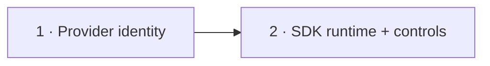

# Conductor SDK launch runtime: phased implementation

Source plan: [`plan.md`](plan.md) ([rendered](plan.html)).

The implementation is divided into two serial merge units. Phase 1 gives every new pipeline task
a provider-owned run identity while preserving the existing terminal host. Phase 2 can then add an
SDK host without weakening completion, restart, duplicate, or legacy-task behavior.

Each phase document is an implementation brief, not a frozen patch recipe. The implementer must
re-read adjacent ownership patterns and record any necessary deviation in the pull request.

## Incorporated decisions

| Decision | Selection | Consequence |
| --- | --- | --- |
| Shipped runtime | Claude Agent SDK | `PipelinesConfigSchema` defaults old and fresh config to `claude-sdk` |
| Failure posture | Fail visibly | No automatic SDK-to-terminal fallback |
| SDK host | Claude only | Invoke the installed skill as `/engineer <idea>`; do not nest `conduct-ts engineer` |
| Completion owner | Provider projection | SDK idleness, host PRs, and host exit do not complete a pipeline task |
| Terminal support | Retained | Terminal is an explicit Settings choice and legacy tasks still bind by home/worktree |
| Daemon scope | Unchanged | ai-conductor's own tmux-supervised build daemon is outside this implementation |

## Phase sizing

The estimated non-test implementation is about 430 lines: approximately 140 lines for provider
identity, launch prebinding, and compatibility behavior, then approximately 290 lines for config,
SDK dispatch, lifecycle guards, Settings, dispatch affordances, and documentation. Tests and
fixtures are additional.

One phase would mix a provider-identity migration with a new SDK ownership path and its visible
controls. Two phases create a useful compatibility boundary: Phase 1 is terminal-only and can be
validated against current behavior; Phase 2 activates SDK only after the task has a durable run key.
A third phase would leave either the server or the dashboard carrying an unusable or inaccurate
setting, so runtime activation and operator controls stay together.

## Repository findings that shaped the phases

- Pipeline launch bypasses normal runtime resolution at `src/server/dispatcher.ts:196` and enters
  `dispatchPipeline`; no ordinary worktree or harness launch is involved.
- `PipelineProvider.taskArgv` in `src/server/pipelines/types.ts:239` is the existing
  provider-specific launch seam. `pipelineTaskLaunch` in `src/server/pipelines/index.ts:207`
  supplies consent and single-provider resolution around it.
- `conductorEngineerArgv` in `src/server/pipelines/conductor/index.ts:342` removes
  `CLAUDECODE` before invoking the interactive CLI. ai-conductor's wrapper refuses nested Claude
  sessions and tells an existing Claude host to invoke `/engineer` directly.
- ai-conductor's `slugify` at external commit `eda111c903d1` lowercases, replaces
  non-alphanumeric runs with hyphens, trims edge hyphens, and truncates to 50 characters. Engineer
  uses that result for `.docs/plans/<slug>.md`; its daemon projects the plan stem as the run slug.
- `Task.pipelineRun` already persists the complete provider key. The current task creation comment
  in `src/server/tasks.ts` says it is learned only after a child session appears, which Phase 1
  intentionally changes for new dispatches.
- `TaskManager.bindPipelineTask` uses terminal resources plus discovered worktree containment.
  That remains necessary for old tasks whose durable row has no link.
- `TaskManager.settlePipelineTask` already treats a processed provider projection as completion
  authority and adopts the provider PR without satisfying merge-only dependency edges.
- `SdkSupervisor.start` already persists `taskId`, registers the SDK card, restores interrupted
  turns, and exposes `taskLiveness` and `liveSessionForTask`. A pipeline adapter must reuse it and
  must not add a second SDK store or eviction path.
- Binding an SDK host through `Task.sessionId` makes generic task PR, idle, merge, exit, and startup
  reconcilers see the pipeline task. Those paths currently assume the session owns completion.
  Phase 2 must explicitly exclude provider-owned pipeline tasks and test every exclusion.
- Claude's SDK driver loads user, project, and local settings, so the installed Engineer skill is
  available to a direct slash invocation. The adapter does not need an ai-conductor SDK dependency.
- Pipeline config is a Zod-validated `app_config` blob. A defaulted `launchRuntime` field needs no
  SQLite migration, but `PUT /api/pipelines/config` reconstructs the object field by field and will
  drop a field that is not forwarded explicitly.
- The dispatch modal currently reads only `/api/pipelines/repos` and renders a static terminal-only
  constraint from `TASK_KIND_BEHAVIOR`. Phase 2 must carry the runtime into that existing read or an
  equivalent single source, then make the wording runtime-aware.
- Every visible Settings or dispatch change requires Playwright coverage under `e2e/`, in addition
  to render and HTTP tests.

## Phases

| # | Phase | File | Direct prerequisites |
| --- | --- | --- | --- |
| 1 | Deterministic provider identity | [`phase-1-provider-identity.md`](phase-1-provider-identity.md) | none |
| 2 | Claude SDK runtime and operator controls | [`phase-2-sdk-runtime-and-controls.md`](phase-2-sdk-runtime-and-controls.md) | 1 |

## Dependency graph and concurrency

The phases are deliberately serial. They overlap in `src/server/dispatcher.ts`, pipeline provider
contracts, task lifecycle tests, and dispatch documentation. Phase 2 also relies on the durable run
key Phase 1 creates before any SDK session can become the task's host. There is no safe concurrent
implementation lane.

## Cross-phase contracts

- **C1, canonical identity (owned by Phase 1):** the Conductor adapter, not shared task code,
  derives the expected 50-character idea slug and returns a complete `PipelineRunLink`.
- **C2, one active task per run (owned by Phase 1):** dispatch refuses a live pipeline task or a
  provider worktree already owning the same `(provider, repoRoot, slug)` before another host starts.
- **C3, prebinding (owned by Phase 1):** every new pipeline dispatch stores `pipelineRun` before it
  launches a terminal or SDK host. Retry clears and recomputes it.
- **C4, legacy fallback (owned by Phase 1):** a task persisted by an older build with
  `pipelineRun: null` may still bind once through its terminal home and a discovered session in the
  projected worktree. A prebound task cannot be reassigned to a different key.
- **C5, provider completion (owned by Phase 1):** only the exact processed provider run settles the
  task and supplies its outcome URL. Host lifecycle never fabricates provider completion.
- **C6, config authority (owned by Phase 2):** `PipelinesConfig.launchRuntime` is the sole runtime
  choice for pipeline tasks; the generic task runtime picker remains inapplicable.
- **C7, SDK ownership (owned by Phase 2):** the Claude SDK session is the current executing session
  and may be focused or cancelled, but generic session PR, idle, and merge reconciliation cannot
  settle its pipeline task.
- **C8, host loss (owned by Phase 2):** a lost SDK host fails the task only while its expected
  provider run does not exist. Once projected, the task clears the stale session binding and stays
  provider-owned.
- **C9, startup (owned by Phase 2):** a live SDK row restores normally; a task whose host is gone
  but whose provider run exists stays live for provider reconciliation; a processed restored run
  settles through the existing projection listener.
- **C10, explicit failure (owned by Phase 2):** SDK preflight or start errors fail that dispatch.
  Nothing silently launches a terminal.
- **C11, product boundary (owned by Phase 2):** Settings and dispatch copy say that SDK replaces
  Engineer's Mission Control terminal only, not ai-conductor's tmux-supervised daemon.

## Compatibility strategy

There is no database migration. Existing task fields carry both identities, and the pipelines
config schema supplies its new default when reading old blobs. The behavior-registry launch label
is in-memory and may change from `pipeline-terminal` to `pipeline` only when all browser consumers
become runtime-aware in Phase 2.

Phase 1 is compatible in both directions: it still opens the same terminal argv and home, while a
new build can also settle a prebound task without waiting for child-session discovery. Phase 2 is a
deliberate product-default change approved by the operator. Terminal remains an explicit setting,
not a fallback.

## Plan-wide verification

Both phase pull requests run focused tests, `npm run typecheck`, `npm run lint`, and `npm test`.
Phase 2 additionally runs `npm run build`, `npm run smoke`, and the complete Playwright suite after
its focused Conductor specs pass. Successful UI evidence belongs in the gitignored evidence
directory and on the pull request, never in these plan artifacts.

## Plan-wide non-goals

- ai-conductor daemon supervision or a tmux-free end-to-end installation;
- Codex Agent SDK hosting for `$engineer`;
- changes to provider routing, DECIDE, gates, downstream agents, or cost ingestion;
- a Mission Control worktree, extra repositories, after-work Workflow, or Foreman dispatch for a
  pipeline task;
- transcript or shell-command parsing as a correlation mechanism;
- cancelling or managing the provider's independently owned daemon.

## Cross-phase audit record

- 2026-08-17: traced terminal launch, provider projection, task resource binding, SDK persistence,
  restart reconciliation, Settings config, and dispatch affordances against the current checkout.
- 2026-08-17: verified direct `/engineer` syntax, nested-session refusal, slug derivation, and
  daemon tmux ownership against ai-conductor commit `eda111c903d1`.
- 2026-08-17: moved deterministic run identity ahead of SDK activation. Without this boundary an
  SDK host runs in the primary checkout and cannot inherit the terminal home's strong resource
  join to the provider worktree.
- 2026-08-17: added explicit generic-completion exclusions to Phase 2. Writing an SDK host to
  `Task.sessionId` otherwise exposes the provider-owned task to idle/PR/merge/exit reconcilers that
  were designed for ordinary session-owned work.
- 2026-08-17: kept runtime activation and UI in one phase. A server-only config value would make
  the dispatch form continue claiming every pipeline uses a real terminal, which is not an
  independently shippable state.
