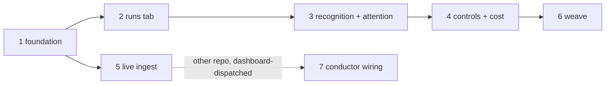

# Conductor SDLC integration: phased implementation plan

Source plan: [plan.md](plan.md). This index splits it into merge units, each delivered by one
task and one reviewable pull request (phase 7 excepted: it lands in the ai-conductor
repository and is dispatched separately from the dashboard).

## Incorporated human decisions

Recorded in full in [plan.md](plan.md) under "Approved decisions". The ones that shaped the
split:

- Pipelines live inside the Runs page behind a page-level Workflows | Pipelines tab (not a new
  topbar destination), and **the existing workflow Runs surface is not modified**; phase 2
  owns the regression spec that pins it.
- The pipeline detail gets its own horizontal diagram in the workflow diagram's visual
  grammar; the conversation window's Workflows tab renders a pipeline ladder for correlated
  sessions.
- Everything ships off; enabling is consent (phase 1 owns the consent surface).
- The scout's deferred ideas (ensemble-powered DECIDE, memory unification, intake bridging)
  are out of scope and unscheduled.

## Investigated findings that shaped the split

- Conductor's visualizer seam is dormant, so live events need one upstream conductor PR. That
  isolates cleanly: file-tail observation (phase 1) carries every UI phase, ingest lands
  MC-side fully operable (phase 5), and the conductor wiring (phase 7) upgrades it to live
  without any MC change.
- The session-carding hazard (a conductor-driven `--print` claude cards with a live composer)
  is fixed by recognition in phase 3; it depends on the phase 2 route only for its deep links.
- MC's contracts make most extensions compile-time-enumerable (append-only tuples, exhaustive
  Records, the `ServerEvent` never-check), so contracts are front-loaded into phase 1 and
  later phases are consumers.

## Phases

| Phase | File | Delivers | Direct prerequisites |
| --- | --- | --- | --- |
| 1 | [phase-1-foundation-and-settings.md](phase-1-foundation-and-settings.md) | Shared contracts, `pipeline_runs` projection, state parsers and tail, SSE events, Settings consent panel, fixtures | none |
| 2 | [phase-2-runs-pipelines-tab.md](phase-2-runs-pipelines-tab.md) | Runs page kind tab, pipelines rail, run detail diagram, deep links, the Workflows-tab regression spec | 1 |
| 3 | [phase-3-session-recognition-and-attention.md](phase-3-session-recognition-and-attention.md) | Session correlation, card badge and composer suppression, Workflows-tab ladder, `pipeline_halt` attention | 2 |
| 4 | [phase-4-pipeline-controls-and-cost.md](phase-4-pipeline-controls-and-cost.md) | Control verbs and stdout validation, hosted consoles, attention actions, `conductor` usage writer | 2, 3 |
| 5 | [phase-5-live-event-ingest.md](phase-5-live-event-ingest.md) | `POST /ingest/conductor`, `pipeline_events` ledger, the shipped visualizer plugin, tail demotion | 1 |
| 6 | [phase-6-dispatch-inspector-foreman.md](phase-6-dispatch-inspector-foreman.md) | Dispatch kind `pipeline`, Inspector `pipeline` source, opt-in Foreman triage of mechanical halts | 4 |
| 7 | [phase-7-conductor-visualizer-wiring.md](phase-7-conductor-visualizer-wiring.md) | Conductor-side visualizer lifecycle wiring (**ai-conductor repository**, dashboard-dispatched, after 5 merges) | 5 (cross-repo) |

## Dependency graph

## Concurrency groups and merge order

- After phase 1 merges: phase 2 and phase 5 may run concurrently and merge in either order
  (phase 5's `routes.ts`/`db.ts` edits are additive and disjoint from every phase 2 file).
- Phase 5 also runs concurrently with phases 3, 4, and 6 (disjoint or additive-only files;
  either merge order is safe against each).
- Phases 2 → 3 → 4 → 6 are serial: each mounts on the previous phase's surface.
- Phase 7 is dispatched from the dashboard against ai-conductor only after phase 5 merges.

## Cross-phase contracts

Owned where introduced; consumers never redefine them:

- Phase 1: `src/shared/pipeline.ts` shapes, `PIPELINE_PROVIDER_IDS` (append-only),
  `Session.pipeline` and its comparator, `pipeline_upsert`/`pipeline_remove`/
  `snapshot.pipelineRuns`, the `pipeline_runs` key, the read-only pipelines module, the e2e
  fixture tree and fake `conduct-ts`.
- Phase 2: the `#/runs/pipeline/:repo/:slug` route and hash helper; the reserved header action
  slot; the tab visibility rule.
- Phase 3: the `pipeline_halt` attention kind and payload; the correlation rule; the
  non-messageable predicate extension.
- Phase 4: the action-route surface; the `conductor` usage writer id (append-only); the
  stdout-validation posture.
- Phase 5: the ingest envelope `{ repo, worktree, slug, seq, event }` and
  `/ingest/conductor`; the `pipeline_events` key (append-only); the plugin home
  `integrations/ai-conductor/mission-control/`.
- Phase 6: the `pipeline` task kind and `"pipeline"` inspector source (append-only); the
  mechanical-only triage gate.

## Final verification

After all in-repo phases merge: the full Definition of done on `main` (`npm run typecheck`,
`npm run lint`, `npm test`, `npm run build`, `npm run smoke`, `npm run test:e2e`), the phase 2
regression spec still green, an upgrade test opening a phase-1-era database, and a manual
end-to-end pass against a real conductor checkout: enable a repo, watch a fixture-driven run
walk SETUP through SHIP, exercise one halt with its attention actions, dispatch one pipeline,
and (once phase 7 lands upstream) observe live ingest demote the tail. With the integration
disabled or conductor absent, the dashboard is byte-for-byte today's.

## Audit summary

Every plan.md requirement maps to exactly one phase (decisions 2, 3, 4 to phase 2; decision 5
and the carding fix to phase 3; decision 7 to phase 1; controls to phase 4; live events to
phases 5 and 7; the weave to phase 6; decision 8 excluded by design). Each consumer follows
its prerequisite; the two concurrent groups touch disjoint or additive-only files; no phase
relies on an unmerged later phase to be operable.
