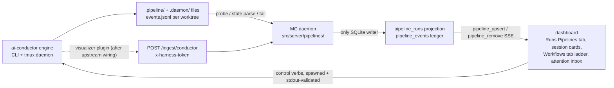

# Conductor SDLC integration: bridge ai-conductor into Mission Control

Mission Control gains a native surface for ai-conductor pipelines: the gated 22-step SDLC that
conductor drives (SETUP, UNDERSTAND, DECIDE, BUILD, SHIP) becomes visible, operable, and
dispatchable from the dashboard, without merging the two systems. Conductor stays the engine and
the only writer of its own state; Mission Control observes, projects, and controls through
conductor's own sanctioned surfaces. Everything ships off by default; an operator without
conductor installed sees nothing new.

This plan is the committed, self-contained source of truth for the work. It distills and
supersedes the scout investigation (session-archived report `conductor-sdlc-integration`, checkout
copy at `docs/reports/conductor-sdlc-integration/report.html`, which is deliberately not committed
per the scout contract). Repository facts below were verified against ai-harness `dc2d99a` and
ai-conductor `8b51392d`.

## Approved decisions

These were decided by the human during plan review and are requirements, not open questions:

1. **Bridge, do not merge.** Conductor remains a standalone engine. MC integrates through a
   compile-time "pipeline provider" axis modeled on MC's existing registries, plus conductor's
   visualizer plugin seam for live events. No conductor logic is ported into MC.
2. **Pipelines live inside the Runs page behind a page-level kind tab** - Workflows | Pipelines -
   not a new topbar destination.
3. **The existing Runs page is not modified.** The Workflows tab is today's Runs page, byte for
   byte: the run rail, the horizontal workflow diagram (stage cards, command rows, reviewer
   cards, round tabs, the repair-loop footer, Reviewer verdicts) are all untouched by this work,
   and a Playwright regression spec pins that.
4. **The pipeline detail gets its own diagram** on the Pipelines tab, in the same visual grammar
   as the workflow diagram: header with live eyebrow and run actions, attempt cards where the
   workflow detail shows round tabs, a horizontal Spec terminus / SETUP / UNDERSTAND / DECIDE /
   BUILD / SHIP / PR terminus strip with command-style step rows, labeled wires, a kickback rule
   footer, and a "Gate verdicts" section below.
5. **The conversation window's per-session Workflows tab** additionally renders a pipeline ladder
   (the vertical ladder it already draws for workflow runs) when a session is correlated to a
   pipeline. Every other session's tab is unchanged.
6. **As native as possible.** MC design tokens, existing component grammar, no new visual
   language. Custom views are fine where needed to make the integration seamless.
7. **Consent model:** detection is automatic, everything arrives disabled, enabling is consent -
   the task-sources posture, verbatim.
8. The scout's "phase 4" ideas (ensemble-powered DECIDE, memory unification, intake bridging)
   are explicitly deferred and are not part of this plan's scheduled work.

## What the investigation established

- **Conductor's visualizer plugin seam is dormant.** The plugin registry discovers
  `kind: visualizer` plugins, but nothing in production starts them: only the built-in OTel
  visualizer is wired inline in `src/index.ts`, and the daemon entrypoint wires none. "Zero
  conductor changes" therefore holds for file-based observation but fails for live events. One
  small upstream PR wiring registered-visualizer start/stop in both entrypoints closes it; until
  it lands, an events-file tail carries the integration.
- **Observation is file-shaped and stable enough to build on.** Per worktree:
  `.pipeline/conduct-state.json` (per-step statuses, `last_step`, `complexity_tier`, `track`),
  `gates/<step>.json` verdicts, `HALT`/`DONE` markers, `.daemon/` (pidfile, `PAUSED`, `parked/`,
  `grants/`, schema-versioned `gated.json`/`blocked.json`), an `events.jsonl` ledger (74 event
  kinds, unversioned), and a machine-readable `~/.ai-conductor/registry.json` plus JSON-emitting
  CLI verbs (`engineer projects`, `inline --status`).
- **Control is CLI-shaped.** Daemon start/stop/pause/resume, park/unpark, `decide-grant` (which
  refuses `--step plan` by design), reseal (TTY-only ceremony), and
  `daemon connect --attach-into <tmux target>` for hosted consoles. Engineer verbs exit 0 even on
  malformed invocations, so control validation must parse expected stdout, not exit codes.
- **The session-carding hazard is real, on both sides.** MC's discovery cards any tty claude
  process, and conductor spawns claude non-detached with a pane tty in `--print` mode - so a
  conductor-driven agent cards as an ordinary session with a live composer writing into a process
  that reads no input. Recognition (badge, grouping, composer suppression) is a correctness fix.
- **MC's pool reaper cannot touch conductor worktrees.** Its candidates come only from
  `treehouse status` output gated on `treehouse.toml`; conductor's in-repo `.worktrees/` never
  enters that set.
- **Inspector adoption is additive.** `adoptPr(url, ctx, source, ts)` takes a source string;
  extending `InspectorSource` is a type-level append with zero DDL.
- **Conductor's engine refuses to nest** (`CLAUDECODE` guard) and `engineer` reads a real stdin,
  so dispatching a pipeline from MC must use a terminal-runtime session, never the SDK runtime.

## Architecture

### Shared contracts (`src/shared/`, browser-safe, no `node:` imports)

New `src/shared/pipeline.ts`:

```ts
export const PIPELINE_PROVIDER_IDS = ["ai-conductor"] as const; // APPEND-ONLY
export type PipelineProviderId = (typeof PIPELINE_PROVIDER_IDS)[number];

export type PipelinePhase = "SETUP" | "UNDERSTAND" | "DECIDE" | "BUILD" | "SHIP";
export type PipelineStepState =
  "pending" | "in_progress" | "done" | "failed" | "skipped" | "stale";
export type PipelineHaltClass =
  "needs-human" | "mechanical" | "protected-artifact" | "legacy" | "unclassified";

export interface PipelineRun {
  provider: PipelineProviderId;
  repoRoot: string;
  slug: string;                        // the plan stem - conductor's canonical key
  tier: "S" | "M" | "L" | null;        // conduct-state.complexity_tier
  track: "product" | "technical" | null;
  steps: { name: string; state: PipelineStepState }[]; // source order; unknown names tolerated
  lastStep: string | null;
  halt: { class: PipelineHaltClass; reason: string } | null;
  group: "building" | "eligible" | "waiting" | "halted" | "parked" | "processed";
  prUrl: string | null;
  costTokens: number | null;
  updatedAt: number;
}
```

Plus a browser-safe `PIPELINE_PROVIDER_INFO` record (label, blurb) mirroring
`TASK_SOURCE_KIND_INFO`, and one additive optional `Session` field:
`pipeline: { provider: PipelineProviderId; slug: string; step: string | null } | null`, with the
matching entry in `SESSION_FIELD_COMPARATORS`. MC ships its own frozen copy of conductor's
22-step order and phase map for display; a step name the copy does not know renders as an
unknown-step chip and sorts after known ones, so a conductor upgrade degrades the display, never
the page.

### Daemon side (`src/server/`)

- **`src/server/pipelines/`** (new module): `index.ts` with
  `PIPELINE_PROVIDERS: Record<PipelineProviderId, PipelineProvider>`; `conductor/probe.ts`
  (binary on PATH, version, registry read with file fallback); `conductor/state.ts` (parsers for
  `conduct-state.json`, `gates/*.json`, `HALT`/`HALT.class`/`DONE`, `.daemon/` markers and v1
  snapshots); `conductor/tail.ts` (byte-offset incremental reads of each worktree's
  `events.jsonl`); `conductor/control.ts` (spawns CLI verbs, validates by parsing expected
  stdout); `conductor/normalize.ts` (event and state fold into `PipelineRun`). The module never
  writes a conductor-owned file: conductor state is CAS/lease-guarded and the CLI is the only
  mutation path.
- **Two tables** in `openDb()`: `pipeline_runs`, a projection cache keyed
  `(provider, repo_root, slug)`, rebuildable from files at any time; `pipeline_events`, an
  append-only ingest ledger keyed `(provider, repo_root, slug, seq)` with `seq NOT NULL` (UNIQUE
  index columns targeted by `ON CONFLICT` must be NOT NULL; the tail assigns byte offsets as seq
  when the producer did not number the event). The daemon remains the only SQLite writer.
- **Two `ServerEvent` kinds**: `pipeline_upsert { run }` and
  `pipeline_remove { provider, repoRoot, slug }`, plus a `pipelineRuns` collection in `snapshot`.
  Touch list per the change contracts: `src/shared/types.ts`, `src/web/useEventStream.ts` (two
  case arms before the never-check), `registry.snapshot()` and the emit sites; `sse.ts`
  untouched. Extend the compile-probe exhaustiveness tests as the last event families did.
- **Ingest route**: `POST /ingest/conductor` in `src/server/routes.ts` beside `/hooks/:event`;
  first-line `x-harness-token` check, Zod envelope `{ repo, worktree, slug, seq, event }`,
  unknown event kinds stored opaquely as `kind: "unknown"` rather than rejected (conductor's
  event schema is TypeScript-only and unversioned; tolerance is mandatory).
- **Session correlation**: in discovery's correlate pass, a carded claude/codex session whose cwd
  sits under an enabled conductor repo's `.worktrees/<slug>` gets its `pipeline` field stamped.
  The web layer renders the badge, groups the card under the run, and suppresses the composer (a
  `--print` process reads no input) while showing the real permission posture. Uncorrelated
  sessions are untouched - fail-open to today's behavior.
- **Halts into attention**: a sixth `AttentionItem` kind `pipeline_halt`, derived before
  `session_blocked` claims leftovers, carrying halt class, blocker text, the matching runbook
  name, and verb buttons. The topbar "need you" count and the Line's amber semantics follow for
  free because both fold over the same state.
- **Cost roll-in**: conductor's per-feature usage totals enter `usage_ledger` under a fifth
  append-only writer id `conductor` (`spend_kind: "automation"`), following the four existing
  hardcoded-INSERT patterns; the change-contracts list gains the id in the same commit.
- **Settings**: a Conductor panel in `SETTINGS_CATEGORIES` modeled on task sources - detection
  state, master enable, per-repo enable switches, health line. Arrives off.

### Web side (`src/web/`)

- **Runs page**: a page-level Workflows | Pipelines kind tab. The Workflows tab is today's page
  unchanged (decision 3, regression-pinned). The Pipelines tab is a sibling surface: its own
  rail projection (grouped per enabled repo under a daemon chip) and its own detail. Deep links:
  `#/runs/:id` keeps meaning a workflow run; `#/runs/pipeline/:repo/:slug` addresses a pipeline.
- **Pipeline detail diagram** per decision 4, with verdict chips read from `gates/*.json`, the
  deprecated no-op step drawn dashed like a disabled command, wires labeled with the boundary
  they cross, and the kickback rule stated in the footer strip.
- **Conversation window**: `SessionWorkflowsPane` renders the pipeline ladder when
  `session.pipeline` is set (phase groups collapsed, current step haloed, "Open in Runs" deep
  link); unchanged otherwise.
- **Fleet surfaces**: session-card badge and grouping; the attention inbox section; the dispatch
  modal's `pipeline` kind (the guided pass picks it up mechanically) with the one constraint the
  engine imposes: terminal runtime only.

### Conductor side (ai-conductor repository)

- **One upstream PR**: start registered `visualizer` plugins in both entrypoints - build the
  list beside the OTel visualizer in `src/index.ts`, and give `daemon-cli.ts` the same
  start/stop-with-flush pass over the daemon bus it currently gives nothing. Small, type-guided,
  inside the seam's documented intent; it goes through conductor's own spec-first intake.
  Optional companions to propose while there: a `seq`/`schemaVersion` field on persisted events,
  and declaring `daemon pause`/`resume` in the help tree.
- **The plugin itself ships from the MC repo** (it is coupled to MC's ingest schema): a directory
  installable into `~/.ai-conductor/plugins/mission-control/` - `plugin.yml`
  (`kind: visualizer`, `harness_version` pinned to a tested range so a breaking conductor
  upgrade refuses loudly) and a default-exported `{ name, start(emitter), stop() }` instance.
  `start()` enumerates the event types it forwards (the bus has no wildcard), batches NDJSON,
  POSTs to `/ingest/conductor` with the operator's token, and swallows transport failures after
  one bounded warning - the OTel visualizer's exact posture. The file tail remains the backfill.

## Data flow



Conductor's files stay the source of truth; the SQLite projection is rebuildable from them at
any time. The control path never writes conductor files - it spawns conductor's own CLI.

## Testing

Per MC's rules: a fake `conduct-ts` plus canned state-file trees (a fixture repo with
`.worktrees/<slug>/.pipeline/` and `.daemon/`) in `e2e/fixtures/`, following the fake-agents
pattern - both dispatch paths stay faked and no spec ever spends a model token. Playwright specs
for every UI surface, including the Workflows-tab-unchanged regression spec. Unit tests in
`test/` for the state parsers, the normalizer, projection rebuild-from-files, and control-verb
stdout validation. The compile-probe exhaustiveness tests extend for the two new event kinds. An
upgrade test opens a pre-feature database. Selectors by role and label, never `data-testid`.

## Phasing

The implementation split, dependency graph, and per-phase detail live in
[phased-plan.md](phased-plan.md) and the `phase-<n>-*.md` files beside this plan. Six phases land
in this repository; one small companion phase lands in the ai-conductor repository and is
dispatched separately from the dashboard.

## Non-goals

- No modification to the existing workflow Runs surface (decision 3).
- No porting of conductor's engine, gates, or step logic into MC.
- No MC-side writes to any conductor-owned file.
- No second session-eviction path, no second SQLite writer, no new topbar destination.
- Ensemble-powered DECIDE, memory unification, and intake bridging: deferred (decision 8).
