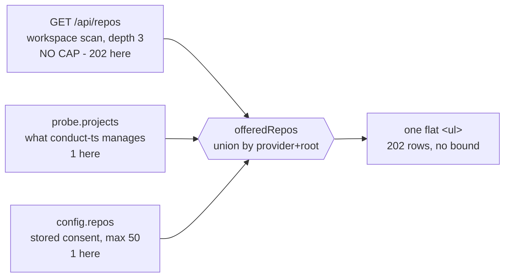
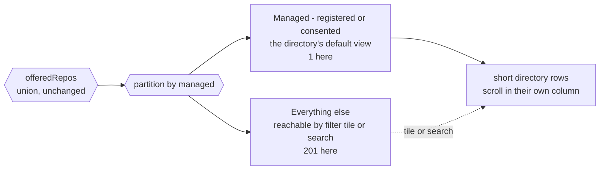

# Conductor settings: directory and detail

The Conductor settings category does not look or behave like the settings pages around it,
and the repository list at the bottom of it runs off the end of the page. This plan records
what is measurably wrong, and the shape the page takes instead.

Nothing here changes what Conductor *does*. The engine probe, the consent model, the two
ordered mutations behind registration, and the launch runtime all keep their current
behaviour. This is about the page they are presented on.

## Decisions taken

Reviewed and resolved on the rendered plan:

| Decision | Chosen |
| --- | --- |
| Page shape | **Directory and detail** - the master-detail shape Task sources already uses |
| Default list contents | **Managed repositories first** - registered or consented, with the rest one filter away |
| Rides along in the same change | Settings-search entries for all six anchors; a Conductor rail dot; dropping the borrowed and bespoke classes |
| Deferred | Trimming the lede, the commissioning ladder and the plugin prose |

Two shapes were considered and rejected. **Console split** - adopting `.sc-split` and drawing
the repositories through the shared `ConsoleTable` - is the most literal answer to "match the
other settings pages", but it bounds the 202 rows rather than questioning them, and page 4 of
9 would still be 201 rows of "Conductor does not manage this repository yet". **Manage what
Conductor manages** - listing only registered repositories and moving the workspace scan
behind a picker - is the cheapest and fixes the cause, but it stays a single reading column
and so only half answers the complaint. Directory and detail does both: the workspace stops
being printed *and* the panel converges on an existing settings shape.

## What is wrong, measured

**The list is unbounded, and on this machine it is 202 rows.** `GET /api/repos` walks the
workspace roots to depth 3 and returns every checkout it finds with no cap
(`src/server/repos.ts:80`). `offeredRepos` (`ConductorPanel.tsx:107`) unions that with the
engine's registered projects and the stored consent rows, and the panel renders the whole
union. `.conductor-repos` has no `max-height` and no `overflow` (`src/web/styles.css:19979`),
so the page itself grows. Each row is four lines of text plus a switch and a button. Asked
directly, this daemon answers with **202 repositories, of which 1 is registered.** The other
201 rows exist only to say "Conductor does not manage this repository yet."

The stored consent list is capped at 50 (`MAX_PIPELINE_REPOS`, `src/shared/pipeline.ts:415`).
The rendered list is not capped at anything.

**Every sibling console panel is two columns; this one is one column.** GitHub Inspector,
Shipping and Foreman all use `.sc-split` - a 332px control column beside a wide ledger
(`src/web/styles.css:18615`). Conductor takes `.sc-solo`, which exists for panels that have
*no* list at all (`styles.css:18636`, written for Workflows). Conductor has the longest list
of the five and the layout meant for having none.

**There are no filters and no count.** There is a search box (`ConductorPanel.tsx:590`), added
in #630, and that is the whole of it. Task sources - the other settings category with many
configured things - has a search input, a kind `<select>`, a row of health filter buttons
whose counts come from one shared fold, a count under the list, and focus restoration across
list mutations (`src/web/components/TaskSourcesPanel.tsx:811-926`). Conductor has one of those
five.

**The tallies exist but are drawn by hand.** The panel already computes `registered` and
`active` (`ConductorPanel.tsx:372-373`) - exactly the kind of tally `ConsoleStrip`'s count
tiles exist for (`settings-console.tsx:169`), where a tile both reports a count and *is* the
filter for it.

**Three drifts that ride along.**

- The repo row's toggle borrows `className="skill-switch"` (`:623`), a class defined for the
  Skills catalog (`styles.css:17649`) and carrying a `.skills-list:disabled` descendant rule
  that can never apply here.
- The Engineer host choice is a bespoke `.conductor-runtime-choice` radio list (`:514-544`)
  rather than the `sc-field sc-seg` segmented control the other three console panels use
  (`ShippingSettingsPanel.tsx:234`, `InspectorSettingsPanel.tsx:307`,
  `ForemanSettingsPanel.tsx:599`).
- `settings-dots.ts` has no `conductor` case, so the rail row never carries a dot - even
  though `SettingsStatus` already carries a `pipelines: { present, observing }` tuple the dot
  could read.

**The category is nearly invisible to settings search.** `settings-search.ts` carries a single
entry for `conductor` (`:430`), pointing at `conductor/repos`. The panel renders six anchors -
`conductor/pipelines`, `/detection`, `/enabled`, `/launch-runtime`, `/foreman-triage`,
`/repos`. Five of the six cannot be jumped to from the palette. Workflows indexes 8, Foreman
and Display 5 each. This passes the test suite because the enforced direction is
index-to-render (an indexed anchor that renders nowhere fails) and not the reverse.

## What feeds the repository list

The list today is a union of three sources, merged in authority order and sorted by path
(`ConductorPanel.tsx:107-151`):



The union stays. What changes is that it arrives pre-partitioned, and the directory opens on
the managed partition rather than on all of it:



## The shape

Conductor takes the master-detail layout Task sources already uses - `.ts-master-detail`,
`.ts-list-col`, `.ts-detail-col` (`styles.css:18019-18029`) - and opts out of the reading
column the same way (`styles.css:17027`).

```
+- Conductor --------------------------------- This machine -+
| ai-conductor drives a feature through a gated 22-step SDLC |
| 01 Engine Installed - 02 Register 1 - 03 Observe 1 ready   |
+----------------------+-------------------------------------+
| [ search... ]        |  ai-harness                         |
|  +-------+---------+ |  /Users/jordanmance/workspace/...   |
|  |MANAGED| ALL     | |  ---------------------------------  |
|  | * 1   | 202     | |  Registered with Conductor      yes |
|  +-------+---------+ |  Observed by Mission Control   [o-] |
|  | READY | FAILING | |  Dispatch ready                 yes |
|  |   1   | 0       | |  Events arrive by       live events |
|  +-------+---------+ |  Last read                   4s ago |
| ---------------------|                                     |
| * ai-harness    Ready|  engine daemon running              |
|                      |  3 pipelines, 1 halted              |
|   (managed only, by  |                                     |
|    default - the     |                                     |
|    other 201 are one |                                     |
|    tile away)        |                                     |
| ---------------------|                                     |
| 1 of 202 repositories|  [ Open Pipelines tab ][ Stop obs. ]|
+----------------------+-------------------------------------+
| THE ENGINE | OBSERVE PIPELINES | LAUNCH RUNTIME | TRIAGE   |
| (the four configuration cards, below the directory)        |
+------------------------------------------------------------+
```

- **The directory opens on what Conductor manages.** The default filter tile is *Managed* -
  registered or consented - which is 1 row here, not 202. `All`, `Ready` and `Failing` are
  tiles beside it, so nothing is hidden and the full catalogue is one click away.
- **The directory rows get short.** Name, a status dot, and the ready mark - so even the
  `All 202` view is a column that scrolls inside itself, not a page that scrolls for twenty
  screens.
- **The detail pane gets long.** Everything the current 90px row cannot hold has room: the
  full health line, the ingest mode (live events versus file tail versus plugin quiet), the
  last read time, the row error, and the register or enable action as a real primary button.
  Its navigation action is **Open Pipelines tab**: the route grammar has no repository-scoped
  pipelines address, so a label promising one would be a lie. See the phase document for the
  grammar this rests on.
- **The filter tiles are the counts, and there is one row of them.** Not a read-only metric
  row above a separate chip row: every number an overview strip would show is a number a tile
  already carries, and two tallies a few pixels apart is exactly the disagreement `healthCounts`
  (`TaskSourcesPanel.tsx:786-804`) was written to prevent. One bucket function feeds both the
  tallies and the rows they select, so the two cannot drift - the rule `ConsoleStrip` and Task
  sources' health chips already follow.
- **Search narrows the active tile; it does not escape it.** The tile and the query combine,
  which is what Task sources does today (`TaskSourcesPanel.tsx:838-845`), and it is what keeps a
  tile's count meaningful: the count describes the population the tile names, not whatever rows
  survive a query. The cost is real - a query matching only unmanaged repositories finds nothing
  while *Managed* is active - so that case does not render as a bare empty list. When the query
  would match under a wider tile, the empty state says how many and offers that tile.
- **The four configuration cards sit below the directory**, as compact cards. They are global
  switches with nothing to do with the selected repository, so they must not compete with the
  detail pane for the right-hand column.

### The redundancy this leaves, deliberately

Trimming the lede, the `01/02/03` commissioning ladder and the plugin prose was deferred, so
they stay. The ladder's `02 Register repo - 1 registered` and `03 Observe - 1 ready` will
therefore say the same thing as two of the four overview metrics. That is accepted for now
rather than unnoticed: the ladder is the first-run narrative and the metrics are the filter,
and they overlap. Collapsing the ladder into the header is the obvious follow-up once the new
shape has been used.

## What rides along

- **`settings-search.ts` gains an entry per anchor**, so the engine, the consent switch, the
  launch runtime and Foreman triage become reachable from the palette instead of only
  `conductor/repos`. Six anchors, six entries.
- **The rail row gets a dot.** `settings-dots.ts` grows a `conductor` case reading the
  `SettingsStatus.pipelines` tuple that already exists, plus its `dotLabel` branch in
  `SettingsPage.tsx:81-108`, so colour is not the only signal.
- **The borrowed and bespoke classes go.** `skill-switch` stops being borrowed from the Skills
  catalog, and the Engineer host choice moves to the shared `sc-seg` segmented control.

## What does not change

- The consent model. Registration through Conductor's CLI and Mission Control's separate
  observation stay two ordered mutations, and the whole-config `PUT` stays the single consent
  writer.
- Every server route. This is a `src/web` change; no endpoint, schema or migration moves.
- The claim the panel makes about itself - that Mission Control never edits Conductor's
  registry or pipeline files.
- `MAX_PIPELINE_REPOS = 50` and the 50-row consent cap.
- The lede, the commissioning ladder and the plugin prose, which were deferred.

## Verification

- **A spec that seeds many repositories and asserts the page does not render all of them.**
  This is the regression the whole change exists to prevent, and it is the one assertion that
  fails today.
- `e2e/specs/settings-conductor.spec.ts` covers the new shape, including selecting a
  repository from the directory and reading its detail pane.
- **A spec that pins search-and-filter precedence**, because neither control reveals the rule on
  its own: with *Managed* active, a query matching only an unmanaged repository renders no rows
  and the empty state offers the wider tile, and taking that offer renders the match.
- `docs/pipelines.md:110-140` - which currently documents "the panel holds five cards" - is
  rewritten to the new shape in the same change.

## Risks

- **The tests are the real cost.** `e2e/specs/settings-conductor.spec.ts` is 548 lines and
  reaches rows through `li.conductor-repo`; `test/conductor-panel.test.ts` is 487 lines of
  markup assertions; `test/settings-sidebar-render.test.ts` fingerprints the panel by the
  string "Conductor commissioning progress". The first two are rewritten by this change; the
  third survives only because the ladder was deferred.
- **Selection state has to survive the four-second poll.** `useConductor` polls at
  `POLL_MS = 4000`, and Task sources hit exactly this problem - its directory restores focus
  across list mutations (`TaskSourcesPanel.tsx:847-853`). The selected repository must be held
  by key, not by index, or a poll will move the selection under the operator.
- **A repository can leave the managed partition while selected** - consent withdrawn, or the
  engine de-registers it. The detail pane needs a defined answer for that rather than
  rendering a stale row.
- **The default filter hides 201 rows by design.** That is the point, but it means the
  `Managed` tile has to be unmistakably a filter and not a title, or an operator will read an
  empty directory on a fresh machine as a broken page rather than as "nothing registered yet".
