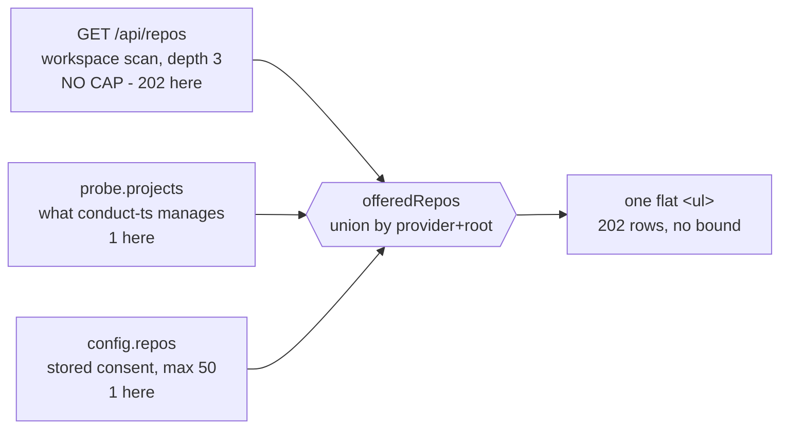
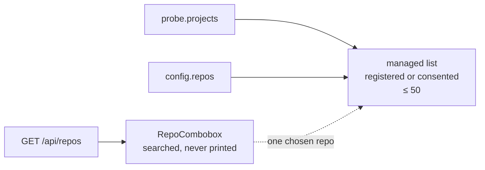

# Conductor settings: three alternatives

The Conductor settings category does not look or behave like the settings pages around it,
and the repository list at the bottom of it runs off the end of the page. This plan states
what is actually wrong, in measurements rather than impressions, and then puts three
alternative shapes for the page side by side so one can be chosen.

Nothing here changes what Conductor *does*. The engine probe, the consent model, the two
ordered mutations behind registration, and the launch runtime all keep their current
behaviour. This is about the page they are presented on.

## What the page is today

One `<section className="settings-section sc-section sc-solo">`
(`src/web/components/ConductorPanel.tsx:386`), 760px wide, in this order:

1. A three-sentence lede.
2. A numbered commissioning ladder - `01 Engine`, `02 Register repo`, `03 Observe`.
3. Conditional daemon-unreachable, error, setup and installer notices.
4. A prose paragraph explaining how to copy the visualizer plugin into `~/.ai-conductor/`.
5. Five stacked `ConsoleCard`s in a single `.sc-controls` column:
   - **The engine** - probe state, registry path, and the whole guided-installer subtree.
   - **Observe pipelines** - the master consent switch.
   - **Launch runtime** - a two-radio Engineer host choice.
   - **Foreman triage** - a switch.
   - **Workspace repositories** - a search box and then every repository, forever.

## What is wrong, measured

**The list is unbounded, and on this machine it is 202 rows.** `GET /api/repos` walks the
workspace roots to depth 3 and returns every checkout it finds with no cap
(`src/server/repos.ts:80`). `offeredRepos` (`ConductorPanel.tsx:107`) unions that with the
engine's registered projects and the stored consent rows, and the panel renders the whole
union. `.conductor-repos` has no `max-height` and no `overflow` (`src/web/styles.css:19979`),
so the page itself grows. Each row is four lines of text plus a switch and a button. Asked
directly, this daemon answers with **202 repositories, of which 1 is registered.** The other
201 rows exist only to say "Conductor does not manage this repository yet."

The stored consent list is capped at 50 (`MAX_PIPELINE_REPOS`, `src/shared/pipeline.ts:415`).
The rendered list is not capped at anything.

**Every sibling console panel is two columns; this one is one column.** GitHub Inspector,
Shipping and Foreman all use `.sc-split` - a 332px control column beside a wide ledger
(`src/web/styles.css:18615`). Conductor takes `.sc-solo`, which exists for panels that have
*no* list at all (`styles.css:18636`, written for Workflows). Conductor has the longest list
of the five and the layout meant for having none.

**The shared paginated table exists and this panel does not use it.** `ConsoleTable` in
`src/web/components/settings-console.tsx:368` owns a heading, column names, a 62vh-bounded
scroller, a filter strip and a pager at `CONSOLE_PAGE_SIZE = 25`. Its own comment says a
panel "cannot make that mistake through this component, because there is no prop with which
to render an unpaged, unbounded list", and `docs/agent-guides/change-contracts.md:656`
records that as a contract. The Conductor list was assembled out of raw `<ul>`/`<li>` beside
that component rather than through it.

**There are no filters and no count.** There is a search box
(`ConductorPanel.tsx:590`), added in #630, and that is the whole of it. Task sources - the
other settings category with many configured things - has a search input, a kind `<select>`,
a row of health filter buttons whose counts come from one shared fold, a count under the
list, and focus restoration across list mutations
(`src/web/components/TaskSourcesPanel.tsx:811-926`). Conductor has one of those five.

**The tallies exist but are drawn by hand.** The panel already computes `registered` and
`active` (`ConductorPanel.tsx:372-373`) - exactly what `ConsoleStrip`'s count tiles exist
for (`settings-console.tsx:169`), where a tile both reports a count and *is* the filter for
it. Instead they are rendered as a bespoke `<ol className="conductor-commissioning">`
(`:393-409`) that restates the cards below it and filters nothing.

**Four smaller drifts, all cheap to correct.**

- The repo row's toggle borrows `className="skill-switch"` (`:623`), a class defined for the
  Skills catalog (`styles.css:17649`) and carrying a `.skills-list:disabled` descendant rule
  that can never apply here.
- The Engineer host choice is a bespoke `.conductor-runtime-choice` radio list (`:514-544`)
  rather than the `sc-field sc-seg` segmented control the other three console panels use
  (`ShippingSettingsPanel.tsx:234`, `InspectorSettingsPanel.tsx:307`,
  `ForemanSettingsPanel.tsx:599`).
- The panel receives no `SettingsNavigate` prop (`SettingsPage.tsx:526` passes only `state`),
  so it cannot deep-link to Trust or anywhere else the way sibling panels do.
- `settings-dots.ts` has no `conductor` case, so the rail row never carries a dot - even
  though `SettingsStatus` already carries a `pipelines: { present, observing }` tuple the
  dot could read.

**The category is nearly invisible to settings search.** `settings-search.ts` carries a
single entry for `conductor` (`:430`), pointing at `conductor/repos`. The panel renders six
anchors - `conductor/pipelines`, `/detection`, `/enabled`, `/launch-runtime`,
`/foreman-triage`, `/repos`. Five of the six cannot be jumped to from the palette. Workflows
indexes 8, Foreman and Display 5 each. This passes the test suite because the enforced
direction is index-to-render (an indexed anchor that renders nowhere fails) and not the
reverse.

## What feeds the repository list

The list today is a union of three sources, merged in authority order and sorted by path
(`ConductorPanel.tsx:107-151`):



Alternatives A and B keep this union and bound how much of it reaches the screen.
Alternative C changes which source *is* the list: Conductor's own managed repositories
become the list, and the 202-repository workspace scan moves behind an explicit
"Add a repository" picker rather than being printed.



---

## Alternative A - Console split

**Make Conductor the same page shape as GitHub Inspector, Shipping and Foreman.**

Drop `sc-solo` and adopt `.sc-split`. The four configuration cards keep their contents and
move into the 332px left column. The repositories become a real ledger in the wide right
column, drawn by `ConsoleTable` with a new `conductor` variant, filtered by a real
`ConsoleStrip`.

```
+- Conductor -------------------------------- This machine -+
| ai-conductor drives a feature through a gated 22-step SDLC |
+----------------------+------------------------------------+
| THE ENGINE           | Repositories                       |
| * Installed 0.101.1  | +-----+------+----------+--------+ |
| Registry ~/.ai-..son | | All | Ready| Registered| Not reg| |
| [ Check again ]      | | 202 |   1  |     1     |   201  | |
+----------------------+ +-----+------+----------+--------+ |
| OBSERVE PIPELINES  o-| | [ search repositories...       ] |
| * On - reading 1     | +--+-----------+-------+--------+-+ |
+----------------------+ |  | REPOSITORY| SETUP | HEALTH | | |
| LAUNCH RUNTIME       | +--+-----------+-------+--------+-+ |
| [ SDK ][ Terminal ]  | |[x]| ai-harness|Reg Obs|running |Ready
+----------------------+ |[ ]| avl-hoops |   -   |   -    |[Reg]
| FOREMAN TRIAGE     o | |      ... 23 more rows ...        |
| * Off                | +----------------------------------+ |
+----------------------+ | 1-25 of 202      < prev   next > | |
                         +----------------------------------+ |
+-----------------------------------------------------------+
```

- **The strip is the filter.** Four `ConsoleStat` tiles - All, Ready, Registered, Not
  registered - folded over one bucket function so the tally and the rows cannot disagree,
  exactly as `.sc-strip` already works for the three ledgers. This replaces the
  `01/02/03` ladder, which was reporting the same two numbers without filtering anything.
- **The pager is the shared one**, 25 rows a page through `consolePage`, bounded at 62vh,
  absent rather than disabled when everything fits, with the focus rescue already built in.
- **Columns**: observe switch, repository (name over path), setup (the three existing
  pills), health line, action.
- The Engineer host radios become the `sc-seg` segmented control the sibling panels use, so
  the narrow left column holds them without a bespoke class.

**What it costs.** `ConsoleTable`'s `variant` is a closed union of
`"inspector" | "shipping" | "foreman"` and its pager says "newer" and "older" because all
three ledgers are chronological. This list is alphabetical, so the component needs a
`conductor` variant, `sc-table-conductor` grid tracks, and a direction-label prop.
`docs/agent-guides/change-contracts.md:656` describes the contract as covering an
"append-only record" and would have to be widened, deliberately, to cover a directory.
`e2e/specs/settings-conductor.spec.ts` reaches rows through `page.locator("li.conductor-repo")`
in six places and would be rewritten against table rows.

**What it is good at.** It is the literal answer to "paginated like other pages": the same
component, the same 25, the same pager, the same bounded height, the same strip. After it,
four settings panels look like one system instead of three plus one.

**What it is not good at.** It bounds the 202 rows rather than questioning them. Page 4 of 9
is still 201 rows of "Conductor does not manage this repository yet."

---

## Alternative B - Directory and detail

**Make Conductor the same page shape as Task sources.**

Task sources is the other settings category whose subject is "many configured things", and
it opted out of the reading column to become master-detail - `.ts-master-detail`,
`.ts-list-col`, `.ts-detail-col` (`styles.css:18019-18029`), with the opt-out at
`styles.css:17027`. Conductor does the same: a metric overview, a searchable and filterable
directory on the left, and the selected repository's full detail on the right.

```
+- Conductor -------------------------------- This machine -+
|  202            1            1               0            |
|  workspace      registered   dispatch ready  need attention|
+---------------------+-------------------------------------+
| [ search... ] [All v]|  ai-harness                         |
| (All)(Ready)(Not reg)|  /Users/jordanmance/workspace/...   |
| ---------------------|  ---------------------------------  |
| * ai-harness    Ready|  Registered with Conductor      yes |
| o ai-conductor       |  Observed by Mission Control   [o-] |
| o avl-hoops          |  Dispatch ready                 yes |
| o claude-skills      |                                     |
| o figgy              |  engine daemon running              |
| o ...                |  3 pipelines, 1 halted, live events |
|   scrolls inside     |  Last read 4s ago                   |
|   its own column     |                                     |
| ---------------------|  [ Open pipelines ] [ Stop observing]|
| 202 repositories     |                                     |
+---------------------+-------------------------------------+
| THE ENGINE | OBSERVE PIPELINES | LAUNCH RUNTIME | TRIAGE   |
| (the four configuration cards, below the directory)        |
+-----------------------------------------------------------+
```

- **The directory rows get short.** Name, a status dot, and nothing else - so 202 of them is
  a column that scrolls inside itself, not a page that scrolls for twenty screens.
- **The detail pane gets long.** Everything the current row cannot hold has room: the full
  health line, the ingest mode (live events versus file tail versus plugin quiet), the last
  read time, the row error, and the register or enable action as a real primary button.
- **Filters exactly like Task sources'**: a search input on `.field-input`, a provider
  `<select>` on `.harnesses-select`, health filter buttons whose counts come from one shared
  fold, a count under the list, and the same focus restoration across polls.

**What it costs.** This is the largest of the three. It is a new two-pane layout with its own
keyboard and focus behaviour, a selected-repository state that has to survive the four-second
poll and probably belongs beside the existing `data-anchor` deep links, and an empty state
for "no repository selected". `e2e/specs/settings-conductor.spec.ts` grows a selection step
on nearly every one of its existing cases.

**What it is good at.** It is the only one of the three that needs no pager at all, and the
only one with room to grow. Per-repository depth that has nowhere to go today - a run
summary, the halt that is waiting, a per-repository ingest choice - gets an obvious home the
moment it exists.

**What it is not good at.** Two of the four configuration cards are global switches with
nothing to do with the selected repository, and they end up either stranded below the fold or
competing with the detail pane for the right-hand column.

---

## Alternative C - Manage what Conductor manages

**Stop printing the workspace. List the repositories Conductor actually manages, and make
adding one an action.**

This alternative treats the 202 rows as the defect rather than as a pagination problem. The
repository card lists the union of *registered* and *consented* repositories - bounded by the
engine's own registry and by `MAX_PIPELINE_REPOS = 50`, and equal to **1** on this machine
today. Adding a repository becomes the `RepoCombobox` the Trust panel already uses for
exactly this (`src/web/components/TrustPanel.tsx:360-366`), which searches the 202 instead of
printing them.

```
+- Conductor ---------------------------- This machine -+
| ai-conductor - engine installed 0.101.1 - 1 observed   |
|                                                        |
| -- Engine and consent ---------------- (section 1) --  |
| THE ENGINE            * Installed at .../conduct-ts    |
| OBSERVE PIPELINES  o- * On - reading 1 repository      |
| LAUNCH RUNTIME        [ Managed SDK ][ Terminal ]      |
| FOREMAN TRIAGE     o  * Off                            |
| > How pipeline events arrive   (poll or push)          |
|                                                        |
| -- Repositories - 1 ------------------ (section 2) --  |
| [ Add a repository   search repos or type a path... v ]|
| +----------------------------------------------------+ |
| | [x] ai-harness             Registered - Observed   | |
| |     /Users/jordanmance/workspace/ai-harness        | |
| |     engine daemon running - 3 pipelines - live     | |
| |                                    [Stop] [Open]   | |
| +----------------------------------------------------+ |
| Nothing else is registered. Add one above.             |
+--------------------------------------------------------+
```

- **Two peer sections, not one.** The panel splits into two `settings-section`s - "Engine and
  consent" and "Repositories" - which is what gives the rail and the search index real
  anchors to land on, and what stops one `data-anchor` standing for a whole page.
- **The managed list is still paged.** It is short by construction, but it takes
  `consolePage` at 25 anyway, so the 50-row ceiling can never reproduce the current shape.
- **The ladder collapses into the header.** One line of facts instead of a numbered ladder
  restating the cards below it. The numbered first-run sequence survives as the *empty
  state*: with no engine and no repositories, the section is the three steps.
- **The plugin prose becomes a disclosure**, on the `aria-expanded` pattern
  `WorktreeSettingsPanel.tsx:222` already uses. It is setup instruction read once, not status
  read weekly.

**What it costs.** The least of the three. No new layout, no `ConsoleTable` generalization,
no master-detail, and the add-repository control is an existing component rather than new UI.
The e2e spec's `li.conductor-repo` rows survive; what changes is that an unregistered
repository is reached through the picker rather than by searching a printed list, which is a
rewrite of about six spec steps.

**What it is not good at.** It is the least visually convergent with the other console
panels - it stays a single reading column, so "matches the current settings pages" is only
half answered. And an operator who wants to check whether some arbitrary repository is
registered has to search the picker for it instead of scanning a list.

---

## What all three do

Whichever shape is chosen, the same work lands with it:

- **The repository list stops rendering unbounded.** No option leaves 202 rows on the page.
- **`settings-search.ts` gains an entry per anchor**, so the engine, the consent switch, the
  launch runtime and Foreman triage become reachable from the palette instead of only
  `conductor/repos`.
- **The rail row gets a dot.** `settings-dots.ts` grows a `conductor` case reading the
  `SettingsStatus.pipelines` tuple that already exists, plus its `dotLabel` branch, so colour
  is not the only signal.
- **The borrowed and bespoke classes go.** `skill-switch` stops being borrowed from the
  Skills catalog, and the Engineer host choice moves to the shared `sc-seg` segmented
  control.
- **`docs/pipelines.md:110-140`** - which currently documents "the panel holds five cards" -
  is rewritten to the chosen shape in the same change.
- **`e2e/specs/settings-conductor.spec.ts` covers the new shape**, including the bound: a
  spec that seeds many repositories and asserts the page does not render all of them.

## What does not change

- The consent model. Registration through Conductor's CLI and Mission Control's separate
  observation stay two ordered mutations, and the whole-config `PUT` stays the single consent
  writer.
- Every server route. This is a `src/web` change; no endpoint, schema or migration moves.
- The claim the panel makes about itself - that Mission Control never edits Conductor's
  registry or pipeline files.
- `MAX_PIPELINE_REPOS = 50` and the 50-row consent cap.

## Risks

- **The tests are the real cost in all three.** `e2e/specs/settings-conductor.spec.ts` is 548
  lines and reaches rows through `li.conductor-repo`; `test/conductor-panel.test.ts` is 487
  lines of markup assertions; `test/settings-sidebar-render.test.ts` fingerprints the panel by
  the string "Conductor commissioning progress". Any option that moves the ladder or the row
  markup touches all three.
- **Alternative A widens a written contract.** The ledger-table contract is about append-only
  records. Extending `ConsoleTable` to a directory is the right reuse, but the contract text
  has to be widened deliberately rather than quietly.
- **Alternative C changes what the page answers.** Today the list answers "what could I
  register?"; afterwards it answers "what have I registered?". That is the intended change,
  but it is a change in meaning, not only in layout.
