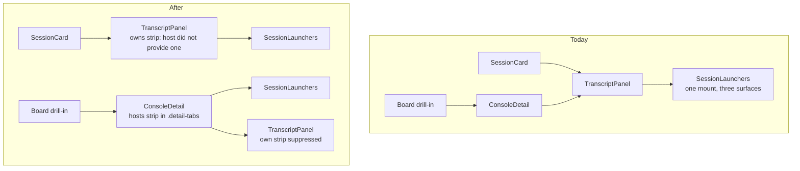

# Console detail: reclaim vertical space for the conversation

## Goal

The Conversation tab of the console detail pane spends roughly half its height on chrome before the
first transcript line. Give that height back to the conversation without removing a control, hiding
information behind a hover, or introducing a second source of truth.

Measured on the shipped layout at a 600px pane: **~294px of fixed chrome above the transcript, plus a
45px footer, leaving 243px of conversation.** The approved design returns the conversation to 410px in
the same pane - a 69% increase - by removing duplicated information and relocating two controls whose
current placement predates the surfaces they now sit beside.

The mockups are `mockups.html` in this directory. Every number in them is measured from the rendered
frames on load rather than typed, and all frames hold the identical conversation so the comparison is
"how much of the same content can you see".

## Approved decisions

These were selected by the human during the design review and are requirements, not open questions.

### D1 - Take option 2, "Tabs are the toolbar"

Of six candidate layouts, option 2 was chosen. Options 1, 2 and 6 form a lattice over two independent
moves, and the measurements decompose exactly:

| | `PATH`/`BRANCH` row | Worktree row | Conversation |
| --- | --- | --- | --- |
| Ships today | kept | kept | 243px |
| Option 1 | killed | kept | 384px |
| **Option 2 (approved)** | **kept** | **killed** | **410px** |
| Option 6 | killed | killed | 465px |

Isolating what all three share via `1 + 2 - 6` gives 86px for the shared changes below; on top of
that, killing the `PATH`/`BRANCH` row is worth 55px and killing the worktree row is worth 81px. The
two moves are independent - neither steals the other's pixels.

Option 2 keeps the `PATH`/`BRANCH` row and folds the worktree row's controls into the tab strip,
which already runs the full width with dead space after "Files" and whose job is adjacent: the
launchers choose *how* you view this session exactly as the tabs choose *what*.

### D2 - Drop the constant `SHIP` badge and the duplicate task title

`TaskKind` has two values, `ship` and `scout`. Every automated writer defaults to `ship` and the MCP
`create_task` tool cannot produce a `scout` at all, so the badge reads `SHIP` in almost every session.
It is not colour-differentiated in this header (`.task-kind` is `var(--working)` unconditionally), it
is frozen once the task leaves `backlog`, and the identical chip is already on the card you clicked
through. Render it **only when the kind is `scout`**; absence means `ship`, unambiguously, because
`kind` is `NOT NULL` and the pill only exists when there is a task.

The pill's title is a duplicate of the `h2` two rows above it, because `dispatcher.ts:430` sets a
dispatched session's name to `task.title`. Render it **only when it differs from `session.name`** -
see F3, which is why this is a conditional rather than a deletion.

### D3 - Promote the permission-mode chip into the header cluster

`ModePicker` already ships, and already appears in this pane - in the footer. Move it to **lead** the
right-hand cluster, giving `auto · Opus 5 · context · cost`. The posture governs the session, while
model, context fill and spend are consequences of running under it, so it reads before the things it
governs. It also puts the one interactive control in that cluster at a stable position instead of
last, where its neighbours change width as cost and context tick.

**It leaves the footer.** Keeping it in both places would create exactly the duplication this effort
exists to remove.

### D4 - Split live status by tempo

The band holding the objective and the activity line is two different things wearing one costume.
`session.goal.text` is a refined, durable objective that changes rarely; `session.activity` is a
free-form one-liner from the last hook that changes constantly. Stacking them in a fixed block 36px
above the transcript serves neither.

- **The objective** joins the identity block under the title, where the other durable facts already are.
- **The activity** becomes a ghosted trailing row at the tail of the transcript log, where the next
  real turn replaces it.

A rejected earlier draft sent the objective to the title's tooltip. That was over-applying one idea to
two problems: the tail-of-log insight is about the heartbeat and says nothing about where a durable
objective should live. Keeping the objective visible costs ~12px and hides nothing.

## Repository findings that changed the design

Investigated against the code before decomposition. Each of these contradicts a naive reading of the
approved design and is binding on implementation.

### F1 - Moving the launcher strip is a deletion for the Cards layout

`SessionLaunchers` is mounted once, from `TranscriptPanel.tsx:966-972`, and that single mount is
deliberate - its own comment says it "reaches the expanded card, the console detail and the board
drill-in from one mount rather than from three placements kept in step by hand". `TranscriptPanel` has
exactly two mount sites: `SessionCard.tsx:502-530` and `ConsoleDetail.tsx:519-553`.

`.detail-tabs` belongs to `ConsoleDetail`, which `SessionCard` never renders. Moving the mount there
would **delete the launchers and the Terminal-view toggle from the Cards layout**, kill three live
e2e assertions in `e2e/specs/conversation-terminal-view.spec.ts` (`:210`, `:225`, `:312`), and break
the `t` / `a` chords in Cards: `App.tsx:1757-1793` parks a `pendingLauncherAction` that is only
cleared when a `SessionLaunchers` registers for that id, so in Cards the pending action would be set
and never cleared, leaving a stale ref to fire on an unrelated later mount.

**Resolution:** the conversation pane keeps owning its toolbar for hosts that do not provide one. The
console detail becomes a host that *does* provide one, and suppresses the panel's own. No surface
loses a control. There is no existing slot for this - `leading` slots a control *into* the strip, not
the strip into a host - so the mount must be lifted and `registerLaunchers` re-threaded.

Both arrangements must register launchers with `App`, or the `t` / `a` chords break in whichever host
does not.

### F2 - `.detail-tabs` is not a query container

The conversation pane's only pane-scoped responsive mechanism is the `container-type: inline-size` on
`.transcript` (`styles.css:4738`) and the two `@container (max-width: 560px)` blocks that hang off it,
one of which (`styles.css:5944-5975`) is already the precedent for a toolbar shedding controls.
`.conv-launch` sits inside that container today; `.detail-tabs` does not, and nothing in the file
declares `container-type` on it or any ancestor. Relocating the controls forfeits that mechanism.

The repo's canonical answer to "this toolbar does not fit" is the measured ladder in
`src/web/topbarLadder.ts`, whose design note argues against container queries for exactly this case:
a rung fires on the width the bar *has*, but whether it needs to fire depends on the width its content
*needs*, and the two are independent. Its hard rule is also binding: a shed label goes visually
hidden, never `display: none`, so the control keeps its accessible name.

### F3 - The task pill's title is not always a duplicate

`task-multi-session.test.ts:404-407` asserts that the card, console detail and board tile all show the
task *now executing* and not the finished one. A session can be re-assigned to a later task, at which
point `session.name` still holds the original task's title while the pill holds the current one. The
title is a duplicate in the common case only, which is why D2 makes it conditional on differing from
`session.name` rather than deleting it.

### F4 - A trailing ghost row breaks stick-to-bottom

`TranscriptPanel.tsx:583-593` re-pins the log to the bottom in a `useLayoutEffect` keyed on
`[messages, session.pendingTurns]`. A row driven by `session.activity` changes `scrollHeight` without
re-running it, so a reader pinned to the bottom silently drifts off every time the activity text
changes height. Separately, `onScroll` (`:600-608`) computes `atBottom` with a 48px threshold, so a
row taller than that appearing under a bottom-pinned reader flips `atBottom` false and the pane stops
following the tail.

### F5 - "Activity" is already taken in this pane

`ConversationActivity` - the "Observed activity" rail beside the transcript - is derived from
`messages`, not from `session.activity`, and its own contract forbids implying a tool is *running*.
A ghosted row six inches away saying "running Bash" sits directly against that. The ghost row is
therefore framed as the in-progress state of the current turn, not as a second activity feed, and the
docs must distinguish them.

### F6 - Fewer tests pin this than expected

Moving `ModePicker` out of `.detail-foot` breaks **zero** tests - `detail-foot` appears nowhere in
`test/` or `e2e/`, and `session-leaf-parity.test.ts:454-475` pins the tile and card only. Removing
`.task-kind` breaks none either; it is entirely unpinned. Removing the goal/activity block from
`.detail-conv` breaks none. The constraint is not the existing suite, it is the structural
selectors: `.detail-conv > .pane-dialog` (`pane-dialog-scroll.test.ts`) and
`.detail-conv > .transcript` (`styles.css:18086-18094`) are child combinators, so no wrapper may be
introduced around the leading children of `.detail-conv`.

## Scope

In scope:

1. The task pill reduction, on both `ConsoleDetail` and `SessionCard`.
2. `ModePicker` promoted to the head of the header cluster and removed from the footer.
3. The objective relocated into the identity block, in `ConsoleDetail` only.
4. The activity line relocated to a trailing row in the transcript log, with the scroll-anchoring
   fixes F4 requires.
5. The launcher strip and Terminal-view toggle hosted by the console detail's tab row, with the Cards
   layout keeping its own, and a give-way order for narrow panes.
6. Documentation and Playwright coverage for each of the above.

Out of scope:

- Options 1, 4, 5 and 6, and the collapse-on-scroll behaviour.
- Any change to `SessionTile`, `RailRow` or `EnsembleMembers`, which render the same facts in their
  own vocabulary and are deliberately left alone.
- Moving the objective on `SessionCard`. `session-card-goal.test.ts:123-129` records that "the goal
  takes the activity slot" was tried and rejected there; this change must not spill onto the card.
- An overflow-menu pattern. None exists in this codebase and this is not the change that should
  invent one.

## Non-goals stated as risks

The tab row in option 2 still overflows a narrow pane by 101px as drawn in the mockup. That is real
unfinished design work and is owned by the phase that moves the controls, not deferred.
