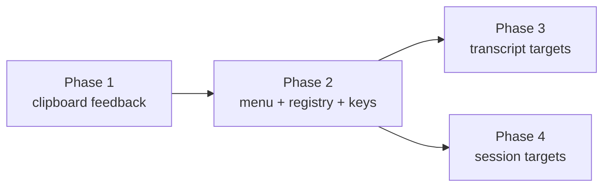

# Context menus - phased implementation

Source plan: [`plan.md`](plan.md) · Rendered: [`plan.html`](plan.html) · Live mockups:
[`mockups.html`](mockups.html)

Four phases. One is a prerequisite for everything, one is the foundation, and the last two are
independent of each other and can run concurrently.

## Incorporated decisions

Both dashboard reviews are settled; nothing below is an open question.

| # | Decided | Owned by |
| --- | --- | --- |
| D1 | Custom menu everywhere; `Shift`+right-click falls through to native | Phase 2 |
| D2 | One DOM menu for both builds; no Electron `Menu` over IPC | Phase 2 |
| D3 | v1 = transcript + composer + session card / tile / rail row | Phases 2-4 |
| D4 | Dense rows - label plus a shortcut/payload hint | Phase 2 |
| Q1 | Both `Copy` (raw, matches ⌘C) and `Copy text` (chrome stripped) | 2 / 3 |
| Q2 | `Paste` always shown; attempt the read, fall back honestly | Phase 2 |
| Q3 | Cross-turn quotes attribute each speaker | Phase 3 |
| Q4 | The clipboard cleanup is its own PR, landed first | Phase 1 |
| Q5 | `Shift+F10` and the Menu key ship in v1 | Phase 2 |

## What the investigation changed

Decomposing against the repository moved four things. Each is recorded in the phase that owns
it, and `plan.md` was corrected before the phase files were written.

1. **Constraint 2 is resolved, not open.** `plan.md` left the Escape contract to be chosen.
   `Overlay.tsx` has exactly one return path and it renders `.modal-backdrop` unconditionally -
   a full-screen blurred veil with the panel as a centred flex child - and joining it sets
   `anyOpen`, which stands down App's entire global handler. A cursor-anchored menu takes the
   **anchored-popover contract** instead: capture-phase `window` keydown with
   `stopImmediatePropagation`. `test/overlay-registry.test.ts:89-136` already documents six
   popovers outside the registry *and* the unfixed gap that `k`/`r`/`c` still reach the card
   behind them; Phase 2 closes that gap for its own surface rather than inheriting it.
2. **A purely DOM-driven registry cannot work.** A turn renders as
   `<div className={\`turn turn-${m.origin ?? m.role}\`}>` with **no id in the DOM**, and the
   source markdown lives only in React state as `m.text`. `Copy message` and `Quote in reply`
   are therefore impossible to read out of the document - the mockup's `innerText` is a
   stand-in. Phase 3 stamps `data-turn-id` and registers a message lookup.
3. **The clipboard counts were wrong.** The plan said seven ad-hoc implementations with three
   defects; there are **six** sites with **four** defects (the fourth being leaked timers in
   `WorkflowRuns.tsx`, which has no unmount cleanup). Corrected in `plan.md`.
4. **`Shift+F10` needs one gate widened.** The chord grammar already supports it with no
   change, but `App.tsx:1610` (`if (typing) return;`) is bypassed only by
   `chordHasCommandModifier`, which is false for `shift+F10` - so it would be eaten inside a
   composer, which is exactly where `Paste` lives. Phase 2 adds a `chordIsNonTyping` sibling
   rather than widening a predicate whose truth table is pinned by test.

## Phases

| # | Phase | File | Depends on | Delivers |
| --- | --- | --- | --- | --- |
| 1 | Clipboard feedback foundation | [`phase-1-clipboard-feedback.md`](phase-1-clipboard-feedback.md) | - | `useCopyFeedback()`; six sites migrated, four defects fixed |
| 2 | Menu, registry, keyboard | [`phase-2-menu-foundation.md`](phase-2-menu-foundation.md) | 1 | The menu; selection / link / field targets; `Shift+F10` |
| 3 | Transcript targets | [`phase-3-transcript-targets.md`](phase-3-transcript-targets.md) | 2 | `Quote in reply`, `Copy message`, `Copy text`, code / tool / path / timestamp |
| 4 | Session targets | [`phase-4-session-targets.md`](phase-4-session-targets.md) | 2 | Branch, checkout path, session id, PR URL on card / tile / rail row |

### Dependency graph

```
Phase 1 ──► Phase 2 ──┬──► Phase 3
                      └──► Phase 4
```



**Concurrency:** Phases 3 and 4 share Phase 2 as their only prerequisite and depend on nothing
of each other's. They touch different components and different registry entries, and Phase 3's
path matcher was deliberately narrowed to transcript elements so Phase 4 owns the card's
branch-before-path ordering outright. **They may merge in either order.**

**Merge order:** 1, then 2, then 3 and 4 in any order.

Every phase leaves the repository operable. After 1, copies work and confirm. After 2, both
builds have a working right-click menu - which alone closes the hole that justified the plan.
After 3 and 4, the v1 scope in D3 is complete.

## Cross-phase contracts

| Contract | Set by | Consumed by |
| --- | --- | --- |
| `useCopyFeedback()` in `src/web/lib/clipboard.ts`; 1600ms hold; the label `"Copied"` | 1 | 2, 3 |
| `copyText()` unchanged - `test/clipboard.test.ts` pins its exact call ordering | 1 | all |
| `resolveContextActions(el, ctx)` and the `ContextTarget` shape | 2 | 3, 4 |
| Tier 1 ordered, first-match-wins; two tiers; six-item budget | 2 | 3, 4 |
| Dedupe on **kind and payload**, not payload alone | 2 | 3, 4 |
| Capture-phase `window` keydown + `stopImmediatePropagation`; no `Overlay` import; no literal `role="dialog"` | 2 | 3, 4 |
| The `.is-desktop` no-drag allow-list entry (`styles.css:1438-1470`) | 2 | - |
| `data-turn-id` + the message lookup; no turn content read from the DOM | 3 | - |
| Path matcher is transcript-scoped; `.card-meta dd.mono` is Phase 4's | 3 | 4 |

## Deliberately not in v1

Named rather than dropped silently. Each is one registry entry plus a test when wanted.

- **Diff targets** - `Copy line`, `Copy hunk`, `Copy SHA`, `Copy file path`, `Copy diff`.
  Excluded by **D3**.
- **Files targets.** Excluded by **D3**.
- **Task and queue items** (`.bl-card`, `.wq-item`) - in the source plan's registry, outside
  D3's v1 surface list.
- **Session ref** (`.sc-ref`) - it lives in `settings-console.tsx`, not on the card / tile /
  rail row that D3 named.
- **Unifying `showFlash`.** `TranscriptPanel.tsx:400-414` and `ActionBar.tsx:153-168` are
  byte-identical, which is the strongest existing argument for a shared transient-state hook -
  but they carry send/queue outcomes, not copy outcomes, and folding them into Phase 1 doubles
  that diff for a different feature.

## Final verification

Per phase: `npm test`, `npm run typecheck`, `npm run lint`, and `npm run build` plus the
phase's own `e2e/` spec. `npm run smoke` where build or runtime surfaces changed (Phase 2).

Across the set, when 3 and 4 have both merged:

- Right-click every surface in D3's scope in **both** conversation renderings, with rich text
  on and off, and with find open - the four states in which `TurnProse` renders different
  markup.
- The full `e2e/` suite (~4.4 minutes locally at 4 workers; two shards in CI).
- The desktop build specifically: right-click Copy and Paste, `Open link` reaching the browser
  without navigating the app window, and the menu not being eaten by the titlebar drag region
  when opened near the top of the window.
