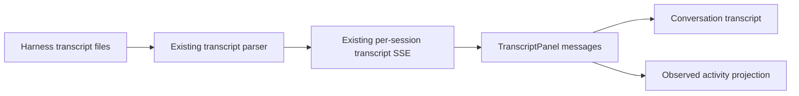

# Conversation observed activity sideband

Status: Approved for phasing and scheduling on 2026-08-06

Visual direction: [Duplex Console mockup](../../archive/mockups/conversation-terminal/02-duplex-console.html)

Mockup set: [Conversation terminal approaches](../../archive/mockups/conversation-terminal/index.html)

## Decision

Implement Scope 1: a useful, observed-only activity sideband derived from transcript data Mission Control already receives.

The sideband is not a process monitor and must not imply lifecycle facts that the current data cannot prove. It may say that a tool invocation was observed, when it appeared in the transcript, and what useful target can be derived from its recorded input. It must not claim that the tool is running, completed, successful, failed, or took a particular duration.

This direction was explicitly selected by the operator on 2026-08-06 with the request to schedule Scope 1. The phased-plan follow-up is therefore approved without another decision gate.

## Problem

The Conversation surface makes the agent's prose easy to follow, but tool activity is embedded in the transcript and can be difficult to scan. The Duplex Console mockup proposes a narrow secondary channel that answers a practical question: what actions has the agent attempted while producing this conversation?

Mission Control already normalizes transcript tool calls and streams transcript updates to the browser. That is enough for an honest first version, provided the interface labels the information as observed activity rather than a complete execution lifecycle.

## Existing evidence and constraints

- `TranscriptMessage.tools` exposes a tool name and optional recorded input.
- `toolChip()` already derives a compact tool label and useful target from common inputs.
- Per-session transcript SSE streams normalized messages, polls for changes, supports reconnect, and loads older scrollback.
- Claude, Codex, and Pi transcript adapters do not expose a uniform tool result, duration, status, or stable invocation identifier.
- Some Codex SDK events contain richer completion details, but the current browser contract intentionally reduces them and terminal sessions do not have matching coverage.
- Hook events carry only a tool name and do not provide a safe cross-harness lifecycle contract.
- Process discovery is a periodic system snapshot. It is neither a per-session event history nor reliable coverage for short-lived child processes, and raw command lines can contain sensitive information.

These constraints rule out status badges such as `running`, `ok`, `failed`, and duration or output counters in Scope 1.

## Intended experience

### Wide conversation surfaces

Render an **Observed activity** rail to the right of the transcript. Each row contains:

- the approximate transcript time;
- the normalized tool label;
- a compact target or summary derived through the existing tool projection;
- restrained language and styling that communicates observation, not completion.

The transcript and activity rail scroll independently. The composer remains pinned and usable.

### Narrow and embedded surfaces

Do not permanently squeeze the transcript. At narrow container widths, expose activity as a collapsible or stacked section that preserves reading width, composer access, and host-page geometry. The same behavior must work in Console detail and expanded session cards because both mount the shared `TranscriptPanel`.

### Find interaction

The existing Find rail owns the secondary column whenever Find is open. Closing Find restores Observed activity. At narrow widths, existing stacked Find behavior remains intact. Activity rows are not a second source of conversation search matches; the canonical searchable content remains the transcript.

### Empty and historical states

- Before a tool call is present: show `No observed tool activity yet`.
- When older transcript messages load: add their tool invocations in transcript order.
- When the transcript is unavailable: do not fabricate activity, and do not disable an otherwise available composer.
- On reconnect: derive the rail from the current deduplicated transcript state rather than maintaining a second event cache.

## Data and request flow

Scope 1 adds one browser-side projection and leaves the server path unchanged.

The activity projection iterates every loaded `TranscriptMessage.tools` entry, including tool calls attached to prose turns. It assigns presentation keys locally from stable message ordering and tool position. It reuses the existing tool label and target projection instead of inventing a second normalization registry.

## Requirements

1. Derive observed activity entirely from the transcript messages already held by `TranscriptPanel`.
2. Include every loaded tool invocation once, in transcript order, including invocations on turns that also contain prose.
3. Reuse the shared tool-name and input projection used by transcript tool chips.
4. Label the surface and its rows so they do not imply result, status, duration, or complete process coverage.
5. Preserve the current transcript stream, scrollback, reconnect, composer, and eviction behavior.
6. Give Find temporary ownership of the secondary rail while it is open.
7. Preserve usable geometry in Console detail and expanded cards at wide and narrow container sizes.
8. Use semantic headings, accessible control names, visible keyboard focus, and reduced-motion-safe behavior. Do not add `data-testid` selectors.
9. Document the observed-only meaning in the README where Conversation behavior is described.

## Non-goals

- Capturing every operating-system process or subprocess.
- Streaming raw command output into the rail.
- Showing tool results, success, failure, duration, line counts, token counts, or lifecycle state.
- Adding a new server event, database table, hook payload, transcript format, poller, or persistence layer.
- Reconciling tool activity across transcript, hooks, SDK events, and process discovery.
- Changing harness-specific transcript parsing beyond what is necessary to consume the existing normalized contract.
- Replacing the transcript's existing inline tool chips.

## Compatibility and privacy

This plan does not change wire contracts, persisted schemas, or harness protocols. Missing or partial tool input must degrade to the normalized tool name. The interface must not expose more raw input than the existing `toolChip()` projection already considers suitable for display.

Because the activity rail is derived from loaded transcript state, its history window is intentionally identical to the transcript window. Scope 1 makes no claim to durable activity history beyond that source.

## Verification strategy

- Unit-test activity projection for mixed prose/tool turns, multiple tools in one turn, missing input, ordering, and deduplication across rerenders.
- Extend Electron geometry coverage for wide and narrow layouts, Console detail and expanded cards, Find open and closed, pinned composer behavior, and independent overflow regions.
- Add a Playwright spec against fake agents that observes deterministic tool activity, verifies the observed-only copy, checks Find takeover and restoration, and exercises the narrow layout without spending model tokens.
- Run typecheck, lint, unit tests, build, bundle smoke tests, and the relevant Playwright suite.
- Perform a manual visual pass against the Duplex Console mockup at desktop and narrow widths.

## Acceptance criteria

- A user can scan observed tool invocations without leaving Conversation.
- The rail uses only existing transcript data and makes no unsupported lifecycle claim.
- Activity remains consistent after live updates, reconnect, and older-message loading.
- Find and Observed activity never compete for the same secondary-column space.
- The composer remains reachable and the transcript remains readable with no host-page overflow at supported widths.
- The feature behaves the same in Console detail and expanded session cards.
- Automated browser coverage proves the user-visible behavior through the built dashboard and fake-agent fixtures.

## Delivery decision

The repository audit found one coherent merge-safe implementation phase. Splitting the projection from the UI would either land unused code or require repeated edits to the same shared transcript files. The approved follow-up is documented in [phased-plan.md](phased-plan.md).
