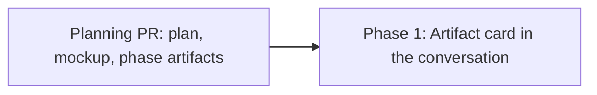

# Phased implementation - inline HTML artifact previews in the conversation

Source plan: [`plan.md`](plan.md) (rendered: [`plan.html`](plan.html))
Mockup: [`mockup.html`](mockup.html) (fixture copy; the live copy stays in gitignored `.evidence/`)

## Incorporated human decisions

Submitted through `request_plan_decisions` on 2026-09-03. These are requirements here, not
open questions, and the source plan has already been rewritten to remove the alternatives.

| Decision | Selected |
| --- | --- |
| How a card arrives | **Expanded, collapsible** |
| Which HTML files qualify | **Only a path the turn presents as an artifact** |
| Comment hand-off depth | **Open Files with comment mode armed** (not the block-carry variant) |
| Placement | **At the foot of the turn** |
| Phased follow-up | Declined at review; the human asked for phasing separately afterwards |

Two design rules were then settled by the live mockup rather than by the review, and they are
requirements too: the reserved height is a single **420px** - the transcript has exactly one
host, so there is no second context and no second number - and the frame is **inset on a dark
mat** because an artifact keeps its own colour scheme. An intermediate draft specified a
240px height for a capped "session card" log; no host in the app produces one, and that scope
is deleted. See the source plan under *Fixed height, and why not auto-fit*.

## Sizing and phase count

**Estimate: 345 to 465 non-test implementation lines** (the rows below, summed), all under `src/web/`, distributed as:

| Area | Lines |
| --- | --- |
| `src/web/lib/conversationArtifacts.ts` (new, pure detection) | 70 - 90 |
| `src/web/components/ConversationArtifacts.tsx` (new, the card) | 150 - 200 |
| `src/web/styles.css` (card, header, reserved-height body, mat) | 55 - 75 |
| `src/web/components/TranscriptPanel.tsx` (two render sites) | 20 - 30 |
| `src/web/App.tsx` (`fileCommentRequest` channel) | 20 - 30 |
| `src/web/components/FileWorkspace.tsx` (honor the request) | 20 - 30 |
| `layouts/types.ts`, `layouts/ConsoleDetail.tsx` (thread it) | 8 - 12 |

Assumptions behind the estimate: no server route, schema, migration, protocol or SSE change;
`htmlPreviewSource`, `HTML_PREVIEW_SANDBOX`, `inlinePreviewStyles`, `fetchSessionFile`,
`matchCheckoutPaths` and `useWorkspacePaths` are all reused as they stand; and the two
existing intent channels (`fileTabRequest`, `fileLineRequest`) are copied in shape rather
than redesigned.

**This is one phase, and one task.** The estimate is above the 200-line one-shot threshold,
so the rubric's default applies: still one phase unless a merge boundary materially reduces
risk. It does not here, and the obvious candidate boundary actively hurts:

- The only tempting split is *card and preview* / *comment hand-off*. But the **Comment in
  Files** control lives in the card's own header, so a first phase would have to ship that
  header with a different action (plain "Open in Files") and a second phase would rewrite it.
  That is a temporary surface replaced by the next merge - the dead-surface case the rubric
  names - and it also splits one approved decision across two reviews.
- A layer split (detection / component / intent channel) is an application-layer boundary,
  which the rubric explicitly rejects as a phase boundary on its own. All of it is one
  vertical slice inside one directory.
- Nothing here is concurrent. Every file in the list is consumed by the card or consumes it,
  so two agents would contend on `TranscriptPanel.tsx` and the card component immediately.
- The risky part is small and localized: honoring the comment intent inside `FileWorkspace`
  without disturbing its documented arming race. That is roughly 30 lines and one effect,
  well within a single reviewable pull request, and it is easier to review *beside* the card
  that triggers it than in a pull request of its own with no caller.

Complexity is real but bounded: no persistence, no migration, no concurrency, and every
security-relevant decision is inherited rather than made. The test surface is one `node:test`
file plus one Playwright spec.

## Phase table

| Phase | Name | File | Depends on | Repository |
| --- | --- | --- | --- | --- |
| 1 | Artifact card in the conversation | [`phase-1-artifact-card.md`](phase-1-artifact-card.md) | This planning session's pull request | `mission-control` (default) |

## Dependency graph

There is one edge and it is the publication gate: Phase 1's task depends on this planning
session, so it stays backlogged until this pull request merges the artifacts to the default
branch. Until then the paths its intent names do not resolve there.

**Concurrency groups:** none. One phase.

**Merge order:** planning pull request, then Phase 1.

## Repository analysis

Every file in the estimate is in `mission-control`, which is also where the plan lives, so
the task omits `repository` and `additionalRepositories` and inherits the current-repository
default. No sibling repository is touched, so no phase opens more than one pull request.

## Cross-phase contracts

With one phase there is no inter-phase contract to hold. What the phase must not break is the
set of **existing** contracts it borrows, and those are listed as inherited constraints in the
phase file rather than invented here:

- `src/web/lib/htmlPreview.ts` is read-only. No fifth bridge script, no CSP change, no
  `allow-same-origin`. `test/html-preview.test.ts` must pass untouched.
- The conversation frame is `.artifact-preview`; `.html-preview` stays the Files workspace's
  alone, and each surface's `message` handler checks its own frame's `event.source`.
- `Markdown.tsx` gains no new prop and no new `components` entry. The card is a sibling of
  `TurnProse`, so the renderer's memo contract is untouched.
- The new intent channel is shaped like `fileLineRequest`: session id, path, and a nonce.

## Final verification strategy

Owned by the phase, run before its pull request is opened:

- `npm run typecheck` and `npm run lint`.
- `npm test`, including `test/html-preview.test.ts` unchanged and the new detection tests.
- `npm run build` and `npm run smoke`, because a runtime surface changed.
- `npm run test:e2e` with the new spec, because a UI surface changed and there are no
  exemptions.
- A look at the running app in both OS colour schemes, on a real skill-written `plan.html`,
  in the Console reading surface, which is the only place the transcript is mounted.
