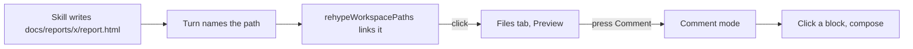
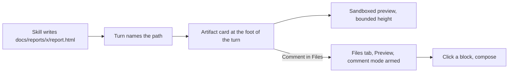
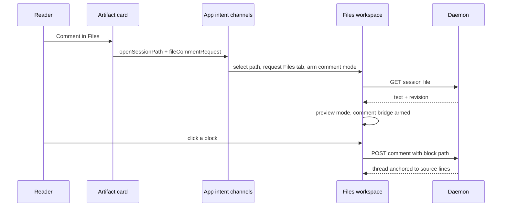

# Inline HTML artifact previews in the conversation

## Recommendation

When a turn names an HTML file that exists in the emitting session's checkout, render an
**artifact card** at the foot of that turn: a collapsible disclosure whose body is the same
sandboxed preview the Files tab already renders, and whose header carries a
**Comment in Files** link that opens that file in Files, in Preview mode, with comment mode
already armed.

Nothing about the preview boundary changes. The card reuses `htmlPreviewSource()` and
`HTML_PREVIEW_SANDBOX` verbatim, arms none of the four hashed bridges, and adds no fifth
script. The whole feature is web-side: no route, no schema, no migration, no server event.

## Approved decisions

Submitted in the Mission Control review on 2026-09-03. Every recommendation was taken, and
the resolved alternatives are gone from the sections below rather than left as choices.

- **A card arrives expanded and is collapsible.** The page is visible without a click, which
  is what an inline preview means; the reserved height keeps that free of layout shift.
- **Only a path presented as an artifact gets a card** - see *What qualifies as an artifact*.
  An `.html` file named in the middle of a sentence stays an ordinary link.
- **The hand-off arms comment mode in Files.** The card does not become a comment-authoring
  surface of its own, so the comment bridge stays inert inside the conversation preview.
- **The card sits at the foot of the turn**, not spliced into the prose.
- **No phased implementation follow-up.** This plan lands as the plan; no phase documents and
  no scheduled implementation tasks come out of this task.

## The gap this closes

Three skills in this repository write self-contained HTML into the checkout and then hand
back a path:

- `skills/html-plans/SKILL.md` writes `docs/plans/<name>/plan.html` and says to link it
  explicitly, because "writing the file is not showing it".
- `skills/html-report/SKILL.md` writes `docs/reports/<slug>/report.html` and mandates the
  literal closing line `Report: docs/reports/<slug>/report.html`.
- `skills/phased-plan/SKILL.md` writes `phased-plan.html` beside a plan.

The dashboard already meets them halfway. `rehypeWorkspacePaths` turns a bare path in the
prose into an anchor when the checkout listing has a file by that name, and clicking it runs
`openSessionPath`, which selects the file, requests the Files tab, and - because
`pathDefaultsToPreview` claims `.html` - renders it rather than showing its source.

What is missing is everything before the click. The page is invisible in the log: a reader
scrolling a session sees one more line of prose ending in a path and has no way to tell a
two-paragraph note from a full audit without leaving the conversation. And commenting on it
is four steps after that - open Files, find the file, confirm Preview, press **Comment** -
so the artifact that was written to be reviewed is the one thing in the session that takes
the most work to review.

## Flow, before and after

Today an artifact reaches a reader only through a click that leaves the conversation:



With the card, the page is legible in the log and the comment path is one click:



## What lands

### The artifact card

One card per distinct HTML file a turn names, at the foot of the turn, after the prose and
after the tool chips.

- **Header**: the file's basename in full weight, its directory muted, its byte size, a
  **Refresh** control, and a **Comment in Files** link. The whole header is the disclosure
  control, so clicking anywhere that is not a link toggles the body.
- **Body**: an `iframe` with `sandbox={HTML_PREVIEW_SANDBOX}` and
  `srcDoc={htmlPreviewSource(text)}`, at a **fixed reserved height** with internal scroll.
- **Accessible name**: `Preview of docs/reports/x/report.html`, matching what the Files tab
  already names its own preview frame, so one selector vocabulary covers both surfaces.
- **Refusals are stated, never blank.** Over the 5 MiB `MAX_SESSION_PREVIEW_BYTES` cap, not
  valid UTF-8, deleted since the turn was written, or refused by the daemon's containment
  check: the body says which, and the header keeps its links.

### Fixed height, and why not auto-fit

The body reserves a fixed height - 420px, floored at 240px and capped at 60% of the
transcript log's height on a short window - and scrolls internally.

Auto-fitting to the document's own height is the obvious alternative and it is rejected.
The dashboard has no origin inside the frame, so the only way to learn a document's height
is a fifth bridge script posting it out. That means a new SHA-256 hash in `PREVIEW_CSP`,
which is shared by the Files tab and by Scouts - a policy change on two surfaces that have
not asked for one - in exchange for letting a single turn grow without bound in a log that
auto-scrolls to its tail. A bounded window with a scrollbar is the honest shape for a page
embedded in a conversation; the reader who wants the whole page has **Comment in Files** and
the extracted Files window.

Because the height is reserved whether or not the frame has mounted, expanding a card and
scrolling past one never shifts the log. The frame itself mounts only when the card is
expanded **and** near the viewport, following `MermaidDiagram`'s `IntersectionObserver` with
a `600px` root margin, so a long session with twenty artifacts costs twenty empty boxes and
not twenty documents.

### Placement at the foot of the turn

The card sits after the turn's prose rather than being spliced into it, and the reasons are
concrete:

- **One card per file, not per mention.** A message that says `plan.html` in a sentence and
  again in its closing line is one artifact, and a per-link preview would draw it twice.
- **No new markdown plugin, and no new component identity.** `Markdown.tsx` documents at
  length why a `components` map that closes over a handler is a bug: a changed element type
  unmounts the subtree, and the transcript re-renders on every SSE frame. A block-replacing
  renderer inside the prose has to be threaded through that memo; a sibling of `TurnProse`
  does not.
- **It works with rich text off.** `richText` gates markdown parsing, and with it off
  `TurnProse` renders raw text and no anchors exist at all. Detection runs on the turn's
  text with `matchCheckoutPaths`, so the card appears in the Terminal conversation view and
  in the chat view alike.

### What qualifies as an artifact

Detection reuses the machinery the transcript already runs. `useWorkspacePaths` has warmed
the checkout listing for any session with a `cwd`, and `matchCheckoutPaths(text, paths)`
finds the path-shaped tokens the listing actually has a file for. Membership decides, so a
path this checkout does not have never becomes a card, and no card ever has to un-render.

On top of that: the extension is `.html` or `.htm`, the file is claimed by
`workspaceFileTarget` against the session's `cwd`, and at most **three** cards are drawn per
turn - the fourth and beyond stay as ordinary links.

One further test, and it is what keeps the card off an incidental mention: the turn has to
**present** the path as an artifact. Two forms qualify, and they are the two the skills
already mandate:

- the path is the whole line, or the line is a short `Label:` prefix and the path
  (`Report: docs/reports/x/report.html`);
- the path is the href of a Markdown link (`[the plan](docs/plans/x/plan.html)`).

A turn that says it edited `src/web/index.html` mid-sentence therefore gets a link and no
card. That rule lives in the detection module beside the extension and cap tests, so the
whole answer to "why is there a card here" is one function.

### Jumping to Files to comment

**Comment in Files** adds one intent channel, shaped exactly like the `fileLineRequest` that
already exists beside it in `App.tsx`:

```ts
const [fileCommentRequest, setFileCommentRequest] = useState<{
  sessionId: string;
  path: string;
  nonce: number;
} | null>(null);
```

A nonce for `fileLineRequest`'s reason: asking to comment on the same file twice is an
ordinary thing to do, and a bare path would fire only on a change. `openSessionPath` already
selects the file, sets the session, opens the board's detail layer, and requests the Files
tab; this rides beside it. `FileWorkspace` matches the request against its own session and
selected path, forces `mode` to `preview`, and calls the `enterCommentMode()` it already
has - the same function its **Comment** toggle calls.

The reader therefore lands in Files, on that file, rendered, with each block outlined on
hover and a click opening the composer. That is the surface
`docs/plans/files-line-comments/phase-5-preview-surfaces.md` already shipped; this plan only
removes the four steps in front of it.



### Two preview frames, and keeping them apart

`FileWorkspace`'s link-message handler finds its frame with
`workspaceRef.current?.querySelector(".file-content .html-preview")` and then refuses any
message whose `event.source` is not that frame's `contentWindow`. The conversation frame
must be equally unmistakable: its own class, its own `event.source` identity check, and its
own handler. Neither surface may act on the other's messages, and the existing scoping means
the workspace already will not - the new code has to hold the same line.

Inside the card, the link bridge behaves as it does in Files: a click on a relative link in
the previewed document resolves through `workspaceAssetPath`, is probed against the checkout,
and opens that sibling in the Files tab. A link the checkout has no file for does nothing,
and the frame never navigates itself.

`inlinePreviewStyles` runs on the fetched text exactly as it does in Files, so a plan page
that links a checkout-local stylesheet renders styled rather than bare.

### Freshness

The card fetches through `fetchSessionFile` when it is first expanded, and again when
**Refresh** is pressed. There is no file-watch event for session files - the Files tab has a
refresh button for the same reason - so a card whose artifact the agent has since rewritten
shows what it read. That is the same contract the Files tab has, stated in the same place,
rather than a second freshness model for the same bytes.

## Non-goals

- **No editing from the conversation.** The card is a reader. Editing stays in Files, where
  autosave, revisions, and conflict recovery live.
- **No markdown or image cards.** `pathDefaultsToPreview` also claims `.md` and images, and
  both are plausible later. Markdown in particular is close to free - the shared renderer is
  already inert - but a markdown artifact reads as prose in the turn that wrote it, and the
  ask here is the HTML page that does not.
- **No fifth bridge script, no CSP change, no `allow-same-origin`.** `test/html-preview.test.ts`
  recomputes every script hash; it should pass untouched.
- **No new setting.** Collapsing the card is the opt-out, and it is remembered for the
  session. Every other conversation switch (`richText`, `conversationView`) chooses how
  *turns* render; a per-artifact disclosure the reader already controls does not need a
  second one in Settings.
- **No cross-session or archived previews.** A path is claimed only against the emitting
  session's own `cwd`, as `workspaceFileTarget` already requires. Scout reports keep their
  own archive surface.

## Surfaces this touches

| Surface | Change |
| --- | --- |
| `src/web/components/TranscriptPanel.tsx` | Render the artifact strip in `Turn` and in the PTY turn, beside `TurnProse` |
| `src/web/components/ConversationArtifacts.tsx` (new) | The card: disclosure, lazy frame, refusals, header links |
| `src/web/lib/conversationArtifacts.ts` (new) | Pure detection: turn text plus checkout listing to a capped, deduplicated artifact list |
| `src/web/App.tsx` | The `fileCommentRequest` channel, and passing it down with `fileLineRequest` |
| `src/web/components/layouts/types.ts`, `ConsoleDetail.tsx` | Thread the new request through the view contract |
| `src/web/components/FileWorkspace.tsx` | Honor the request: force Preview, `enterCommentMode()` |
| `src/web/styles.css` | Card, header, reserved-height body |
| `src/web/lib/htmlPreview.ts` | Read-only. Reused as is |

## Scope and effort

| Area | Expected scope |
| --- | --- |
| Production code | About 300 to 450 non-test lines, all under `src/web/` |
| Tests | A `node:test` file for detection and the intent channel, plus one Playwright spec |
| Delivery estimate | About 2 to 4 engineering days including visual verification in the packaged app |
| Backend and persistence | None: no route, schema, migration, protocol, or SSE change |
| Main uncertainty | Scroll stability in the transcript with cards expanding above the reader, and how a light-background artifact page reads inside a dark log |

## Verification

- **`test/`** for what has no UI surface: detection over a turn's text and a listing (one
  card per distinct file, the three-card cap, extension filtering, membership deciding,
  `:line` suffixes stripped), and the request channel's arm-once-per-nonce behavior.
- **`e2e/specs/conversation-html-artifact-preview.spec.ts`** for the feature, because it is a
  UI change and there are no exemptions. A fake agent turn ends with
  `Report: docs/reports/x/report.html`; the spec asserts the card is present and named, that
  its body renders the page's own heading inside the frame, that collapsing hides the body
  and the choice survives a tab change, and that **Comment in Files** lands on the Files tab
  with the file selected, Preview pressed, and **Comment mode** pressed - then leaves a
  comment on a block and reads it back in the rail. Fake agents only, and selection by role,
  label, and placeholder, never `data-testid`.
- **Electron geometry** for the one thing a browser assertion cannot produce: that a card's
  reserved height does not clip the turn or overflow the log at the app's minimum window
  size.
- **Visual check in the packaged app**, in both color schemes, on a real `plan.html` written
  by the skill.

## Sources read

- `src/web/lib/htmlPreview.ts` - the one sandboxed preview boundary, its four hashed
  bridges, and `PREVIEW_CSP`.
- `src/web/components/FileWorkspace.tsx` - the preview frame, the **Comment mode** toggle,
  `enterCommentMode()`, and the link-message handler's frame identity check.
- `src/web/components/TranscriptPanel.tsx` and `src/web/components/Markdown.tsx` - the turn,
  `TurnProse`, `richText`, and the memo contract the renderer rests on.
- `src/web/lib/workspaceLinks.ts`, `src/web/lib/rehypeWorkspacePaths.ts`,
  `src/web/lib/sessionFiles.ts` - path claiming, listing-decided markup, and
  `useWorkspacePaths`.
- `src/web/App.tsx` - `openSessionPath`, `requestFilesTab`, and the `fileLineRequest`
  channel this one is shaped after.
- `src/server/session-files.ts` - `MAX_SESSION_PREVIEW_BYTES` and the containment rules the
  card inherits.
- `docs/plans/html-viewer/plan.md` and `docs/plans/files-line-comments/` - the shipped Files
  workspace and the preview-surface commenting this plan hands off to.
- `skills/html-plans/SKILL.md`, `skills/html-report/SKILL.md`,
  `skills/phased-plan/SKILL.md` - the artifacts and the closing-path convention that make
  detection reliable.
