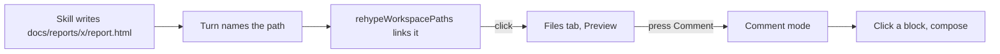
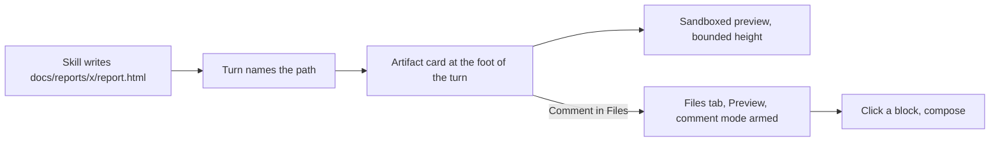
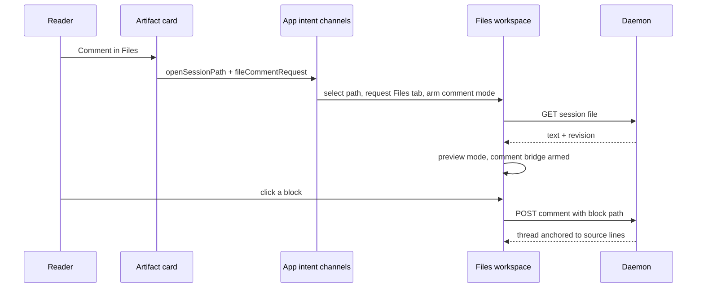

# Inline HTML artifact previews in the conversation

## Recommendation

When a turn names an HTML file that exists in the emitting session's checkout, render an
**artifact card** at the foot of that turn: a collapsible disclosure whose body is the same
sandboxed preview the Files tab already renders, and whose header carries a
**Comment in Files** link that opens that file in Files, in Preview mode, with comment mode
already armed.

Nothing about the preview boundary changes. The card reuses `htmlPreviewSource()` and
`HTML_PREVIEW_SANDBOX` verbatim, arms none of the four hashed bridges, and adds no fifth
script. The whole feature is web-side: no route, no schema, no migration, no server event.

## Approved decisions

Submitted in the Mission Control review on 2026-09-03. Every recommendation was taken, and
the resolved alternatives are gone from the sections below rather than left as choices.

- **A card arrives expanded and is collapsible.** The page is visible without a click, which
  is what an inline preview means; the reserved height keeps that free of layout shift.
- **Only a path presented as an artifact gets a card** - see *What qualifies as an artifact*.
  An `.html` file named in the middle of a sentence stays an ordinary link.
- **The hand-off arms comment mode in Files.** The card does not become a comment-authoring
  surface of its own, so the comment bridge stays inert inside the conversation preview.
- **The card sits at the foot of the turn**, not spliced into the prose.
- **Phasing was declined at review, then asked for separately.** The review's follow-up
  question was answered "Stop after this plan", so no phasing was produced at that point. The
  human then asked for mockups and a phased implementation in the same session, which is why
  `phased-plan.md`, `phase-1-artifact-card.md` and a scheduled Phase 1 task are part of this
  plan's directory after all. The declined answer is recorded here because it is what was
  submitted; the later request supersedes it.

## The gap this closes

Three skills in this repository write self-contained HTML into the checkout and then hand
back a path:

- `skills/html-plans/SKILL.md` writes `docs/plans/<name>/plan.html` and says to link it
  explicitly, because "writing the file is not showing it".
- `skills/html-report/SKILL.md` writes `docs/reports/<slug>/report.html` and mandates the
  literal closing line `Report: docs/reports/<slug>/report.html`.
- `skills/phased-plan/SKILL.md` writes `phased-plan.html` beside a plan.

The dashboard already meets them halfway. `rehypeWorkspacePaths` turns a bare path in the
prose into an anchor when the checkout listing has a file by that name, and clicking it runs
`openSessionPath`, which selects the file, requests the Files tab, and - because
`pathDefaultsToPreview` claims `.html` - renders it rather than showing its source.

What is missing is everything before the click. The page is invisible in the log: a reader
scrolling a session sees one more line of prose ending in a path and has no way to tell a
two-paragraph note from a full audit without leaving the conversation. And commenting on it
is four steps after that - open Files, find the file, confirm Preview, press **Comment** -
so the artifact that was written to be reviewed is the one thing in the session that takes
the most work to review.

## Flow, before and after

Today an artifact reaches a reader only through a click that leaves the conversation:



With the card, the page is legible in the log and the comment path is one click:



## What lands

### The artifact card

One card per distinct HTML file a turn names, at the foot of the turn, after the prose and
after the tool chips.

- **Header**: the file's basename in full weight, its directory muted, its byte size, a
  **Refresh** control, and a **Comment in Files** action. The disclosure is the name and
  directory - a generous target, the part you are reading anyway - with the two actions
  as siblings beside it rather than inside it. The header itself is not a control:
  interactive content nested in a button is invalid HTML that browsers reparent, and the
  inner control's clicks and keys then fight the outer one.
- **Body**: an `iframe` with `sandbox={HTML_PREVIEW_SANDBOX}` and
  `srcDoc={htmlPreviewSource(text)}`, at a **fixed reserved height** with internal scroll.
- **Accessible name**: `Preview of docs/reports/x/report.html`, matching what the Files tab
  already names its own preview frame, so one selector vocabulary covers both surfaces.
- **Refusals are stated, never blank.** Over the 5 MiB `MAX_SESSION_PREVIEW_BYTES` cap, not
  valid UTF-8, deleted since the turn was written, or refused by the daemon's containment
  check: the body says which, and the header keeps its links.
- **A failed checkout listing produces no cards at all, and that is correct.** One live
  session answered `GET /api/sessions/:id/files` with
  `500 could not list files in this checkout`. Because membership in the listing is what
  makes a path an artifact, an unavailable listing means no candidate is ever confirmed - so
  there is no card on which to report the failure, and inventing one would mean detecting
  artifacts by shape and weakening the membership boundary this design rests on. The session
  degrades exactly as `rehypeWorkspacePaths` already does with an empty listing: the path
  stays plain text, and the Files tab is still reachable. Cards appear on the render after a
  listing arrives.

### Fixed height, and why not auto-fit

The body reserves a fixed **420px** and scrolls internally. One number, everywhere, because
the transcript has exactly one host.

That replaces an earlier rule in this plan that could not hold - "420px, floored at 240px and
capped at 60% of the transcript log's height" - and then a second one that was designing for
a host the app does not have. Both are worth recording, because the second mistake was mine
and it survived two rounds of review before the code contradicted it:

- `.transcript-log` does carry `max-height: 340px` in the base stylesheet, lifted by
  `.detail-conv > .transcript .transcript-log { max-height: none }`. So a *capped* log would
  make 60% of its height 204px, under the plan's own 240px floor - the two rules contradicted
  each other, which is why the percentage went away.
- But **there is no capped host.** `className="transcript"` appears once in the codebase, in
  `TranscriptPanel`; `TranscriptPanel` is rendered once, in `layouts/ConsoleDetail.tsx`; and
  that render is always inside `<div className="detail-conv">`. So the base 340px cap never
  applies to a mounted transcript at all. It is almost certainly a leftover from the Cards
  layout that no longer exists, which `docs/plans/html-viewer/plan.md` still describes.

A mockup context switcher offering a "session card" log was therefore modelling a surface
that does not exist, and the 240px second height, the context-dependent default and the
collapse-versus-CSS question it raised were all scope for nobody. All three are gone.

What remains is the approved decision unqualified: the card arrives **expanded**, with a
420px body, and the reader may collapse it. `aria-expanded` always describes a body that is
really rendered, and the body wrapper stays in the DOM when collapsed so the disclosure's
`aria-controls` keeps resolving - only the previewed document is dropped.

**If the transcript ever gains a second host, the 340px cap becomes live** and this decision
has to be revisited. That is a note for whoever adds one, not scope here.

Auto-fitting to the document's own height is the obvious alternative and it is rejected.
The dashboard has no origin inside the frame, so the only way to learn a document's height
is a fifth bridge script posting it out. That means a new SHA-256 hash in `PREVIEW_CSP`,
which is shared by the Files tab and by Scouts - a policy change on two surfaces that have
not asked for one - in exchange for letting a single turn grow without bound in a log that
auto-scrolls to its tail. A bounded window with a scrollbar is the honest shape for a page
embedded in a conversation; the reader who wants the whole page has **Comment in Files** and
the extracted Files window.

Because the height is reserved whether or not the frame has mounted, expanding a card and
scrolling past one never shifts the log. The frame itself mounts only when the card is
expanded **and** near the viewport, following `MermaidDiagram`'s `IntersectionObserver` with
a `600px` root margin, so a long session with twenty artifacts costs twenty empty boxes and
not twenty documents.

The mockup measured that claim rather than restating it. Swapping the previewed document
across four real artifacts whose own heights span 2,422px to 16,914px - a seven-fold range -
left the card height, the log's scroll height, the reader's scroll position, and the on-screen
position of a turn below the card **identical to the pixel** in all four cases.

### The artifact decides its own colour scheme, and it will not match

A `srcdoc` iframe inherits neither the dashboard's `color-scheme: dark` nor any scheme the
parent would like to impose, and `color-scheme` does not move `prefers-color-scheme`. The app
also never sets `nativeTheme.themeSource` - `src/main/window.ts` pins only the window's
`backgroundColor: "#0e1116"` - so the media query follows the operator's OS in the packaged
app exactly as it does in a browser tab.

The consequence is specific and was seen rather than predicted: this plan's own `plan.html`,
which is correctly `prefers-color-scheme`-aware, renders as a **bright white slab** in the
middle of the dark log whenever macOS is in light mode. A dark-scheme artifact
(`docs/archive/mockups/alert-panels.html`, body `rgb(10, 12, 15)`) is by contrast continuous
with the app.

Nothing in this feature can fix that, so the design absorbs it: the frame is inset 7px on a
`--panel-2` mat with a 1px border and a 6px radius, so a light page reads as an embedded
document rather than as a panel that lost its stylesheet. That is a mitigation and not a
cure, and it is worth saying so plainly.

Pinning `nativeTheme.themeSource = "dark"` in the main process would settle it for the whole
app, previews included. That is an app-wide theming decision well outside this plan; it is in
**Follow-up work** rather than here.

### Placement at the foot of the turn

The card sits after the turn's prose rather than being spliced into it, and the reasons are
concrete:

- **One card per file, not per mention.** A message that says `plan.html` in a sentence and
  again in its closing line is one artifact, and a per-link preview would draw it twice.
- **No new markdown plugin, and no new component identity.** `Markdown.tsx` documents at
  length why a `components` map that closes over a handler is a bug: a changed element type
  unmounts the subtree, and the transcript re-renders on every SSE frame. A block-replacing
  renderer inside the prose has to be threaded through that memo; a sibling of `TurnProse`
  does not.
- **It works with rich text off.** `richText` gates markdown parsing, and with it off
  `TurnProse` renders raw text and no anchors exist at all. Detection runs on the turn's
  text with `matchCheckoutPaths`, so the card appears in the Terminal conversation view and
  in the chat view alike.

### What qualifies as an artifact

Detection reuses the machinery the transcript already runs. `useWorkspacePaths` has warmed
the checkout listing for any session with a `cwd`, and `matchCheckoutPaths(text, paths)`
finds the path-shaped tokens the listing actually has a file for. Membership decides, so a
path this checkout does not have never becomes a card, and no card ever has to un-render.

On top of that: the extension is `.html` or `.htm`, the file is claimed by
`workspaceFileTarget` against the session's `cwd`, and at most **three** cards are drawn per
turn - the fourth and beyond stay as ordinary links.

One further test, and it is what keeps the card off an incidental mention: the turn has to
**present** the path as an artifact. Two forms qualify, and they are the two the skills
already mandate:

- the path is the whole line, or the line is a short `Label:` prefix and the path
  (`Report: docs/reports/x/report.html`);
- the path is the href of a Markdown link (`[the plan](docs/plans/x/plan.html)`).

A turn that says it edited `src/web/index.html` mid-sentence therefore gets a link and no
card. That rule lives in the detection module beside the extension and cap tests, so the
whole answer to "why is there a card here" is one function.

### Jumping to Files to comment

**Comment in Files** adds one intent channel, shaped exactly like the `fileLineRequest` that
already exists beside it in `App.tsx`:

```ts
const [fileCommentRequest, setFileCommentRequest] = useState<{
  sessionId: string;
  path: string;
  nonce: number;
} | null>(null);
```

A nonce for `fileLineRequest`'s reason: asking to comment on the same file twice is an
ordinary thing to do, and a bare path would fire only on a change. `openSessionPath` already
selects the file, sets the session, opens the board's detail layer, and requests the Files
tab; this rides beside it. `FileWorkspace` matches the request against its own session and
selected path, forces `mode` to `preview`, and calls the `enterCommentMode()` it already
has - the same function its **Comment** toggle calls.

The reader therefore lands in Files, on that file, rendered, with each block outlined on
hover and a click opening the composer. That is the surface
`docs/plans/files-line-comments/phase-5-preview-surfaces.md` already shipped; this plan only
removes the four steps in front of it.



### Two preview frames, and keeping them apart

The conversation frame is `.artifact-preview`, deliberately not `.html-preview`.

`FileWorkspace`'s link-message handler finds its frame with
`workspaceRef.current?.querySelector(".file-content .html-preview")` and then refuses any
message whose `event.source` is not that frame's `contentWindow`. The conversation frame
must be equally unmistakable: its own class, its own `event.source` identity check, and its
own handler. Neither surface may act on the other's messages, and the existing scoping means
the workspace already will not - the new code has to hold the same line.

Inside the card, the link bridge behaves as it does in Files: a click on a relative link in
the previewed document resolves through `workspaceAssetPath`, is probed against the checkout,
and opens that sibling in the Files tab. A link the checkout has no file for does nothing,
and the frame never navigates itself.

`inlinePreviewStyles` runs on the fetched text exactly as it does in Files, so a plan page
that links a checkout-local stylesheet renders styled rather than bare.

### Freshness

The card fetches through `fetchSessionFile` when it is first expanded, and again when
**Refresh** is pressed. There is no file-watch event for session files - the Files tab has a
refresh button for the same reason - so a card whose artifact the agent has since rewritten
shows what it read. That is the same contract the Files tab has, stated in the same place,
rather than a second freshness model for the same bytes.

## Non-goals

- **No editing from the conversation.** The card is a reader. Editing stays in Files, where
  autosave, revisions, and conflict recovery live.
- **No markdown or image cards.** `pathDefaultsToPreview` also claims `.md` and images, and
  both are plausible later. Markdown in particular is close to free - the shared renderer is
  already inert - but a markdown artifact reads as prose in the turn that wrote it, and the
  ask here is the HTML page that does not.
- **No fifth bridge script, no CSP change, no `allow-same-origin`.** `test/html-preview.test.ts`
  recomputes every script hash; it should pass untouched.
- **No new setting.** Collapsing the card is the opt-out, and it is remembered for the
  session. Every other conversation switch (`richText`, `conversationView`) chooses how
  *turns* render; a per-artifact disclosure the reader already controls does not need a
  second one in Settings.
- **No cross-session or archived previews.** A path is claimed only against the emitting
  session's own `cwd`, as `workspaceFileTarget` already requires. Scout reports keep their
  own archive surface.

## Mockup

The design was drawn over the **live** daemon rather than over fixtures, because a card drawn
on invented data cannot show what a real 40 KB report does inside a real log.

- **Live copy**: `.evidence/mockups/conversation-artifact-card/mockup.html` (gitignored - a
  live board is operator data, so it is never committed). It renders a real idle codex
  session, its 12 real turns, and the real turn ending
  `Report: docs/reports/pipeline-plan-comparison/report.html`, with five real artifacts out of
  live checkouts selectable in the card.
- **Committed copy**: `mockup.html` beside this plan, with the same chrome, the same proposed
  CSS and two small fixture artifacts. It links the app's real `src/web/styles.css` rather
  than freezing a copy of it, so it cannot drift from the styles it is drawn against.

Both carry the app's real preview boundary rather than an imitation: the CSP and all four
hashed bridge scripts are lifted out of `src/web/lib/htmlPreview.ts` and checked by
recomputing each script's SHA-256 against the policy's own hashes. The proposed CSS is one
clearly marked block; everything else is the shipped stylesheet.

What the mockup changed in this plan: the reserved-height rule (which was self-contradictory),
the colour-scheme mat, the `min-width` on the disclosure without which the header crushes its
own directory instead of wrapping in a narrow column, and the lazy-mount contract, which the
mockup first described and now demonstrates. Its own "could not be listed" panel is what
exposed the contradiction that removed that state from the design: a listing failure leaves
nothing to draw a card on.

It also produced one wrong turn worth recording. Its context switcher offered a capped
"session card" log, which no host in the app produces, and the design grew a second reserved
height and a context-dependent default to serve it before the code was checked. Inventing a
surface is a real hazard of a mockup built beside the app rather than inside it.

## Follow-up work, out of scope here

- **Pin the app's colour scheme.** `nativeTheme.themeSource = "dark"` in the main process
  would make `prefers-color-scheme` inside every preview match the dashboard. It changes
  theming for the whole app, so it is its own decision.
- **`navigate-to` is a dead CSP directive.** `PREVIEW_CSP` ends with `navigate-to 'none'`,
  and current Chromium logs `Unrecognized Content-Security-Policy directive 'navigate-to'`
  for every preview it renders. The directive was never shipped by Chromium; the protection
  it was meant to add comes from the sandbox and the link bridge instead. Pre-existing, not
  introduced here, and worth removing or commenting so the console stops carrying a warning
  nobody can act on.

## Surfaces this touches

| Surface | Change |
| --- | --- |
| `src/web/components/TranscriptPanel.tsx` | Render the artifact strip in `Turn` and in the PTY turn, beside `TurnProse` |
| `src/web/components/ConversationArtifacts.tsx` (new) | The card: disclosure, lazy frame, refusals, header links |
| `src/web/lib/conversationArtifacts.ts` (new) | Pure detection: turn text plus checkout listing to a capped, deduplicated artifact list |
| `src/web/App.tsx` | The `fileCommentRequest` channel, and passing it down with `fileLineRequest` |
| `src/web/components/layouts/types.ts`, `ConsoleDetail.tsx` | Thread the new request through the view contract |
| `src/web/components/FileWorkspace.tsx` | Honor the request: force Preview, `enterCommentMode()` |
| `src/web/styles.css` | Card, header, reserved-height body |
| `src/web/lib/htmlPreview.ts` | Read-only. Reused as is |

## Scope and effort

| Area | Expected scope |
| --- | --- |
| Production code | About 300 to 450 non-test lines, all under `src/web/` |
| Tests | A `node:test` file for detection and the intent channel, plus one Playwright spec |
| Delivery estimate | About 2 to 4 engineering days including visual verification in the packaged app |
| Backend and persistence | None: no route, schema, migration, protocol, or SSE change |
| Main uncertainty | Both original uncertainties are now settled by the mockup: scroll stability is measured, and a light artifact in a dark log is confirmed and mitigated. What remains is CodeMirror-free but real - honoring the comment-mode intent inside `FileWorkspace` without disturbing its existing arming race |

## Verification

- **`test/`** for what has no UI surface: detection over a turn's text and a listing (one
  card per distinct file, the three-card cap, extension filtering, membership deciding,
  `:line` suffixes stripped), and the request channel's arm-once-per-nonce behavior.
- **`e2e/specs/conversation-html-artifact-preview.spec.ts`** for the feature, because it is a
  UI change and there are no exemptions. Assert *inside* the preview with Playwright's
  `frameLocator`, not with `contentDocument`: the sandbox has no `allow-same-origin`, so the
  frame is an opaque origin and the page cannot read into it - but Playwright reaches in over
  CDP, which the mockup confirmed by reading the artifact's own `h1` through a live sandbox. A fake agent turn ends with
  `Report: docs/reports/x/report.html`; the spec asserts the card is present and named, that
  its body renders the page's own heading inside the frame, that collapsing hides the body
  and the choice survives a tab change, and that **Comment in Files** lands on the Files tab
  with the file selected, Preview pressed, and **Comment mode** pressed - then leaves a
  comment on a block and reads it back in the rail. Fake agents only, and selection by role,
  label, and placeholder, never `data-testid`.
- **Electron geometry** for the one thing a browser assertion cannot produce: that a card's
  reserved height does not clip the turn or overflow the log at the app's minimum window
  size.
- **Visual check in the packaged app**, in both color schemes, on a real `plan.html` written
  by the skill.

## Sources read

- `src/web/lib/htmlPreview.ts` - the one sandboxed preview boundary, its four hashed
  bridges, and `PREVIEW_CSP`.
- `src/web/components/FileWorkspace.tsx` - the preview frame, the **Comment mode** toggle,
  `enterCommentMode()`, and the link-message handler's frame identity check.
- `src/web/components/TranscriptPanel.tsx` and `src/web/components/Markdown.tsx` - the turn,
  `TurnProse`, `richText`, and the memo contract the renderer rests on.
- `src/web/lib/workspaceLinks.ts`, `src/web/lib/rehypeWorkspacePaths.ts`,
  `src/web/lib/sessionFiles.ts` - path claiming, listing-decided markup, and
  `useWorkspacePaths`.
- `src/web/App.tsx` - `openSessionPath`, `requestFilesTab`, and the `fileLineRequest`
  channel this one is shaped after.
- `src/server/session-files.ts` - `MAX_SESSION_PREVIEW_BYTES` and the containment rules the
  card inherits.
- `docs/plans/html-viewer/plan.md` and `docs/plans/files-line-comments/` - the shipped Files
  workspace and the preview-surface commenting this plan hands off to.
- `skills/html-plans/SKILL.md`, `skills/html-report/SKILL.md`,
  `skills/phased-plan/SKILL.md` - the artifacts and the closing-path convention that make
  detection reliable.
