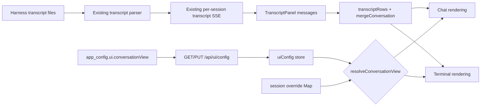

# Conversation native PTY rendering

Status: Approved for implementation on 2026-08-09

Visual direction: [Native PTY mockup](../../archive/mockups/conversation-terminal/01-native-pty.html)

Mockup set: [Conversation terminal approaches](../../archive/mockups/conversation-terminal/index.html)

Sibling plan: [Conversation observed activity sideband](../conversation-activity-sideband/plan.md) (concept 02, shipped in #444)

## Decision

Ship mockup 01, **Native PTY**, as a second, selectable rendering of the Conversation
view. The conversation reads as one terminal stream: human turns are prompt lines, agent
turns are stdout blocks under a speaker header, and tool runs fold into disclosure records
below the output instead of becoming chat rows. A titlebar frames the log, the composer
keeps the prompt metaphor, and a status line carries the session facts an operator watches.

The current Conversation rendering stays the default and stays whole. The terminal
rendering is a presentation of the same rows, the same stream, and the same composer - not
a second conversation implementation.

The conversation study produced three concepts. Concept 02's observed-activity sideband
shipped in #444; concept 01 was meant to ship alongside it and did not. This plan closes
that gap.

## Problem

The Conversation surface renders a chat log: bubbles, role bylines, grey tool chips. That
is a faithful reading of a transcript file, and for a supervised session it is the wrong
metaphor twice over.

An agent session **is** a process. The operator is watching a program work, and the facts
they need while watching it - is it running, on which pid, on which branch, how much
context is left - are on the card behind the panel, in a different visual language, and
not in the reader's eye while they read. Meanwhile a long stretch of tool work renders as
a column of chat rows that say nothing a shell would not have said in one line.

The mockup answers both: the log reads as a stream, and the frame around it says what the
process is doing.

## Existing evidence and constraints

- `TranscriptPanel` already receives the whole `Session`, so `session.pid`,
  `session.gitBranch`, `session.state` and `session.meta.contextPct` are reachable without
  a new prop. Both mounts (`ConsoleDetail`, `SessionCard`) already pass it.
- `transcriptRows()` already folds consecutive tool-only assistant turns into one row -
  the exact fold the mockup's disclosure record draws. It keeps the first folded turn's
  `id` and `ts` on purpose (stable React key, stable interleave position).
- `toolChip()` already derives a display name and a target from a capped tool input, and
  carries the **uncapped** source in `title` - which is what the mockup's command list
  wants to print.
- `mergeConversation()` folds Foreman episodes and answered reviews into the row list by
  timestamp. Find hits are addressed by row id and offset over that same list, so the
  renderer and the search must keep walking one list.
- `ToolCall` carries a name and an optional capped input. **It carries no status, no exit
  code, and no duration.** `TranscriptMessage` carries one `ts` per turn.
- The transcript stream's own state (`connecting` / `live` / `unavailable`) is already held
  by the panel, and is a real fact about whether the dashboard is attached to the file.
- `.transcript` is the query container (`container-type: inline-size`); the existing
  narrow breakpoint is `@container (max-width: 560px)`. The expanded card is narrower than
  the console detail pane, and both must work.
- The flex chain `.transcript → .find-split → .find-logwrap → .transcript-log` is
  load-bearing: `.transcript-log` is the only scrolling surface, and its bounded height
  comes from `min-height: 0` at every link above it.
- Display preferences already have exactly one path: a field in `UiConfigSchema` and
  `UI_CONFIG_DEFAULTS`, a field-by-field entry in `uiCache.coerce()`, a hook in
  `src/web/lib/`, a control with a `data-anchor`, and a `SETTINGS_CONTROLS` entry. The
  route and the KV are generic over the schema, so neither changes.
- There is **no** precedent for a persisted per-session UI preference. The nearest
  precedent for per-session transient state is `src/web/lib/drafts.ts`: a module-level
  keyed `Map`, honestly tab-scoped, collected on `session_remove`.

### What the honesty contract rules out

The sideband plan's rule applies here unchanged: the interface may say what the transcript
recorded, and must not imply what it did not. So this plan does **not** render:

- the mockup's `done` marker before each command in a folded run - there is no result;
- an exit code, a status, or an output size for any tool call;
- a duration for a single tool call.

Where the mockup shows `codex executed 3 commands · 1.8s`, the honest reading is the
**span between the first and last turn in that folded run**, which is arithmetic over two
recorded timestamps. It is shown only when the run holds more than one turn and the span
is positive, and it is labelled as the span it is. A one-turn run shows the count alone.

## Intended experience

### The terminal rendering

Inside `.transcript`, above the log, a titlebar: three window lights, the centred title
`mission-control: conversation · <agent> · <shell>`, and a live attach indicator on the
right. `<shell>` is the session's controlling tty when it has one (`ttys012`) and its
runtime otherwise (`sdk`) - never an invented shell name. The indicator reads `attached`,
`attaching…`, or `detached` off the transcript stream's own state.

Rows, in the same order and from the same list as today:

- **A human turn** is a prompt line: `you@mission ~/repo ❯ <text>`, on one line where it
  fits and wrapping where it does not. The host part is the turn's real author - a turn
  Foreman or the harness typed reads `foreman@mission`, not `you@mission`, exactly as
  `turnWho()` already decides for the chat byline. The cwd is the session's own, shortened.
- **An agent turn** is a stdout block under a `<agent> / stdout` speaker header with the
  turn's timestamp, rendered in the log's mono face. Markdown formatting still applies when
  Format messages is on, and find highlighting still replaces it inside a matching turn,
  because both are the same decision the chat turn already makes.
- **A folded tool run** is a disclosure record: `<agent> executed 3 commands · 1.8s`,
  closed by default, listing the full command or path per call when opened.
- **Foreman episodes and answered reviews** keep their existing cards. They are not
  transcript stdout and must not be dressed as it.

The composer keeps the prompt metaphor: a `mission ❯` label, the same uncontrolled
textarea with the same draft, attachments, paste and Enter-to-send behaviour, and an
`enter sends` hint. Below it, a status line: the agent's run state with its live dot, `pid`
when the session reports one, the git branch, the context percentage, and a keybinding
legend for terminal / diff / complete / kill.

The legend prints the operator's own resolved chords and is a **legend, not a second set of
buttons**. Those four actions already have exactly one home each in the action bar and one
chord each in the keybinding registry; a second control path to `kill` is precisely the
kind of parallel path this repository forbids. It hides with `keybindingHints`, because
teaching chords is all it does.

### What does not change

Everything else the panel owns survives untouched, in both renderings: the transcript SSE
stream and its reconnect, scrollback paging, pending turns, attachments and the drop veil,
the find bar and rail, the observed-activity sideband, the launcher strip, and the Foreman
and review rows folded in by `mergeConversation`. The secondary column keeps its one-owner
invariant - find while open, observed activity otherwise - in the terminal frame too.

### Both mounts

The terminal frame is a flex column inside `.transcript`, so it inherits the same height
contract the panel already gives the log, and both hosts keep their `max-height: none`
overrides. At the existing `@container (max-width: 560px)` breakpoint - which the expanded
card crosses and the console detail does not - the frame drops the centred title, drops the
`enter sends` hint and the context percentage, and wraps the status line rather than
clipping it. The status line is never scrolled off and never overflows the card.

### Choosing a rendering

**Global default, server-persisted.** A `conversationView` field on the UI config, with
values `chat` (the default) and `terminal`, following the display-preference path exactly:
a default in `UI_CONFIG_DEFAULTS` and a field in `UiConfigSchema`, a field-by-field entry
in `uiCache.coerce()` validated against the mode list the way `layout` is, a
`useConversationView()` hook shaped like `useRichText()`, a radio group in Settings →
Display with a `data-anchor`, and a `SETTINGS_CONTROLS` entry. No new route, no migration.

An enum rather than a boolean because the study produced three concepts and this is the
second of them to ship: `LAYOUT_MODES` is the precedent for a named set of renderings
validated in one place, and a boolean would have to be renamed the first time a third
reading arrives.

**Per-session override, transient and tab-scoped.** A control in the conversation pane's
launcher strip toggles the rendering for one session, so one session can be read as a
terminal while the rest stay on the current view. It is a module-level `Map` keyed by
session id in the same module as the hook, following `drafts.ts`: nothing persists it, it
is honestly scoped to the tab, and it is dropped on `session_remove` alongside the drafts
for the same reason the drafts are.

Precedence is explicit and stated in one function: **session override when set, global
preference otherwise.** A reload starts over from the global preference.

## Data and request flow

No server path changes. The preference rides the existing UI-config route, and the
rendering is a second projection of rows the panel already holds.

## Requirements

1. Render the approved mockup's five elements from data the transcript and session already
   carry: prompt lines for human turns, stdout blocks under a speaker header for agent
   turns, folded disclosure records for tool runs, a titlebar with a live attach
   indicator, and a status line with run state, pid, branch, context and the chord legend.
2. Derive every rendering from the existing `mergeConversation(transcriptRows(messages))`
   list, so find hits keep addressing the rows the reader can see.
3. Make no claim the transcript does not carry: no tool status, no exit codes, and no
   duration beyond a labelled span between two recorded timestamps.
4. Preserve the chat rendering as the default and preserve every behaviour of the panel in
   both renderings: stream and reconnect, scrollback paging, pending turns, attachments,
   find bar and rail, observed-activity sideband, launchers, Foreman and review rows.
5. Add the global preference through the existing display-preference path only - schema,
   defaults, cache coercion, hook, settings control with `data-anchor`, search entry. No
   new route and no migration.
6. Add the per-session override as transient tab-scoped state in a module-level keyed Map,
   collected on `session_remove`. Do not create a second settings store, and do not persist
   it.
7. Resolve precedence in one place: session override when set, global preference otherwise.
8. Keep both mounts working across the existing `@container (max-width: 560px)` breakpoint,
   with the status line visible and unclipped in the expanded card.
9. Use roles, labels and placeholders for every new control; add no `data-testid`.
10. Document the rendering and its two switches where Conversation behaviour is described.

## Non-goals

- Attaching to a real PTY, or streaming real process output. This renders the transcript
  Mission Control already has; the terminal is a reading, not a connection.
- Replacing, restyling or retiring the chat rendering.
- A third rendering. Concept 03 is out of scope, though the enum leaves room for it.
- Persisting the per-session override, or adding any per-session settings store.
- New server events, tables, routes, migrations, hook payloads or transcript parsing.
- New action paths for terminal / diff / complete / kill.
- Changing the find, sideband, pending-turn, attachment or paging contracts.

## Compatibility and privacy

No wire contract, persisted schema or harness protocol changes. `UiConfigSchema` gains one
field with a shipped default, so an existing `app_config.ui` blob parses unchanged and an
older blob reads as `chat`. A cache written by a newer build and read by an older one is
already handled by `coerce()`'s field-by-field rule.

The terminal rendering shows nothing the chat rendering does not already show, with one
deliberate difference: a folded run lists `toolChip().title`, the uncapped command or path,
where the chat chip shows it in a tooltip. That string is already on screen today on hover
and already governed by the same `TOOL_INPUT_CAP`, so this exposes no new input - it moves
a hover into a disclosure the reader opens.

## Verification strategy

- Unit-test the new pure pieces beside their peers: the row projection helpers and the
  folded-run span in `test/transcript-tools.test.ts`, the config field in
  `test/ui-config-store.test.ts` and `test/ui-config-cache.test.ts`, the settings control in
  `test/settings-search.test.ts` and `test/settings-sidebar-render.test.ts`, and the
  override precedence in its own test beside `test/compose-drafts.test.ts`.
- Render the terminal chrome with `renderToStaticMarkup` to pin the honest status line: no
  `pid` row when the session reports none, no context when it is unknown, and the attach
  indicator following the stream state.
- Add a Playwright spec in `e2e/` driving the built dashboard against fake agents: switch
  the global preference by `PUT /api/ui/config` and reload, assert the prompt line, the
  folded tool run and the status line appear, then assert the per-session override takes
  precedence over the global preference and that the chat rendering is intact when neither
  is set. Never spend model tokens.
- Use the Electron geometry test only if the container-query pass leaves doubt that the
  status line survives the narrow breakpoint unclipped.
- Run typecheck, lint, unit tests, build, bundle smoke tests, and the Playwright suite.
- Compare both renderings against the mockup in a browser at console-detail and
  expanded-card widths, and attach the captures to the pull request.

## Acceptance criteria

- With the preference set to Terminal, the Conversation reads as one terminal stream: a
  prompt line for what the operator typed, a stdout block for what the agent said, a folded
  record for a run of tool calls, a titlebar above and a status line below.
- The status line carries this session's real run state, pid, branch and context, and says
  nothing when a fact is absent.
- One session can be read as a terminal while the rest stay on the current view, and that
  choice disappears with the tab.
- The default is unchanged, and every existing Conversation behaviour works identically in
  both renderings.
- Both mounts render the frame without clipping the status line at their own widths.
- Automated browser coverage proves the switch, the precedence and the rendering through
  the built dashboard.
