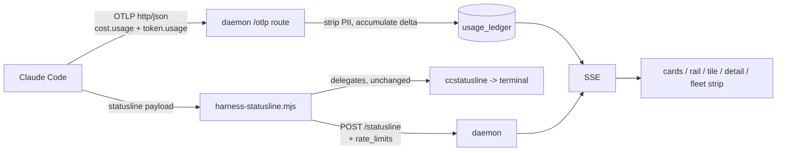

# Cost & token telemetry

Status: implemented
Owner: ai-harness (Mission Control)
Rendered: `plan.html` beside this file - open that for the diagrams.
Supersedes the "Cost & token telemetry" bullet in an earlier feature-ideas note that was
never checked in.

Built as written, with three decisions the plan left open resolved in the code:

- **Two install prompts, not one.** `npm run install-telemetry` (the `env` block) is separate
  from `npm run install-statusline` (the wrapper), because they are two different asks of the
  user's config and someone may well want the spend figures without us near their status line.
  In the app, the Cost settings toggle owns the env block; `removeIntegrations` still tears it
  down unconditionally.
- **Export interval: 15s**, settable 5s-60s in Settings → Cost.
- **Rail treatment: glyph-when-notable.** `RailRow` pushes a `$` mark once `costIsNotable`
  (`@shared/cost.ts`) says so; the other three surfaces carry the figure via `CostChip`.

Two things the plan did not anticipate, both found while building:

- **`window_end_ns` also covers the cumulative case.** Claude Code exports delta today, but a
  cumulative series is keyed on its fixed `startTimeUnixNano` so each export replaces one row
  rather than accumulating - `SUM` at read time stays correct either way.
- **`model_id` / `query_source` are `NOT NULL DEFAULT ''`.** SQLite treats NULLs as distinct
  inside a `UNIQUE` index, so the plan's nullable columns would have made `ON CONFLICT` never
  fire for a datapoint carrying no `model`, and every retry would have inserted a new row.

You run a fleet and nothing tracks what it costs. This consumes Claude Code's own cost
telemetry over OpenTelemetry, adds the subscription rate-limit view from the statusline
payload, and stores both durably.

> **Revision note.** Two earlier drafts of this plan were built on parsing transcript
> JSONL and pricing the tokens ourselves. Research and measurement showed that to be the
> weakest of five available sources, and showed the arithmetic to be far more error-prone
> than expected. The findings are kept below rather than edited out, because each is a trap
> the implementation still has to avoid - and because the cheapest way to be wrong here is
> to rediscover them.

## Premises that turned out to be wrong

**1. "Token counts ride the same hook payloads that already drive status."**
(The earlier feature-ideas note, not this plan.) They do not. Verified empirically rather
than from docs: `Stop`, `SessionEnd`, and `PostToolUse` hooks were registered to dump raw
stdin, and no field matching `cost|token|usage` appears in any of them.
`hooks/harness-hook.mjs:67-84` builds an allowlist body with no `usage` field.

**2. "We do not know a subscription's limits programmatically and will not guess."**
(This plan, draft 1.) Wrong - the statusline payload carries them.

**3. "Compute cost from tokens x a rate table."** (This plan, drafts 1 and 2.) Workable but
unnecessary and risky. Claude Code already computes the dollars. See the accuracy section.

## Architecture

Two sources, each used for the thing only it can do.

| Source | Provides | Why this one |
|---|---|---|
| **OpenTelemetry** | `claude_code.cost.usage` (USD), `claude_code.token.usage` by `type`, per `session.id`, `model`, `query_source` | Claude Code's own cost arithmetic. A continuously-emitted counter, so no snapshot or reconstruction problem. Does not touch the statusline slot. |
| **Statusline payload** | `rate_limits.{five_hour,seven_day}.{used_percentage,resets_at}` | The **only** local source of real subscription limits. |

Transcript parsing is **not** in the design. It is retained only as an optional one-time
backfill for history predating the feature, clearly labelled approximate.

### Why OTel rather than transcripts

Verified on this machine (`CLAUDE_CODE_ENABLE_TELEMETRY=1 OTEL_METRICS_EXPORTER=console`):

```
descriptor: { name: "claude_code.cost.usage", type: "COUNTER", unit: "USD" }
dataPoints: [{ attributes: { "session.id": "c180e57e-...", model: "claude-opus-4-8[1m]",
                             query_source: "main", effort: "xhigh" },
               value: 0.0987345 }]
```

Four metrics emit: `claude_code.cost.usage`, `claude_code.token.usage` (with a `type`
attribute of `input` / `output` / `cacheRead` / `cacheCreation` - note camelCase),
`claude_code.session.count`, `claude_code.active_time.total`.

`query_source` is `main | subagent | auxiliary`, which separates subagent spend natively -
better than the transcript path, where subagent usage lives in separate
`subagents/*.jsonl` files that the existing reader never opens.

Crucially it **needs no pricing table**: no rates to maintain, no effective-date logic for
Sonnet 5's introductory pricing expiring 2026-08-31, no fast-mode rate variants, no
`[1m]` context-tier ambiguity, and no exposure to LiteLLM's known-bad Claude 3 values.

### What OTel cannot do

There is **no quota or rate-limit metric**. Confirmed by grepping a live capture and by
documentation review. That is the entire reason the statusline is still in the design.

## Accuracy: why we consume rather than reconstruct

Measured against Claude Code's own per-model `costUSD`, which it records in
`~/.claude.json` under `projects.<path>.lastModelUsage[<model>].costUSD` alongside
`lastSessionId`. Nineteen sessions had both an oracle value and a transcript.

Where both sources are complete, a correct reconstruction agrees closely - **median
absolute error 0.99%**, ten of nineteen within 2%, several at 0.0-0.3%. The arithmetic is
tractable. What is not tractable is everything around it:

| Reconstruction method | Total across the 19 sessions | vs oracle |
|---|---:|---:|
| Correct: dedup by `message.id`, exact cache tiers | $46.30 | +32% |
| No dedup | $114.40 | +227% |
| Flat cache rate | $204.98 | +486% |

The +32% residual is **not** an arithmetic error. `lastCost` is a per-project field that is
overwritten, so it is frequently a mid-session snapshot rather than a final total - one
session shows 245 usage records against a $1.70 oracle. Which is itself the point: three
different local artifacts disagree about what a session cost, and two of them are
snapshots. OTel's counter is the only one that is neither reconstructed nor overwritten.

### The traps a transcript implementation must survive

Kept because the optional backfill still faces them.

**Dedup is mandatory, and its direction matters.** One API response is written as multiple
JSONL lines, one per content block, each carrying an identical complete `usage` object:

```
message.id msg_011Cd8gui6EZ...
  blocks:['thinking']   in:2 out:561 cache_write:27298
  blocks:['tool_use']   in:2 out:561 cache_write:27298   <- same usage
  blocks:['tool_use']   in:2 out:561 cache_write:27298   <- same usage
```

78,346 usage-bearing lines collapse to 34,451 responses; summing every line inflates 2.25x.
But naive "keep first" is also wrong: 6.58% of groups carry *differing* usage - streaming
partials where `output_tokens` grows (`[3, 1028, 1028]`) - and keeping the first
undercounts output by 6.24% corpus-wide.

> Rule: group by `message.id`, keep the record with maximum `output_tokens`.

`message.id` is present on 100% of records; `requestId` is missing on 74 (all
`model: "<synthetic>"`, not billable - filter them). Draft 1 of this plan specified
`UNIQUE(request_id)` with `INSERT OR IGNORE`, which would have silently dropped 56% of rows.

**Other double-count traps:** `cache_creation_input_tokens` equals
`ephemeral_5m + ephemeral_1h` - redundant, never sum both. `usage.iterations[]` repeats the
same numbers per iteration. And 791 `message.id`s appear across two or more transcripts
(resume and fork copy history forward), so `sessionId` is not identity and dedup must span
files.

**Tier multipliers** (verified uniform across current models): cache read 0.1x base input,
5-minute cache write 1.25x, 1-hour cache write 2.0x, output billed separately. On this
corpus 99.4% of input tokens are cache reads and 853 of 857 cache writes use the 1h tier,
so collapsing the split misprices real work.

## Ingestion

### OTel receiver

A new route on the daemon accepting OTLP metrics. Use `OTEL_EXPORTER_OTLP_PROTOCOL=http/json`
so the daemon parses JSON and takes no protobuf dependency. Per `CLAUDE.md`, a new mutating
route needs a zod schema in `protocol.ts` and must go through `parseBody` - never
hand-parse.

Enablement is a `settings.json` `env` block, **verified to work**: a session started with
`{"env": {"CLAUDE_CODE_ENABLE_TELEMETRY": "1", ...}}` emitted `claude_code.cost.usage`.
This matters because Mission Control's premise is passive discovery - it sees sessions it
did not start - and an env block applies to all of them, where a per-spawn variable would not.

Details that bite:

- **Temporality is `delta` by default.** Datapoints are increments; the receiver
  accumulates. Do not treat a value as a running total.
- **Default export interval is 60s** (`OTEL_METRIC_EXPORT_INTERVAL`). Tune down for a
  livelier badge, at the cost of more requests.
- **`OTEL_METRICS_INCLUDE_SESSION_ID` defaults true and must stay true** - false silently
  destroys per-session attribution. Assert it at startup rather than discovering empty
  cardinality later.
- **Datapoints carry PII**: `user.email`, `user.account_uuid`, `user.account_id`,
  `organization.id`. Strip these at ingest; store only `session.id`, `model`,
  `query_source`, and the value.
- **`model` carries a context suffix** here (`claude-opus-4-8[1m]`) that the transcript
  omits. Normalize if the two are ever joined.

### Statusline wrapper

`hooks/harness-statusline.mjs` already exists and is a **wrapper**: it captures the payload,
POSTs selected fields to `/statusline`, and delegates rendering to the user's real
statusline so the terminal is byte-for-byte unchanged. `DEFAULT_INNER` is
`npx -y ccstatusline@latest`.

`toBody()` (`:64`) currently lifts only `model`, `context_window`, `effort`, and
`thinking`. Add `payload.rate_limits`. Cost is deliberately **not** taken from here - OTel
owns cost, and one source per fact avoids two numbers that disagree on screen.

The wrapper is opt-in and currently not installed; this machine's `statusLine` is
`npx -y ccstatusline@latest` directly. Installing it edits the user's `settings.json`, so
prompt rather than doing it silently. The wrap is designed to be lossless, but it is still
their config.

## Storage

A **new table**, not a new `kind` in `session_events`. `db.ts:900-910` documents a
load-bearing invariant: that table has exactly one writer, and `hooksEverSeen` asks "any
row?", not "any row of a hook kind". A second writer would make every session it touched
claim hooks it never emitted. The remedy the file names is a separate table, as
`gate_replies` got.

**Key on `note_key`, not `session_id`.** `db.ts:74-80`: a session id is synthetic
(tty+pid+start) and re-mints on restart, so it is the wrong key for a record meant to
outlive the session. OTel's `session.id` is the agent session id, which is exactly what
`note_key` prefers.

```sql
CREATE TABLE IF NOT EXISTS usage_ledger (
  id            INTEGER PRIMARY KEY AUTOINCREMENT,
  note_key      TEXT NOT NULL,          -- agentSessionId (OTel session.id)
  session_id    TEXT,                   -- provenance only, never joined on
  agent         TEXT NOT NULL DEFAULT 'claude',
  model_id      TEXT,                   -- raw, e.g. 'claude-opus-4-8[1m]'
  query_source  TEXT,                   -- main | subagent | auxiliary
  window_end_ns TEXT NOT NULL,          -- datapoint timeUnixNano; the dedup identity
  ts            INTEGER NOT NULL,        -- window end in epoch ms, for range queries
  cost_usd      REAL NOT NULL DEFAULT 0,
  input         INTEGER NOT NULL DEFAULT 0,
  output        INTEGER NOT NULL DEFAULT 0,
  cache_read    INTEGER NOT NULL DEFAULT 0,
  cache_write   INTEGER NOT NULL DEFAULT 0,
  UNIQUE(note_key, model_id, query_source, window_end_ns)
);
CREATE INDEX IF NOT EXISTS idx_ledger_key ON usage_ledger(note_key, ts);
CREATE INDEX IF NOT EXISTS idx_ledger_ts  ON usage_ledger(ts);
```

**Idempotency is `REPLACE`, not `SUM`.** OTel delta datapoints carry
`aggregationTemporality: 1` (delta) with `startTimeUnixNano`/`timeUnixNano` window bounds -
verified on the wire. Each export's window is unique, so the ledger keys on the window-end
nanos and **replaces** the row's columns on conflict; the cumulative total is `SUM` over
rows at read time. A retried POST carries the same `window_end_ns` and replaces with
identical values, so it cannot double-count. An *additive* upsert would double-count on
retry - the opposite of the goal. `cost.usage` and `token.usage` are separate metrics
sharing one window, so each datapoint updates only its own column (per-column replace),
which is order-independent:

```sql
INSERT INTO usage_ledger (note_key, session_id, model_id, query_source, window_end_ns, ts, <col>)
VALUES (?, ?, ?, ?, ?, ?, ?)
ON CONFLICT(note_key, model_id, query_source, window_end_ns)
DO UPDATE SET <col> = excluded.<col>;   -- <col> from a fixed whitelist, never interpolated freely
```

> **`window_end_ns` is a string, not an integer.** `timeUnixNano` is ~1.78e18, past
> `Number.MAX_SAFE_INTEGER` (9.007e15). Store and compare it as text; derive `ts` with
> `Number(BigInt(window_end_ns) / 1_000_000n)`. Parsing the nanos as a JS number silently
> collides adjacent windows.

No `migrate()` entry is needed; `db.ts:341-346` records that a brand-new table is created
identically on fresh and upgraded DBs.

**Retention: age-based, 180 days**, on the `gate_replies` precedent (`db.ts:613-628`) -
session-scoped pruning is wrong because the record becomes interesting precisely once the
session is gone. Add a fourth `try` block in `registry.pruneQueues` (`registry.ts:341-364`),
where each prune is independently caught.

Rate-limit percentages are **not** stored. They are a live gauge with a server-supplied
reset time; persisting them would invite treating a stale percentage as current.

## Surfaces

A session is drawn by four components and three mark vocabularies disagree, so the badge
needs a spelling in each.

| Surface | File | Placement |
|---|---|---|
| Cards | `components/SessionCard.tsx:252` | beside `RuntimeMetaRow` |
| Console / Board detail | `components/layouts/ConsoleDetail.tsx:152` | beside `RuntimeMetaRow` |
| Board tile | `components/layouts/SessionTile.tsx:218` | beside `RuntimeMetaRow` |
| Console rail | `components/layouts/RailRow.tsx:36-40` or `:59` | see open question |

`CostChip` lives in `components/session-bits.tsx`, modelled on `PrChip` (`:72`): returns
`null` when there is nothing to say, tone in the class suffix, detail in a tooltip. It must
render a `<span>`, not a `<div>` - `RuntimeMetaRow` (`:304`) is a flex-styled span
deliberately so it stays valid phrasing content inside the tile's all-span body.

`RuntimeMetaRow` is the right neighbour because cost is the fourth runtime fact of the same
kind as model, thinking level, and context. It is explicitly *not* in `SessionTile`'s
`.tile-marks`, which means "things that want your attention" - a routine cost is not an
alert. Over-budget is, and escalates there.

**Every figure is a local estimate.** Anthropic's docs are explicit that the client-side
number may differ from actual billing, and for Pro/Max the dollars are notional entirely.
Label it as an estimate in the tooltip rather than implying it is a bill.

### Fleet strip

Inside `.summary` in the topbar (`App.tsx:539-548`), reusing `Stat` (`:844`). Placement
matters: `--topbar-h` is measured live off `topbarRef` with a `ResizeObserver`
(`App.tsx:305-320`), so a strip **inside** the header is measured automatically while a
sibling after `</header>` is not - focus mode would then overflow by exactly the strip's
height. `Stat` takes `n: number` and renders it bare, so it needs a formatter for currency
and percent.

Two rate-limit bars (five-hour, seven-day) come straight from `rate_limits` and reuse the
`.rt-meter` / `.rt-meter-fill` idiom (`session-bits.tsx:334`). There is no charting library
and no non-icon SVG in the app; a sparkline of flex-basis spans matches the house style.

**Degrade honestly.** `rate_limits` appears only for Pro/Max subscribers and only after the
first API response. For API-key users, and before that first response, the bars must be
absent rather than rendered empty at 0%.

### Settings

A `cost` category in `SETTINGS_CATEGORIES` (`SettingsModal.tsx:20`) plus its `case` in
`renderCategory` (`:126`) - the switch is exhaustive with no `default`, so the typecheck
fails until both land. Holds the telemetry enable/disable, the OTel export interval, and
the dollars-vs-plan-percent default view.

State is **owned by App and passed in**, per the `foreman` precedent
(`SettingsModal.tsx:59-64`): the topbar strip and the panel read the same state, so a local
copy would leave the strip stale after an edit and double-poll.

### CSS

A `--cost` token in `:root`, starting as an alias of `--purple` (already the designated
off-palette "neither state nor warning" colour), escalating to `--attention` and `--danger`
at thresholds. Rules go in the runtime-meta-row section (`styles.css:560`), not at the end.

Cost is **not** a session tone and must not go in `TONE_ORDER` - that registry drives grid
sort, rail sections, and board columns, none of which should reorder by spend.

## Tests

| File | What is at stake |
|---|---|
| `otel-ingest.test.ts` | delta accumulation, bucket idempotency (a replayed POST must not double-count), PII stripping, and `session.id` absent handling. |
| `statusline-ratelimits.test.ts` | `toBody` lifts `rate_limits`, tolerates it absent (API-key users), and tolerates one window present without the other. |
| `session-contracts.test.ts` | exists; the new `Session` field fails typecheck without a comparator. |
| `session-leaf-parity.test.ts` | add `CostChip` to the import, a per-surface test, and the loop at `:183-188`. |
| `settings-sidebar-render.test.ts` | exists; asserts nav count equals array length. |
| `usage-backfill.test.ts` | *only if the backfill ships*: the dedup traps - multi-block groups collapse to one, and `[3, 1028, 1028]` resolves to 1028. |

**Cross-check as a test, not a mechanism.** `~/.claude.json`'s `lastModelUsage[*].costUSD`
and `ccusage --json` are both Claude-derived oracles. A slow test asserting the ledger lands
within tolerance of one of them on a fixture corpus is cheap insurance on the part of the
system that carries the risk. Neither is a runtime dependency, and neither is ground truth -
`lastCost` is an overwritten snapshot, as the accuracy section shows.

Known gap: `session-leaf-parity.test.ts` does not cover `RailRow` or `GoalLine` at all.
Nothing will catch a forgotten rail mark. That is the riskiest item in the change.

## Sequencing

1. OTLP receiver route + zod schema + `usage_ledger` + `otel-ingest.test.ts`.
2. Enablement: write the `env` block into settings on install, prompted; assert
   `OTEL_METRICS_INCLUDE_SESSION_ID` at startup.
3. `Session` field + comparator + read route. The compiler walks you through this one.
4. `CostChip` + the four surfaces + parity test.
5. Statusline wrapper: add `rate_limits`; install prompt.
6. Fleet strip: spend, burn rate, and the two rate-limit bars.
7. Settings panel.
8. Optional: transcript backfill for pre-feature history, behind an `app_config` flag and
   labelled approximate.
9. README: a capability section, and Configuration lines for the telemetry env vars.

Steps 1-4 deliver a live per-session cost with no pricing table and no statusline change.
Step 5 adds the subscription view.

## Open questions

Kept as they were asked. The first three were answered while building - the answers are at
the top of this file. The last two stand: Codex is out of scope, cost-per-PR is deferred.

**Two config edits, not one.** OTel needs an `env` block; rate limits need the statusline
wrapper. Both touch the user's `settings.json`. Worth deciding whether install is one
prompt or two, and whether rate limits are opt-in separately given they are the more
invasive of the two.

**Export interval.** 60s default makes the badge feel stale next to a live context meter.
Lowering it increases request volume from every session on the machine. 10-15s is probably
right; worth measuring.

**Rail treatment.** `RailRow.tsx:52-54` sets an explicit budget: "Two lines, never four
[...] a rail you can only fit six sessions in has stopped being a rail." A full `$1.24` in
`.rail-meta` is honest but costs horizontal room on the tightest surface. A glyph in the
`marks` array only when over budget fits the existing vocabulary but makes the rail the one
place cost is invisible until it is a problem. Leaning glyph-when-notable.

**Codex.** Out of scope, and the schema carries an `agent` column for it. Codex on this
machine stores state in `~/.codex/state_5.sqlite` with a single `tokens_used` scalar - no
tier split, no cost - so it cannot be priced to the same confidence. Codex cards should read
"not tracked" rather than show a number with a different error bar beside a Claude one.

**Cost per PR** needs a join from ledger rows to a PR, which `Session.prUrl` gives only
while the session lives. Deferred; `note_key` on every row keeps the join possible later.

## Implementation

This section is the build order with exact file anchors, signatures, and the contract
points from `CLAUDE.md` each change trips. Line numbers are from the current tree and will
drift; the surrounding function/const names are the durable anchors.

### Data model, in one place

Two additions to the wire model, no more:

- **`Session.cost: SessionCost | null`** - a per-session denormalized summary, resolved from
  the ledger by `note_key`, exactly like `Session.goal`. Drives the badge.
- **`ServerEvent` gains `{ type: "cost_fleet", fleet: FleetCost }`** - a new top-level
  collection for the topbar strip (fleet spend + burn + rate limits). Rate limits are
  account-global, so they ride here, not on each session.

There is deliberately **no** `Session.rateLimits` field and no pricing table in the runtime.

### 0. Wire format the receiver must parse (verified on the wire)

OTLP/HTTP JSON, `POST /v1/metrics`, `Content-Type: application/json`:

```jsonc
{ "resourceMetrics": [{
  "resource": { "attributes": [ /* host/os/service only - no PII here */ ] },
  "scopeMetrics": [{ "metrics": [
    { "name": "claude_code.cost.usage",
      "sum": { "aggregationTemporality": 1, "isMonotonic": true,
        "dataPoints": [{
          "asDouble": 0.0965845,
          "startTimeUnixNano": "1784489513278000000",
          "timeUnixNano":      "1784489513488000000",
          "attributes": [
            { "key": "session.id",   "value": { "stringValue": "e86934c3-..." } },
            { "key": "model",        "value": { "stringValue": "claude-opus-4-8[1m]" } },
            { "key": "query_source", "value": { "stringValue": "main" } },
            { "key": "user.email",   "value": { "stringValue": "..." } }  // PII - drop
          ] }] } },
    { "name": "claude_code.token.usage",
      "sum": { "aggregationTemporality": 1, "dataPoints": [ /* one per `type` attr */
        { "asDouble": 2, "attributes": [ /* ...same, plus */
          { "key": "type", "value": { "stringValue": "input" } } ] } ] } }
  ]}]
}]}
```

Facts an implementer needs and will otherwise get wrong:

- **Value is `asDouble`** even for token counts. Read `asDouble ?? asInt`, coerce to number.
- **`type` on `token.usage`** is `input | output | cacheRead | cacheCreation` (camelCase).
  Map to columns `input | output | cache_read | cache_write`.
- **`model` carries a `[1m]` suffix** the transcript omits. Store raw; `modelLabel()`
  (`src/shared/model.ts`) already strips it for display.
- Ignore `claude_code.active_time.total` and `claude_code.session.count`.
- PII lives on the **datapoint** attributes (`user.email`, `user.account_uuid`,
  `user.account_id`, `organization.id`), never the resource. Read only `session.id`,
  `model`, `query_source`, `type`; discard the rest at parse time.

### 1. `src/shared/types.ts`

```ts
// near SessionMeta (~line 59)
export interface SessionCost {
  costUsd: number;        // SUM(cost_usd) for this note_key
  input: number; output: number; cacheRead: number; cacheWrite: number;
  updatedAt: number;      // MAX(ts) seen, epoch ms
}
export interface RateLimits {
  fiveHour: { usedPercentage: number; resetsAt: number } | null;  // resetsAt: epoch seconds (as Claude sends)
  sevenDay: { usedPercentage: number; resetsAt: number } | null;
  updatedAt: number;
}
export interface FleetCost {
  spendToday: number;     // SUM(cost_usd) since local midnight
  burnPerHour: number;    // SUM(cost_usd) in the last hour
  rateLimits: RateLimits | null;
  updatedAt: number;
}

// in interface Session (~line 214, beside `meta`)
cost: SessionCost | null;

// in the ServerEvent union (~line 1153)
| { type: "cost_fleet"; fleet: FleetCost }
```

Adding `Session.cost` and a `ServerEvent` variant both trip compiler-enforced contracts -
see steps 4 and 6. `CLAUDE.md` -> "Compiler-enforced contracts".

### 2. `src/server/db.ts` - table + writer + readers + prune

**Table:** add the `usage_ledger` CREATE (from the Storage section) inside the `openDb()`
`db.exec` block (`db.ts:41-264`), next to the other `CREATE TABLE IF NOT EXISTS`. New table
=> **no `migrate()` entry** (`db.ts:341-346`).

**Writer** (model on `logEvent`, `db.ts:494`). One row per (note_key, model, query_source,
window), one column updated per datapoint. Column comes from a fixed whitelist, never
interpolated from input:

```ts
const USAGE_COLS = { costUsd: "cost_usd", input: "input", output: "output",
                     cacheRead: "cache_read", cacheWrite: "cache_write" } as const;

export function upsertUsageCell(k: {
  noteKey: string; sessionId: string | null; modelId: string | null;
  querySource: string | null; windowEndNs: string; ts: number;
}, col: keyof typeof USAGE_COLS, value: number): void {
  const c = USAGE_COLS[col];  // whitelist lookup - throws on anything else
  openDb().prepare(
    `INSERT INTO usage_ledger
       (note_key, session_id, model_id, query_source, window_end_ns, ts, ${c})
     VALUES (?, ?, ?, ?, ?, ?, ?)
     ON CONFLICT(note_key, model_id, query_source, window_end_ns)
       DO UPDATE SET ${c} = excluded.${c}`
  ).run(k.noteKey, k.sessionId, k.modelId, k.querySource, k.windowEndNs, k.ts, value);
}
```

**Readers:**

```ts
export function sessionCostFor(noteKey: string): SessionCost | null {
  const r = openDb().prepare(
    `SELECT SUM(cost_usd) c, SUM(input) i, SUM(output) o,
            SUM(cache_read) cr, SUM(cache_write) cw, MAX(ts) u
       FROM usage_ledger WHERE note_key = ?`).get(noteKey) as any;
  if (r?.c == null) return null;   // no rows -> unpriced, not $0
  return { costUsd: r.c, input: r.i ?? 0, output: r.o ?? 0,
           cacheRead: r.cr ?? 0, cacheWrite: r.cw ?? 0, updatedAt: r.u ?? 0 };
}
export function fleetSpendSince(tsMs: number): number {
  const r = openDb().prepare(
    `SELECT SUM(cost_usd) c FROM usage_ledger WHERE ts >= ?`).get(tsMs) as any;
  return r?.c ?? 0;
}
export function pruneUsageLedger(cutoff: number): number {
  return openDb().prepare(`DELETE FROM usage_ledger WHERE ts < ?`).run(cutoff).changes;
}
```

The per-field defensive `?? 0` and the `c == null` null-return mirror `episodesFor`'s row
mapper and its rationale (`db.ts:840-847`): rows outlive the daemon that wrote them.

### 3. `src/server/registry.ts` - ingest, resolve, sync, prune

**Constants** (near the other retention constants, ~`:108-131`):
`USAGE_RETENTION_MS = 180 * 24 * 60 * 60 * 1000`.

**Ingest.** New method, the OTel analog of `applyStatusLine`:

```ts
applyOtelMetrics(body: OtlpMetrics): void {
  for (const rm of body.resourceMetrics ?? [])
    for (const sm of rm.scopeMetrics ?? [])
      for (const m of sm.metrics ?? []) {
        const col = m.name === "claude_code.cost.usage" ? "costUsd"
                  : m.name === "claude_code.token.usage" ? "TOKEN" : null;
        if (!col) continue;
        for (const dp of m.sum?.dataPoints ?? []) {
          const a = attrMap(dp.attributes);          // {session.id, model, query_source, type}
          const noteKey = a["session.id"];
          if (!noteKey) continue;                    // unattributable -> skip
          const value = Number(dp.asDouble ?? dp.asInt ?? 0);
          const windowEndNs = String(dp.timeUnixNano);
          const ts = Number(BigInt(windowEndNs) / 1_000_000n);   // NOT Number(windowEndNs)
          const key = { noteKey, sessionId: sessionIdFor(noteKey), modelId: a["model"] ?? null,
                        querySource: a["query_source"] ?? null, windowEndNs, ts };
          if (col === "costUsd") upsertUsageCell(key, "costUsd", value);
          else {
            const c = TOKEN_TYPE_COL[a["type"] ?? ""];   // input|output|cacheRead|cacheCreation
            if (c) upsertUsageCell(key, c, value);
          }
          this.touchedCostKeys.add(noteKey);
        }
      }
  for (const k of this.touchedCostKeys) this.syncSessionsForCost(k);
  this.touchedCostKeys.clear();
  this.recomputeFleetCost();
}
```

**Resolve onto sessions** - the `goal` template (`goalSummaryFor` + the merge/apply seeds):

- In `mergeDiscovered`'s base object (`registry.ts:442`, beside `meta: prev?.meta ?? null`):
  add `cost: null`.
- After the overlay lands (`registry.ts:486`, where `base.goal` is resolved): add
  `base.cost = sessionCostFor(noteKeyFor(base));`
- In `applyHook` (~`:556`) and `applyStatusLine` (~`:993`): after building `next`, add
  `next.cost = sessionCostFor(noteKeyFor(next));` so a freshly-bound `agentSessionId` picks
  up already-ledgered cost.

**`syncSessionsForCost(key)`** - verbatim shape of `syncSessionsForGoal` (`registry.ts:1569`):

```ts
private syncSessionsForCost(key: string): void {
  const cost = sessionCostFor(key);
  for (const [id, s] of this.sessions) {
    if (noteKeyFor(s) !== key) continue;
    if (JSON.stringify(s.cost) === JSON.stringify(cost)) continue;
    const next = { ...s, cost };
    this.sessions.set(id, next);
    this.emitSession(next);
  }
}
```

**Comparator** - `SESSION_FIELD_COMPARATORS` (`registry.ts:2207`). Add `cost: byJson,`.
Without it, `session-contracts.test.ts` fails typecheck - that is the mechanism, not a bug.

**Fleet + rate limits.** Registry gains `private latestRateLimits: RateLimits | null = null`.
`applyStatusLine` sets it from `ingest.rateLimits` (step 5) and calls `recomputeFleetCost()`.

```ts
private recomputeFleetCost(): void {
  const now = Date.now();
  const fleet: FleetCost = {
    spendToday: fleetSpendSince(startOfLocalDay(now)),
    burnPerHour: fleetSpendSince(now - 3_600_000),
    rateLimits: this.latestRateLimits,
    updatedAt: now,
  };
  if (JSON.stringify(fleet) === JSON.stringify(this.lastFleetCost)) return;  // suppress no-op
  this.lastFleetCost = fleet;
  this.emitEvent({ type: "cost_fleet", fleet });
}
```

**Prune** - add a fourth independently-caught `try` to `pruneQueues` (`registry.ts:341-364`):

```ts
try { pruneUsageLedger(now - USAGE_RETENTION_MS); }
catch (err) { console.error("[registry] usage ledger prune failed:", err); }
```

**Snapshot** - `cost_fleet` is a top-level collection, so per `CLAUDE.md` extend
`registry.snapshot()` (`:251`) to include `fleetCost: this.lastFleetCost`, and the `snapshot`
ServerEvent (below).

### 4. `src/shared/protocol.ts` - two schema changes

**OTLP body** - loose, since it is Claude Code's shape, not ours. Validate only what is
read; `passthrough`/`optional` the rest so a schema drift never drops a whole export:

```ts
export const OtlpMetricsSchema = z.object({
  resourceMetrics: z.array(z.object({
    scopeMetrics: z.array(z.object({
      metrics: z.array(z.object({
        name: z.string(),
        sum: z.object({
          aggregationTemporality: z.number().optional(),
          dataPoints: z.array(z.object({
            asDouble: z.number().optional(), asInt: z.union([z.number(), z.string()]).optional(),
            timeUnixNano: z.union([z.string(), z.number()]),
            attributes: z.array(z.object({
              key: z.string(),
              value: z.object({ stringValue: z.string().optional() }).passthrough(),
            })).optional().default([]),
          })).optional().default([]),
        }).optional(),
      })).optional().default([]),
    })).optional().default([]),
  })).optional().default([]),
});
export type OtlpMetrics = z.infer<typeof OtlpMetricsSchema>;
```

**Rate limits** on the statusline ingest - extend `StatusLineIngestSchema` (`protocol.ts:51`):

```ts
rateLimits: z.object({
  fiveHour: z.object({ usedPercentage: z.number(), resetsAt: z.number() }).nullable().optional(),
  sevenDay: z.object({ usedPercentage: z.number(), resetsAt: z.number() }).nullable().optional(),
}).optional(),
```

### 5. `src/server/routes.ts` + the statusline wrapper

**OTLP route** (beside `/statusline`, `routes.ts:382`). Token-guarded like `/statusline`;
the exporter sends the token via `OTEL_EXPORTER_OTLP_HEADERS` (step 7):

```ts
app.post("/v1/metrics", async (c) => {
  if (!authed(c)) return c.json({ error: "unauthorized" }, 401);
  const parsed = await parseBody(c, OtlpMetricsSchema);
  if (!parsed.ok) return parsed.res;
  registry.applyOtelMetrics(parsed.data);
  return c.json({});   // OTLP expects a JSON body, not 204
});
```

Not under the `/api/*` loopback middleware (`:242`), matching `/statusline` and `/hooks`;
loopback bind + token is the guard. Return `{}` - the OTel SDK treats a non-JSON 2xx as a
partial failure and retries, doubling exports.

**Statusline wrapper** (`hooks/harness-statusline.mjs`, `toBody` at `:64`). Add to the
returned object:

```js
rateLimits: payload.rate_limits && typeof payload.rate_limits === "object"
  ? { fiveHour: rl(payload.rate_limits.five_hour), sevenDay: rl(payload.rate_limits.seven_day) }
  : undefined,
// rl(w) = w && typeof w==="object" ? {usedPercentage:num(w.used_percentage), resetsAt:num(w.resets_at)} : null
```

Cost is deliberately not taken here - OTel owns it. `applyStatusLine` sets
`this.latestRateLimits` from `ingest.rateLimits` and calls `recomputeFleetCost()`.

### 6. `src/web/useEventStream.ts` - the SSE contract

Per `CLAUDE.md` -> "New `ServerEvent` variant". Add a `case "cost_fleet"` to the switch
(before the `default`/`unhandled: never` guard at `:99`), extend `MissionState` with
`fleetCost: FleetCost | null` (`:13`), initialise it, extend the `snapshot` case (`:58`) to
read `msg.fleetCost`, and return it (`:125`). The `unhandled: never` line fails to compile
until the case exists - that is the guard doing its job.

```ts
case "cost_fleet": setFleetCost(msg.fleet); break;
```

Also extend the daemon `snapshot` emit (`src/server/sse.ts:20`) and `registry.snapshot()`
to carry `fleetCost`, or the strip is blank until the first post-connect change.

### 7. Enablement - `hooks/install.mjs` + `src/main/integrations.ts`

Both write `~/.claude/settings.json` surgically with `jsonc-parser`'s `edit` (the existing
mechanism, `install.mjs:172`, `integrations.ts:136`). Two edits:

**a. OTel env block** (new). Merge into `settings.json` `env`:

```jsonc
"env": {
  "CLAUDE_CODE_ENABLE_TELEMETRY": "1",
  "OTEL_METRICS_EXPORTER": "otlp",
  "OTEL_EXPORTER_OTLP_PROTOCOL": "http/json",
  "OTEL_EXPORTER_OTLP_ENDPOINT": "http://127.0.0.1:7317",   // HOST:PORT from config
  "OTEL_EXPORTER_OTLP_HEADERS": "x-harness-token=<token>",  // readToken()
  "OTEL_METRIC_EXPORT_INTERVAL": "15000"
  // OTEL_METRICS_INCLUDE_SESSION_ID defaults true - do NOT set it false
}
```

Verified: a session started with this `env` block emits `claude_code.cost.usage` to the
endpoint. Merge, don't overwrite - preserve any keys the user already set, and on uninstall
remove only the keys we added.

**b. Startup assertion.** In the daemon boot (`src/server/index.ts`), if telemetry is
enabled but `OTEL_METRICS_INCLUDE_SESSION_ID` reads `"false"` anywhere it can, log a loud
warning - a false value silently destroys per-session attribution.

**c. Rate-limit statusline** is the existing opt-in wrapper (`install.mjs:148-201`),
unchanged except that `toBody` now also forwards `rateLimits` (step 5). Keep it a separate
opt-in from the env block; see the open question on one prompt vs two.

Env/`OTEL_` and `x-harness-token` fallbacks are append-only per `CLAUDE.md` -> never rename
an env key a shipped session might still send.

### 8. Web leaf + four surfaces

**`SessionCost` / `FleetCost` / `RateLimits`** are already in `src/shared/types.ts`
(step 1); the web imports from `@shared/types`.

**`CostChip`** in `src/web/components/session-bits.tsx`, modelled on `PrChip` (`:72`):

```tsx
export function CostChip({ cost }: { cost: SessionCost | null }): React.JSX.Element | null {
  if (!cost || cost.costUsd <= 0) return null;
  return (
    <Tooltip label={`${fmtUsd(cost.costUsd)} - ${compactTokens(cost.input + cost.cacheRead + cost.cacheWrite)} in / ${compactTokens(cost.output)} out (estimate)`}>
      <span className="cost-chip">{fmtUsd(cost.costUsd)}</span>
    </Tooltip>
  );
}
```

Render it beside `RuntimeMetaRow` in **all four**: `SessionCard.tsx:252`,
`layouts/ConsoleDetail.tsx:152`, `layouts/SessionTile.tsx:218`,
`layouts/RailRow.tsx` (glyph or `.rail-meta` - see open question). Because `cost` is a
`Session` field it flows through `cardProps` automatically; no `layouts/types.ts` change is
needed (contrast a fleet-computed prop, which would).

### 9. Fleet strip - `src/web/App.tsx`

`fleetCost` comes from `useEventStream` (step 6). Render inside `.summary`
(`App.tsx:539-548`), reusing `Stat` (`:844`) with a currency/percent formatter:

```tsx
{fleetCost && <Stat n={fleetCost.spendToday} label="today" fmt={fmtUsd} />}
{fleetCost?.rateLimits?.fiveHour && <RateMeter window={fleetCost.rateLimits.fiveHour} label="5h" />}
{fleetCost?.rateLimits?.sevenDay && <RateMeter window={fleetCost.rateLimits.sevenDay} label="7d" />}
```

`RateMeter` reuses `.rt-meter`/`.rt-meter-fill` (`session-bits.tsx:334`). It must be
**inside** `<header className="topbar">` so `--topbar-h`'s `ResizeObserver`
(`App.tsx:305-320`) measures it; a sibling after `</header>` overflows focus mode by the
strip's height. Degrade honestly: absent windows render nothing, not 0%.

### 10. Settings panel

Append `{ id: "cost", label: "Cost", icon: "$" }` to `SETTINGS_CATEGORIES`
(`SettingsModal.tsx:20`) and a `case "cost": return <CostSettingsPanel state={cost} />;` to
`renderCategory` (`:126`) - the switch is exhaustive with no `default`, so it fails typecheck
until the case lands. New `CostSettingsPanel.tsx`: telemetry on/off, export interval, and the
dollars-vs-plan-percent default view. State is **owned by App and passed in** per the
`foreman` precedent (`SettingsModal.tsx:59-64`), since the topbar strip reads the same view
setting. `settings-sidebar-render.test.ts` asserts nav count == array length; add a case.

### 11. CSS - `src/web/styles.css`

`--cost` token in `:root` (`:1-38`), aliasing `--purple` initially, escalating to
`--attention`/`--danger` at thresholds. `.cost-chip` rule in the runtime-meta-row section
(`:560`), not at the end. Grep for `cost-chip`/`--cost` when renaming - no linter guards this
file. Do **not** add `--cost` to `TONE_ORDER`.

### 12. Tests (`node:test` + `node:assert/strict`, flat in `test/`)

- **`otel-ingest.test.ts`** - feed the captured OTLP body (fixture) to a stub registry:
  (a) a `token.usage type=input` datapoint lands in `input`; (b) re-posting the identical
  body leaves row count and sums unchanged (window-end replace, no double-count);
  (c) `user.email`/`user.account_uuid` never reach the DB; (d) a datapoint with no
  `session.id` is skipped; (e) `window_end_ns` past 2^53 round-trips without collision.
- **`usage-ledger.test.ts`** - `sessionCostFor` returns `null` (not `$0`) for an unseen key;
  `fleetSpendSince` windows correctly; per-column replace preserves the other columns.
- **`statusline-ratelimits.test.ts`** - `toBody` forwards `rate_limits`; one window present
  without the other is tolerated; absent `rate_limits` yields `undefined`, and the strip
  renders no bar.
- **`session-contracts.test.ts`** (exists) - already forces the `cost` comparator and the
  `cost_fleet` `useEventStream` case at typecheck.
- **`session-leaf-parity.test.ts`** - import `CostChip`, a per-surface test, and the loop
  entry at `:183-188`. (Reminder: this file does not cover `RailRow` - the rail mark is
  unguarded.)
- **`settings-sidebar-render.test.ts`** (exists) - add the `cost` category case.
- **`usage-oracle.test.ts`** (slow, optional) - assert the ledger sum for a fixture session
  lands within a tolerance of `ccusage --json` / `.claude.json` `lastModelUsage.costUSD`.

### 13. README

`CLAUDE.md` -> "Done means" #1: same-change README update. A capability section for cost
telemetry, and Configuration lines for the telemetry env vars and the opt-in statusline.

## Flow



The hook path is untouched. Cost never passes through a pricing table we maintain.
