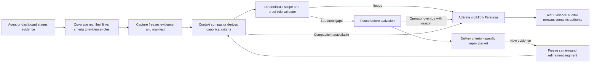

# Criterion-mapped evidence preflight

## Summary

Add an evidence-readiness preflight before workflow Personas run. The author explicitly maps each material acceptance criterion to the evidence intended to prove it. Mission Control freezes that coverage manifest with the submission, reconciles it with the canonical criteria derived during context capture, and checks a small proof-shape matrix. Structurally incomplete packets pause before consuming Persona attempts and return an exact repair checklist.

This feature is intended to improve Test Evidence Auditor first-pass acceptance without weakening the Auditor. The preflight answers only whether the packet contains the expected kinds of proof. The Auditor remains responsible for judging whether that proof is relevant, trustworthy, and sufficient.

## Clarified decisions

- Reuse the existing configurable `workflow-context` background job. Do not add a second model or Settings row.
- Keep its existing resolution through **Settings -> Models -> Workflow context**, then `MISSION_WORKFLOW_CONTEXT_MODEL`, then the selected provider's cheap default.
- Extend that call beyond its current raw goal, refined goal, and human-decision inputs with bounded changed-path and diff-summary metadata. It must not receive evidence source paths or artifact bodies.
- Treat the author's proof class as the source of hard structural requirements. A model-suggested proof class can identify a mismatch or omission, but model-only classification produces a warning rather than demanding a screenshot or other proof type.
- Require every canonical criterion to have an author mapping or an explicit override. The model helps reconcile criteria and claims; deterministic code validates IDs, scope, and proof roles.

## Problem statement

The rejection review found a repeated pattern: evidence was often registered, but it did not demonstrate the material claim being reviewed. Examples included typecheck output in place of a focused behavior test, browser output without a rendered screenshot, a post-fix performance screenshot without baseline and result measurements, and prose describing downstream state without a state snapshot.

The existing system cannot reliably catch those gaps before review:

- Staged evidence has a caption and repository scope, but no declared criterion or proof role.
- Acceptance criteria become canonical only after the context compactor runs during submission capture.
- The Test Evidence Auditor sees the immutable packet only after the run has activated.
- A rejection consumes a repair round even when the defect is a high-confidence structural omission.
- Current first-submission telemetry assumes the first Auditor attempt is always round 1, segment 0.

## Goals

1. Make the intended relationship between criteria and evidence explicit and inspectable.
2. Catch high-confidence missing proof before any Persona model call.
3. Give the author an exact, criterion-specific repair packet.
4. Preserve immutable submissions, repository scoping, restart safety, and one delivery at a time.
5. Keep the Test Evidence Auditor as the semantic acceptance authority.
6. Measure first Auditor attempt acceptance honestly after preflight refinements exist.

## Non-goals

- Do not loosen or bypass Test Evidence Auditor standards.
- Do not claim that structurally complete evidence proves the behavior.
- Do not automatically run commands or manufacture screenshots.
- Do not import pull request or CI evidence in this feature.
- Do not allow arbitrary files or expose operator paths in Persona prompts.
- Do not spend a repair round for a preflight-only correction.
- Do not alter historical workflow versions or already-running submissions.

## Proposed experience

### Authoring evidence

The dashboard evidence composer and `submit_workflow_evidence` accept an optional coverage manifest. Each claim contains:

- A caller-stable `clientCriterionId`.
- The author's criterion text.
- A proof class.
- A repository scope.
- Links to staged evidence `clientItemId` values, each with a proof role.

The initial proof classes and required roles are deliberately small:

| Proof class | Required evidence roles | Typical claim |
| --- | --- | --- |
| `focused_execution` | `execution` | A focused test or command demonstrates changed behavior. |
| `integration` | `execution` | A boundary or end-to-end flow works across components. |
| `visual` | `execution`, `rendered_output` | A UI flow works and the rendered result looks correct. |
| `performance` | `baseline_measurement`, `result_measurement` | A measured outcome improved from a comparable baseline. |
| `rendered_artifact` | `deliverable` or `rendered_output` | A report, document, or generated artifact exists and renders correctly. |
| `state_confirmation` | `state_snapshot` | A requested external or downstream state is confirmed. |

The composer shows missing required roles immediately. Those role requirements come from the author's declared proof class, so a non-UI claim never acquires a screenshot requirement merely because it touches a frontend file. This is advisory until submission capture because the author's list is not yet the canonical acceptance-criteria list.

### Submission preflight

During capture, Mission Control freezes the evidence and coverage manifest, captures the bounded task context, and asks the existing configurable `workflow-context` job for structured canonical criteria. Today that call sees only the raw goal, refined goal, and human decisions. This feature adds bounded changed paths, a clipped diff summary, evidence captions, and claim metadata, but never evidence locators, local artifact paths, or artifact bodies. It returns:

- Canonical criterion text.
- A suggested proof class.
- Matching author claim IDs.

The daemon then performs deterministic validation. It assigns stable canonical criterion IDs from normalized criterion text plus ordinal, resolves only evidence frozen in the same submission, validates repository scope, and applies the proof-role matrix selected by the author's declaration. Model output never decides a screenshot or other proof requirement on its own. A disagreement between the model suggestion and author declaration is visible as a warning for correction or Auditor review.

If every material criterion has a structurally complete mapping, the existing workflow engine activates the submission normally.

If a high-confidence structural gap exists, the run enters `waiting_for_evidence_readiness` before Persona activation. Mission Control prepares an `evidence_readiness` delivery containing:

- The canonical criterion.
- The missing proof role or unmatched criterion.
- The evidence already linked.
- Instructions for registering the missing proof and resuming.

No Persona attempt is created and no Persona model tokens are consumed while the run is held.

### Repair and override

Agent-authored repair freezes a new immutable submission segment in the same round. This extends segment lineage beyond SessionAction continuation, so the new submission records its refinement parent and reason. The repair budget changes only when a Persona rejects the evidence.

An operator can override the preflight from the run detail view with a required reason. Override activates the same immutable submission and is idempotent. It does not mark the packet ready, hide the gaps, or influence the Auditor's judgment.

If context compaction falls back or readiness cannot be evaluated safely, Mission Control records `unavailable` and proceeds with the existing Auditor behavior. An advisory system must not deadlock a valid workflow because its own classifier failed.

## System flow



## Data model and contracts

### Versioned policy

Add an immutable `evidenceReadinessPolicy` to `WorkflowDefinition` and `WorkflowVersion`:

```ts
type WorkflowEvidenceReadinessPolicy = "off" | "criterion_mapped_v1";
```

New and custom workflows default to `off`. Publish a new No-Mistakes Review version with `criterion_mapped_v1`; versions 1 through 11 remain byte-for-byte behaviorally unchanged. The run pins the policy from its workflow version. Under the enforcing policy, absent coverage deterministically produces `missing_coverage`; null readiness is never treated as ready.

### Mutable staging

Add `workflow_evidence_coverage_staging`, keyed by note key and `client_criterion_id`, with bounded criterion text, proof class, repository scope, linked item roles, episode key, generation, reservation group, and timestamps. Updating a claim or its links advances the existing evidence generation so automatic resumption observes the change.

Existing callers that submit only images, artifacts, or command outputs remain valid. Coverage is additive in the shared protocol and generated agent-tool schema.

### Immutable submission state

Add:

- `workflow_submission_evidence_coverage` for the frozen author claims and evidence links.
- A bounded readiness record on the submission containing canonical criteria, mappings, deterministic gaps, evaluator status, and policy version.
- `workflow_submission_readiness_overrides` as an append-only audit record with actor, reason, request ID, and timestamp.
- Reuse the existing `parent_submission_id` relation and add an append-only refinement reason so a same-round segment can identify the immutable packet it superseded and distinguish evidence repair from SessionAction continuation.

Do not add a second parent relation or overload SessionAction continuation fields for evidence repair. Both flows produce child segments, but their ownership and resumption semantics differ.

### Lifecycle additions

Append new values rather than renaming or reordering persisted identifiers:

- Run/submission wait state: `waiting_for_evidence_readiness`.
- Delivery kind: `evidence_readiness`.
- Submission refinement reason: `evidence_preflight`.

All exhaustive shared predicates, browser labels, SSE projections, serializers, and strict row parsers must be updated together.

## Reconciliation and validation rules

1. Normalize whitespace for matching but preserve original text for display.
2. Assign canonical IDs in the daemon, not in model output.
3. Require every material canonical criterion to match exactly one author claim unless the compactor marks it informational; missing mappings can be repaired or explicitly overridden.
4. Reject duplicate claim IDs, stale evidence IDs, and links outside the frozen submission.
5. A repository-scoped claim can link only to evidence for the same repository or `all`.
6. An `all` claim is evaluated independently for each repository run.
7. Proof-role requirements are deterministic and versioned with `criterion_mapped_v1`.
8. Extra evidence is allowed and displayed but does not satisfy an unrelated criterion.
9. Ambiguous semantic matches and model-only proof-class suggestions produce warnings. Only missing claims, invalid links, scope conflicts, and roles required by the author's declared proof class hard-block.
10. Compaction fallback or malformed model output yields `unavailable`, not a block.

## Multi-repository behavior

Readiness is evaluated per repository run because each run freezes a repository-specific evidence packet. An `all` claim can satisfy each sibling only when its linked evidence is also available to that sibling. One sibling may activate while another pauses. The existing one-outstanding-delivery rule continues to serialize messages into the shared session, and each repair packet names its repository clearly.

## API and UI changes

### Shared and server contracts

- Extend `SubmitWorkflowEvidenceSchema` and the MCP tool schema with optional `coverage` claims.
- Extend the existing workflow-evidence staging response so the dashboard can render claims and link status.
- Add bounded create/update/remove coverage operations using the same note-key ownership and reservation rules as staged items.
- Add an operator-only, request-ID-protected override endpoint for a specific run and submission.
- Extend run detail projections with immutable readiness status, criteria, mappings, gaps, refinement lineage, and override state.

### Dashboard

- Add criterion rows to `WorkflowEvidenceComposer` with proof class, repository scope, linked evidence, and required-role status.
- Explain that composer checks are provisional until canonical capture.
- Show `Evidence preflight` as a distinct waiting phase in run cards and detail views.
- Display each canonical criterion with mapped evidence chips, missing-role messages, and refinement history.
- Provide `Continue despite gaps` only to the operator, requiring a non-empty reason and a confirmation that the Auditor may still reject it.
- Use accessible roles, labels, and placeholders. Do not add `data-testid` selectors.

## Telemetry and success measurement

Preserve existing metrics for historical compatibility, but add a first-Auditor-attempt dimension. Round 1, segment 0 is no longer equivalent to the first time the Auditor sees a packet.

Record only bounded enums, counts, timestamps, and digests:

- First Auditor attempt accepted or rejected.
- Preflight interception rate.
- Missing proof classes and roles.
- Number of same-round evidence refinements.
- Override rate and eventual Auditor outcome.
- Readiness-unavailable rate.
- Auditor rejection after a preflight-ready result, used to find matrix blind spots.

Do not store prompt text, verdict bodies, criterion text, evidence output, or paths in telemetry.

Primary success metric: increase first Test Evidence Auditor attempt acceptance above the observed 50 percent baseline in the reviewed slice, while keeping override and post-ready rejection rates visible. Preflight interception is not counted as Auditor success because no Auditor attempt occurred.

## Implementation sequence

1. **Define additive contracts and migrations.** Add policy, proof classes, roles, coverage schemas, readiness projections, lifecycle values, staging and immutable tables, strict readers, and compatibility defaults.
2. **Stage and freeze coverage.** Extend dashboard and MCP evidence registration, implement item-link validation and generation changes, and reserve/finalize claims atomically with evidence items.
3. **Produce canonical criteria.** Extend the existing configurable Workflow context call with bounded changed-path, clipped diff-summary, and evidence metadata; add deterministic canonical IDs, advisory proof-class suggestions, and safe fallback behavior.
4. **Add the readiness gate.** Reconcile claims after compaction and before `engine.activateSubmission`, persist results, pause incomplete packets, and prepare idempotent deliveries without creating Persona attempts.
5. **Resume safely.** Implement same-round refinement segments, explicit parent lineage, auto-resumption from new evidence, and operator override on the same immutable submission.
6. **Expose the state.** Add run-detail projections, phase and delivery labels, criterion mapping UI, gap explanations, and override controls.
7. **Opt in the built-in workflow.** Publish the next No-Mistakes Review version with `criterion_mapped_v1`; retain all earlier version literals unchanged.
8. **Measure and document.** Add first-Auditor-attempt metrics, operational counters, workflow documentation, architecture notes, and change-contract updates.

## Test strategy

### Focused unit and contract coverage

- Shared schema accepts legacy evidence calls and rejects oversized, duplicate, or invalid coverage.
- Every proof class enforces the expected roles, including the rendered-artifact alternative.
- Stale IDs, cross-repository links, and links outside the reservation are refused.
- Database migration opens existing databases and strict readers default old versions to `off`.
- Staging reservation, finalization, pruning, reset, and generation changes remain atomic and restart-safe.
- Context compaction produces structured criteria; fallback and malformed output proceed as `unavailable`.
- A ready packet activates exactly once.
- A blocked packet creates no Persona attempts and prepares one idempotent delivery.
- New evidence creates a same-round child segment and does not consume repair budget.
- Override activates the original immutable submission exactly once and records its reason.
- Multi-repository siblings evaluate independently and retain delivery ordering.
- First-Auditor-attempt telemetry remains correct after one or more preflight segments.

### Browser coverage

Add Playwright coverage against the built dashboard for the primary rejection shape:

1. Stage a UI behavior command and declare a `visual` criterion without a screenshot.
2. Submit and verify the run pauses at Evidence preflight before any Persona appears.
3. Verify the detail view names the missing `rendered_output` role.
4. Register a screenshot, link it, and verify a new segment in the same round activates.
5. Verify the immutable readiness mapping is visible in run detail.
6. Cover the override path with a required reason and confirm the unresolved gap remains visible.

Use fake agent fixtures, semantic selectors, and a captured screenshot of the rendered state. Add HTTP-level multi-repository coverage unless a browser assertion materially adds confidence.

### Final verification

Run focused tests with the required setup preload, then the repository gates appropriate to this cross-layer UI and runtime change:

```sh
node --test --import ./test/setup-state.mjs --import tsx <focused test files>
npm run typecheck
npm run lint
npm test
npm run build
npm run smoke
npm run test:e2e -- <focused Playwright spec>
```

Register the exact final focused command output and rendered screenshots through Mission Control after the final relevant run. Evidence remains gitignored and is never committed.

## Documentation updates

- Explain author-declared criterion mappings and proof roles in workflow evidence documentation.
- Document the pre-activation readiness state, same-round refinement lineage, and fallback behavior in the architecture guide.
- Extend change contracts for the new append-only policy, status, delivery kind, and segment reason.
- Document the operator override as an audited exception, not an acceptance decision.
- Update No-Mistakes Review version history without rewriting earlier versions.

## Acceptance criteria

- A workflow version can opt into criterion-mapped evidence readiness without changing old or custom versions.
- A structurally incomplete opted-in packet pauses before any Persona model call and identifies the criterion and missing proof role.
- A structurally complete packet follows the existing workflow path with no additional human action.
- Compaction failure never deadlocks a run.
- Preflight repair creates a new immutable segment in the same round and preserves the Persona repair budget.
- An operator can override with a required, durable reason while gaps remain visible to the Auditor.
- Repository scope and multi-repository sibling behavior remain isolated and deterministic.
- The dashboard makes mappings, gaps, lineage, and override state inspectable.
- Browser coverage proves the visible pause, repair, activation, and override paths in the built application.
- Metrics distinguish preflight interception from first Auditor attempt acceptance.

## Risks and mitigations

| Risk | Mitigation |
| --- | --- |
| The compactor invents or misclassifies criteria. | Treat model output as a bounded proposal, assign IDs in the daemon, make model-only proof-class disagreements warnings, and proceed when evaluation is unavailable. |
| Authors game the matrix with irrelevant artifacts. | Keep semantic sufficiency with Test Evidence Auditor and measure post-ready rejection disagreements. |
| New segment semantics blur repair accounting. | Add explicit refinement lineage and reason; do not overload Persona round or SessionAction continuation fields. |
| Evidence links leak across repositories or submissions. | Resolve IDs only inside the frozen submission and enforce scope compatibility before activation. |
| The gate surprises existing workflows. | Default policy to `off` and opt in only through a new immutable built-in version. |
| Added UI becomes form-heavy. | Start with six proof classes, derive required roles, reuse staged evidence cards, and show only criterion-specific gaps. |

## Expected outcome

Authors get a precise proof checklist before review, common omission patterns are repaired without spending Persona attempts, and the Auditor receives a more coherent immutable packet. The system becomes stricter about evidence preparation while preserving the Auditor as the final judge of whether the implementation actually works.
