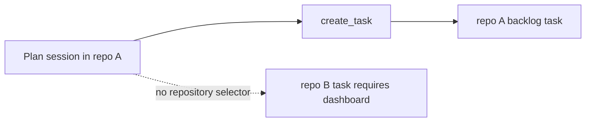
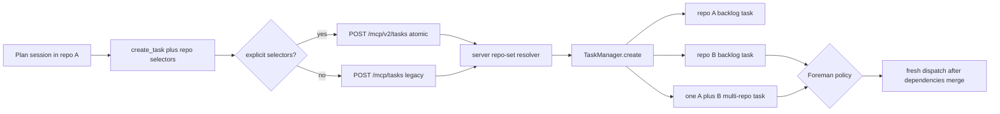

# Cross-repository task spawning from Mission MCP

Status: Approved on 2026-08-24

Rendered page: [plan.html](plan.html)

## Outcome

A Mission Control agent working in repository A can call `create_task` and place an implementation
task in repository B, or create one task spanning A and B, without first attaching those repositories
to the planning task or obtaining a separate Mission Control repository grant.

The repository selector is optional. Omitting it preserves today's behavior exactly: the task is
filed against the main checkout that owns the calling session's current worktree. Supplying it makes
the target explicit and lets the repository's own Git and GitHub credentials decide whether the
eventual branch can be pushed and reviewed.

This plan does not add a push-permission preflight. Mission Control cannot prove push authority
without contacting the remote, and a speculative push check is both incomplete and potentially
side-effecting. It validates only that each target is a local Git repository with a reachable main
checkout. The ordinary commit, push, pull-request, and review path remains the point where the
repository host enforces write access.

## Approved decisions

The Mission Control review fixed these choices on 2026-08-24:

- Keep Foreman's repository allowlist for unattended backlog launches. Cross-repository task
  creation and manual dispatch do not require a new grant, but autonomous launch still requires
  every target repository to be trusted.
- Expose the full repository set through `create_task`: an optional alternate primary plus optional
  attached repositories.
- Continue from this approved design into a repository-verified phased implementation plan and
  dependency-linked implementation tasks.

## Requirement interpretation

The requested boundary is the agent-facing scheduling restriction, not the durable backlog model:

- `create_task` currently exposes no target repository and always sends `process.cwd()` as the task's
  repository.
- The daemon already accepts and canonicalizes repository roots, the task model already persists a
  primary plus secondary repositories, and dependency edges already cross repository boundaries.
- The dashboard already lets an operator type a local repository path outside the workspace scan.
  Agent-created tasks should use the same repository-validity rule rather than introduce a second
  trust catalogue.

Foreman's repository allowlist governs unattended execution, not task creation. The approved
implementation keeps that separate launch-time boundary.

## Repository findings

1. `src/mcp/server.ts:317-360` describes `create_task` as current-repository-only. Its public schema
   has no repository field, and its HTTP payload sets both `cwd` and `repoRoot` to `process.cwd()`.
2. `src/shared/protocol.ts:727-743` already carries `repoRoot` in `McpCreateTaskSchema`. This is an
   internal transport field, not an agent-selectable target. The wire shape can evolve additively.
3. `src/server/routes.ts:3373-3413` resolves the requested path through `resolveTaskRepoRoot`, builds
   dependencies, and calls `TaskManager.create`. It is the correct server boundary for target
   selection because the MCP child must not decide canonical repository identity.
4. `src/server/repos.ts:207-289` already owns `resolveTaskRepoSet`: main-checkout walk-back,
   canonicalization, primary/secondary collision checks, deduplication, and stable ordering.
5. `src/server/routes.ts:5774-5830` is the dashboard's mature creation path. It resolves a full repo
   set, resolves the effective harness, refuses unsupported multi-repo dispatch, and then converges on
   `TaskManager.create`.
6. `src/server/tasks.ts:124-170,1975-2048` already accepts a resolved `repoRoot` and
   `extraRepoRoots`, stores the full set before launch, defaults self-filed work to the backlog, and
   preserves dependencies without a same-repository restriction. No database migration is needed.
7. `src/server/dispatcher.ts:316-340` is the launch backstop for multi-repo capability. A future MCP
   creator cannot silently launch a harness that lacks additional-directory support.
8. `skills/phased-plan/SKILL.md:85-105` is the current policy bottleneck: it correctly reports that a
   cross-repo phase cannot be scheduled because `create_task` is current-repository-only.
9. `skills/phased-plan/SKILL.md:107-174` also creates the delivery constraint this feature must
   preserve. Phase tasks carry repository-relative paths rather than pasted implementation detail,
   and those paths must resolve after the planning pull request merges.
10. `src/server/foreman/backlog-machine.ts:331-351` applies a separate all-repositories allowlist
    before unattended backlog assignment or dispatch. That check happens after task creation and is
    not the source of the current MCP restriction.

## Proposed product behavior

### Public tool contract

The public tool becomes:

```ts
create_task({
  title,
  intent,
  repository?,
  additionalRepositories?,
  dependsOnTaskIds?,
  dependsOnCurrentSession?,
})
```

`repository` accepts either an absolute local checkout path or a unique repository directory name.
When omitted, it means the calling session's repository. `additionalRepositories` uses the same
selector rules and defaults to an empty list. The result echoes canonical primary and secondary
paths so an agent can confirm what a short name or linked worktree resolved to.

### Repository selector resolution

Add one server-owned resolver for MCP task selectors:

1. Omitted `repository`: use the transport's existing caller `repoRoot`, which remains
   `process.cwd()` and walks back to the main checkout.
2. Absolute path: pass it directly into `resolveTaskRepoRoot`. It need not appear in
   `MISSION_WORKSPACE_DIRS`, matching the dashboard's existing typed-path behavior.
3. Short name: compare it with the basename of every repository returned by `listRepos()`. Exactly
   one match resolves. No match returns a 400 asking for an absolute path. Multiple matches return a
   409 listing the canonical candidates so the agent can retry without guessing.
4. Resolve the selected primary and all secondaries together through `resolveTaskRepoSet`.

This resolver is addressing, not authorization. It adds no persisted allowlist, repository token,
remote-owner mapping, or push probe.

### Transport compatibility

Keep `McpCreateTaskSchema` and legacy `POST /mcp/tasks` as the selector-free contract for older
bundles. Add `McpCreateTaskV2Schema` with optional `targetRepository` and
`additionalRepositories`; its handler selects `targetRepository ?? repoRoot`. Both schemas preserve
the internal `repoRoot` field as the calling checkout.

The MCP child exposes the friendlier `repository` names in its tool schema and maps them to the
transport fields. An old child continues to create current-repo tasks against a new daemon.

Repository-targeting calls use a new token-authenticated, versioned creation endpoint. This is
required because the older request schema strips unknown object keys rather than rejecting them: an
older daemon handling the legacy endpoint could ignore a target or attachment and create a
valid-looking task in the wrong repository set. An older daemon has no versioned route, so it returns
404 without creating anything. Current-repository calls keep the legacy endpoint and their existing
compatibility path. The daemon that accepts a selector-bearing request is therefore the same daemon
that validates and stores the full repository set, with no check/create race.

### Server convergence

Do not copy the dashboard route's multi-repo policy into a second hand-maintained block. Extract a
focused server helper that:

- resolves the primary and secondary repositories;
- resolves the effective `ship` harness when the caller did not pin one;
- checks `multiRepoDispatch` when secondaries are present; and
- returns normalized `CreateTaskInput` repository fields or a user-facing refusal.

Use it from both `POST /api/tasks` and `POST /mcp/tasks`. The MCP route continues to own its special
dependency conversion, especially `dependsOnCurrentSession`, then calls `TaskManager.create` with
`backlog: true`, the server-resolved effective agent, and no caller-supplied model or effort opinion.

The caller's session identity remains based on `env`, `sessionId`, and `cwd`. Selecting repository B
must not make Mission Control look for the planning session in B or weaken the current-session
dependency proof.

### Phased-plan behavior

Update the shipped phased-plan skill so repository analysis drives the tool fields instead of
stopping at a cross-repo phase:

- A phase that changes only the source-plan repository omits `repository` and behaves exactly as
  today.
- A phase that changes only repository B sets B as the primary. Because the detailed phase file
  remains in source repository A, attach A as an additional repository for that task. The task
  manifest gives the implementing agent the checkout path containing the plan. The phase file and
  task intent mark A as context-only and require no changes there. Existing completion logic already
  exempts an attached repository whose head never moves.
- A phase that must change A and B together becomes one multi-repo task with a deliberate primary
  and the remaining repositories in `additionalRepositories`. It still produces one pull request per
  changed repository and completes only after every changed repository merges.
- Every task keeps `dependsOnCurrentSession: true`. The planning pull request must merge before the
  dispatcher provisions any primary or attached checkout, which makes the referenced plan files
  available on A's default branch.
- If a target cannot be resolved or the default ship harness lacks multi-repo support, stop creating
  dependent tasks, report every task id already created, and name the unscheduled phase. Never fall
  back to repo A or drop an attachment.

This reuses the existing task and worktree model. It does not introduce a task-brief blob, duplicate
phase Markdown in another repository, or make goal-level `intent` carry a pasted plan.

## Request-flow change

Before:



After:



The target repository changes at the MCP-to-daemon boundary. Dependency identity, task persistence,
backlog ordering, worktree provisioning, launch manifests, pull-request tracking, and completion use
their existing repository-aware paths.

## Foreman policy

The repository allowlist is not consulted when `create_task` stores a backlog row. It controls
whether Foreman may launch that enabled row unattended. The approved behavior keeps this gate:

- an agent can create tasks in any valid local repository;
- manual dispatch works immediately; and
- Foreman auto-launches only when every target repository is trusted.

There is no Foreman code or configuration migration. Documentation and copy must distinguish task
creation from autonomous execution. This preserves the separate protection for local command
execution before any push reaches the repository host.

## Multi-repo scope

The approved contract exposes both `repository` and `additionalRepositories`. Phased planning can
schedule single-target work, inseparable multi-repository phases, and target-repository phases that
attach the source-plan repository as context. This closes the full dashboard-only MCP gap and uses
the task model's existing capability and persistence checks.

## Implementation surfaces

### Shared and MCP contracts

- Add a selector-bearing `McpCreateTaskV2Schema` in `src/shared/protocol.ts` while preserving the
  legacy schema. Reuse one base request shape, the dependency refinement, and
  `MAX_TASK_EXTRA_REPOS` rather than duplicating limits.
- Extend `create_task` in `src/mcp/server.ts` with public selector fields, current-repo defaults,
  accurate descriptions, transport mapping, and canonical repository paths in its result.
- Keep the existing tool name and `MISSION_MCP_TOOLS` entry. This is a schema extension, not a new
  tool or persisted identifier.

### Daemon resolution and task creation

- Add the selector resolver beside `src/server/repos.ts` ownership or in a focused MCP task-target
  module that delegates canonical identity to `resolveTaskRepoRoot` and `resolveTaskRepoSet`.
- Extract shared full-repo-set and harness-capability preparation from the dashboard route.
- Keep selector-free `POST /mcp/tasks` behavior and route it through the shared preparation helper.
- Add a token-authenticated versioned creation endpoint for explicit selectors. An older daemon lacks
  that route and cannot silently strip fields or race between a support check and task creation. The
  versioned handler preserves caller-session dependency attribution and passes canonical
  `extraRepoRoots` into `TaskManager.create`.
- Return 400 for invalid repositories and unsupported harness capability, 409 for ambiguous short
  names or dependency conflicts, and no partially created task.

### Planning procedure and documentation

- Replace the “You cannot schedule it here” branch in `skills/phased-plan/SKILL.md` with the
  repository-set scheduling rules above.
- Update the skill's task-call checklist and worked example to show target selection without
  embedding phase content.
- Update `docs/sessions.md`, `docs/dispatch-and-backlog.md`, and `docs/skills-and-settings.md` with
  optional targeting, name/path resolution, push-time authorization, multi-repo behavior, and the
  Foreman distinction.
- Keep `docs/plans/multi-repo-tasks/plan.md` and older phase documents unchanged as historical design
  records.

### Dashboard-visible consequence

No new dashboard control is required, but the change is visible: a plan session in repo A can create
a backlog card whose primary chip is repo B, or whose card lists both repos. Cover that consequence
with Playwright rather than treating the feature as MCP-only.

## Test and verification contract

### Focused tests

- `test/mcp-create-task.test.ts`: omitted target, absolute repo B target, unique short-name
  resolution, ambiguous-name refusal, invalid path, canonical worktree walk-back, echoed repo set,
  and repo A current-session dependency on a repo B task.
- `test/multi-repo-policy.test.ts`: MCP-created secondaries are deduped, cannot repeat the primary,
  honor the maximum, and refuse a default harness without `multiRepoDispatch`.
- `test/task-repo-root.test.ts`: owner main-checkout resolution and typed paths outside workspace scan
  roots.
- `test/skills-catalog.test.ts`: the phased-plan skill no longer claims cross-repo scheduling is
  impossible and requires explicit repo fields plus failure-safe id reporting.
- `test/phased-plan-task-intent.test.ts`: publish plan files in repo A, create a repo B primary task
  with A attached and `dependsOnCurrentSession`, prove it remains blocked before planning merge, then
  prove plan paths resolve in A's attached checkout after release.
- `test/dispatcher-runtime.test.ts` and `test/mission-mcp.test.ts`: source/bundle schema parity and the
  unchanged required-tool registry.
- Existing Foreman tests remain authoritative because the review kept the backlog allowlist gate.

### Browser end-to-end proof

Add `e2e/specs/cross-repo-plan-tasks.spec.ts` using two fixture repositories and fake agents only:

1. launch a plan task in repo A with planning skills enabled;
2. exercise the token-authenticated MCP route in the bundled tool's request shape, targeting repo B
   and depending on the plan session;
3. assert the Board renders the task under repo B and shows the dependency wait;
4. repeat with A attached and assert both repository rows are visible;
5. prove an invalid or ambiguous selector creates no card and returns the actionable refusal.

The spec spends no model tokens and uses role, accessible name, and visible repository text with no
`data-testid`.

### Verification commands

```sh
node --test --import ./test/setup-state.mjs --import tsx test/mcp-create-task.test.ts
node --test --import ./test/setup-state.mjs --import tsx test/task-repo-root.test.ts
node --test --import ./test/setup-state.mjs --import tsx test/multi-repo-policy.test.ts
node --test --import ./test/setup-state.mjs --import tsx test/skills-catalog.test.ts
node --test --import ./test/setup-state.mjs --import tsx test/phased-plan-task-intent.test.ts
npm test
npm run typecheck
npm run lint
npm run build
npm run smoke
npm run test:e2e -- e2e/specs/cross-repo-plan-tasks.spec.ts
```

## Compatibility and failure behavior

- Current-repo callers are equivalent at the task-manager boundary when selectors are omitted.
- The MCP transport change is additive and preserves the existing caller `repoRoot`.
- Selector-bearing calls use the atomic versioned creation route; unselected current-repo calls keep
  the legacy route.
- No database schema or Task wire migration is required.
- No task is created until the whole repo set resolves and the effective harness capability is known.
- A failed creation returns no id. The phased-plan procedure stops before creating dependents.
- Existing all-or-nothing provisioning and per-repository PR completion remain authoritative.
- Push failure remains ordinary task evidence. Mission Control does not retry or reinterpret it as a
  target-selection error.

## Risks and mitigations

| Risk | Mitigation |
|---|---|
| A short name selects the wrong checkout | Resolve only a unique basename and return canonical candidates on ambiguity. Never choose first. |
| An agent targets an arbitrary local Git checkout | This is the requested policy. Require a valid main checkout, return exact canonical paths, and rely on existing sandbox, task intent, and repository host for later writes. |
| A repo B phase cannot read its plan in repo A | Attach A when the task points at A's phase files; gate launch on the planning merge; verify the attached path end to end. |
| The source-plan repo is accidentally changed | Mark it context-only. Existing changed-repo detection makes movement visible and requires its own reviewed PR. |
| A harness cannot write multiple repos | Resolve the effective ship harness before storage and refuse the whole request. Keep the dispatcher backstop. |
| Foreman does not launch the task | Keep creation separate from allowlist status and explain which target repository still needs operator trust. |

## Acceptance criteria

1. From an agent in repo A, `create_task(repository: "repo-b", ...)` creates exactly one backlogged
   ship task whose canonical primary is repo B.
2. Omitting `repository` still targets repo A through worktree-owner resolution.
3. Valid absolute paths outside workspace scan roots work; non-repos, orphaned worktrees, duplicate
   repos, and ambiguous names fail before task creation.
4. A selector-bearing call to an older daemon fails on the missing versioned route and creates no
   legacy task.
5. A repo B task can depend directly on the planning task or session in repo A.
6. One call can create B primary plus A attached under existing harness capability rules.
7. A phased plan can schedule every resolvable phase without pasting phase Markdown into task intent.
8. Plan-file paths resolve in a source-repo checkout only after the planning pull request merges.
9. The backlog visibly names the selected repo set, with Playwright proof of the full route and SSE
   consequence.
10. Git push and pull-request authority stays enforced by the repository host at ship time. No MC
   repository grant or push preflight is added.
11. Foreman keeps its all-target-repositories allowlist for unattended execution and does not
    conflate that policy with task creation.

## Non-goals

- No remote-only target or automatic clone.
- No stored GitHub token or repository permission cache.
- No push, dry-run push, branch-protection, or collaborator-role preflight during creation.
- No new task kind, task table, dependency model, worktree provider, PR tracker, or completion rule.
- No change to Pi's measured lack of multi-repo dispatch support.
- No attempt to make duplicate checkout basenames globally unique.

## Implementation follow-up

Create the repository-verified phased implementation plan beside this source, publish all plan
artifacts, and schedule its dependency-linked implementation tasks behind the planning-session
merge.
