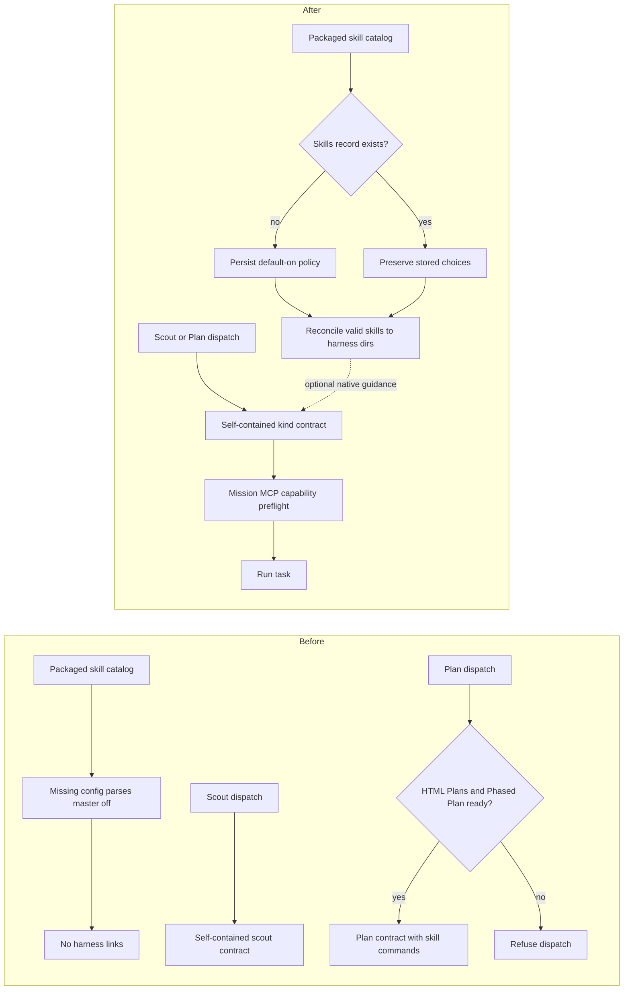

# Default-on, dispatch-optional skills

## Status

Approved on 2026-08-24. This document plans the change and does not implement it. The operator chose to stop after the approved plan, so no phased implementation plan or task was created.

## Outcome

Mission Control starts a truly unconfigured installation with every valid shipped skill enabled across every harness that declares a native skills directory. The first Plan or Scout dispatch therefore needs no Settings detour.

Skills remain optional guidance. No task kind is allowed to depend on a native skill being enabled, linked, reload-acknowledged, or even present in the packaged catalog. Scout already satisfies this rule. Plan adopts a self-contained task contract with the same independence while retaining its Mission MCP requirements for interactive review and phase task creation.

An operator can still turn the master switch off or disable individual skills. Those opt-outs remain durable across restarts, updates, catalog growth, and settings backup or restore.

## Verified current behavior

The repository investigation established these facts:

| Surface | Current behavior | Evidence |
|---|---|---|
| Fresh Skills config | A missing `app_config.skills` row parses as `enabled: false`, `skills: {}`. | [`src/shared/protocol.ts:2032`](../../../src/shared/protocol.ts), [`src/server/skills/config.ts:20`](../../../src/server/skills/config.ts) |
| Installation timing | The app package includes `skills/**/*` as plain files. The daemon first reconciles links after opening SQLite; the installer does not seed Skills settings. | [`electron-builder.yml:21`](../../../electron-builder.yml), [`src/server/index.ts:96`](../../../src/server/index.ts) |
| Native destinations | The reconciler targets Claude, Codex, and Pi through harness declarations, using only `mission-` and legacy `fleet-` symlinks it owns. | [`src/shared/harness-capabilities.ts:458`](../../../src/shared/harness-capabilities.ts), [`src/server/skills/reconcile.ts:296`](../../../src/server/skills/reconcile.ts) |
| Catalog | Five skills ship: HTML Plans, HTML Report, Phased Plan, Pull Request, and Retro. | [`skills/`](../../../skills) |
| Scout delivery | Scout embeds its report contract in the delivered prompt and is tested with Skills globally off. It does not require HTML Report. | [`src/server/scouts/prompt.ts:10`](../../../src/server/scouts/prompt.ts), [`e2e/specs/scout-archive.spec.ts:86`](../../../e2e/specs/scout-archive.spec.ts) |
| Plan delivery | Plan points at HTML Plans and Phased Plan. The route, backlog launch, dispatcher, and live-session assignment refuse when those skills cannot be invoked. | [`src/server/plans/prompt.ts:8`](../../../src/server/plans/prompt.ts), [`src/server/plans/skills.ts:14`](../../../src/server/plans/skills.ts), [`src/server/tasks.ts:2296`](../../../src/server/tasks.ts) |
| Other skill gates | Pull Request and Retro use the separate Session Action `requiredSkillId` contract. They gate an explicit action or retro follow-up rather than a general task kind. | [`src/server/workflows/builtin-session-actions.ts:30`](../../../src/server/workflows/builtin-session-actions.ts), [`src/server/retro.ts:390`](../../../src/server/retro.ts) |
| Tool requirements | Scout still requires `submit_scout_artifacts`; Plan still requires `request_plan_decisions` and `create_task`. These are verified Mission MCP capabilities, not native skills. | [`src/server/mission-mcp.ts:97`](../../../src/server/mission-mcp.ts) |

## Product rules

1. A native skill can improve how an agent performs relevant work, but no ordinary task kind can make installation of that skill a launch condition.
2. The shipped default is opt-out: a new Skills configuration has the master switch on and treats valid catalog rows as enabled.
3. A stored operator choice always wins over a later default. Explicit master-off and per-skill-off states are never reset by app startup or update.
4. Default initialization occurs in the daemon, which owns SQLite and link reconciliation. The packaging or installer layer remains a file-delivery mechanism only.
5. Mission MCP requirements remain fail-closed. Removing a native-skill dependency must not let a Plan launch without its human decision channel or let a Scout launch without report submission.
6. The skills catalog remains machine-wide. Default-on reaches native harness sessions the app did not launch, so Settings and documentation continue to state that blast radius plainly.

## Proposed design

### 1. Represent a durable catalog default separately from row overrides

`SkillsConfigSchema` gains a setting such as `defaultSkillEnabled`.

- Existing stored configurations parse the new field as `false`. This preserves the old sparse-map meaning on upgrade: ids absent from an old map stay off.
- A truly unconfigured installation is initialized with `enabled: true`, `defaultSkillEnabled: true`, and an empty override map.
- A row resolves through one shared helper: an explicit boolean in `skills[id]` wins, otherwise the catalog default applies.
- Turning a default-on row off stores `false`; turning it back on may store `true` or remove the override if the patch contract gains an explicit reset operation. The implementation should choose one canonical representation and test concurrent dashboard patches against it.
- The master switch remains independent. Turning it off removes all owned links but keeps the catalog default and row overrides, so turning it back on restores the same selection.

This field avoids two unsafe shortcuts. Changing only the schema master default would still enable no rows. Treating every missing map key as on would reinterpret existing sparse maps and automatically install skills after a corrupt config was mistaken for a missing one.

### 2. Initialize only a truly absent Skills record

A Skills-owned read path distinguishes:

- no `app_config.skills` row;
- a present, valid row;
- a present row with invalid JSON or invalid schema.

Only the first state receives the new default. The second is preserved exactly. The third fails closed, installs nothing new, and produces a bounded Settings problem instead of being treated as a fresh install.

Initialization runs at daemon startup before ordinary `reconcileSkills()`:

1. The read path detects a truly absent row.
2. The Skills config owner persists the default intent; installer code and direct route-shaped writes do not.
3. Reconciliation links the valid parsed catalog into every distinct declared harness directory.
4. The generation watermark moves only when the filesystem actually moves.
5. The current safe crash direction remains: if intent is persisted before all links exist, the next startup heals the disk from that intent.

An unreadable catalog must never be treated as empty. A malformed new entry is not auto-linked merely because its directory exists. Explicitly enabled legacy entries remain protected from accidental unlinking when the narrow catalog parser cannot read their frontmatter.

### 3. Make effective state the reconciler's single source of truth

Every current explicit-`true` scan resolves through the same effective selection for these consumers:

- `desiredSkillIds`;
- preflight blockers and patch refusal scoping;
- startup reconciliation;
- drift reporting;
- `/api/skills` row projection;
- master-toggle touched ids;
- reload generation changes;
- Settings backup capture and restore.

The effective set must be catalog-aware. For an id with no override, the default applies only to a successfully parsed catalog entry. For an explicit historical `true`, the existing `catalog.present` protection continues to prevent a parser limitation from uninstalling a working native skill.

New catalog fields join the automatic settings backup registry. An older snapshot with no catalog-default field restores the legacy `false` meaning. Derived `generation` and `generationAt` remain outside logical setting payloads.

### 4. Replace Plan's skill pointer with a self-contained task contract

`planContractAppendix` carries the minimum complete procedure a Plan task follows regardless of Skills settings:

- this is planning work, not implementation;
- the Markdown source belongs at `docs/plans/<name>/plan.md` and a self-contained offline `plan.html` belongs beside it;
- the rendered page is opened or surfaced for human review;
- flow changes between major components are represented in the source and rendered as inline SVG in the page;
- every plan review calls `request_plan_decisions`, with all open choices and the phased implementation follow-up last;
- submitted choices are resolved into the source and the page is regenerated;
- if phasing is selected, repository-compatible phase files and a phased index are written beside the plan, published, and scheduled through `create_task` with direct dependencies and `dependsOnCurrentSession: true`;
- a dismissal stops the workflow;
- the plan files land through the ordinary pull-request path so task pointers can resolve on the default branch.

The appendix stays compact and aligns its required paths, tools, decision ids, offline rendering properties, publication gate, and scheduling dependencies with the two planning skills in tests. This follows the existing Scout pattern: one task-kind contract owns what must happen, while an enabled native skill remains richer optional guidance.

No skill command is conditionally injected. When skills are enabled, each harness's native loader already exposes their trigger descriptions to the model. Plan delivery remains sufficient when the catalog is disabled, missing, malformed, drifted, or awaiting a live reload.

### 5. Remove Plan-only skill gates from every delivery seam

The plan-specific requirement owner and its plumbing are removed:

- `src/server/plans/skills.ts` is deleted;
- the manual dispatch route preflight is removed;
- the backlog dispatch preflight is removed;
- dispatcher launch resolution and its injected test seam are removed;
- live-session assignment resolution and reload-watermark refusal are removed;
- `PlanSkillInvocations`, Plan skill ids, and `TaskContractInputs.planSkills` are removed;
- `withTaskKindContract` composes a Plan contract without extra inputs.

The plan kind continues to contribute `request_plan_decisions` and `create_task` through `kindMissionMcpRequirement`. The existing bundle handshake still refuses a missing or stale Mission MCP implementation before an agent spawns.

### 6. Preserve explicit Session Action skill gates

`requiredSkillId` remains for explicit Session Actions and the built-in Pull Request and Retro actions. Those are separately authored procedure contracts with separate completion proofs, not ordinary task-kind dispatch requirements. Removing them would require making each action self-contained, changing workflow snapshots, retro runner selection, Library authoring, and action delivery failure states. That broader redesign is outside this plan.

### 7. Update the product surface and documentation

Skills Settings copy states that shipped catalog skills start enabled, remain machine-wide, and can be disabled globally or by row. The API already supplies row state; the panel renders every row checked on a fresh daemon without inventing client defaults.

Documentation updates cover at least:

- `README.md`;
- `docs/skills-and-settings.md`;
- `docs/dispatch-and-backlog.md`;
- configuration and backup documentation if the persisted setting shape changes.

The current statements that Skills are opt-in and that Plan requires HTML Plans and Phased Plan are removed. The distinction between optional native skills and required Mission MCP tools remains.

## Flow change

Today, installation leaves the catalog inactive. Scout carries its own contract, while Plan must resolve two native skills before it can launch. After the change, startup creates a durable default-on intent only for an unconfigured Skills record. Both Scout and Plan carry self-contained contracts; enabled skills sit beside those contracts as optional guidance.



## Edge-case contract

| Case | Required result |
|---|---|
| Truly absent Skills row | Initialize the approved default once, persist it, and reconcile all valid shipped skills. |
| Existing stored master off | Preserve off. Do not reinitialize on startup or update. |
| Existing sparse legacy map | Preserve absent ids as off through the legacy catalog-default value. |
| Future valid catalog skill | Follow the approved catalog-growth policy without rewriting explicit false overrides. |
| Corrupt JSON or schema-invalid stored row | Fail closed, do not treat it as fresh, and surface a bounded problem. |
| Catalog directory unreadable | Do not unlink live skills or finalize an empty default selection. Retry on later startup. |
| New malformed `SKILL.md` | Report the catalog problem and do not auto-link that new entry. |
| Previously explicit-on skill becomes unparsable | Preserve its link while the directory still exists, matching current parse-failure safety. |
| Skill removed from catalog | Remove its owned link. Preserve explicit historical intent for a possible return; do not wedge the master switch. |
| Foreign `mission-<id>` or `fleet-<id>` path | Never replace or remove it. Report the exact path and keep the default intent recoverable. |
| One destination is unwritable | Preserve intent, report per-directory drift, and retry; do not claim every harness is current. |
| Duplicate harness destinations | Reconcile the physical directory once, as today. |
| Existing live Claude or Pi session | Keep generation and verified-idle reload rules; sessions started after the change owe no reload. |
| Existing live Codex session | Let its native directory watcher observe the links; do not count it as waiting for a typed reload. |
| Isolated `MISSION_HOME`, test, or demo daemon | Keep all destinations inside the isolated home and never touch the operator's real directories. |
| Settings backup from an older build | Restore legacy opt-in meaning unless the snapshot explicitly carries the new default-on field. |
| Plan with master off or planning rows off | Launch and deliver the complete Plan contract. Do not read Skills config during task-kind preflight. |
| Plan with catalog missing or links drifted | Launch under the same rule; optional skill availability cannot affect the task. |
| Plan without Mission MCP tools | Continue to refuse before spawn with the existing tool-specific reason. |
| Scout with HTML Report off | Continue to run and submit its report, preserving existing behavior. |
| Pull Request or Retro action | Follow the approved required-skill scope decision. |

## Tests and verification

### Focused unit and contract coverage

- Coverage in `test/skills-config.test.ts` proves a truly absent row initializes master-on, resolves every valid catalog row on, links every declared harness directory, and bumps the generation only for actual disk changes.
- Regression cases cover a stored explicit-off config, a sparse legacy config, future catalog growth, explicit false overrides, unreadable and malformed catalogs, foreign paths, partial I/O, corrupt stored config, idempotent restart, and restoration of master selection.
- `test/skills-reconcile.test.ts` and `test/skills-multi-harness.test.ts` continue to cover real-directory guards, deduplicated destinations, prefix ownership, old-prefix cleanup, and isolated-home behavior.
- Backup coverage and restore tests include the new setting field and old-snapshot behavior.
- `test/plan-prompt.test.ts` proves both delivery seams compose a self-contained contract without Skills inputs, the contract agrees with the optional skills on paths and tool ids, and no route, dispatcher, or task-manager plan skill gate remains.
- Mission MCP tests prove Plan still requires and pre-approves `request_plan_decisions` and `create_task`.
- Scout contract tests remain unchanged except where fresh default-on setup requires an explicit master-off fixture.

### Browser coverage

Browser coverage conforms to the repository's E2E contract documented in [`e2e/README.md`](../../../e2e/README.md) and proves that:

1. starts a fresh daemon and shows the Skills master plus all valid catalog rows checked in Settings;
2. explicitly turns Skills off, dispatches a Plan through the real form, and observes the self-contained contract in the fake agent's conversation with no refusal;
3. keeps the existing skills-off Scout report and archive proof;
4. verifies a Plan still receives the interactive decision and scheduling tool names;
5. verifies explicit operator opt-outs survive a daemon restart if the fixture supports restart without widening the test substantially.

Every agent binary remains faked, selectors use roles, labels, or placeholders, and no `data-testid` is added.

### Required commands

Verification comprises the focused files with the repository preload and the full gates because the change affects persisted settings, startup, dispatch, the browser, build artifacts, and package content:

```sh
node --test --import ./test/setup-state.mjs --import tsx test/skills-config.test.ts
node --test --import ./test/setup-state.mjs --import tsx test/skills-reconcile.test.ts
node --test --import ./test/setup-state.mjs --import tsx test/skills-multi-harness.test.ts
node --test --import ./test/setup-state.mjs --import tsx test/plan-prompt.test.ts
node --test --import ./test/setup-state.mjs --import tsx test/settings-backup-coverage.test.ts
node --test --import ./test/setup-state.mjs --import tsx test/settings-restore.test.ts
npm run typecheck
npm run lint
npm test
npm run build
npm run smoke
npm run test:e2e
```

On macOS under the Codex seatbelt, Electron-bearing test commands require the repository's scoped outside-sandbox approval. Build precedes smoke and E2E.

## Non-goals

- Native harness skill discovery and the single installation mechanism remain unchanged.
- Catalog files are not copied into user directories; owned symlinks and current prefix safety remain.
- The master switch and per-skill controls remain.
- Mission MCP bundle verification and task-kind tool requirements remain fail-closed.
- No route, warning, workflow default, or hidden installer precondition makes skills mandatory.
- The Scout archive contract, Plan archive capture, task completion boundaries, and phased task dependency semantics remain unchanged except where the self-contained Plan text describes existing behavior.
- Production, signing, release, and update infrastructure stay outside this work. The package already includes the catalog correctly.

## Approved decisions

| Decision | Selection | Consequence |
|---|---|---|
| Catalog growth | Enable future skills by default. | Default-on is a durable policy. A future valid catalog skill is enabled unless the operator explicitly opts it out. |
| Existing unconfigured installations | Enable on next start. | A truly absent Skills row adopts the default on the next daemon start. Any stored choice is preserved. |
| Required-skill scope | Task kinds only. | Plan and Scout remain independent of native skills. Explicit Pull Request, Retro, and user-authored Session Action gates remain. |
| Implementation follow-up | Stop after this plan. | Do not invoke phased planning and do not create implementation tasks from this session. |

## Completion criteria

- A fresh unconfigured daemon presents and installs every valid shipped skill as enabled across all declared harness destinations.
- Stored opt-outs and legacy sparse configurations are preserved across startup, update, and restore.
- A Plan and a Scout can launch with Skills globally off and complete their task-kind contracts without native skill installation.
- Plan still fails closed when its required Mission MCP tools are unavailable.
- All filesystem ownership, catalog-read safety, generation, reload, isolated-home, backup, documentation, and UI contracts above are covered and green.
