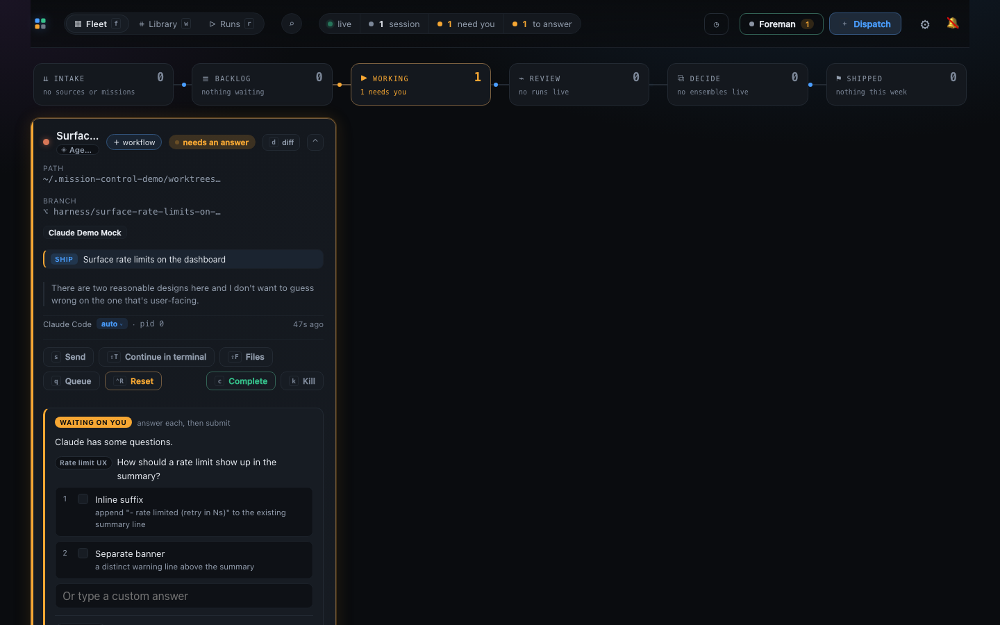
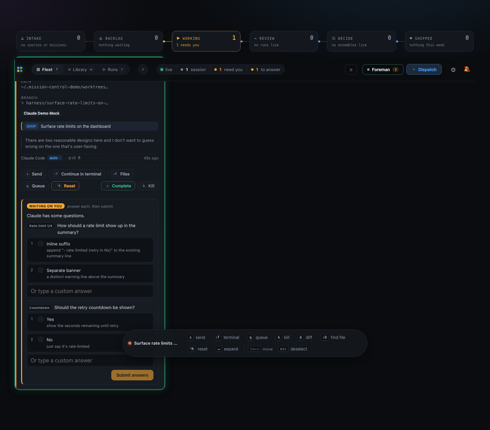
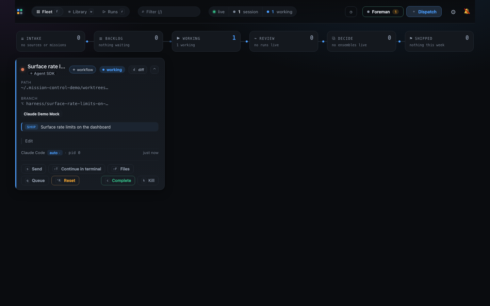
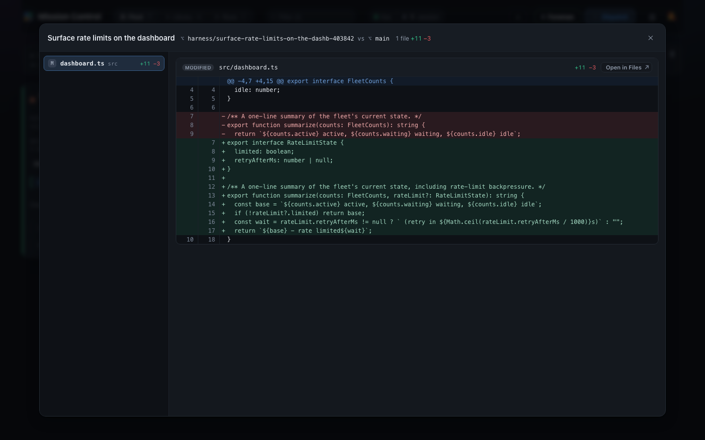

# Phase 1 verification evidence

Committed alongside the plan (the same pattern `plan.html`/`phased-plan.html` already use)
so the review process can see actual output and actual screenshots as part of the diff,
rather than narration referencing them. Every command below was re-run fresh against the
PR's final state to produce the output quoted here.

## 1. `npm run demo -- --check`

The phase file's own CI-shaped launcher smoke test: boot, assert identity and isolation,
shut down, exit 0.

```
$ npm run build
[... esbuild output omitted, exit 0 ...]

$ node scripts/demo/launch.mjs --check --fresh
[demo] --fresh: removing /Users/jordan.mance/.mission-control-demo
[demo] state root: /Users/jordan.mance/.mission-control-demo
[demo] booting the daemon on port 7417...
[demo] daemon is up (pid 51731), isolated under /Users/jordan.mance/.mission-control-demo
[demo] --check: identity and isolation assertions passed
[demo] --check: ok
$ echo $?
0
```

## 2. `fake-pi.mjs` standalone, verified against pi's own product parser

`pi` has no control wire, so the transcript file it writes is the only thing to check. Ran
the player directly with a real `--session-id` and prompt against a throwaway repo
checkout, then imported `piToMessage`/`computePiSessionActivity` read-only from
`src/server/harness/pi/{transcript,meta}.ts` (unmodified - this only reads them) to parse
the result the same way the daemon would.

```
$ MISSION_DEMO_SCENARIO_DIR=scripts/demo/scenarios \
    node scripts/demo/fake-pi.mjs --session-id 99999999-8888-7777-6666-555555555555 \
    "Fix the flaky retry test - it seems to race with abort"
$ echo $?
0
```

The real edit it made, diffed against the original file:

```diff
--- src/retry.ts (before)
+++ src/retry.ts (after the scenario ran)
@@ -4,16 +4,27 @@
   signal?: AbortSignal;
 }

-/** Retry an async operation with a fixed delay between attempts. */
+/** Retry an async operation with a fixed delay between attempts, honoring `signal`. */
 export async function retry<T>(fn: () => Promise<T>, opts: RetryOptions): Promise<T> {
   let attempt = 0;
   for (;;) {
+    if (opts.signal?.aborted) throw new Error("retry aborted");
     try {
       return await fn();
     } catch (err) {
       attempt += 1;
       if (attempt >= opts.retries) throw err;
-      await new Promise((resolve) => setTimeout(resolve, opts.delayMs));
+      await new Promise<void>((resolve, reject) => {
+        const timer = setTimeout(resolve, opts.delayMs);
+        opts.signal?.addEventListener(
+          "abort",
+          () => {
+            clearTimeout(timer);
+            reject(new Error("retry aborted"));
+          },
+          { once: true },
+        );
+      });
     }
   }
 }
```

And the resulting transcript, parsed by the actual product code (`tsx` script that imports
`piToMessage`/`computePiSessionActivity` directly, run once for this check and not
committed - the import lines are quoted below so the check is reproducible):

```js
import { piToMessage } from "./src/server/harness/pi/transcript.ts";
import { computePiSessionActivity } from "./src/server/harness/pi/meta.ts";
```

```
=== piToMessage (conversation renderer) ===
user | Fix the flaky retry test - it seems to race with a |
assistant | Let's look at the retry helper first - that's the  |
assistant |  | Bash
assistant | Found it: the backoff timer keeps running after th |
assistant |  | Edit
assistant |  | Edit
assistant |  | Bash
assistant | Both tests pass now. The retry loop no longer fire |
assistant |  | TodoWrite
=== computePiSessionActivity (idle/working signal) ===
{ state: 'idle', lastActivity: 1785877965674 }
```

Full conversation with tool chips, and a correct `idle` report once the scenario finished -
parsed by pi's own real product code, not this player's own idea of what it wrote.

## 3. The Foreman orphan-process fix: a committed regression test

`scripts/demo/launch.test.mjs` unit-tests `createShutdownGate` - the exact site of both the
original leak (cleanup that only ran on one of several exit paths) and the race in that
fix's own first attempt (a losing caller's `process.exit` could still beat the winner's own
in-flight cleanup). Run with `node --test scripts/demo/launch.test.mjs`:

```
$ node --test scripts/demo/launch.test.mjs
✔ stop runs the cleanup (1.13375ms)
✔ two concurrent callers race for the SAME stop: exactly one runs cleanup, exactly one is told it lost (21.419542ms)
✔ a stop claimed after cleanup already finished is told it lost, and does not re-run cleanup (0.355084ms)
✔ a caller that loses the race never sees onStop's return value or throws on its behalf (31.562458ms)
ℹ tests 4
ℹ suites 0
ℹ pass 4
ℹ fail 0
ℹ cancelled 0
ℹ skipped 0
ℹ todo 0
ℹ duration_ms 112.185875
```

That test exercises the coordination logic in isolation. The two real failure modes it was
extracted from were also re-verified end to end against the actual launcher (a throwaway
copy with Foreman's spawn replaced by a command that fails immediately, or after an 8s
delay so a signal can be sent mid-wait - not committed, reproducible from the description):

```
=== Foreman crashes on start ===
[demo] daemon is up (pid 47363), isolated under /Users/jordan.mance/.mission-control-demo
[demo] starting the real Foreman against the demo daemon...
[demo] Foreman exited before acquiring its lease (code 1, signal null):
[demo] foreman-failed: stopping (state root kept at /Users/jordan.mance/.mission-control-demo)
$ echo $?
1
$ lsof -i :7417
port 7417 is free - no leak

=== SIGINT sent mid-lease-wait ===
[demo] daemon is up (pid 49410), isolated under /Users/jordan.mance/.mission-control-demo
[demo] starting the real Foreman against the demo daemon...
(SIGINT sent here)
[demo] SIGINT: stopping (state root kept at /Users/jordan.mance/.mission-control-demo)
[demo] Foreman exited before acquiring its lease (code null, signal SIGTERM):
$ lsof -i :7417
port 7417 is free - no leak
$ echo $? # of the launcher process itself, after `wait`
0
```

## 4. The dashboard, driven live and screenshotted

Captured with a throwaway Playwright script (Chromium was already installed locally; not
committed, not under `e2e/`) against the real built dashboard and daemon at
`127.0.0.1:7417`, dispatching the `waiting-on-you` scenario end to end.

### Dispatch lands, and the question is already waiting

Seconds after `POST /api/tasks`, the Fleet board shows the card `WORKING`, flagged
**needs an answer**, titled `Surface rate limits on the dashboard` - the scenario player's
answer to the real task-titler call, not the fallback heuristic.



### Both scripted questions, rendered as a real form

The `ask` step raised a genuine `AskUserQuestion` control request; the dashboard renders it
as an actual selectable form with a Submit button, not a static description.



### Submitting the form resumes the turn for real

Clicking through the real options and pressing **Submit answers** sent a real
`POST /api/sessions/:id/submit-options`. The card flips back to working with a genuine
`Edit` tool chip - the scenario continuing exactly where the question paused it.



### The Diff view shows the actual edit

Once the scenario's remaining steps finished, the Diff view shows a real,
syntax-highlighted `+11 -3` against `src/dashboard.ts` - the exact content the scenario
script wrote into the cut git worktree, rendered by the product's own diff view against a
real merge base.


