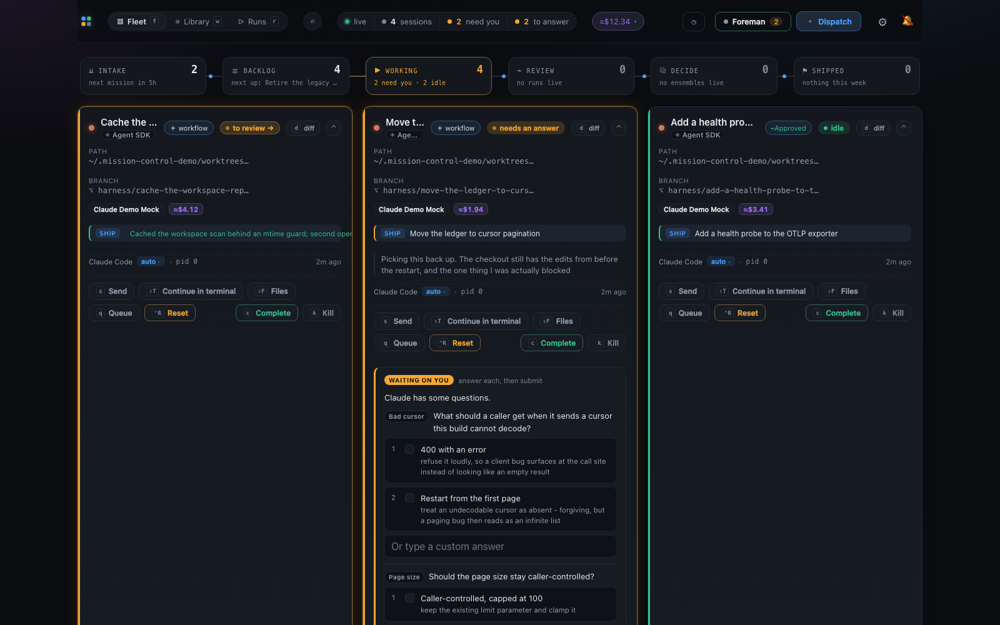
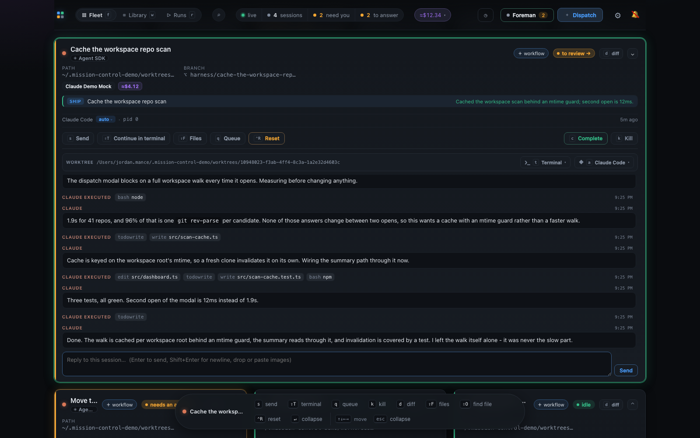
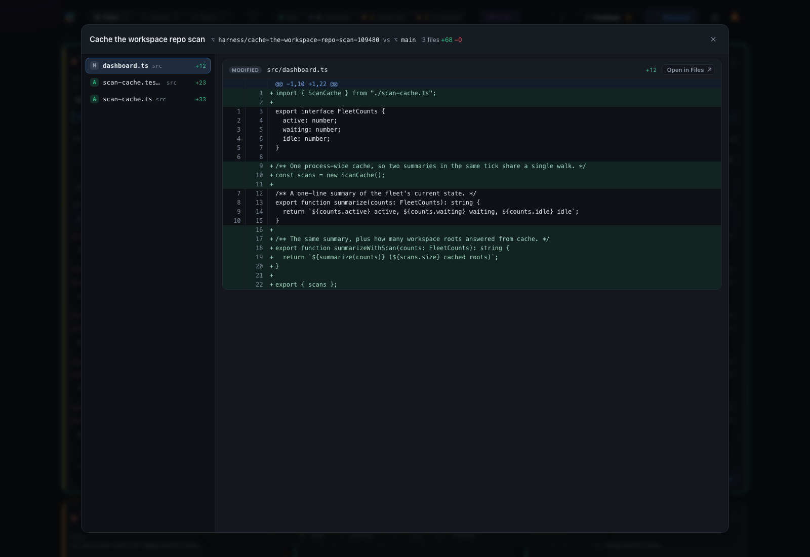
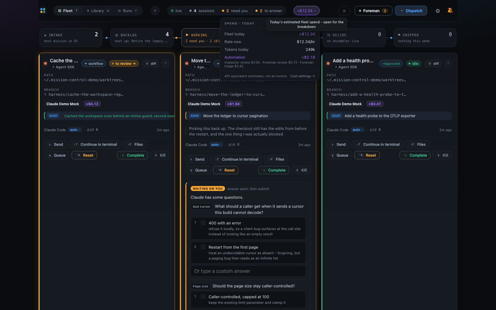
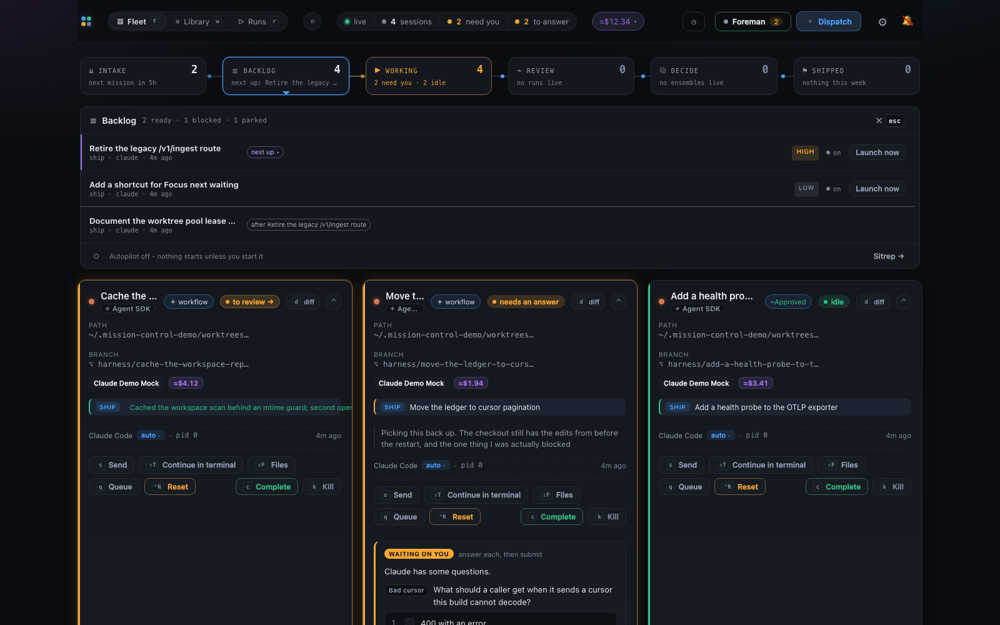
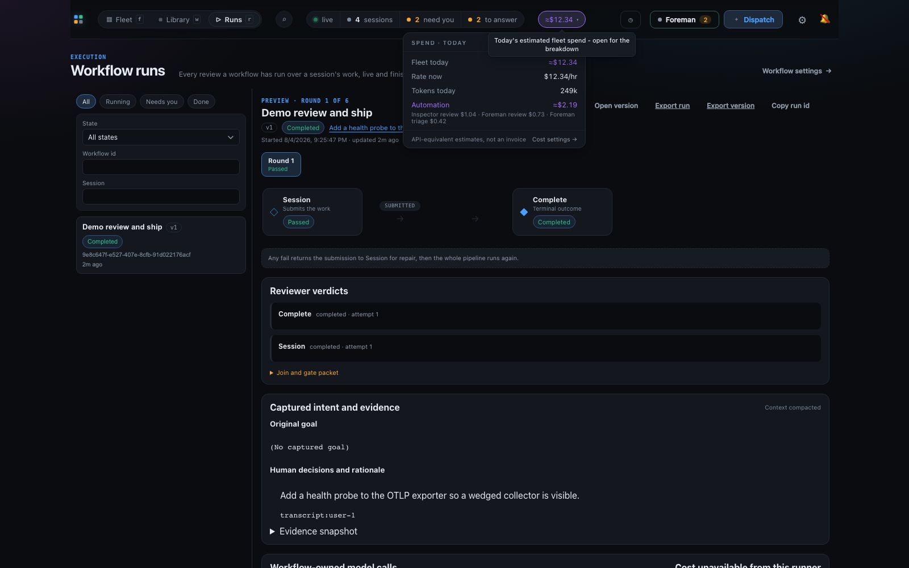
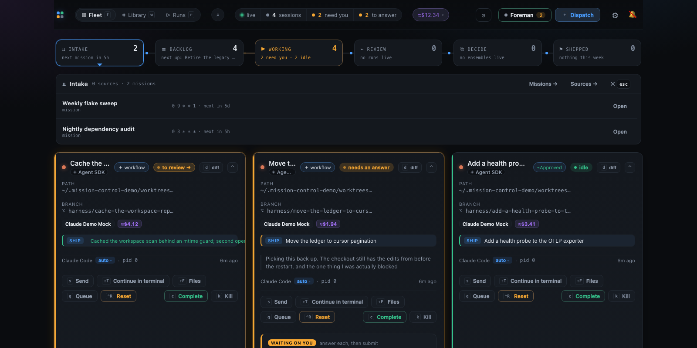

# Phase 2 verification evidence

Committed alongside the plan, the same pattern
[phase-1-verification.md](phase-1-verification.md) established, so a reviewer sees actual
output and actual screenshots as part of the diff rather than narration referencing them.

Every command below was run against this PR's final state. The dashboard screenshots were
taken with headless Chromium against the seeded demo daemon, so no browser opened on the
operator's machine and nothing extra landed in the repo to produce them.

## 1. `npm run demo -- --fresh` - the full seed

Run with `--no-foreman` (Foreman spends real tokens, and this phase changes nothing about
that path) and `--no-open` (so the scripted inspection below did not fight a browser).

```
$ npm run demo -- --fresh --no-foreman --no-open --port 7431
[demo] --fresh: removing /Users/jordan.mance/.mission-control-demo
[demo] state root: /Users/jordan.mance/.mission-control-demo
[demo] --fresh: seeding a lived-in fleet (this replays real work - a few minutes)
[seed] backlog: Retire the legacy /v1/ingest route
[seed] backlog: Document the worktree pool lease protocol (waiting on Retire the legacy /v1/ingest route)
[seed] backlog: Batch the SSE session_upsert frames (parked)
[seed] backlog: Add a shortcut for Focus next waiting
[seed] backlog: Try the experimental cursor renderer (cancelled)
[seed] dispatched: Cache the workspace repo scan
[seed] dispatched: Stop the token refresh double-fetch
[seed] dispatched: Move the ledger to cursor pagination
[seed] dispatched: Add a health probe to the OTLP exporter
[seed] raised a pending plan-decisions review on "Cache the workspace repo scan"
[seed] resolved two reviews on "Stop the token refresh double-fetch"
[seed] persona: Demo test-first reviewer
[seed] workflow run completed for "Add a health probe to the OTLP exporter"
[seed] schedule: Nightly dependency audit (0 3 * * *)
[seed] schedule: Weekly flake sweep (0 9 * * 1)
[seed] posted 37 telemetry exports through the ingest routes
[seed] stopping the daemon so its sessions suspend...
[demo] seeded: 9 tasks, 4 sessions, 1 pending / 2 resolved reviews, 1 workflow run(s), 2 schedule(s), $12.34 today
[demo]   session "Cache the workspace repo scan" (idle) in /Users/jordan.mance/.mission-control-demo/worktrees/10948023-...
[demo]   session "Stop the token refresh double-fetch" (idle) in /Users/jordan.mance/.mission-control-demo/worktrees/fc973747-...
[demo]   session "Move the ledger to cursor pagination" (waiting on a question) in /Users/jordan.mance/.mission-control-demo/worktrees/3f2471d7-...
[demo]   session "Add a health probe to the OTLP exporter" (idle) in /Users/jordan.mance/.mission-control-demo/worktrees/40bfff78-...
[demo] booting the daemon on port 7431...
[demo] daemon is up (pid 46456), isolated under /Users/jordan.mance/.mission-control-demo
[demo] --no-foreman: skipping the Foreman worker
[demo] dashboard: http://127.0.0.1:7431
```

## 2. The restored fleet, read back through the routes the dashboard reads

The point of these reads is that they come from a **different daemon process** than the one
that seeded: the seeder stopped, and this is what the next boot restored.

```
$ curl -s $B/api/sessions | ...
- Cache the workspace repo scan
    state=idle dialog=none reviews=1 cost=$4.12
- Stop the token refresh double-fetch
    state=idle dialog=none reviews=0 cost=$2.87
- Move the ledger to cursor pagination
    state=working dialog=driver reviews=0 cost=$1.94
- Add a health probe to the OTLP exporter
    state=idle dialog=none reviews=0 cost=$3.41
```

`dialog=driver` on the pagination session is the waiting-on-you card: it was suspended
mid-`ask`, kept its `turnInProgress` bit, and the restore sent it the continuation prompt
that `resume-continuation.json` answers by asking again.

```
$ curl -s $B/api/tasks | ... group by status
{
 "backlog": ["Retire the legacy /v1/ingest route",
             "Document the worktree pool lease protocol [blocked]",
             "Batch the SSE session_upsert frames [parked]",
             "Add a shortcut for Focus next waiting"],
 "running": ["Stop the token refresh double-fetch",
             "Move the ledger to cursor pagination",
             "Add a health probe to the OTLP exporter"],
 "done":      ["Cache the workspace repo scan"],
 "cancelled": ["Try the experimental cursor renderer"]
}

$ curl -s $B/api/reviews | ...
- [pending] plan-decisions: How should the scan cache invalidate?

$ curl -s $B/api/sessions/<token-refresh>/resolved-reviews | ...
[approved] Collapse concurrent refreshes onto one in-flight promise
[answered] What should an expired refresh token do?

$ curl -s "$B/api/workflow-runs?limit=5" | ...
workflowName="Demo review and ship" workflowVersion=1 status="completed" phase="complete"

$ curl -s $B/api/schedules | ...
- Weekly flake sweep      0 9 * * 1
- Nightly dependency audit 0 3 * * *
```

The cost figures, read off the SSE `snapshot` frame - the only place `fleetCost` exists, and
exactly what the topbar chip renders:

```
fleetCost: {
 "estimatedCostToday": 12.34,
 "estimatedBurnPerHour": 12.34,
 "tokensToday": 249400,
 "automation": {
  "estimatedCostToday": 2.19,
  "tokensToday": 236400,
  "roles": [
   { "role": "inspector:review", "costUsd": 1.04, "tokens": 82100, "runs": 1 },
   { "role": "foreman:review",   "costUsd": 0.73, "tokens": 78800, "runs": 1 },
   { "role": "foreman:triage",   "costUsd": 0.42, "tokens": 75500, "runs": 1 }
  ]
 }
}
counts: sessions=4 tasks=9 reviews=1 runs=1 schedules=2
```

## 3. Real dirty worktrees, real diffs

`git status` in each seeded worktree - these are ordinary checkouts, and the edits are the
scenario players' own `editFile` steps:

```
$ for w in ~/.mission-control-demo/worktrees/*/; do git -C "$w" status --porcelain; done
10948023-...:  M src/dashboard.ts  ?? src/scan-cache.test.ts  ?? src/scan-cache.ts
3f2471d7-...:  M src/dashboard.ts  ?? src/cursor.ts
40bfff78-...:  M src/dashboard.ts  ?? src/exporter-health.test.ts  ?? src/exporter-health.ts
fc973747-...:  M src/retry.test.ts  M src/retry.ts
```

And the daemon's own git-derived Diff and Files views over one of them:

```
$ curl -s "$B/api/sessions/<health-probe>/diff"
ok=true filesChanged=3 +78/-3 branch=harness/add-a-health-probe-to-the-otlp-e-40bfff patchBytes=3830

$ curl -s "$B/api/sessions/<health-probe>/files"
entries=6: README.md, src/dashboard.ts, src/exporter-health.test.ts,
           src/exporter-health.ts, src/retry.test.ts, src/retry.ts
```

## 4. First paint, screenshotted



The Line reads `INTAKE 2 · BACKLOG 4 · WORKING 4 (2 need you · 2 idle)`, the topbar carries
`4 sessions · 2 need you · 2 to answer · ≈$12.34`, and the middle card is holding a real
two-question form an operator can answer.



The restored conversation, which is the claim most worth photographing: this session's
process was killed and relaunched by a later daemon, and the whole history came back - prose
turns plus `bash node`, `todowrite`, `write src/scan-cache.ts`, `edit src/dashboard.ts`,
`bash npm` chips - with the `SHIP` outcome line and a live composer.







`2 ready · 1 blocked · 1 parked`, with the blocked task naming its blocker
("after Retire the legacy /v1/ingest route").





## 5. `npm run demo -- --check`

The reduced seed, a reboot over it, and the residue asserted through the same routes. Runs
against its own throwaway root so it cannot bulldoze a curated demo.

```
$ npm run demo -- --check --port 7431
[demo] --check: throwaway state root /Users/jordan.mance/.mission-control-demo-check
[seed] backlog: Retire the legacy /v1/ingest route
[seed] dispatched: Move the ledger to cursor pagination
[seed] raised a pending plan-decisions review on "Move the ledger to cursor pagination"
[seed] posted 9 telemetry exports through the ingest routes
[seed] stopping the daemon so its sessions suspend...
[demo] --check: reduced seed complete, rebooting over it
[demo] --check: ok   tasks were seeded (2)
[demo] --check: ok   a suspended session came back as a card (1)
[demo] --check: ok   a pending review survived the restart
[demo] --check: ok   the cost ledger has priced rows (4.12)
[demo] --check: identity, isolation and seed assertions passed
[demo] --check: seeded 2 tasks, 1 sessions, 1 pending / 0 resolved reviews, 0 workflow run(s), 0 schedule(s), $4.12 today
[demo] --check: ok
$ echo $?
0
```

## 6. The player's resume behaviour, verified standalone

The two player fixes this phase depends on, checked without a daemon in the way. First run
writes a transcript; the second is given `--resume=<that id>`.

```
$ echo '{"type":"user",...,"content":"probe please"}' | node scripts/demo/fake-claude.mjs
{"type":"system","subtype":"init","session_id":"d661cf2a-8b52-4f0c-8485-c0bffd004079",...}

$ cat <home>/.claude/projects/<cwd>/d661cf2a-....jsonl
{"type":"user","uuid":"user-1",...,"content":"probe please"}

$ echo '{"type":"user",...,"content":"probe again"}' \
    | node scripts/demo/fake-claude.mjs --resume=d661cf2a-8b52-4f0c-8485-c0bffd004079
{"type":"system","subtype":"init","session_id":"d661cf2a-8b52-4f0c-8485-c0bffd004079",...}
                                               ^ the SAME id, not a fresh uuid

$ cat <home>/.claude/projects/<cwd>/d661cf2a-....jsonl
{"type":"user","uuid":"user-1",...,"content":"probe please"}
{"type":"user","uuid":"user-2",...,"content":"probe again"}
  ^ appended, not truncated; and uuid numbering continued rather than reusing user-1

$ find <home> -name '*.jsonl' | wc -l
1
  ^ one file, so the card's derived transcript path still resolves to its own history
```

## 7. Isolation: the operator's real state was not touched

The demo's four transcripts landed under the demo `HOME`:

```
$ find ~/.mission-control-demo/.claude/projects -name '*.jsonl'
~/.mission-control-demo/.claude/projects/-Users-jordan-mance--mission-control-demo-worktrees-3f2471d7-.../ca6ba637-....jsonl
~/.mission-control-demo/.claude/projects/-Users-jordan-mance--mission-control-demo-worktrees-10948023-.../f510f729-....jsonl
~/.mission-control-demo/.claude/projects/-Users-jordan-mance--mission-control-demo-worktrees-40bfff78-.../9e8c647f-....jsonl
~/.mission-control-demo/.claude/projects/-Users-jordan-mance--mission-control-demo-worktrees-fc973747-.../b96034f2-....jsonl
  count: 4
```

Nothing under the operator's real state names the demo:

```
$ ls ~/.claude/projects | grep -i "mission-control-demo"
(no matches)

$ grep -rl "mission-control-demo" ~/.mission-control/
(no matches)
```

`~/.mission-control/harness.db` and `~/.claude` DID change mtime during the run, and the
attribution matters, so it was checked rather than waved away. Both are explained by two
processes that were live throughout and are not the demo:

- `lsof ~/.mission-control/harness.db` names pid 1540, a pre-existing real Mission Control
  daemon. The database's SIZE was unchanged across the whole run (3383296 bytes before and
  after).
- The newest `~/.claude/projects` entries are `-Users-jordan-mance-workspace-ai-harness` and
  a `/private/var/folders/...T` dir, which belong to the Claude Code session that did this
  work (pids 89210/89438, resuming from that same project dir).
- The one real project dir mentioning worktrees is
  `-Users-jordan-mance--mission-control-worktrees-c13cb236-...` - `~/.mission-control/worktrees`,
  the real daemon's own, not `~/.mission-control-demo/worktrees`.

## 8. Definition of done

```
$ npm run typecheck          # clean
$ npm run lint               # exit 0
$ npm test                   # tests 6000 | pass 6000 | fail 0
$ npm run build              # ok
$ npm run smoke              # [smoke] ok
$ npm run test:e2e           # 125 passed, 2 skipped
$ npm run demo -- --check    # [demo] --check: ok
```

CI agrees on a clean machine: `check (node 24)` and `check (node 26)` both pass on this
branch's head.

One note on the local suite, because a reader looking at intermediate output would otherwise
be misled. An earlier local run reported three failures, two of them with durations around
**16 minutes** for tests that normally take seconds. That was self-inflicted contention: two
`npm test` invocations and a `npm run demo -- --check` were running on the same machine at
once. Re-run alone, the suite is green and the worst offender
("a Manual binding blocks Straight to PR and a failed card write stays retryable") takes
**11s** rather than 938s. Nothing in this PR touches those code paths - it adds no `src/`
changes at all.

`test/demo-seed.test.ts` adds 19 cases over the seeder's pure half:

- **Scenario routing** for every seeded intent, including that none may fall through to the
  default. This caught a real bug during development - the health-probe task fell through and
  narrated a retry/abort fix - which is why a fourth seed scenario exists.
- **Every request body parsed with the daemon's OWN Zod schema** (`DispatchSchema`,
  `CreateScheduleSchema`, `CreatePersonaSchema`, `CreateWorkflowSchema`, `SpendReportSchema`),
  so a tightened schema fails here rather than as a wall of 400s during someone's demo. Plus
  the `timeUnixNano`-must-be-a-digit-string trap (a float there is silently dropped by
  `nanoString`, giving an empty cost chip) and the unique-`runId` requirement (the automation
  insert is `ON CONFLICT DO NOTHING`, so a duplicate silently drops a row).
- **`holdSignals` ordering**, pinned as ordering rather than by racing a real daemon - the same
  approach `scripts/demo/launch.test.mjs` takes with `createShutdownGate`. The leak it guards is
  the stale listener: the seed wires signals to its daemon for minutes, `main` then boots a
  second one, and a release that missed a handler would leave a signal stopping the daemon the
  operator is no longer looking at.

An interactive Ctrl-C reaches the seeder's daemon through the foreground process group anyway
(verified: interrupting a `--check` mid-flight left nothing listening on its port). `holdSignals`
makes that cleanup explicit and ordered, and covers the case the process group does not - a
signal sent to the launcher alone.
