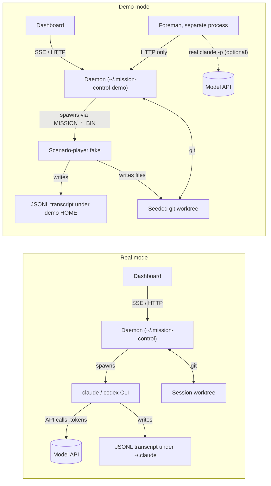

# Demo mode investigation (task: "Investigate Mission control preview mode")

Goal: a mode that makes the dashboard look and behave like a busy fleet - sessions
running, conversation history, diffs, files, workflows executing, prompts waiting,
and the ability to dispatch a task - without exercising a real agent harness or
spending tokens on sessions. Foreman is allowed to spend tokens. PR creation and
Inspector are out of scope.

First decision: do not call it "Preview". The word is taken three times over -
workflow Preview runs, `deliveryMode: "preview"` on bindings, and the
`/api/*/preview` compute-what-would-happen endpoints. Call it **Demo mode**.

## Decisions (submitted 2026-08-04 via Mission Control)

The open choices below were presented on the dashboard and resolved:

- **Build path: Phases A then B.** Launcher plus scenario-player fakes first,
  then the pre-seeded lived-in fleet.
- **Demo state: persistent `~/.mission-control-demo` with a `--fresh` flag** that
  rebuilds it from the seeder.
- **Foreman: run the real Foreman with the real `claude` bin** in its own
  environment, genuinely reasoning over the fake fleet.
- **Follow-up: create a phased implementation plan** from this document.

## What the investigation found

The dashboard is fed by four architecturally distinct sources, and a demo has to
satisfy all four:

| # | Source | Feeds | Fakeable by |
|---|---|---|---|
| 1 | SQLite (`<state dir>/harness.db`) | tasks, reviews, workflows, ensembles, schedules, queues, cost ledger | seeding rows |
| 2 | OS process sweep (never persisted) | terminal-session cards | not needed - use SDK-runtime sessions |
| 3 | JSONL transcript files under `$HOME` | the entire conversation view | writing JSONL + `HOME` override |
| 4 | Live git worktree (`git` subprocess per request) | Diff and Files views | a real seeded repo with real edits |

Three facts make this much cheaper than it looks:

1. **Nothing in `src/` calls a model API.** Every model interaction is a spawned
   CLI resolved through one chain (`resolveBinSpec` in `src/server/harness/bin.ts`:
   `MISSION_<AGENT>_BIN` and friends), and the SDK runtime honours the same chain
   (`sdk-deps.ts` pins `pathToClaudeCodeExecutable`). Redirecting three binaries
   closes every route to a paid call.
2. **State isolation already exists.** `MISSION_HOME` moves the DB, token, logs,
   and dispatch worktrees as a unit (`stateDir()` in `src/shared/harness-runtime.mjs`).
   `migrate-state.ts` is a no-op under an explicit override, and `db.ts` opens any
   older schema safely by design.
3. **`e2e/` is already a demo mode in all but name.** `e2e/fixtures/daemon.ts`
   boots the built daemon fully isolated; `fake-claude.mjs` speaks enough of the
   SDK control protocol to bind, run turns, hold turns open, and raise an
   `AskUserQuestion` card - and it writes the JSONL transcript file itself, which
   is the load-bearing trick (a fake that only wrote stdout gives a live card with
   a permanently empty conversation). The 24 specs are working recipes for
   dispatch, conversation, diff-to-files, driver questions, workflow runs, the
   Line, and the cost chip.

### The gaps between e2e's fakes and a convincing demo

- The fake emits no `Edit`/`Write`/`Bash`/`TodoWrite` tool blocks. The transcript
  parser already normalizes arbitrary `tool_use` blocks into tool chips, so this
  is purely fixture authoring in `fake-claude.mjs`.
- The fake writes no files. Diff and Files are git-derived on every request, so
  the scenario must actually write files into the dispatched worktree (the
  `diff-open-in-files` spec already does this from the test side).
- Replies are echoes (`"Mock reply to: ..."`), not a narrative. Needs a scenario
  script table instead of the sentinel switchboard.
- Turn attribution (foreman/workflow origin chips) is in-memory only
  (`src/server/injections.ts`), keyed by SHA-1 of turn text. Seeded histories will
  not carry origin labels; only live deliveries through real routes will.
- `fleetCost`, `lineSummary`, and `settingsStatus` are recomputed from
  `usage_ledger` rows and `app_config` blobs on every snapshot. Seed the rows, not
  the summaries.

### Non-negotiable isolation guards (all learned the hard way by e2e)

- `MISSION_POLL_MS=0` - discovery is NOT scoped by `MISSION_HOME`; left on, the
  demo daemon walks every process on the machine and adopts the operator's real
  sessions, Kill/Reset buttons included.
- `MISSION_POOL_REAP_MS=0` - the pool sweep is not scoped either and will reap
  shared treehouse worktrees.
- `HOME` must be overridden separately from `MISSION_HOME` - Claude transcript
  paths derive from `homedir()`.
- Distinct port plus the `/api/health` pid check, so a squatting real daemon never
  silently receives the demo's dispatches.
- With polling off, terminal sessions never appear: **a demo fleet is SDK-runtime
  sessions only** (set via `PUT /api/harnesses/config`). That is fine - SDK cards
  carry full conversations, menus as data, and answerable questions.

## The adopted path (with rejected alternatives noted)

### Option A - Demo launcher plus scenario-player fakes (adopted: phase 1, no `src/` changes)

A `scripts/demo/` launcher (`npm run demo`) that promotes the e2e fixture pattern
into an operator-facing tool:

1. Create (or reuse) the persistent demo state dir `~/.mission-control-demo`
   (decided; `--fresh` rebuilds it from the seeder), plus a demo `HOME`.
2. Write scenario-driven fake `claude`/`codex`/`pi` binaries derived from
   `e2e/fixtures/fake-*.mjs`.
3. Seed one or two real git repos (`git init` + commits) as the demo workspace;
   set `MISSION_WORKSPACE_DIRS` to them.
4. Boot the built daemon with the full isolation env block; flip session runtime
   to SDK; open the dashboard.
5. Start the real Foreman worker against the demo daemon (decided). Foreman is a
   separate HTTP-only process, so it is given the REAL `claude` bin in its own
   environment while the daemon keeps the fakes - Foreman then genuinely reasons
   about the fake fleet (the task explicitly allows Foreman tokens).

Upgrade the fake from echo to **scenario player**: a JSON script table mapping
dispatch intents to a paced sequence of turns - assistant text, `tool_use` blocks
(Edit/Write/Bash/TodoWrite), actual file writes into the worktree so Diff/Files
fill up, a held-open turn for the "working" state, an `AskUserQuestion` for the
"waiting on you" state, then `result`. Prompts waiting can also be raised through
`POST /mcp/reviews`; workflows by creating, publishing, binding, and submitting
through the real routes with Personas answering via the scripted `-p` fake.

Everything the operator sees is the real daemon, real routes, real SSE, real git -
only the model is scripted. Dispatching a task from the UI works for real.

Effort: roughly 1-2 days. Launcher is ~150 lines reusing `daemon.ts` patterns;
the scenario player is edits confined to the fake's `answer()`/`appendTurn()`.

#### The flow, before and after

The one load-bearing change is who sits behind the spawned agent binary. In real
mode the CLI reaches the model API and spends tokens; in demo mode the same spawn
resolves (via `MISSION_<AGENT>_BIN`) to a scenario player that writes the JSONL
transcript and the worktree files itself, and no path to a model API exists. The
dashboard, daemon, routes, SSE, and git stay exactly as they are. Foreman is the
one deliberate exception: a separate HTTP-only process that may keep the real
`claude` bin in its own environment.

### Option B - Pre-seeded lived-in state (adopted: phase 2)

A one-shot seeder that populates the demo state dir before boot, so the dashboard
opens onto a fleet that already looks busy instead of starting empty:

- SQLite rows: tasks in every status, resolved and pending reviews, workflow
  definitions/versions/runs/events, ensembles, schedules, `usage_ledger` rows for
  the cost chip, `app_config` blobs.
- `sdk_sessions` rows in `suspended` status so the daemon restores them at startup
  as resumable session cards without any process behind them.
- Pre-written JSONL transcripts with rich conversations under the demo `HOME`.
- Pre-seeded worktrees with uncommitted edits so Diff/Files are instantly full.

Effort: roughly 2-4 days. The fiddly parts are id consistency across tables,
transcript paths, and worktrees, plus verifying the suspended-restore path renders
what we want. Schema drift is absorbed by the daemon's own migrations, since it
opens older databases safely by design.

### Option C - First-class in-product demo mode (rejected)

Ship the fakes and seeder inside the app (`--demo` flag, Electron menu item, DEMO
badge). Rejected by the submitted build-path decision, and on the merits: it
touches controlled paths (harness registry, config, the Electron shell), carries
demo code in the product forever, and re-opens the exact isolation failure classes
the guards exist for. Revisit only if demos must be one click from the packaged
app for people without a checkout.

### Option D - Record and replay (deferred: optional phase 3)

Capture a real session's JSONL and git state once, replay it through the scenario
player with timing. Maximum realism, minimal authoring - but capture tooling and
transcript scrubbing are their own project. Natural phase 3 on top of A/B.

## Should we have a separate database?

Yes (decided) - as a **separate state dir**, not a second DB knob or a demo flag
in the real database. `MISSION_HOME` is the existing, tested isolation boundary
and it moves the DB, token, logs, and worktrees together, which is what a demo
actually needs (a separate DB alone would still share worktrees and the auth
token). The demo uses a persistent `~/.mission-control-demo` so a curated demo
survives restarts, with a `--fresh` flag that rebuilds it from the seeder. Never
point a demo at the real `~/.mission-control` - that is live operator state and
the schema is append-only.

## The plan as adopted

- **Phase 1 (Option A):** `scripts/demo/` launcher + scenario-player fakes, with
  the real Foreman (real `claude` bin) running against the demo daemon. Dispatch,
  conversation, working/waiting states, diffs, and files all work end-to-end in
  about a day or two of work, with zero production-code risk.
- **Phase 2 (Option B):** the seeder for an instantly lived-in fleet, plus two or
  three curated scenarios: "dispatch a task and watch it work", "answer a waiting
  prompt", "watch a workflow run advance".
- **Phase 3 (optional, not scheduled):** record/replay; revisit Option C only if
  demos must run from the packaged app.
