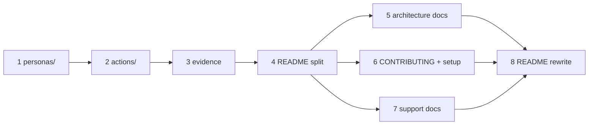

# Docs overhaul: phased implementation

Source plan: [plan.md](plan.md) ([rendered](plan.html)). The operator approved the plan's
structure and phasing and delegated the scope decisions, which are resolved and recorded
in the source plan's "Adopted decisions" section. The operator-confirmed non-negotiables
are recorded there too and are restated in the phase files that own them.

## Incorporated decisions

1. Optional docs: troubleshooting/FAQ, glossary, `SECURITY.md`. Daemon API reference and
   release runbook deferred.
2. No LICENSE file; the README states the repository is internal.
3. `docs/mockups/` and `docs/backups/` move under `docs/archive/`; `docs/plans/` stays.
4. Phased implementation with dependency-linked Mission Control tasks (this document).

## Investigated findings that shaped the phases

1. **The generators glob every `*.md` in their source directory**
   (`scripts/builtin-markdown.ts`, `builtinMarkdownSources(dir)`). Consolidating
   `FOREMAN.md` and `INSPECTOR.md` into `personas/` - and adding a `personas/README.md` or
   `actions/README.md` - would compile them into builtin workflow personas/actions
   (`builtin:FOREMAN`, `builtin:README`, ...). Phase 1 and Phase 2 therefore add an
   explicit exclusion list to each generator (operator briefs and `README.md`), mirrored
   in the drift tests that `readdirSync` the source directory.
2. **The Inspector brief loader has a single lookup** -
   `join(root, BRIEF_FILENAME)` in `src/server/inspector/brief.ts:77`. Phase 1 replaces it
   with an ordered candidate list (`personas/INSPECTOR.md`, then root `INSPECTOR.md`) and
   adds unit tests for the order, because nothing fails today if the file silently stops
   resolving (operator non-negotiable 1).
3. **The authored session action has the same evidence defect as the skill**:
   `pull-request.md:23` says "attach or link screenshots". Phase 3 fixes the skill and the
   action source and regenerates the module.
4. **The README cannot go quiet between the split and the rewrite.** Phase 4 leaves a
   short interim README (what it is, quick start, link to the docs index) so the
   repository is never without a front page; Phase 8 replaces it with the final
   screenshot-led version. No content is duplicated between README and `docs/` at any
   point.
5. **`.gitignore` already models the artifacts pattern** (`e2e/.probe/`,
   `test-results/`). Phase 3 adds `e2e/.artifacts/` beside them and introduces one shared
   fixture helper so sixteen specs do not each restate the location.

## Phases

| Phase | File | Direct prerequisites |
| --- | --- | --- |
| 1. Personas under root `personas/` | [phase-1-personas-root.md](phase-1-personas-root.md) | none |
| 2. Session-action sources under root `actions/` | [phase-2-actions-root.md](phase-2-actions-root.md) | 1 |
| 3. Remove `docs/evidence/`, attach-only evidence policy | [phase-3-evidence-removal.md](phase-3-evidence-removal.md) | 2 |
| 4. Split README into `docs/`, archive historical material | [phase-4-readme-split.md](phase-4-readme-split.md) | 3 |
| 5. Architecture and technical docs | [phase-5-architecture-docs.md](phase-5-architecture-docs.md) | 4 |
| 6. CONTRIBUTING, setup, core repo docs | [phase-6-contributing-setup.md](phase-6-contributing-setup.md) | 4 |
| 7. Troubleshooting, glossary, SECURITY.md | [phase-7-support-docs.md](phase-7-support-docs.md) | 4 |
| 8. New README with screenshots | [phase-8-readme-rewrite.md](phase-8-readme-rewrite.md) | 5, 6, 7 |

## Dependency graph and concurrency

- Phases 1-4 are serial. They share edits to `README.md`, `AGENTS.md`, and
  `docs/agent-guides/change-contracts.md` (adjacent lines), and Phase 3 edits the action
  source at the path Phase 2 creates.
- Phases 5, 6, and 7 are concurrent. Each owns disjoint new files and adds index entries
  only under its own reserved section of `docs/README.md` (contract below), so they can
  merge in any order.
- Phase 8 is last: the README is the hub that links what 5-7 produce.

## Cross-phase contracts

1. **Layout (phases 1-2, all later phases rely on it):** persona sources live in
   `personas/` and session-action sources in `actions/`, filenames byte-identical to
   today's (`intent-conformance-judge.md`, `documentation-steward.md`,
   `code-risk-reviewer.md`, `test-evidence-auditor.md`, `pull-request.md`). The slug is
   the durable `builtin:<slug>` id. Operator briefs are `personas/FOREMAN.md` and
   `personas/INSPECTOR.md`. Generators exclude `README.md` and the operator briefs.
2. **Evidence policy (phase 3, binds every later phase):** PR evidence is produced under
   gitignored `e2e/.artifacts/<topic>/` and attached to the pull request. Nothing under
   it is ever committed. Committed documentation imagery lives in `docs/images/` only
   (introduced by phase 8).
3. **Docs index ownership (phase 4):** `docs/README.md` is created by phase 4 with
   reserved sections, in this order: Features (phase 4 fills), Architecture (phase 5
   fills), Contributing and setup (phase 6 fills), Support (phase 7 fills). Phases 5-7
   add entries only under their own section and do not reorder the file.
4. **Interim README (phase 4 → phase 8):** phase 4's README is a placeholder overview;
   phase 8 replaces it wholesale. Phases 5-7 do not edit `README.md`.
5. **Historical material keeps its paths** except `docs/mockups/` and `docs/backups/`
   (archived by phase 4). Plans under `docs/plans/` and their internal links stay put.

## Merge order

1 → 2 → 3 → 4, then {5, 6, 7} in any order, then 8.

## Final verification

After phase 8 merges: `npm run typecheck`, `npm run lint`, `npm test`, `npm run build`,
`npm run smoke`, and `npm run test:e2e` all green on the default branch; `README.md` under
300 lines with rendering screenshots; every intra-repo link in `README.md`, `docs/`, and
`CONTRIBUTING.md` resolves; `git ls-files docs/evidence` and `git ls-files | grep -c
'^docs/mockups\|^docs/backups'` are empty; `npm run personas` and
`npm run session-actions` are no-ops against the committed generated modules.
