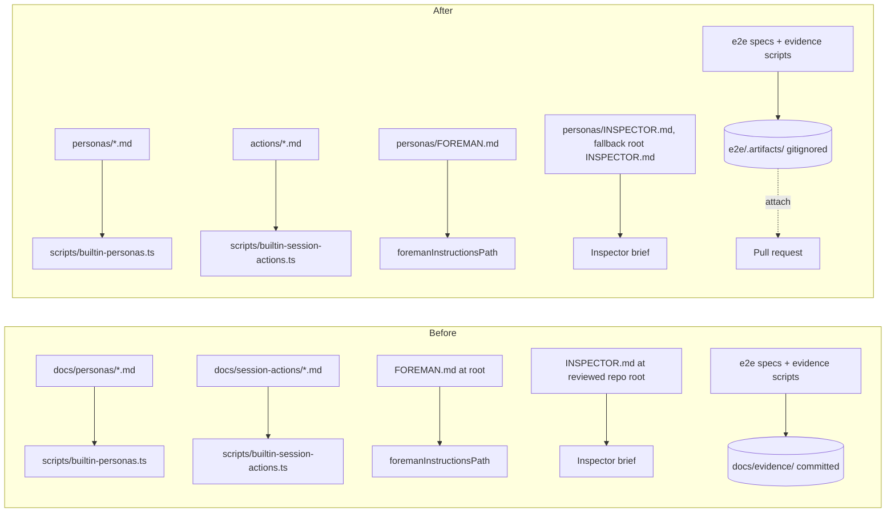

# Documentation overhaul and asset reorganization

## Goal

Make this repository legible to a person who has never opened it: a concise README that
advertises what Mission Control is and shows it, discoverable human-readable docs under
`docs/`, real contributor onboarding, and a tidy repo layout where agent-facing assets
(personas, session actions) live in obvious root directories and committed PR evidence is
gone for good.

## Problems today

- `README.md` is ~6,000 lines (425KB) with zero images. It is a complete behavioral
  reference, not an overview. Nothing advertises the product; everything documents it.
- Agent-facing assets are scattered: `FOREMAN.md` and `INSPECTOR.md` sit at the repo root,
  four workflow personas live under `docs/personas/`, and session actions under
  `docs/session-actions/`.
- `docs/evidence/` holds 23MB across 152 files of committed PR screenshot evidence.
  Sixteen e2e specs and three scripts write into it, so deleting it without changing them
  silently recreates it.
- No `CONTRIBUTING.md`, no `SECURITY.md`, no LICENSE, no PR or issue templates.
  `.github/` contains only `workflows/ci.yml`.
- `docs/` mixes durable documentation with historical plans, mockups, and backups, so the
  durable pages are hard to discover.

## What is not changing

- HTTP namespaces (`/api/personas/...`, `/api/session-actions/...`) and hash routes.
- Builtin IDs. The filename slug is the durable `builtin:<slug>` id that reaches published
  workflow versions and operator drafts, so every persona and action filename stays
  byte-identical through the moves.
- `skills/` stays where it is; `electron-builder.yml` ships it as source and `asar` stays
  off.
- `docs/plans/` remains the home for plans (this plan included).
- The generated modules stay generated. Sources move; `npm run personas` and
  `npm run session-actions` regenerate outputs in the same commit.

## Workstream 1: consolidate personas under root `personas/`

Move `FOREMAN.md`, `INSPECTOR.md`, and `docs/personas/*.md` into a new root `personas/`
directory, keeping filenames byte-identical.

| Change | Where | Why |
| --- | --- | --- |
| `foremanInstructionsPath()` resolves `../../personas/FOREMAN.md` | `src/server/config.ts:64` | The `../../` prefix is the one expression that reaches the repo root in dev and the app root when packaged; the file moves one directory deeper on both sides at once |
| Ship `personas/FOREMAN.md` | `electron-builder.yml:38` (`files:` allowlist) | The packaged app reads the seed at the app root; the allowlist entry must follow the file |
| Inspector brief looks for `personas/INSPECTOR.md` first, then falls back to root `INSPECTOR.md` | `src/server/inspector/brief.ts` (`BRIEF_FILENAME`, `readBrief`) | The brief resolves against the *reviewed repo's* root. Without a code change, moving this repo's copy silently downgrades its own reviews to `DEFAULT_BRIEF` with no failing test. The fallback keeps every other repo's existing convention working |
| Generator source dir and glob | `scripts/builtin-personas.ts:22,27` | `sourceGlob` is baked into the generated header, so regenerate in the same commit or the drift test fails |
| Regenerate | `src/server/workflows/builtin-personas.generated.ts` | Never hand-edited |
| Test path constants | `test/builtin-personas.test.ts:32`, `test/seed-personas.test.ts:28` | Both pin `docs/personas` |
| Prose references | `README.md:2564,5815`, `docs/agent-guides/change-contracts.md:370`, README Foreman/Inspector sections and the `MISSION_FOREMAN_INSTRUCTIONS` row | Keep links and anchors working |
| Default-brief copy | `src/server/inspector/brief.ts:30`, `src/server/inspector/prompt.ts:104`, `src/server/inspector/github.ts:870`, `src/web/components/InspectorSettingsPanel.tsx:237` | User-facing text that names `INSPECTOR.md` should describe the new lookup |

Historical plans and `docs/backups/AGENTS.old` keep their old paths; they describe the
past. The Inspector settings panel copy change is user-visible, so it needs an e2e
assertion per the UI rule.

## Workstream 2: move `docs/session-actions/` to root `actions/`

Exact structural sibling of workstream 1, smaller:

- `scripts/builtin-session-actions.ts:2-3,22,27` (source dir, glob, header comment).
- Regenerate `src/server/workflows/builtin-session-actions.generated.ts`.
- `test/builtin-session-actions.test.ts:22`.
- `README.md:5816`, `docs/agent-guides/change-contracts.md:371-372`.
- `pull-request.md` keeps its filename: the slug keys the enforced contract table and
  `PULL_REQUEST_SESSION_ACTION_ID`.

Note: a root `actions/` can read as GitHub Actions at first glance (`.github/workflows/`
already exists). Proceeding as directed; the directory gets a short `README.md` stating
what it is to remove the ambiguity.

## Workstream 3: remove `docs/evidence/` and fix the evidence policy

Delete `docs/evidence/` (all 23MB) and make the deletion stick:

- Redirect the sixteen e2e specs that write evidence into `docs/evidence/...` to a
  gitignored `e2e/.artifacts/` directory, and update their `CAPTURED ...` log lines.
- Redirect the three capture scripts (`scripts/review-answer-evidence.cjs`,
  `scripts/conversation-timestamp-evidence.cjs`, `scripts/workflow-skipped-status-evidence.cjs`)
  to the same gitignored location.
- Update `e2e/README.md` (about 16 links plus copy-paste `tee docs/evidence/...` commands)
  to the new location and the attach-to-PR policy.
- Fix the six `README.md` links into `docs/evidence/`.
- Relocate `docs/evidence/inspector-prompt-bytes.md` to
  `docs/agent-guides/inspector-prompt-bytes.md` - it is the recorded baseline that
  `test/standards.test.ts` and `test/standards-prompt-bytes.test.ts` reason about - and
  update the four comments that point at it (`src/server/standards.ts:137`,
  `src/server/util/repo-doc.ts:60`, plus the two tests).
- Preserve `docs/plans/workflow-card-progress/evidence/` - it is plans-scoped, written by
  different scripts, and out of scope for this deletion.

Policy changes in the same workstream:

- `skills/pull-request/SKILL.md`: change "attach or link screenshots" to attach-only.
  Evidence is uploaded to the pull request itself; never a link to a committed file.
- The `pull-request` session action source gains the same rule, regenerated.
- `AGENTS.md` boundary: never commit evidence artifacts. Proof-of-work screenshots and
  transcripts attach to the pull request; evidence produced for or submitted to workflow
  personas is also never committed - produce it in a gitignored location and attach it.
  Committed documentation imagery (for example `docs/images/` produced by the docs
  screenshot script) is documentation, not evidence.

## Workstream 4: split the README into `docs/`

Carve the ~6,000-line reference into organized pages under `docs/`, one page per feature
area, with a `docs/README.md` index. Candidate grouping, derived from the current heading
structure: sessions and terminals; dispatch, tasks and the backlog; task sources and
recurring missions; ensembles; workflows, personas and session actions; Foreman;
Inspector and shipping; the Library and the Line; attention, alerts and away mode; UI
(layout, palette, shortcuts, formatting); worktrees and checks; configuration reference;
demo mode; security. Content moves, it is not rewritten - accuracy is already there, the
problem is the container. Every anchor that other files link to gets a forwarding link or
an updated referrer.

In the same workstream, `docs/mockups/` and `docs/backups/` move under `docs/archive/`
(adopted decision) so the `docs/` top level holds only durable documentation.
`docs/plans/` stays put as the live plans home; old PR links into it keep working.

## Workstream 5: new README with screenshots

- A deterministic capture script (`scripts/docs-screenshots.mjs`) drives the built
  dashboard in demo mode with Playwright and writes curated screenshots to `docs/images/`.
  Demo mode is faked data, so captures spend no model tokens and are reproducible when the
  UI changes.
- A new `README.md`: what Mission Control is, who it is for, a screenshot-led feature
  tour, quick start (leaning on `make init` / `make setup`), and links into `docs/` for
  everything deep. Target well under 300 lines.

## Workstream 6: architecture and technical docs

- `docs/architecture.md`: a human-readable component overview - daemon, web dashboard,
  Electron shell, MCP server, Foreman worker, Inspector, SDK supervisor, terminal
  registry, hook bridges - with a component diagram and links into per-subsystem pages.
- Per-subsystem technical pages under `docs/` expanding on `docs/agent-guides/`
  (which stays, as the agent-facing contract): session lifecycle and eviction, dispatch
  and runtimes, harness capabilities, workflows/personas/ensembles, tasks/backlog/
  scheduler, database and migrations, event stream, packaging.

## Workstream 7: CONTRIBUTING and core repo docs

- `CONTRIBUTING.md`: prerequisites (Node 24+, Playwright Chromium), the command table,
  the four test layers and when each applies, the e2e-spec-for-UI-changes rule, working
  rules, and the PR bar (typecheck, lint, tests, build, smoke).
- `docs/setup.md` plus small hardening of `scripts/init.mjs` / `make init` so first-run
  bootstrap verifies its own prerequisites (Node version, Playwright browser) instead of
  failing downstream.
- `.github/PULL_REQUEST_TEMPLATE.md` and issue templates aligned with the pull-request
  skill's Goal / Design decisions / Proof of work shape.
- No LICENSE file (adopted decision): the repository is internal, and the new README
  states that plainly.

## Workstream 8: optional docs (adopted)

- `docs/troubleshooting.md`: common failure modes - daemon port conflicts, hooks not
  firing, missing Playwright browser, stale worktree leases - each with the observed
  symptom and the fix.
- `docs/glossary.md`: the product vocabulary a newcomer hits first - Foreman, Inspector,
  the Line, the Library, ensembles, missions, shipping, harness, dispatch - one paragraph
  each, linking into the feature pages from workstream 4.
- `SECURITY.md`: reporting guidance plus the security posture currently at the bottom of
  the README.

Deferred, deliberately: a daemon API reference (drifts unless generated from the Zod
schemas - revisit as generated-or-not-at-all) and a release/packaging runbook (Makefile
help output covers the commands today).

## Asset flow, before and after

## Sequencing

Workstreams 1-3 are the mechanical moves and land first, serialized, because they all
touch `README.md`, `AGENTS.md`, and `docs/agent-guides/change-contracts.md` and would
conflict in parallel. Workstream 4 (README split) depends on 1-3 so extracted pages are
written against final paths. Workstreams 5-8 depend on 4.

## Verification bar

Every workstream lands with `npm run typecheck`, `npm run lint`, and `npm test` green;
build-affecting workstreams (1, 2) additionally run `npm run build` and `npm run smoke`;
workstreams touching e2e or UI-visible copy (1, 3) run `npm run test:e2e` with specs
covering the change. Doc workstreams verify every intra-repo link resolves. Every
workstream that changes behavior lands with tests and the matching README/docs update in
the same change.

## Non-negotiables (operator-confirmed)

1. The `INSPECTOR.md` move teaches the brief loader to prefer `personas/INSPECTOR.md`
   with a root fallback; no test currently fails if this is missed and the Inspector
   silently degrades to the default brief.
2. Deleting `docs/evidence/` redirects the sixteen e2e specs and three scripts to a
   gitignored artifacts directory in the same change, and relocates
   `inspector-prompt-bytes.md` rather than dropping it - two tests reason about that
   baseline.
3. The persona move updates the generator `sourceDir`/`sourceGlob`, regenerates
   `builtin-personas.generated.ts`, fixes the two path-pinning tests, and keeps filenames
   byte-identical so `builtin:<slug>` IDs survive.
4. `FOREMAN.md`'s move changes both `foremanInstructionsPath()` in `src/server/config.ts`
   and `electron-builder.yml`.
5. Every phase that changes behavior lands with tests and a README/docs update in the
   same change.

## Adopted decisions

1. Optional docs: troubleshooting/FAQ, glossary, and `SECURITY.md` are in (workstream 8).
   The daemon API reference and release runbook are deferred.
2. No LICENSE file; the README states the repository is internal.
3. `docs/mockups/` and `docs/backups/` move under `docs/archive/`; `docs/plans/` stays.
4. Follow-up: phased implementation with dependency-linked Mission Control tasks.
