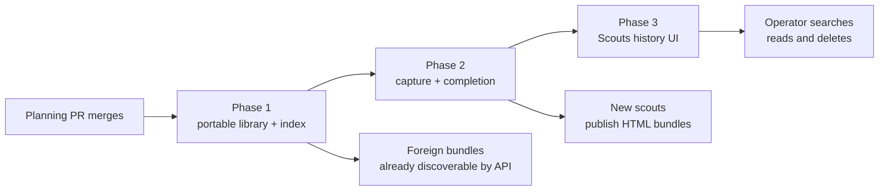

# Durable scout archive: phased implementation

Source plan: [`plan.md`](./plan.md), rendered at [`plan.html`](./plan.html).

This index turns the approved product and engineering plan into three merge units. The detailed
phase files beside this index are the implementation guides. The source plan remains the authority
for the intended outcome and approved product choices.

## Incorporated human decisions

| Decision | Approved selection | Consequence |
|---|---|---|
| Durable content | One self-contained HTML report, not the scout conversation | `report/report.html` is required for every complete scout; transcripts, prompts, hidden reasoning, and last-message fallbacks are excluded |
| Supporting artifacts | Report folder plus explicit files | Capture bounded companion files beside the report and only additional paths submitted by the scout; never infer all changed files |
| Canonical container | Versioned directory bundle | `manifest.json`, `report/`, and `artifacts/` remain directly inspectable and portable without SQLite or Mission Control |
| Index behavior | Incremental local SQLite cache | Bootstrap and recurring background passes index new or changed bundles; deleting the database causes an automatic one-time rebuild |
| Sharing model | Filesystem copy or operator-selected sync | Producer and archive UUIDs form the global key, so independently created scouts do not collide and foreign bundles auto-appear |
| Retention | Keep until explicit deletion | No age, count, or byte eviction; the Scouts UI owns a deliberate delete action |
| Permanent entry point | Top-level Scouts page | Add a topbar segment, stable list and detail routes, a global action, and a static command-palette result |
| Follow-up | Phased implementation | This document and the three phase files below |

## Repository findings that changed the route

Verified against the planning checkout. Implementers must re-check the current tree before editing.

- `STATE_DIR` in `src/server/config.ts` already resolves the current local Mission Control home and
  honors `MISSION_HOME`. The archive belongs under that root. `src/server/db.ts` remains the only
  SQLite schema and upgrade owner, and the daemon remains the only database writer.
- `Registry.onSessionExit` already fires once inside `beginEviction`, before `session_remove` and
  while the session row and task binding are still addressable. No new exit or eviction path is
  needed.
- `TaskManager.complete` is currently synchronous and is called by HTTP, merge reconciliation,
  session-loss reconciliation, tests, and the Ensemble task gateway. Making scout completion await
  capture requires one owner-level refactor across those callers, not a special completion route.
- A task reaches an agent through two seams. `Dispatcher.dispatch` handles a fresh terminal or SDK
  launch, while `TaskManager.assignReserved` injects `ready.intent` into an existing session. The
  scout report appendix must be composed for both.
- Launch-scoped Mission MCP requirements already fail dispatch when a required tool cannot be
  registered. `submit_ensemble_result` provides the closest registry, duplicated-schema, attribution,
  idempotency, and focused-test pattern for `submit_scout_artifacts`.
- The existing `skills/html-report/SKILL.md` already writes
  `docs/reports/<slug>/report.html`, requires self-contained static HTML, and asks the agent to report
  the output path. It is optional model guidance today, so the daemon must enforce the scout contract
  even when the global skill is disabled.
- Server file access already has containment and regular-file defenses in
  `src/server/session-files.ts`, but those helpers are session-root-specific. Scout storage needs a
  focused archive-path owner or a carefully extracted generic primitive, not reuse of a route that
  accepts session paths.
- `FileWorkspace.tsx` already builds the sandboxed HTML preview source and link bridge. The Scouts
  reader should extract a small shared preview module so the Files and Scouts surfaces share one CSP
  and navigation policy.
- The route owner is `src/web/workflows/useWorkflowRoute.ts` despite its workflow-oriented name.
  `AppPageShell`, `PAGE_SEGMENTS`, route destinations, action IDs, and event handling are exhaustive
  contracts that must move with a new top-level page.
- The command palette forbids providers that fetch their own data. A static **Open Scouts** page row
  is compatible; individual archive search stays inside the Scouts page.
- Browser tests run only against the built daemon and fake agent binaries. The existing E2E fixture
  exposes an isolated `MISSION_HOME`, so it can seed foreign bundles, restart the daemon, and remove
  only `harness.db` without spending model tokens.

## Phase map

| # | Phase | Detailed file | Merge unit | Direct prerequisite |
|---|---|---|---|---|
| 1 | Portable library and disposable index | [`phase-1-portable-library-and-index.md`](./phase-1-portable-library-and-index.md) | Manifest contract, local producer namespace, contained bundle reader, rebuildable SQLite search cache, reconciler, HTTP API, deletion mechanism, and invalidation event | None |
| 2 | Scout capture and completion | [`phase-2-scout-capture-and-completion.md`](./phase-2-scout-capture-and-completion.md) | Required report prompt and MCP tool, capture jobs, atomic publication, completion gating, exit recovery, and cleanup protection | Phase 1 |
| 3 | Scouts history UI | [`phase-3-scouts-history-ui.md`](./phase-3-scouts-history-ui.md) | Top-level Scouts route, search and report reader, supporting artifacts, background refresh, explicit deletion, responsive and accessible E2E coverage, and product docs | Phase 2 |

## Dependency and delivery flow



The phases are intentionally serial. Phase 2 consumes the manifest, storage, reconciliation, and
route contracts from phase 1. Phase 3 exercises the capture behavior from phase 2 in its required
browser flow. No phases can safely implement concurrently because each later phase consumes source
and tests owned by its direct prerequisite.

## Cross-phase contracts

These names let each phase state what it owns and what downstream work may rely on.

- **C1, portable source of truth (Phase 1):** a completed archive is the verified directory at
  `scouts/<producer-id>/<archive-id>/`. The pair of generated UUIDs is its global identity. SQLite,
  tasks, sessions, and worktrees are not required to read it.
- **C2, immutable publication (Phase 1):** Mission Control writes only through `.staging` and an
  atomic final rename, never overwrites a final key, and deletes through `.trash`. External copies
  settle across two observations before validation. Same-key, different-digest input is unreadable,
  never silently selected.
- **C3, version 1 manifest (Phase 1):** the shared schema, allowed role and status vocabularies,
  canonical content digest, generated path rules, hard limits, and golden vectors are append-only
  portable contracts. `report/report.html` is the only complete archive primary artifact.
- **C4, disposable index (Phase 1):** archive, artifact, and search rows are derived only from final
  bundles and have no task or session foreign keys. Empty SQLite state is rebuilt by the same
  incremental reconciler. Unchanged manifests do not cause body parsing.
- **C5, bounded read model (Phase 1):** list, detail, artifact, open, and delete routes accept opaque
  archive and artifact IDs rather than paths. Historical records stay out of the SSE snapshot; one
  `scout_archive_changed` event invalidates bounded browser queries.
- **C6, required report (Phase 2):** every delivered scout intent requires one answer-first,
  self-contained, static `docs/reports/<slug>/report.html`, regardless of skill settings or answer
  length. Conversation content is never an archive fallback.
- **C7, server attribution (Phase 2):** `submit_scout_artifacts` accepts report-relative metadata and
  explicit supporting locators only. The daemon derives task, work episode, repositories, producer,
  archive ID, and destination. One task episode maps idempotently to one capture operation.
- **C8, ordered completion (Phase 2):** every transition to scout `done` awaits a verified final
  bundle before changing task status. Cache indexing may retry later. Ship completion behavior and
  dependency semantics remain unchanged.
- **C9, cleanup safety (Phase 2):** `onSessionExit` reserves recoverable source locators before
  eviction. Missing or ambiguous HTML yields an honest partial bundle. Reclaim, remove, and any
  teardown that could destroy the sources wait for the capture job to settle.
- **C10, shared preview boundary (Phase 3):** Files and Scouts use one CSP and sandbox helper. Scout
  HTML cannot execute JavaScript or make external requests, and links resolve only to fragments or
  verified companions in the same bundle.
- **C11, stable history route (Phase 3):** `#/scouts` and `#/scouts/<archive-key>` are permanent
  routes. Search and filters remain bounded HTTP state; reconnect and archive invalidation refetch the
  mounted query without browser polling.
- **C12, explicit local deletion (Phase 1 server, Phase 3 UI):** deletion binds the typed archive key
  to the route key, atomically removes only the verified bundle and derived rows, preserves current
  filters, and has no portable tombstone or cascade into tasks and sessions.

## Merge order and compatibility strategy

Merge Phase 1, then Phase 2, then Phase 3. Each pull request must be independently operable:

1. After Phase 1, a valid bundle copied into the local library appears through bounded HTTP search
   and detail routes, survives SQLite removal, and can be deleted through the authenticated API.
   Existing scouts and every current dashboard page behave exactly as before.
2. After Phase 2, newly completed scouts always publish the Phase 1 bundle and cannot lose their
   evidence to task or worktree cleanup. The library remains headless but fully usable through its
   routes. Ship tasks retain their current completion and teardown behavior.
3. After Phase 3, operators can search, read, open, copy, and delete local or foreign scout bundles
   from the permanent Scouts page. This is the final user-visible state in the source plan.

All schema work is additive. All persisted identifiers and format vocabularies are append-only.
There is one filesystem source of truth, one daemon-owned derived index, one existing task owner, and
one existing event stream. No phase creates a compatibility adapter that a later phase must remove.

## Final verification strategy

The phase files own focused tests and commands. The complete feature finishes with:

```sh
npm run typecheck
npm run lint
npm test
npm run build
npm run smoke
npm run test:e2e -- e2e/specs/scout-archive.spec.ts e2e/specs/topbar-one-row.spec.ts
```

The final Playwright flow uses fake agents and an isolated local home. It proves required HTML output
with the optional skill disabled, completion before cleanup, search and deep links, sandbox behavior,
foreign-bundle discovery, partial-copy settling, SQLite reconstruction, explicit deletion from both
UI entry points, and deletion failure recovery. No scout archive, report, screenshot, or other
evidence artifact is committed to the repository.

## Complete cross-phase audit

- 2026-08-12: initial decomposition. Every approved decision is assigned to one owning phase and no
  transcript capture remains.
- 2026-08-12: repository trace corrected the source plan's dispatcher-only wording. C6 now requires a
  shared task-delivery appendix for both fresh dispatch and assignment to an existing session.
- 2026-08-12: the archive index and externally copied bundle path stay together in Phase 1, avoiding
  a database schema that has no usable reconciliation owner. Capture jobs move to Phase 2 because
  they coordinate task lifecycle rather than portable reading.
- 2026-08-12: the invalidation event begins in Phase 1 to keep the wire contract exhaustive, while
  its first visible consumer lands with the page in Phase 3. The revision counter is inert until
  then and requires no temporary browser poller.
- 2026-08-12: the final audit confirms a single serial dependency graph. Phase 2 consumes C1-C5;
  Phase 3 consumes C1-C12. The complete result matches the source plan without a cleanup phase.
- 2026-08-12: after all phase files were written, the full set was reconciled again. Phase 1 owns
  portable reads, index reconstruction, server deletion, and invalidation. Phase 2 alone owns task
  attribution, capture, completion, and cleanup gating. Phase 3 consumes their public contracts for
  routing, preview, refresh, and explicit deletion. No requirement has two behavior owners.
- 2026-08-12: review tightened the renderer contract. It now refuses to render when the number of
  Markdown Mermaid blocks and hand-authored inline SVG diagrams differs, preventing a later plan edit
  from silently dropping or attaching the wrong flow.
