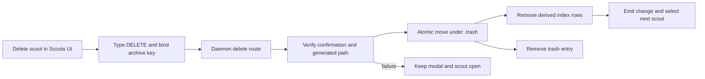
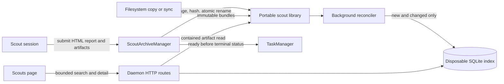
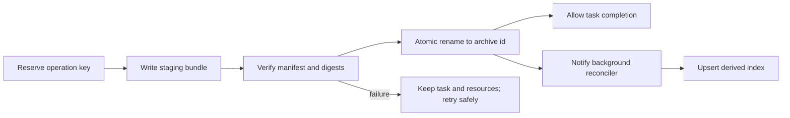
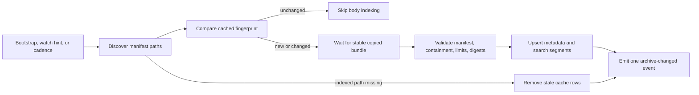

# Durable scout archive

## Outcome

Mission Control keeps every completed scout as a machine-local, searchable record after the
agent, task card, source transcript, and worktree are gone. A scout archive preserves one primary,
self-contained HTML report and the supporting evidence files the scout produced, including files
that were never committed. The conversation is not copied into the archive.

The default scout library lives under the resolved Mission Control state directory:

```text
~/.mission-control/scouts/<producer-id>/<archive-id>/
```

`MISSION_HOME` and the existing legacy state-directory resolution remain authoritative, so an
isolated or demo daemon keeps its scouts beside its own database instead of writing into the normal
home. Archives survive agent-session closure, daemon restarts, database replacement, and Mission
Control reinstallation when the library directory is retained or restored. An operator may copy or
sync immutable bundles into this directory with any filesystem tool. Mission Control does not
provide a network transport, account service, or remote store; it automatically discovers what is
present in the local library.

A dedicated **Scouts** view lets the operator search historical questions and findings across local
and shared producers, open a stable deep link to one archive, read its HTML report, inspect each
captured supporting artifact, and copy the bundle path for direct filesystem access.

## What the repository does today

- `Task.kind` already distinguishes `scout` from `ship`, and the kind is durable in SQLite.
- Completing a task stores only a short `outcome` before the dashboard stops the session.
- The full task table remains in SQLite, but terminal tasks are capped in Registry memory and the
  SSE snapshot, so old tasks are not a historical browsing surface.
- Conversations are read from harness-owned transcript files through the harness transcript
  capability. Once the session leaves the Registry, the dashboard transcript routes can no longer
  address that conversation, even when the source file happens to remain on disk.
- Session files are read from a live checkout. Reclaiming a task removes that path, and untracked
  scout artifacts disappear with it.
- The shipped, opt-in `html-report` skill already asks scouts and investigations to produce a
  self-contained `docs/reports/<slug>/report.html`, and the Files tab already opens that path in a
  sandboxed preview. It is model-invoked today, so a scout task does not guarantee that output.
- `~/.mission-control` is already the daemon-owned local state directory for the database, token,
  logs, uploads, and dispatched worktrees. The daemon is the only SQLite writer.
- Historical pages such as the Ship log fetch bounded data on demand instead of placing all
  history in the opening SSE snapshot. The browser does not poll.

The missing boundary is therefore not another task status. Mission Control needs an immutable
archive bundle and an independent catalog, captured before cleanup and addressable after every live
session object has disappeared.

## Recommendation

Add a daemon-owned `ScoutArchiveManager`, a portable bundle format, a background library
reconciler, and a small disposable SQLite search index.

The recommended archive contains:

1. `report/report.html`: the scout's required primary deliverable, copied from
   `docs/reports/<slug>/report.html`. It is self-contained, works from `file://`, uses inline CSS and
   SVG rather than JavaScript, and makes no external request.
2. `report/`: every bounded regular file produced beside `report.html`, preserving relative paths so
   the report can refer to a CSV, image, or other supporting output in its own directory.
3. `artifacts/`: additional contained regular files the scout explicitly submits from an attached
   worktree. Mission Control does not archive the whole worktree or infer a deliverable from every
   changed file.
4. `manifest.json`: a versioned, self-describing snapshot containing the globally stable archive
   key, opaque producer identity, display and search metadata, timing, completion, artifact
   provenance, byte sizes, and SHA-256 digests. Task and session ids are deliberately not
   published into the portable format; local capture jobs may use them only until the final bundle
   exists.

The bundle is the only durable source of truth for a completed scout. SQLite is a derived search
cache plus a local capture-job ledger, not a requirement for opening or reconstructing the library.
Every display field, artifact identity, and search input needed by a fresh installation is in the
bundle. Deleting the database, original task, or original session must not damage an archive.
Persist indexed bundle paths relative to the library root so the entire directory can move and be
reconciled in a fresh Mission Control installation.

### Why not archive the conversation

The useful output of a scout is the finding and its evidence, not the turns spent reaching it. A
normalized conversation increases storage and privacy exposure, preserves intermediate mistakes,
and still does not replace a deliberately structured report. The live transcript remains available
while the session exists, but the durable contract captures only the submitted HTML report directory
and explicitly named supporting files. Hidden reasoning, system prompts, raw tool protocol,
credentials, and vendor bookkeeping never enter a scout archive.

### Why not use Git refs as the archive

Ensemble refs are appropriate for restorable code snapshots, but a scout archive must remain usable
when its source repository is moved or deleted. Copying the small evidence set into Mission
Control's state directory also makes screenshots, rendered HTML, notes, and other uncommitted files
ordinary artifacts rather than Git-specific special cases.

### Why not copy the whole checkout by default

A full checkout duplicates source and dependencies, grows without a meaningful bound, and can copy
local configuration that was unrelated to the investigation. The focused archive captures the
required report directory and explicitly named supporting evidence while recording omissions
honestly in the manifest.

### Why retain SQLite at all

Scanning report HTML and artifact metadata for every query would make search cost grow with the whole
library. Mission Control already owns SQLite, so a derived index provides bounded search,
pagination, filtering, and snippets without adding another service. Normal bootstrap does not
reindex existing scouts: a background reconciler compares discovered manifest fingerprints with
the cache and parses only new or changed bundles. When the database is absent, the empty cache makes
every valid bundle new and it rebuilds automatically without a prompt.

The final directory remains independently readable. Database-only labels, annotations, foreign
keys, and ownership state are forbidden because they would be lost during reconstruction.

## User experience

### Information architecture

The recommended entry point is a top-level `#/scouts` page with a **Scouts** segment in the existing
topbar, a stable `#/scouts/<archive-key>` detail route, an **Open Scouts** global action, and a static
page result in the command palette. The palette opens the page but does not ingest every historical
record into SSE; search remains on the page that owns the archive catalog.

This is execution history, not a reusable authored asset, so it should not be inserted into the
Library's authored workflows, Personas, actions, strategies, and missions shelves. The approved
top-level placement accepts the additional topbar-density cost in exchange for direct historical
lookup.

### The page's single job

The operator is trying to recover an answer without reopening the original agent. The page should
answer, in order: **what did we investigate, what did we conclude, and what evidence survived?**

```text
┌ Scouts ─────────────────────────────────────────────────────────────────────┐
│ [Search questions, findings, reports, files...] [Source ▾] [When ▾]        │
├──────────────────────┬──────────────────────────────────┬───────────────────┤
│ AUG 12               │ Why did resume lose permissions? │ EVIDENCE          │
│ ● Resume permissions │ repo · agent · completed time    │ ● HTML report     │
│   3 files · 8 min    │                                  │ ● 3 support files │
│                      │ Sandboxed report.html            │                   │
│ AUG 09               │                                  │                   │
│ ○ Header density     │                                  │ evidence.csv Open │
│   partial · 1 file   │                                  │ notes.txt    Open │
│                      │                                  │ Copy bundle path  │
└──────────────────────┴──────────────────────────────────┴───────────────────┘
```

The signature element is an **evidence spine** in the detail rail. Its primary HTML report and
supporting-file stops show what the archive actually contains and navigate to the matching content.
Ready evidence is green, an incomplete capture is amber, and missing or corrupt evidence is red with
a sentence explaining the recovery action. This is structure, not decoration: one glance says
whether an old report is complete enough to trust.

Use Mission Control's existing dark operational palette and type roles rather than introducing a
new visual system:

| Role | Existing token or value | Use in Scouts |
|---|---|---|
| Canvas | `#0a0c0f` / `--bg` | Page background |
| Dossier | `#14181e` / `--panel` | Report reader and rails |
| Primary text | `#e7ebf1` / `--fg` | Findings and headings |
| Secondary text | `#939eae` / `--muted` | Provenance and excerpts |
| Ready | `#35c08a` / `--idle` | Complete archive stops |
| Incomplete | `#f6a733` / `--attention` | Partial capture and recovery |

System sans remains the reading face; the existing monospace face carries timestamps, paths,
digests, byte sizes, and manifest labels. The report is the visual thesis, not a dashboard of KPI
tiles. On a narrow viewport the archive rail becomes the first screen, the selected report replaces
it, and the evidence rail folds below the report.

### Search and filters

Search is server-side, bounded, and literal substring matching over normalized search segments:

- title, archived question, summary, tags, and visible text extracted from static `report.html` by a
  nonexecuting server-side HTML parser;
- repository labels, archived tags, producer, agent, model, source, and schedule names;
- report-directory paths plus original supporting artifact paths and filenames.

Results are newest first and cursor-paginated. Filters cover producer or source, repository, agent,
completion state, and date range. The route owns `q`, filters, and the selected archive so a copied
link reopens the same record. Empty search shows recent archives. A failed request says the archive
is unavailable; it must not render as an empty history. Background discovery is unobtrusive: the
page updates after a reconciled batch without a blocking startup screen or a manual reindex prompt.

### Detail and artifact reading

- Open `report/report.html` as the selected scout's default content using the existing sandboxed HTML
  preview and CSP. The report cannot execute JavaScript or make network requests.
- Show artifact path, repository provenance, media type, bytes, digest, and captured-at time.
- Preview supporting UTF-8 text and Markdown, images, and sandboxed HTML inside Mission Control.
  Reuse the existing HTML sandbox rules and never execute an archived page with dashboard
  privileges.
- Download any artifact through an id-addressed route. For supported files, **Open in Browser**
  reuses the registered open-target mechanism after archive containment is verified.
- Display and copy the absolute bundle directory, resolved from the current library root. The
  composite producer and archive key remains the stable application reference after copying.
- Offer **Delete scout** in the selected scout header and the corresponding archive-row overflow
  menu. Use Mission Control's existing `btn-danger-ghost` treatment so the action is discoverable
  without competing with the report and evidence controls.

### Deleting a scout from the UI

Selecting **Delete scout** opens a modal that names the scout, its producer, archive size, and exact
local consequence. The operator types `DELETE` before the destructive button enables. The request
also echoes the composite archive key, so a stale browser cannot delete whichever record later
occupies a list position. The modal must say that Mission Control removes the bundle and search entry
from this local library and does not touch any task, session, repository, or remote service. An
operator-configured two-way filesystem sync may propagate that file deletion to another machine or
restore the same immutable bundle later; Mission Control cannot promise either behavior.

On success, remove the row after the daemon confirms the filesystem move and index transaction,
select the next visible scout, preserve the active query and filters, and announce **Scout deleted**
through the existing status treatment. On failure, keep the modal and scout open, show the daemon's
specific reason above the actions, and restore the enabled **Delete scout** control. An unreadable
archive remains deletable by its server-verified generated path without trusting fields from its
manifest. Deleting a task or reclaiming its worktree never deletes its scout archive.



## Capture contract

### Required HTML output

Mission Control already ships the opt-in `html-report` skill. It tells investigations and scouts to
write one self-contained, no-JavaScript page at `docs/reports/<slug>/report.html`, put supporting
outputs beside it, and finish with the checkout-relative path. Promote that proven contract from an
optional model behavior to a server-enforced output contract for every `Task.kind === "scout"`.

Mission Control appends the compact report requirements to every scout intent regardless of the
global Skills toggle. Compose that appendix at the task-delivery boundary so it reaches both a new
dispatch and a backlog scout assigned to an existing session. The skill remains opt-in for
non-scout investigations, audits, and research. Keep the runtime appendix and
`skills/html-report/SKILL.md` aligned with a focused drift test for the path pattern, offline
requirement, no-JavaScript rule, answer-first structure, and final path handoff. Update the skill's
current one-sentence exception to say it never applies to a durable scout task: even a short scout
answer produces the HTML artifact. Do not depend on a model noticing an installed skill to satisfy
task completion.

Add a launch-scoped `submit_scout_artifacts` Mission MCP tool. Scout dispatches require and
preapprove this tool in the same capability-driven way ensemble members require
`submit_ensemble_result`. Ship tasks do not receive the scout submission contract.

The tool accepts a required primary-worktree-relative `reportPath` matching
`docs/reports/<slug>/report.html`, a bounded plain-text summary, optional tags, and optional
supporting artifact locators made from a server-issued repository slot plus checkout-relative path.
The daemon derives session, task, episode, worktrees, agent, and repository from the calling
environment, and generates the producer and archive ids. The agent never supplies an archive id,
task id, absolute destination, or filesystem root.

Submission validates that the report is a contained, nonignored regular HTML file; uses no script,
form, executable embed, external URL, or runtime-built content; and is within the report and bundle
limits. Capture the report directory as one relative unit so its local links survive. Additional
artifact paths pass through the same containment, ignore, symlink, type, and size rules.

The existing skill teaches reports to link citations back into the live checkout. That is correct in
the Files tab but would create broken or escaping links after archival. For a scout, update the
contract so source citations remain visible as `<code>path:line</code>` text without an `href` unless
the cited file is deliberately placed inside the report directory. Submission permits fragment
links, `data:` resources, and normalized relative links that remain inside the report directory. It
rejects network URLs, URL schemes, protocol-relative URLs, and relative paths that escape the report
directory. The archived HTML bytes are copied exactly; the daemon does not silently rewrite a
finished report.

The shared protocol schema and the MCP server's hand-written schema move together. Add the tool to
the append-only `MISSION_MCP_TOOLS` registry and extend the existing registration drift test.

### Completion backstop

Every transition that marks a scout `done` must await `ScoutArchiveManager.ensureReady` before the
task status changes. Normal completion requires a successful `submit_scout_artifacts` call and a
verified final HTML bundle. It does not fall back to transcript text, the last assistant message, or
all changed worktree files. A missing or invalid report keeps the scout nonterminal and returns the
exact required path and validation problem so the agent or operator can correct it.

This makes scout completion one ordered boundary:

1. Resolve the current task and work-episode identity.
2. Reserve or replay the archive operation key.
3. Capture the submitted HTML report directory and explicit supporting artifacts into staging.
4. Write and verify the manifest and content digests.
5. Atomically rename the staging directory to its final producer and archive path.
6. Notify the background reconciler and optimistically index the new bundle.
7. Once the final bundle itself is verified, mark the task done and allow the existing session-stop
   flow to continue. An index failure retries in the background and does not make durable evidence
   depend on the database.

Refactor the current synchronous `TaskManager.complete` boundary to await archive preparation and
update all existing call sites. Do not add a second task-completion path in routes. A capture
failure leaves the scout nonterminal, keeps its resources, and returns the exact file or validation
problem to the caller.

### Unexpected exit and partial scouts

`Registry.onSessionExit` remains the last-chance signal before removal. For an unarchived scout it
synchronously reserves a durable capture job containing only server-derived checkout locators, then
a background worker looks for exactly one new conventional `docs/reports/*/report.html` while the
retained worktree still exists. A successfully submitted path always wins; ambiguous discovery is
never guessed.

Reclaim refuses a scout until its final bundle has been verified. Capture-job recovery resumes
reserved or interrupted local work before it permits cleanup; this is distinct from library index
reconciliation. If no valid report can be recovered, the manager publishes a self-describing
`partial` manifest that says the primary HTML report is missing; it does not manufacture a report
from conversation text. The UI never labels that record complete, even when no original task or
session exists.

### Limits and honesty

Use hard limits to protect the local daemon: 32 MiB for `report.html`, 128 MiB and 256 entries for
the full report directory, 64 MiB per additional file, 512 entries, and 512 MiB for the complete
bundle. Keep the constants together and apply them before publishing a ready bundle.

Crossing a limit refuses completion and names every offending path or count. It must not publish a
green archive that silently omitted evidence. Symlinks, sockets, devices, paths outside an attached
realpath, ignored files, and files that change while being copied are rejected. Explicit supporting
files pass through the same containment and regular-file checks as the report directory.

## Data and request flow

Today the scout's useful report is an optional untracked checkout file that disappears with worktree
reclaim. The proposed capture makes a verified HTML output mandatory before normal completion.
Locally captured bundles and externally copied bundles then enter the same portable library and the
same disposable index without carrying session conversations.



The publication sequence is intentionally filesystem first. A verified final bundle permits task
completion even if indexing must retry. A database row pointing at files that were never durably
renamed cannot be repaired, while any complete bundle can reconstruct its row and search segments.



Discovery and indexing use a separate recurring flow. Bootstrap schedules it after the daemon can
serve requests, filesystem events provide low-latency hints, and a jittered 60-second cadence is the
authoritative fallback because filesystem watchers can drop events on synced directories.



## Persistence and lifecycle

### Bundle layout

```text
~/.mission-control/scouts/
  .staging/
  .trash/
  <producer-id>/
    <archive-id>/
      manifest.json
      report/
        report.html
        <files produced beside the report>
      artifacts/
        <repo-slot>/path/from/worktree
```

### Version 1 archive format

The canonical v1 container is the directory shown above. It is an artifact bundle, not a transcript
export. It stays directly inspectable with normal filesystem tools and does not require Mission
Control to extract a package before opening the report. `manifest.json` and `report/report.html` are
UTF-8 with LF line endings and no byte-order mark. Companion and supporting files retain their
original bytes. The manifest is pretty-printed with two spaces and a trailing newline so a human can
inspect it, but readers use fields rather than byte-for-byte JSON formatting.

A representative manifest is:

```json
{
  "format": "mission-control/scout-archive",
  "format_version": 1,
  "producer": {
    "id": "7aa704fd-d2ab-48b3-a726-0c2643ed91d2",
    "label": "Avery's laptop"
  },
  "archive": {
    "id": "9f5db6c8-79f5-4f9e-84aa-8b5dc15362f8",
    "created_at": "2026-08-12T18:42:11.000Z",
    "completed_at": "2026-08-12T18:50:03.000Z",
    "capture_status": "complete",
    "title": "Resume permission loss",
    "question": "Why did a resumed agent lose repository permissions?",
    "summary": "Resume rebuilt the session without replaying the repository grant.",
    "tags": ["permissions", "resume"]
  },
  "origin": {
    "agent": "codex",
    "model": "gpt-5.6",
    "source": "manual",
    "repositories": [
      {
        "slot": "repo-01",
        "label": "mission-control",
        "head": "4cc55a1d69bb7f843881001643c76185f5c7db1a"
      }
    ]
  },
  "content": {
    "primary_artifact_id": "report",
    "artifacts": [
      {
        "id": "report",
        "role": "primary_report",
        "repo_slot": "repo-01",
        "original_path": "docs/reports/resume-permissions/report.html",
        "archive_path": "report/report.html",
        "media_type": "text/html",
        "bytes": 12744,
        "sha256": "sha256:<64 lowercase hex>"
      },
      {
        "id": "artifact-01",
        "role": "report_companion",
        "repo_slot": "repo-01",
        "original_path": "docs/reports/resume-permissions/permission-events.csv",
        "archive_path": "report/permission-events.csv",
        "media_type": "text/csv",
        "bytes": 4821,
        "sha256": "sha256:<64 lowercase hex>"
      },
      {
        "id": "artifact-02",
        "role": "supporting",
        "repo_slot": "repo-01",
        "original_path": "evidence/resume-debug.log",
        "archive_path": "artifacts/repo-01/evidence/resume-debug.log",
        "media_type": "text/plain",
        "bytes": 2911,
        "sha256": "sha256:<64 lowercase hex>"
      }
    ]
  },
  "missing": [],
  "content_digest": "sha256:<64 lowercase hex>"
}
```

The example digest values are placeholders. The format contract defines them as lowercase SHA-256.
`content_digest` is derived with a format-version-specific canonical encoder over the sorted table
of content paths, sizes, and individual digests; it excludes `manifest.json` to avoid a recursive
hash. Publish golden test vectors with the shared schema so another implementation can create a
byte-compatible identity without using Mission Control's TypeScript code.

The manifest rules are:

- The producer and archive ids in the manifest must match the generated directory components. Their
  pair is the archive key used by routes and SQLite.
- `producer.label` is optional and unverified. Absolute usernames, home paths, task ids, session ids,
  and worktree paths are not part of the portable manifest.
- `archive.capture_status` is `complete` or `partial`. A partial archive lists structured entries in
  `missing`, each with a kind, expected source, and safe reason. `unreadable` is an index state for a
  bundle whose manifest cannot be accepted, not a value a manifest can claim for itself.
- Repository slots are generated. Repository labels and commit ids are informational; no remote or
  checkout must exist to read the archive.
- `content.primary_artifact_id` must select exactly one HTML entry with role `primary_report` for a
  complete archive. Other roles are `report_companion` and `supporting`. A partial archive may set
  the primary id to null and must explain the missing report.
- Every archive path uses normalized POSIX separators, is relative to the bundle, and passes the same
  containment and symlink checks during creation, reconciliation, read, open, and delete.
- HTML fragment links and links among report-directory companions stay navigable. In the Scouts
  preview, the existing link bridge resolves only a matching report companion or generated artifact
  id; every unclaimed link remains inert.
- Unknown top-level or nested fields do not authorize behavior. Readers may preserve and ignore them
  within a known format version; unknown newer format versions stay visible as unreadable.

`report/report.html` is the canonical answer and contains no required machine-readable metadata.
Metadata belongs in the manifest so the report remains ordinary HTML when opened elsewhere. Its
first screen carries the title, question, and finding; evidence and limits follow. Static HTML,
inline CSS, inline SVG, fragment links, and `data:` images are allowed. JavaScript, external URLs,
forms, executable embeds, meta refresh, and content that only appears after runtime execution are
rejected. The Scouts UI renders it with the same sandbox and CSP as the existing Files preview.

The indexer extracts visible text with a nonexecuting server-side HTML parser after removing style,
SVG metadata, and hidden content. It never loads the page, follows a link, or evaluates markup. The
bounded manifest summary provides a useful list snippet even if full-text extraction later fails.

The daemon stores its opaque cryptographically random producer id in
`$STATE_DIR/scout-producer.json`, outside SQLite and outside the syncable `scouts/` directory, and
generates a fresh random archive id for every scout. Losing that small local identity file creates a
new producer namespace for future scouts but does not orphan or rename existing bundles. The
producer and archive pair is the global archive key.
Independent users therefore write to different namespaces; copying the same immutable bundle twice
is idempotent. Mission Control never overwrites an existing final archive path. If external tools
mutate a ready key or produce two candidates claiming the same key with different digests, the
reconciler marks the key unreadable instead of silently choosing content. Producer display labels
are optional, informational, and never trusted as identity.

Producer ids, archive ids, and internal repo slots are generated values. Operator and agent text
never becomes a directory component. Original relative paths live in the manifest and are recreated
only below a generated repository slot after containment checks. The reconciler discovers valid
two-level bundles regardless of whether they arrived through Mission Control, Finder, `cp`, a cloud
drive, or another synchronization tool.

### Disposable SQLite index

Add additive tables beside their migration path:

- `scout_archives`: composite archive key, producer id, archive id, append-only format version,
  bundle digest, frozen manifest-derived display fields, status (`ready`, `partial`, `unreadable`),
  relative bundle path, manifest fingerprint, counts, bytes, error, last seen reconciliation epoch,
  and timestamps.
- `scout_artifacts`: archive key, generated artifact id, repository slot, original relative path,
  kind, media type, bytes, SHA-256, and deletion marker.
- `scout_search_segments`: archive key, ordinal, source kind, and normalized text used by bounded
  literal search. This keeps full HTML report search independent of the compact archive summary row
  without assuming FTS5 is compiled into every shipped SQLite.
- `scout_capture_jobs`: local operation key, source locators, and capture status for unfinished
  Mission Control tasks. These rows coordinate capture only and are not needed to read completed
  bundles imported from any producer.

Index status and completion time, producer, repository, and artifact ownership. Completed archive
rows have no foreign keys to tasks or sessions and no cascade behavior. Search is a local scan over
bounded segments with a result limit and cursor; do not add an optional SQLite extension as a
startup requirement.

The manifest format version and status values are append-only persisted identifiers. Unknown newer
formats stay listed as unreadable rather than being parsed as the current format.

### Automatic incremental reconciliation

The daemon starts serving its normal API, then launches one serialized reconciliation loop. Each
pass walks candidate producer and archive directories while excluding `.staging`, `.trash`,
symlinks, and unexpected depth. It compares relative path plus the manifest size and nanosecond
modification time with the stored fingerprint. Unchanged scouts skip report, artifact, and search
parsing. New or changed candidates receive complete validation and replace their derived
rows in one transaction. Indexed paths not observed in a complete pass are removed from the cache.

Run this pass at bootstrap, after a debounced filesystem watch hint, and on a jittered 60-second
cadence. Coalesce overlapping triggers and emit one `scout_archive_changed` event after a batch, not
one event per file. A wiped database simply has no fingerprints, so every valid bundle is indexed
in the background once. There is no reindex prompt, settings action, or blocking startup migration.

Filesystem synchronization may expose a directory before all payload files arrive. A new or changed
candidate must remain fingerprint-stable across two observations before digest verification. A
missing payload or temporary digest mismatch stays pending and retries rather than flashing a
corrupt record. Once stable, an invalid schema, traversal, unsupported version, or digest conflict is
listed as unreadable with a safe diagnostic. Completed bundles are immutable; mutation creates a
new archive id instead of rewriting history.

### Crash recovery

- The operation key is stable for one task and work episode, so MCP retries and lost HTTP responses
  return the same archive.
- A valid final directory without an index row is discovered and indexed by reconciliation.
- A staging directory is resumed when its source locators remain valid; otherwise it becomes a
  self-describing failed or partial bundle rather than being discarded.
- A cache row whose bundle disappears is removed after a complete discovery pass. If an external
  sync later restores the bundle, it is indexed again automatically.
- Deletion atomically moves the bundle under `.trash`, removes derived rows, and then removes the
  trash entry. Reconciliation finishes an interrupted deletion. An external synchronization tool
  may restore a locally deleted archive; Mission Control does not publish portable tombstones.
- No automatic retention sweep touches a ready archive. Ready bundles remain until explicit deletion.

## HTTP and live synchronization

Add shared request and response types for:

```text
GET    /api/scouts?q=&producer=&repo=&agent=&state=&from=&to=&cursor=&limit=
GET    /api/scouts/:archiveKey
GET    /api/scouts/:archiveKey/artifacts/:artifactId
POST   /api/scouts/:archiveKey/artifacts/:artifactId/open
DELETE /api/scouts/:archiveKey
POST   /mcp/scouts/submit
```

The list route returns compact summaries and snippets. Detail returns manifest-derived provenance,
completeness, primary report identity, and supporting artifact metadata, but not artifact bodies.
Artifact routes serve the HTML report and supporting files through generated ids and resolve the
stored relative path beneath the verified archive root. Reads never accept an arbitrary path. Delete
requires `{ "confirmArchiveKey": "..." }` and
rejects a key that does not exactly match the route parameter before resolving the generated bundle
path.

Historical archives do not belong in the SSE snapshot. Add a lightweight
`scout_archive_changed` invalidation event and a browser revision counter. A mounted Scouts page
refetches its current bounded query after the reconciler commits a changed batch; reconnect
increments the same counter. The daemon watches and scans the filesystem, while the browser keeps
one event stream and no polling loop.

## Repository changes

| Area | Planned change |
|---|---|
| `package.json` and lockfile | Add one server-only, nonexecuting standards-based HTML parser for validation and visible-text extraction; do not use Electron or a browser to index reports |
| `src/shared/types.ts` and a focused `src/shared/scouts.ts` | Portable manifest, producer, archive key, artifact, summary, detail, completeness, format, and search types; append-only persisted tuples |
| `src/shared/protocol.ts` | Strict search, delete, open, and MCP submission schemas |
| `src/server/config.ts` | Export the scout library path, opaque local producer identity, reconciliation cadence, and test overrides under `STATE_DIR` |
| `src/server/db.ts` | Rebuildable index schema, capture-job ledger, additive migration, readers/writers, indexes, and old-database upgrade tests |
| `src/server/scouts/` | Store, capture manager, reconciler, static HTML validator and text extractor, submitted artifact copier, imported manifest verification, recovery, and deletion |
| `src/server/mission-mcp.ts` and `src/mcp/server.ts` | Register and expose `submit_scout_artifacts`; keep duplicate validation in sync |
| `src/server/dispatcher.ts`, `src/server/tasks.ts`, and `skills/html-report/SKILL.md` | Require the HTML output contract and MCP tool for every scout, keep the optional skill aligned, and make archive readiness precede completion and reclaim |
| `src/server/routes.ts` | Thin validated search, detail, artifact, open, delete, and MCP adapters |
| `src/server/registry.ts` and `src/web/useEventStream.ts` | Emit and exhaustively reduce the archive invalidation revision without snapshotting history |
| `src/web/workflows/useWorkflowRoute.ts` | Add stable Scouts list and detail routes, filters, serialization, and parsing |
| `src/web/components/ScoutsPage.tsx` and focused helpers | Search rail, sandboxed primary report, evidence spine, supporting artifact viewer, failures, and deletion |
| `src/web/App.tsx`, `AppPageShell.tsx`, keybindings, palette | Add the chosen entry point, page slot, deep links, and Open Scouts action |
| `src/web/styles.css` | Three-pane dossier layout, responsive fold, focus, preview, and semantic completeness states |
| `docs/README.md` and a new product reference | Document storage layout, portable copying, automatic discovery cadence, contents, limits, search, deletion, recovery, and privacy |

## Security and privacy

- Everything remains loopback-only and under the existing daemon authentication boundary.
- The daemon is the only SQLite writer. Its capture path is the only Mission Control archive writer,
  but external tools may place immutable bundles in the library for read-only discovery.
- Capture only real regular files beneath verified worktree realpaths. Reject symlinks before and
  after resolution, special files, traversal, null bytes, and arbitrary absolute paths.
- Treat every externally copied bundle as untrusted input. Strictly validate manifest schema,
  version, generated identities, limits, digests, and containment before indexing it.
- Never trust a manifest read from disk to authorize a path. Join generated index identity to a
  server-verified archive root and verify containment on every read and open.
- HTML previews remain sandboxed with scripts unable to execute in the dashboard origin. Archived
  Markdown uses the existing safe link transformation.
- Search snippets are plain data and follow normal React escaping.
- The archive is local but may contain sensitive investigation content. The UI and documentation
  name the exact directory, state that it is not encrypted by Mission Control, explain that an
  operator-controlled sync tool may copy its contents elsewhere, and make deletion explicit.
- Producer labels and provenance from foreign manifests are descriptive claims, not authenticated
  user identities. The initial design does not add signing or trust badges.
- Do not commit archive contents, screenshots, reports, or generated evidence to the repository.

## Verification

### Fast and integration tests

- Fresh schema and pre-feature upgrade tests open safely and preserve all existing task history.
- Portable-format tests cover artifact-only manifest v1 fixtures, primary-report selection,
  unknown-field handling, partial evidence, path normalization, digest verification, and published
  golden digest vectors.
- Store tests cover operation-key idempotency, pagination, literal search across every segment kind,
  filters, task deletion independence, nullable provenance, producer namespaces, unknown format
  versions, and interrupted deletion.
- Capture tests cover required HTML submission, report-directory copying, companion and explicit
  supporting files, missing or ambiguous report recovery, script and external-resource refusal,
  multi-repo artifacts, ignored files, symlink and traversal refusal, changing files, limits,
  digests, atomic publication, and crash recovery at each boundary.
- Task tests prove a scout cannot become done or be reclaimed before its archive is ready, while a
  ship task's byte-for-byte completion behavior stays unchanged.
- MCP tests prove attribution, kind refusal, duplicate schema coverage, preapproval, idempotent
  replay, and no caller-controlled archive identity or destination.
- Reconciler tests cover nonblocking bootstrap, unchanged fingerprint skips, new and changed bundle
  indexing, missing-path pruning, an empty-database rebuild, trigger coalescing, recurring cadence,
  watch hints, partially copied bundle settling, exact-copy deduplication, producer separation, and
  same-key digest conflict refusal.
- Route tests cover bounded search, missing, partial, foreign, and unreadable bundles, artifact
  content headers, containment, open-target refusal, archive-key confirmation, unreadable-bundle
  deletion, and local-only deletion.
- Router, keybinding, palette, static render, accessibility, responsive-source, SSE invalidation,
  and AppPageShell exhaustiveness tests move with the new page.

### Required Playwright coverage

Add `e2e/specs/scout-archive.spec.ts` against the built dashboard and fake agents:

1. Dispatch a scout with the global HTML Report skill disabled and prove its prompt still requires a
   self-contained `docs/reports/<slug>/report.html` plus optional supporting artifacts without
   opening a pull request.
2. Complete it and prove the task does not close until the archive is ready.
3. Reclaim or remove the task and stop the session.
4. Open Scouts through the chosen permanent UI entry point, search for visible text found only in the
   HTML report and for a supporting artifact path, and open the stable detail route.
5. Read the sandboxed report as the default scout view, preview each supported artifact, copy the
   bundle path, and prove report JavaScript and external requests cannot execute.
6. Reload the daemon and prove unchanged bundles are not reindexed while the same deep link and
   search results survive.
7. Copy a valid foreign-producer bundle into the library after the page is open and prove it appears
   automatically after reconciliation without browser polling or a user action.
8. Stop the daemon, delete only the SQLite database, restart, and prove the background reconciler
   reconstructs search and detail access from the bundle directory.
9. Seed a partially transferred bundle, finish copying its payload, and prove it becomes visible
   only after it settles and validates.
10. Seed a partial archive and prove it is amber, names the missing evidence, and is never presented
    as complete.
11. Delete from both the selected-scout header and archive-row overflow, prove `DELETE` and the
    composite key are required, and prove success selects the next result without clearing filters.
12. Force one deletion failure and prove the modal stays open with the scout still readable; then
    delete successfully and prove another archive and its source task are untouched.

Run the focused unit and HTTP tests first, then the required gates:

```sh
npm run typecheck
npm run lint
npm test
npm run build
npm run smoke
npm run test:e2e -- e2e/specs/scout-archive.spec.ts e2e/specs/topbar-one-row.spec.ts
```

## Rollout and non-goals

Ship the archive for newly completed scouts. Do not attempt to import old terminal task rows or scan
every harness transcript on first startup: the historical mapping from a transcript to a particular
scout is not reliable enough to manufacture provenance. Existing scout tasks still running when the
feature first starts can be archived when they submit or complete. Independently produced valid
bundles copied into the scout library are in scope immediately and require no original task row.

Out of scope:

- implementing a cloud provider, peer protocol, account system, or remote search service inside
  Mission Control. Portable bundles and compatibility with operator-selected filesystem sync are in
  scope;
- automatic model-written summaries after the scout has ended;
- archiving ship tasks, workflow evidence, ensemble artifacts, or arbitrary terminal sessions;
- editing an immutable historical report in place;
- restoring a worktree from a scout archive; and
- archiving conversations, hidden reasoning, system prompts, or vendor-specific transcript internals.

## Acceptance criteria

- Every normal `scout` completion publishes one ready archive before its task becomes terminal.
- The archive remains readable after session removal, worktree reclaim, task deletion, daemon
  restart, SQLite deletion, and restoration into a fresh Mission Control state directory.
- A complete record includes one self-contained HTML report, its report-directory companions, every
  explicitly submitted supporting artifact, a manifest, honest completeness, and digests. It does
  not include conversation content.
- Normal bootstrap and recurring reconciliation index only new or changed bundles; they never parse
  unchanged report or artifact bodies.
- A valid foreign-producer bundle copied into the library appears automatically within one
  reconciliation cadence with no import or reindex prompt.
- Independent producer namespaces prevent normal cross-user collisions, exact copies deduplicate,
  and a same-key different-digest bundle is never silently overwritten.
- Search finds visible HTML report text, metadata, and artifact paths without loading history into
  the SSE snapshot or browser polling.
- The dedicated UI has a stable list and detail route, keyboard-accessible search, internal artifact
  previews, a copyable bundle path, visible partial and corrupt states, and **Delete scout** actions
  in both the selected-scout header and row overflow. Confirmation, failure, focus restoration, and
  post-delete selection are keyboard accessible.
- Ship tasks and machines with no scouts behave as before except for the chosen empty-state entry
  point.
- Mission Control never sends archive data over the network. Data leaves the local library only
  through an explicit open, copy, or operator-configured external synchronization tool.

## Approved decisions

- **Supporting artifacts:** capture the required HTML report directory plus only additional files
  explicitly named by the scout. Do not infer the deliverable from all worktree changes.
- **Retention:** keep every ready archive until the operator explicitly deletes it from the Scouts
  UI. Do not add automatic time or size eviction.
- **Permanent entry point:** add a top-level **Scouts** segment, stable route, global action, and
  command-palette page result.
- **Canonical container:** use a versioned directory bundle containing `manifest.json`,
  `report/report.html`, its bounded companion files, and `artifacts/` as ordinary files.
- **Implementation follow-up:** decompose this approved plan into merge-aware implementation phases
  and schedule dependency-linked Mission Control tasks.
