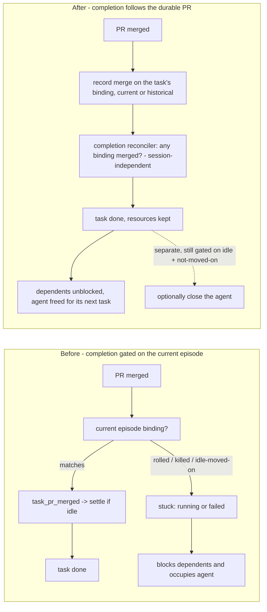

# Durable, PR-driven task completion

Decouple a task's **completion** from the state of the session that happened to run it.
A task whose work shipped - a pull request we opened for it got merged - must reach `done`
and stop blocking the backlog, whether its session is still idle, was killed, rolled onto
new work, or landed in some invalid state. Whether to also *close the agent* stays a
separate preference and must never gate completion.

## The problem

Today, a task's terminal state is derived from **live session state plus the current work
episode**. When the session attributed to a task moves on, dies, or goes weird, the task
can sit in `running` (or get marked `failed`) even though its work is done. A task that is
not `done` has two downstream costs:

- **It blocks its dependents.** `blockersIn` (`@shared/backlog.ts`) clears a task
  dependency only when the depended-on task is `done`; a `running`, `failed`, or
  `cancelled` dependency stays a blocker, so anything declared to wait on it never gets
  scheduled.
- **It occupies its agent.** `agentIsFree` (`src/server/foreman/backlog-machine.ts`)
  refuses a session that still has a `running`/`dispatching` task bound to it, so the
  backlog autopilot will not reuse that agent.

Observed instance: the session that shipped PR #220 stayed `running` with its task never
settling, because it kept working (drove its own merge, then follow-up) long after the PR
was created - so its *current* work episode is no longer the one that merged.

## Why it happened before Phase 1 (grounded in the code)

At plan adoption, the merge was recorded against **one specific work episode**, and every
completion path read only the **current** episode:

- `mergedPrFor(taskId)` (`src/server/tasks.ts`) read only the *current* task↔episode
  binding (`taskWorkEpisodeForTask`) and returned a merged PR only if **that** binding had
  `mergedAt`. The **historical** bindings were ignored.
- Merge attribution (`reconcileWorkEpisodeMerge` → `markWorkEpisodeMerged`,
  `src/server/registry.ts`) only fired `task_pr_merged` when the current binding matched
  the merged episode (`activeTaskId`).
- `settleIfEpisodeFinished` and `closeMergedSession` both gated on
  `episodeId === current`.

So a merge recorded on a **rolled-past** episode was invisible to task completion: the task
never learned its work merged. When the session then went away, `agentWentAway` called
`mergedPrFor` - which read the current (unmerged) binding - found nothing, and marked the
task `failed`, stranding every dependent behind a `stopped` blocker for work that shipped.

The machinery was **only half-wired**: the historical table and its readers existed, but
rollover did not populate it. The *dependency* merge path
(`reconcileDependencyPrMerges`) already read current **and** historical bindings, while
standalone task completion did not.

## Requirement

If a task's work was satisfied by a merged PR, the task is `done` and does not block
backlog scheduling - regardless of whether its session is idle, was cancelled/killed, or is
in an invalid state. Session disposition (closing the agent) is a separate preference and
must not gate task completion.

## Adopted decisions

Resolved via the Mission Control dashboard review (2026-07-24):

1. **The durable PR↔task link is the work-episode bindings (current + historical).** No
   new `Task.prs` field or table. The bindings are already retained and already carry
   `prUrl`/`mergedAt`; completion learns to read the whole record instead of only its
   head. A first-class field can still be layered on later without migration pain, since
   the bindings remain the source it would be derived from.
2. **A merged PR always upgrades the task to `done` - even one the operator explicitly
   cancelled.** The work shipped; a task row that says otherwise blocks scheduling for
   work that landed. Only a **merged** PR upgrades - a closed-unmerged PR changes nothing,
   and a cancelled task with no merged PR stays cancelled. The upgrade records the merged
   PR as the outcome so the row says *why* it moved.
3. **Formalize multiple tasks per session in this change.** `Task.sessionId` becomes a
   mutable "currently executing on" pointer; the durable task↔episode bindings are the
   provenance record linking each task to the work (and PRs) it produced. A session runs
   tasks **serially** - at most one `running`/`dispatching` task at a time, unchanged -
   but completed tasks no longer pin the session, and the session's history of tasks
   remains queryable through the bindings rather than through a single live pointer.

## Design: completion follows the durable PR, not the session

Pull apart two things that are currently entangled:

1. **Task completion** - a durable fact: *this task's work was satisfied by a merged PR we
   opened for it*. Independent of session liveness and episode currency.
2. **Session disposition** - *should the agent be closed/killed* - stays gated on session
   state (idle **and** not moved on to new work) and never blocks (1).

Concrete changes:

- **Durable merge lookup.** `mergedPrFor(taskId)` consults the task's current **and
  historical** bindings, so a merge recorded on *any* of the task's episodes completes it.
  (Reads a record already retained.)
- **Durable merge recording.** When a merge is observed for a task's PR, record it on the
  task's binding even after the session rolled to a new episode - extend the standalone
  path the way the dependency path already records merges onto historical bindings.
- **A completion reconciler that ignores session state.** One predicate - *does any binding
  for this task show a merged PR?* - run on every relevant signal: a merge observed, a
  session going idle (`session_upsert`), a session removed (`session_remove`), the first
  discovery sweep (`onSessionsObserved`), startup, and a periodic backstop. It never reads
  the current episode or requires the session to be alive.
- **Terminal-state upgrade.** The reconciler applies to `running`/`dispatching` tasks AND
  to `failed`/`cancelled` ones: any task whose binding shows a merged PR is upgraded to
  `done` with the PR recorded as its outcome (adopted decision 2). `done` rows are never
  touched.
- **Completion keeps resources.** `complete` marks the task `done`, records the merged PR as
  the outcome, and **keeps** the worktree/home for the operator's Clean up. "Mark done must
  not discard work" is preserved; `git worktree remove --force` stays behind a human click.
- **Session-kill unchanged in spirit.** Close-after-merge still only fires for an idle
  session that has **not** moved on to new work; a session that rolled to new work is never
  killed. Completion no longer waits on it.

### Multiple tasks per session (adopted decision 3)

What it means concretely:

- **`Task.sessionId` is "currently executing on"** - mutable and nullable. It is cleared
  (or left pointing at history harmlessly) once the task is terminal; nothing may read it
  as "the session that produced this work". Provenance questions go to the bindings.
- **Serial execution is the invariant, restated where it is enforced:** at most one
  `running`/`dispatching` task per session at any moment (`agentIsFree` already refuses
  otherwise). This change does not introduce concurrent tasks in one pane.
- **A completed task frees its agent immediately.** Once the reconciler moves a task to
  `done`, `agentIsFree`'s "no non-terminal task bound" clause passes and the backlog
  autopilot may hand the session its next task - the N-tasks-over-a-session's-life flow
  this formalizes.
- **PRs associate with tasks through bindings, never retracted.** The live session card's
  `prUrl` may come and go with episode currency (it is a decoration); the binding record
  is append-only in effect and is what completion, dependencies, and history read.
- **Audit every reader of `Task.sessionId` and `Session.task`** for the 1:1-for-life
  assumption - the card's task chip, `reconcileTasksBoundTo`, `agentWentAway`,
  `reopenIfWorkResumed`, the Foreman backlog machine, and the reset path - and repoint any
  that actually wanted "the task this session is running *now*" vs "a task this session
  ever ran".

### Flow: before → after

## Invariants honored

- **PR provenance.** Only PRs Mission Control opened are ever considered (unchanged -
  `adoptPr` / episode `prUrl` are the only sources).
- **Reclaim is a human click.** `complete` never tears down a worktree; freeing a tree that
  could hold uncommitted work stays the operator's Clean up. This holds for the
  cancelled→done upgrade too: the upgrade changes the row, never the resources.
- **Dependency resolution unchanged.** It already reads historical bindings for merges; this
  brings standalone completion to parity, not the reverse.
- **Serial execution.** One running task per session at a time, before and after.

## Tests

- A task whose merged PR is on a **historical** (rolled-past) episode completes to `done`.
- A `running` task whose session was **killed**, with a merged PR, completes (not `failed`).
- A completed-by-merge task **stops blocking** a dependent and **frees** its agent - and the
  freed agent can be **handed a second task**, whose completion then reads its own bindings
  (not the first task's).
- A task marked `failed` for "no outcome recorded" is **upgraded to `done`** when its PR is
  later seen merged.
- An operator-**cancelled** task whose PR is later seen merged is **upgraded to `done`**,
  with the PR recorded as the outcome; a cancelled task with a closed-unmerged PR **stays
  cancelled**.
- Session-kill still **refuses** a session that moved on to new work.
- Completion **keeps** worktree/home (no reclaim without a human click).
- Existing `task-merge-settles.test.ts` and `task-session-orphan.test.ts` stay green.
