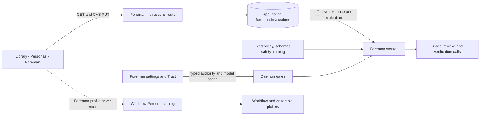

# Editable Foreman profile

Status: **approved on 2026-08-15**

## Outcome

Give Foreman a first-class, editable profile beside Personas in the Library without turning it
into a workflow Persona.

The profile lets an operator read, preview, replace, clear, copy, download, and restore Foreman's
standing guidance. It also makes the current provider and model-role configuration easy to find.
Foreman's identity, built-in operating policy, safety boundaries, protocol grammar, and eligibility
remain owned by Mission Control and cannot be changed through the profile.

The intended result is:

- Foreman appears under a distinct **System** group in **Library -> Personas**;
- its fixed identity is visibly different from built-in and operator-authored workflow Personas;
- its standing Markdown is editable with the same quality of draft, preview, conflict, keyboard,
  copy, download, and reset interactions as the Persona editor;
- operational and authority-bearing controls retain one owner in the top-bar Foreman control,
  **Settings -> Foreman**, and **Settings -> Trust**;
- Foreman never enters the Persona catalog consumed by workflow stages or ensemble evaluators;
- a save affects the next Foreman evaluation, while an evaluation already in flight finishes with
  the exact guidance it captured at its start.

## Approved decisions

- **Profile location:** add a System guidance profile in the Persona Library. Existing Settings,
  top-bar, and Trust surfaces continue owning typed model, operational, and authority controls.
- **Save semantics:** keep one current, exact-text document with compare-and-swap conflict
  protection. Do not add immutable version history or an activation step.
- **Prompt coverage:** preserve the current guidance surfaces only: triage, full review,
  queued-work verification, and prompted completion verification. Do not add the guidance to
  backlog dependency planning.
- **Follow-up:** stop after publishing this approved root plan. Do not create phased plans or
  implementation tasks.

## Why this is smaller than the older Persona versioning plan

`docs/plans/persona-versioning-and-foreman/plan.md` proposed extracting a shared Persona domain,
adding immutable Persona versions, migrating every workflow draft, changing ensemble references,
and representing Foreman as a non-stage-eligible database Persona. The repository has changed since
that plan was written:

- Persona authoring now has an independent home in the Library rather than under Workflows or
  Settings;
- operator Personas still use one mutable row with a compare-and-swap revision;
- workflow publication already snapshots exact Persona content for durable execution;
- Foreman's standing guidance already has a dedicated storage and prompt-injection seam;
- no current consumer needs Foreman to share the workflow Persona store.

This plan therefore does not make general Persona versioning a prerequisite for editing Foreman.
It reuses the current product semantics: one current editable document protected against stale
writes, with immutable workflow snapshots remaining a separate concern. The older plan remains a
possible future expansion for Persona history, but its broad migration is not required here.

## Current repository facts

| Current behavior | Owner | Consequence for this plan |
| --- | --- | --- |
| The shipped seed is `personas/FOREMAN.md` | `foremanInstructionsPath()` and `src/server/foreman/instructions.ts` | Keep it as the built-in default and the Reset target. |
| `app_config["foreman.instructions"]` stores a custom string; empty and unset are different | `src/server/foreman/instructions.ts` | Preserve all three states: built-in default, custom Markdown, and no standing guidance. |
| `GET` and `PUT /api/foreman/instructions` already read, replace, clear, and reset the document | `src/server/routes.ts` and shared Zod schemas | Strengthen this route with stale-write protection instead of inventing a second storage path. |
| The Foreman worker reaches the daemon over HTTP and reads guidance once per evaluation | `src/server/foreman/client.ts` and `worker.ts` | Keep Foreman HTTP-only and keep the one-capture boundary. |
| Standing guidance is inserted by `instructionsSection()` into triage, full review, and verification prompts | `src/server/foreman/prefs.ts`, `prompt.ts`, `triage-prompt.ts`, and `queue-prompt.ts` | Keep the existing one-way ratchet and prompt placement byte-for-byte outside the edited block. |
| Workflow Personas are delivered through `PersonaManager`, Registry/SSE, `/api/personas`, workflow pickers, and ensemble pickers | `src/server/workflows/*`, `src/web/useEventStream.ts`, and Library/workflow/ensemble components | Do not put Foreman into this collection. Absence is the strongest eligibility rule. |
| Foreman's operational controls are already distributed by purpose | top-bar Foreman control, `Settings -> Foreman`, and `Settings -> Trust` | Cross-link these owners; do not create duplicate controls in the profile. |

The daemon remains the only SQLite writer. The worker must not import the Persona store or the
instructions storage module.

## Editable and application-owned boundaries

The central rule is that prose may shape judgment but may not grant authority or rewrite the
protocol that makes Foreman safe and compatible.

| Surface | User editable? | Reason |
| --- | --- | --- |
| Standing guidance: priorities, quality bar, escalation preferences, completion expectations | **Yes, in the System profile** | This is the operator speaking to Foreman and is already the supported editable prompt block. |
| Empty guidance | **Yes** | Empty means "use Foreman's built-in policy without extra operator guidance," not Reset. |
| Restore `personas/FOREMAN.md` | **Yes, explicit Reset** | Reset is a separate action because default and empty are intentionally different. |
| Provider and Review, Verify, Triage, and Backlog model overrides | **Yes, in Settings** | These are typed cost and quality controls with four distinct roles, not profile prose. |
| Enable, mode, access approval, queue budgets, backlog automation, wrap-up, and PR follow-through | **Yes, in the top-bar control or Settings** | These are operational choices with bounded schemas and visible consequences. |
| Repository allowlists | **Yes, in Trust** | Repository consent remains an explicit authority grant and must never be inferred from Markdown. |
| Name, description, system identity, archive/delete state | **No** | Foreman is an application service with one durable meaning, not a user-created reusable role. |
| Workflow-stage or ensemble eligibility | **No** | Foreman must never be selectable as a reviewer or evaluator. |
| Review policy, triage buckets, verifier contract, structured-output schemas | **No** | Existing features parse and act on these exact contracts. Editing them could make output unreadable or reverse safety decisions. |
| Destructive-action backstops, allowlist checks, invite checks, delivery validation | **No** | These enforce authority in code and must outrank prose. |
| Menu/request grammar, evidence fences, prompt-injection framing, captured context | **No** | These are compatibility and trust boundaries, not operator preferences. |
| Lease timing, retry caps, prompt-size caps, retention, concurrency, and transport behavior | **No profile control** | These are application mechanisms or existing environment escape hatches, not choices a profile can safely express. |

Standing guidance continues to be a one-way ratchet. It may make Foreman more careful, move an ask
away from automatic approval, or raise the definition of complete. It cannot make Foreman less
careful, authorize a destructive action, bypass a typed switch, dictate a literal message, or
redefine the JSON it must return.

This change does not add standing guidance to the backlog dependency planner. It preserves the
current prompt coverage: triage, full review, queued-work verification, and prompted completion
verification. Expanding guidance to another model role is separate product behavior and needs its
own review of cost, prompt size, and authority.

## Product experience

### Library entry and routing

Add a fixed `foreman` asset under `#/library/personas/foreman`.

The Persona rail becomes three groups in this order:

1. **System**: Foreman, always one row;
2. **Built-in**: app-owned workflow review Personas;
3. **Yours**: imported and operator-authored workflow Personas.

The Foreman row is sourced locally by the Persona Library and is not appended to the streamed
`PersonaView[]`. Its sub-label names its effective provider and the fact that it has four model
roles. A `System` tag and tooltip say that it is not available to workflows or ensembles.

The Library front-page Personas shelf also shows Foreman as a System card. The card opens the fixed
route above and does not change the count of workflow Personas.

### Foreman profile editor

Use the Persona workspace's visual language without forcing Foreman through `PersonaEditor`'s data
model. A focused `ForemanProfileEditor` can reuse the shared workspace header, file editor, Markdown
preview, property chips, overflow menu, copy feedback, and unsaved-change navigation guard.

The workspace shows:

- fixed name **Foreman** and a fixed application-owned description;
- `System profile` and `Not available to workflows or ensembles` identity copy;
- a source chip: **Built-in default**, **Customized**, or **No standing guidance**;
- a provider/model summary linking to `Settings -> Foreman -> Models`;
- an authority summary linking to the top-bar Foreman control and `Settings -> Trust`;
- character usage against the existing 64,000-character API ceiling, with the server also
  enforcing the request-body limit;
- **Edit** and **Preview** modes for the effective standing Markdown;
- one promoted **Save** action;
- overflow actions for **Copy Markdown**, **Download FOREMAN.md**, and **Reset to built-in default**.

There is no Rename, Duplicate, Archive, Delete, or Re-import action. Duplicate would imply that
standing preferences are a complete workflow reviewer prompt when they are only an overlay on
Foreman's fixed policy. Operators can still copy or download the exact Markdown.

Reset requires confirmation when it discards a custom or empty saved state. Clearing the editor and
saving stores the intentional **No standing guidance** state. Reset restores the shipped default;
the two actions never collapse into one another.

### Cross-links, not duplicate owners

Add a compact **Standing guidance** card near the stable posture in `Settings -> Foreman`. It reports
the current source and opens the Library profile. The Library profile links back to the Models,
Foreman posture, and Trust controls.

Provider/model fields remain in `Settings -> Foreman`; authority and scheduling controls remain in
their current top-bar and Settings homes. This keeps one writing surface per value and avoids two
tabs presenting different optimistic state for the same high-impact switch.

## Persistence and API contract

### Keep the existing value and add compare-and-swap

Continue storing the exact custom string in `app_config["foreman.instructions"]` and `null` for the
built-in default. Do not add a Persona row, a second text key, or a database migration.

Build a stable ETag from both the source discriminator and exact effective bytes:

- `builtin` plus the seed bytes for the default state;
- `custom` plus the stored non-empty bytes;
- `none` for an intentionally stored empty string.

Including the source prevents custom text identical to the default from being mistaken for the
built-in state. The ETag provides the same stale-write protection the Persona editor gets from its
integer revision without changing the storage shape or losing downgrade readability.

Define shared browser-safe response and mutation schemas in `src/shared/protocol.ts`:

```ts
interface ForemanInstructionsView {
  text: string;
  defaultText: string;
  source: "builtin" | "custom" | "none";
  etag: string;
}

type ForemanInstructionsUpdate =
  | { expectedEtag: string; text: string }
  | { expectedEtag: string; reset: true };
```

The exact schema may use a discriminated Zod object, but it must preserve these semantics:

- text is observed and bounded but never trimmed or newline-normalized;
- the empty string is valid;
- Reset and empty are distinct variants;
- `expectedEtag` is required on every mutation;
- a stale write returns HTTP 409 with code `foreman_instructions_revision_conflict` and the current
  `ForemanInstructionsView`;
- malformed, oversized, or non-loopback requests are refused before storage changes.

Keep `GET /api/foreman/instructions` as the worker and editor read. Keep `PUT` as the single mutation
route, now CAS-protected. The worker client continues projecting only `text`; browser code consumes
the full view.

The editor fetches the body only when the Foreman profile is selected and again when that browser
window regains focus. A clean editor adopts a changed ETag. A dirty editor preserves every local
byte and shows the same explicit reload-versus-keep-editing conflict pattern as the Persona editor.
No 64 KB document is added to the global SSE snapshot or the existing four-second Foreman status
poll.

### Runtime atomicity

Preserve the current per-evaluation capture:

1. The worker requests the effective standing text once while gathering the other inputs.
2. Shadow triage and full review receive that same captured string.
3. A verification call receives the one string gathered for that verification.
4. A profile save during a model call does not mutate the in-flight prompt.
5. The next evaluation reads the newly saved state.

`instructionsSection()` and its framing stay the only way editable prose enters a Foreman prompt.
Tests continue pinning that adding guidance changes only that section.

## Data and request flow



There are two independent inputs to Foreman: editable judgment guidance and typed operational
configuration. The daemon enforces authority after model judgment. Workflow and ensemble consumers
continue to see only the workflow Persona catalog.

## Workflow and ensemble exclusion

Do not add a `stageEligible` flag merely to filter Foreman back out of a catalog it does not need to
enter. Use separation as the primary invariant:

- `PersonaManager.list()`, `personaCatalog()`, Registry snapshots, and `persona_upsert` never contain
  Foreman;
- `/api/personas` and `/api/personas/:id` do not resolve the fixed Foreman profile id;
- `PersonaView` and the `personas` SSE collection remain workflow Persona contracts;
- the Library alone composes its local System entry with the streamed workflow Persona entries;
- workflow stage pickers, workflow graph validation, publish, and ensemble evaluator pickers remain
  unchanged and therefore cannot select Foreman;
- a forged workflow or ensemble reference to `foreman` fails as an unknown Persona rather than being
  accepted and filtered only in the browser.

This also keeps Foreman out of Persona imports, plugin catalog sync, drift checks, archive behavior,
name-shadowing, workflow snapshot outdated checks, and ensemble source metadata.

## Implementation workstreams

### 1. Harden the standing-guidance contract

- Add the shared view and CAS update schemas.
- Refactor `src/server/foreman/instructions.ts` to return source-aware views and compute ETags from
  exact bytes without changing the stored value's compatibility.
- Update the GET/PUT route, body limit, 409 conflict response, and loopback integration tests.
- Keep the worker client reading only `text` and keep its unreadable-route degradation to policy
  alone.

### 2. Add the System profile to the Library

- Add a focused browser API helper and `ForemanProfileEditor` rather than widening `PersonaView`.
- Compose the fixed Foreman row into `PersonaLibrary`'s rail and selection model.
- Add the front-page System card and the canonical `#/library/personas/foreman` route.
- Reuse the existing file editor, Markdown preview, workspace header, property chips, copy feedback,
  overlay confirmation, save shortcut, and unsaved-navigation contract.
- Implement clean refresh, dirty conflict, empty-save, character limit, reset, copy, and download
  states.

### 3. Connect the existing configuration owners

- Add the read-only source summary and profile link to `ForemanSettingsPanel`.
- Link the profile's provider/model summary to the existing Models tab and its authority summary to
  the existing posture and Trust controls.
- Keep all existing typed configuration writes on `ForemanConfigPatchSchema`; do not proxy them
  through the guidance route.

### 4. Lock the boundary with tests and documentation

- Add pure and route tests for built-in, custom, empty, reset, exact text preservation, ETag conflicts, malformed
  input, oversize input, and missing seed behavior.
- Add render tests for the System rail group, fixed identity, allowed actions, source states, links,
  dirty/conflict copy, and the absence of workflow-Persona actions.
- Add regression assertions that `/api/personas`, Registry/SSE, workflow choices, graph validation,
  and ensemble choices never admit Foreman.
- Add a Playwright spec that opens the System profile, edits and previews Markdown, saves it, reloads,
  proves the fixed identity and workflow exclusion copy, clears it, and resets to the built-in
  default. Use the real built dashboard and daemon; no model or agent call is needed.
- Update `README.md`, `docs/foreman.md`, `docs/library-and-line.md`, `docs/workflows.md`, and
  `personas/README.md`. Remove the old `Next` note that says the editor will live in Settings and
  document the System-profile boundary instead.

## Verification bar

Implementation is complete only when all focused tests pass and the repository also passes:

```sh
npm run typecheck
npm run lint
npm test
npm run build
npm run smoke
npm run test:e2e -- e2e/specs/foreman-profile.spec.ts
```

The Playwright run must capture review evidence in the gitignored `e2e/.artifacts/` location for the
pull request. No evidence artifact is committed.

## Explicit non-goals

- general immutable Persona history or activation;
- migration of workflow drafts or ensemble evaluator references;
- making Foreman a workflow node, Persona evaluator, or plugin-imported Persona;
- editing the built-in review, triage, verification, backlog, or delivery prompts;
- per-repository or per-session Foreman guidance;
- changing which Foreman roles currently receive standing guidance;
- moving or duplicating authority-bearing controls into Markdown;
- changing worker startup, leases, retention, prompt caps, concurrency, or model-call transport.
