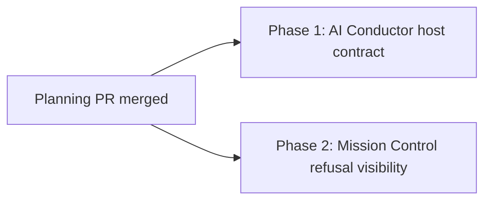

# Phased Plan: Engineer Progress and Refusal Visibility

**Source plan:** `docs/plans/engineer-progress-and-refusal-visibility/plan.md`
**Status:** Ready to schedule
**Repository set:** Mission Control plus `mancej/ai-conductor`

## Implementation outcome

Restore live DECIDE progress for managed Codex Engineer runs at the provider source, prevent the
reproduced artifact-stem refusal when the canonical workflow is followed, and make any remaining
recoverable refusal unmistakable on Mission Control's shared Pipeline surfaces.

## Incorporated human decisions

- The operator explicitly asked to plan and schedule the fixes on 2026-08-31.
- AI Conductor owns lifecycle emission, completion evidence, artifact identity, and land behavior.
- Mission Control owns commission projection and user-visible presentation only.
- No AI Conductor planning skills are used for this planning work.
- Quality and durable ownership take priority over a duplicated Mission Control prompt workaround.

## Repository findings that shape the phases

1. AI Conductor's lifecycle CLI already supports provider-neutral `run-record` transitions and
   validates step names and completion evidence. `docs/reference/cli.md`,
   `src/conductor/src/engine/engineer-cli.ts`
2. AI Conductor documentation names `engineer run-record` as the Codex/no-hook path, but
   `skills/engineer/SKILL.md` never instructs the host to use it. The live transcript followed that
   omission exactly.
3. `engineer worktree` already prints `engineerRunId`, `slug`, `branch`, and `worktreePath`, and writes
   the same identity into `.pipeline/engineer-run.json`. No new identity API is needed.
4. `land-spec.ts` deliberately validates all feature-scoped artifact stems against the reserved
   feature slug. The canonical Engineer skill only says complexity must match the plan stem and does
   not bind the feature artifacts to the returned slug.
5. Mission Control's dispatcher passes the reserved Engineer run id and authoring-worktree reporting
   instruction. Adding step-by-step provider commands there would duplicate AI Conductor's skill.
6. Mission Control's commission reducer retains `engineer_land_refused` as a generic recoverable
   authoring error and clears it on the next provider event, but the persisted commission does not
   preserve whether that error came from land refusal, step failure, or retry.
7. The shared synthetic commission view creates a halt only for terminal `lifecycle === "failed"`.
   A land refusal therefore remains visually `Engineer authoring`; deriving a new halt from generic
   error shape would be ambiguous, so Phase 2 must add explicit reducer-owned blocker provenance.
8. The built-dashboard continuity fixture already drives real commission ingest with fake agents and
   is the correct E2E seam for the visible regression.

## Size estimate

Estimated non-test implementation and maintained contract documentation: **220-350 lines**.

Assumptions:

- 130-210 lines in AI Conductor for the executable lifecycle/naming contract and maintained
  references. Existing CLI and event-store production code should not need expansion.
- 90-140 lines in Mission Control for additive commission blocker provenance, compatibility decoding,
  shared view-model behavior, accessible refusal presentation, and product documentation.
- Tests are excluded and are expected to add roughly 180-300 lines across shell contract checks,
  TypeScript unit coverage, and Playwright E2E coverage.

## Why two phases

The estimate is above 200 lines and the work crosses two independently versioned repositories with
different owners and verification suites.

- Combining the phases would force one task and one review episode to carry a provider workflow
  contract plus a browser-visible consumer hardening change even though each repository remains
  operable alone.
- Splitting by repository makes the ownership boundary reviewable and permits both fixes to run in
  parallel because Mission Control consumes existing provider events and adds only its own additive
  commission projection field, without changing the provider wire contract.
- Neither phase is preparation, test-only, documentation-only, or cleanup-only. Each lands working
  behavior in its repository.

## Phase graph

| Phase | Primary repository | Attached context | Direct dependency | Merge outcome |
| --- | --- | --- | --- | --- |
| [Phase 1: Record live Engineer progress and preserve artifact identity](phase-1-ai-conductor-engineer-host-contract.md) | `mancej/ai-conductor` through the task-provided checkout | Mission Control, context-only | Planning session | Codex/no-hook Engineer runs record live lifecycle events and author under the reserved slug |
| [Phase 2: Surface recoverable Engineer refusals](phase-2-mission-control-refusal-visibility.md) | Mission Control | AI Conductor, context-only | Planning session | Board, Console, and Runs visibly distinguish a recoverable refusal from ordinary authoring |

## Concurrency and merge order

Both phases depend directly on the planning session and may execute concurrently after the planning
PR merges. Neither phase depends on the other's code:

- Phase 1 changes provider guidance and its provider-side contract tests.
- Phase 2 consumes existing Engineer event kinds and adds an explicit Mission Control-owned blocker
  field without changing the provider event schema.

The pull requests may merge in either order. The complete user experience exists when both merge.

## Cross-phase contracts

| Contract | Owner | Consumer rule |
| --- | --- | --- |
| Engineer step truth and completion evidence | AI Conductor | Mission Control projects events and never reconstructs them from files or transcripts. |
| Worktree run identity and feature slug | AI Conductor | Hosts use returned values; Mission Control keeps commission id, Engineer run id, and final plan slug distinct. |
| Recoverable refusal | AI Conductor event, Mission Control presentation | `engineer_land_refused` does not terminate the run; Mission Control records its explicit kind and later provider events may clear the visible block. |
| Commission blocker projection | Mission Control | An additive typed field records only `step_failed` or `land_refused` provenance; generic errors and retry reasons never imply a halt. |
| Commission reducer | Mission Control | Each accepted recovery event clears stale error and blocker before applying its own state, so recovery needs no second cleanup path. |
| Wire compatibility | Existing shared contract | Neither phase renames events, narrows ingest, or changes revision and replay semantics. |

## Publication and task scheduling contract

- The source plan, both HTML renderings, this index, and both phase files are committed and pushed on
  the current Mission Control planning branch before either implementation task is created.
- Every task depends on the current planning session, so it remains backlogged until the planning PR
  merges and these paths exist on the default branch.
- Phase 1 targets AI Conductor and attaches Mission Control as context-only.
- Phase 2 targets Mission Control and attaches AI Conductor as context-only.
- The tasks have no dependency edge between them because their existing interface is already fixed.
- Each task changes and opens a pull request only in its primary repository.

## Final verification strategy

1. Phase 1 structurally proves the canonical Engineer skill cannot omit `run-record`, accepted
   completion evidence, explicit skip/retry handling, or returned-slug naming.
2. Phase 1 reuses the real lifecycle CLI and land tests to prove instructions match executable
   behavior and deterministic gates remain authoritative.
3. Phase 2 proves persistence and the reducer retain explicit failed-step or land-refusal provenance,
   legacy commissions remain readable, the view model blocks only on that provenance, a retry stays
   running, and recovery clears the blocker.
4. Phase 2 reproduces the user-visible defect in the built browser with fake agents and records
   screenshot plus command evidence.
5. Both repositories run their full required typecheck, lint, test, and build gates before their
   pull requests are ready.

## Cross-phase audit record

- 2026-08-31, ownership audit: lifecycle calls and artifact naming remain entirely in AI Conductor;
  Mission Control adds no competing progress source.
- 2026-08-31, compatibility audit: the phases consume the existing provider event contract; Mission
  Control adds only an optional projection field with a legacy-safe default, so they can merge in
  either order.
- 2026-08-31, recovery audit: a refusal remains nonterminal and is cleared by the next accepted
  provider event through the existing reducer reset.
- 2026-08-31, Inspector audit: replaced generic error-shape inference with an explicit typed blocker
  set from `engineer_step_failed` and `engineer_land_refused` only.
- 2026-08-31, task-scope audit: each repository is primary exactly once and context-only once; no
  task is allowed to edit its attached context repository.
