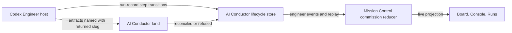

# Engineer Progress and Refusal Visibility

**Status:** Approved for phased implementation
**Requested:** 2026-08-31
**Repository set:** Mission Control and `/Users/jordan.mance/workspace/upstart/ai-conductor`

## Outcome

When a managed Codex Pipeline Engineer authors and the operator approves DECIDE artifacts, the
Pipeline meter advances during the work instead of remaining on an earlier stage. If Engineer later
refuses to land the artifact set, every Mission Control surface that shows the commission makes that
blocked state and its reason visible instead of continuing to say `Engineer authoring`.

## Reproduced failure

The live run proved two independent defects.

1. AI Conductor created and started the reserved Engineer run, selected the repository, and created
   the authoring worktree. The Codex host then authored an approved PRD, stories, and an implementation
   plan, but the provider journal recorded no `engineer_step_started`, `engineer_step_completed`, or
   `engineer_step_skipped` events. Mission Control therefore had no provider-owned progress to project.
2. `land` refused the artifact set because `.docs/specs/2026-08-31-hello-endpoint.md`,
   `.docs/stories/hello-endpoint.md`, and `.docs/plans/hello-endpoint.md` did not use the exact
   worktree-reserved feature stem. AI Conductor emitted `engineer_land_refused`, and Mission Control
   retained its reason, but the Board meter still described the nonterminal commission as authoring.

This was not an approval-ingest delay. The approved files existed on disk while the lifecycle journal
remained unchanged.

## Ownership decisions

- AI Conductor remains the only authority for Engineer step truth, accepted completion evidence,
  feature artifact identity, land reconciliation, and refusal reasons.
- Mission Control continues to consume and project provider events. It must not inspect `.docs/`
  artifacts, infer approval from transcript text, or emit lifecycle events on the provider's behalf.
- The canonical Engineer skill must make the no-hook host path executable. Documentation elsewhere
  already says Codex uses `engineer run-record`; the skill that runs the workflow must carry the same
  contract.
- The `slug` and `engineerRunId` returned by `engineer worktree` are authoritative for the rest of
  that run. Feature-scoped PRD, stories, plan, conflict, complexity, and coherence filenames use the
  returned slug wherever their artifact contract requires a feature or plan stem.
- A tool return alone is not completion evidence. The host records completion only from the owning
  workflow's accepted result or deterministic artifact validation. `land` remains the final
  reconciliation authority.
- Mission Control may derive a visible blocked presentation from provider-projected facts already in
  the commission, but it must not make a recoverable refusal terminal or invent a new provider state.

## Target flow

The successful path advances as each accepted DECIDE step is recorded. The refused path uses the
same event spine and shows a recoverable blocked state with the exact provider reason until a later
provider event clears it.

## AI Conductor changes

Update the canonical `skills/engineer/SKILL.md` contract so a supported host without structured
Engineer hooks:

- captures the exact `engineerRunId`, `slug`, `branch`, and `worktreePath` from the worktree command;
- uses that run id for validated `run-record` transitions around every applicable Engineer lifecycle
  step, including explicit skips and retry/failure transitions;
- uses accepted-result or artifact-validation completion evidence, never mere tool return;
- names every feature-scoped artifact from the returned slug and checks the filenames before `land`;
- preserves keep-on-failure behavior and guides repair in the same authoring worktree after a refusal;
- records or relies on deterministic land reconciliation without double-emitting mechanical events.

Pin these requirements in the provider skill contract tests and align the maintained Engineer and
lifecycle reference documentation. The existing CLI and event schemas are sufficient; do not create
a second lifecycle API unless implementation proves a missing deterministic primitive.

## Mission Control changes

Keep the provider integration and persisted contract unchanged. Harden the shared commission view
model so a current provider-projected failed step or land refusal produces a visible halted treatment
and exact reason on the Board, Console, and Runs surfaces. A retry-in-progress remains running, and a
later successful or retry event clears the old refusal through the existing reducer behavior.

Reproduce the problem in the built dashboard with Playwright: dispatch a fake managed Engineer,
advance it through real commission ingest, emit a nonterminal land refusal, and assert the card and
detail surfaces no longer present it as ordinary authoring. Then emit a recovery transition and prove
the stale blocked treatment disappears.

Mission Control must not add `run-record` commands to the host prompt. That would duplicate the
provider skill's workflow contract and create two instructions that can drift.

## Acceptance criteria

1. A Codex-hosted Engineer run emits live start, completion, skip, failure, and retry transitions for
   applicable authoring steps through AI Conductor's existing lifecycle command and event journal.
2. An approved PRD advances the Mission Control meter as soon as the corresponding provider event is
   observed, without waiting for `land`.
3. Feature-scoped artifacts use the exact worktree-returned slug, so the reproduced short-name versus
   reserved-name land refusal cannot occur when the canonical Engineer skill is followed.
4. `land` still validates filenames and artifacts independently. Skill guidance does not weaken the
   deterministic gate.
5. A land refusal or failed current step is visibly blocked on Board, Console, and Runs, with the
   exact reason reachable by keyboard and assistive technology.
6. A step retry remains visibly in progress, and a later provider event removes stale refusal copy.
7. Mission Control does not infer step completion, read authoring artifacts, or write provider
   lifecycle state.
8. Existing Claude, direct Engineer, BUILD/SHIP, replay, and uncommissioned flows remain compatible.

## Non-goals

- No change to the Engineer lifecycle wire schema, event discriminants, revision rules, or Mission
  Control ingest envelope unless a repository contradiction is found during implementation.
- No automatic PRD approval detection from files or conversation text.
- No automatic repair or rename of an already-authored artifact set.
- No automatic spec merge or implementation-run behavior change.
- No reopening of the previously completed pipeline-continuity phases.

## Verification strategy

### AI Conductor

- Add structural contract coverage that fails when the canonical Engineer skill omits lifecycle
  recording, completion evidence, explicit skips/retries, or returned-slug naming.
- Exercise the skill contract and existing lifecycle/land tests, then run the repository-required
  typecheck, lint, test, and build gates.

### Mission Control

- Add focused reducer/view-model and static-render coverage for failed-step, land-refused,
  retry-in-progress, and recovered shapes.
- Add a built-dashboard Playwright scenario with fake agents and visible evidence for the card and
  detail surfaces.
- Run focused tests, typecheck, lint, build, smoke, and the focused E2E spec.

## Publication decision

The operator explicitly requested a phased implementation plan and scheduled task or tasks in the
2026-08-31 request. There are no unresolved product or architecture choices.
