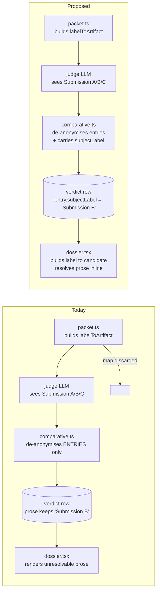

# The ensemble decision dossier: an inverted hierarchy, and three ways to right it

Status: proposed, awaiting direction. Date: 2026-08-01.
Surface reviewed: the Best-of-N decision dossier at `#/workflows/ensembles/<runId>` - `src/web/ensembles/results/BestOfN.tsx`, `results/dossier.tsx`, `results/DecisionPanel.tsx`, `EnsembleMembers.tsx`, `EnsembleTimeline.tsx`, and `styles.css:8785-9354`.
Basis: a live read of a completed three-candidate run in the running dashboard, with every measurement below taken from the rendered DOM at 1440x900 and 1024x900, plus the server-side review pipeline in `src/server/ensembles/reviews/`.

A rendered copy with three mockups lives beside this file as `plan.html`. Open that, not this.

---

## 1. Why this screen

The dossier is where an operator picks a winner. The decision is one-shot and destructive: it promotes one snapshot, reaps the losing worktrees, and refuses a second `decide` on `expectedStatus`. `DecisionPanel` is honest about it - *"Recorded once. A decision cannot be replayed or revised."*

So the screen has exactly one job: **make the choice defensible in under a minute.** Everything below is measured against that job, not against taste.

The feature's information architecture is already good. The strategy renderers preserve the judge's reasoning, the reported-versus-observed split is a genuinely principled distinction, and the CSS carries load-bearing comments explaining most layout choices. This review is not about what the screen knows. It is about the fact that the screen's typography ranks its content in almost exactly the reverse of its evidential value.

---

## 2. What the measurements say

Every figure here was read off the live DOM, not inferred from source.

### 2.1 The type hierarchy is inverted

| Element | Selector | Size | Weight | Colour |
| --- | --- | --- | --- | --- |
| Unverified agent prose | `.ensemble-reported p` | **16px** | 400 | `--fg` |
| Unverified check list | `.ensemble-checks li` | **16px** | 400 | `--fg` |
| Strengths / risks | `.ensemble-scorecard-cols li` | **16px** | 400 | `--fg` |
| Rank marker | `.ensemble-rank` | 16px | 800 | `--fg` |
| **Judge's score** | `.ensemble-score` | **12px** | **400** | **`--muted`** |
| Run intent | `.dossier-intent` | 13px | 400 | `--fg` |
| Frozen cost | `.dossier-cost` | 12px | 400 | `--fg` |

The block the interface itself labels *"Claims, not verified by Mission Control"* is set 33% larger than the judge's score, in a brighter colour. The score - the one number the entire comparison stage exists to produce - is the smallest, dimmest text on the card.

That 16px is not a choice. `body` never declares a `font-size`, so it resolves to the user-agent default and every ensemble paragraph inherits it. The rest of the dashboard sets its own sizes: 87% of all `font-size` declarations in `styles.css` fall between 9px and 13px, with 11.5px as the canonical secondary size. **The decision screen is the one surface in the app that opted out of the app's type scale, and it did so by omission.**

`line-height` on all of that prose computes to `normal` - roughly 1.2 - across a 337px column. Long-form text at 16px/1.2 in a 337px measure is the worst-reading configuration on the page, and it is the largest body of text on the page.

### 2.2 The comparison grid does not compare

`.dossier-cols` is `repeat(auto-fit, minmax(min(320px, 100%), 1fr))` with `align-items: start`. Three columns, no shared rows. Each candidate's prose is unbounded, so each column is an independent essay and peer sections drift apart vertically.

Measured at 1440x900, offsets from each card's own top:

| Section | Candidate 1 | Candidate 2 | Candidate 3 | Spread |
| --- | --- | --- | --- | --- |
| Score line | +71px | +71px | +44px | 27px |
| Reported by this candidate | +97px | +97px | +70px | 27px |
| Observed by Mission Control | +2160px | +1286px | +309px | **1851px** |
| Strengths | +2365px | +1453px | +514px | **1851px** |
| Risks | +2603px | +1691px | +676px | **1927px** |

Card heights: **2806px / 1932px / 936px**. The row is 3.1 viewports tall.

To compare the three candidates' risks - the reason a person is on this screen - you scroll roughly 1900px between each one. At 1024px the columns stack entirely and the same spread grows past 3600px. The layout that exists to prevent holding a candidate in your head requires holding two of them in your head.

The CSS comment at `styles.css:8905` anticipates the failure exactly: *"a column that outgrows it neither clips nor scrolls."* It is right about the mechanism. What follows from it is that nothing bounds the growth.

### 2.3 The judge's headline sentence cannot be resolved

The comparison summary renders verbatim:

> Submission B best addresses the half-screen requirement with a measured responsive ladder and the strongest reported verification. Submission A is a solid, smaller redesign...

The cards beneath it are titled `Candidate 2 (claude · claude-opus-5)`, `Candidate 3 (claude · claude-sonnet-5)`, `Candidate 1 (codex · gpt-5.6-terra)`, ranked `#1 #2 #3`. **Nothing on the screen says which candidate is Submission B.**

This is not cosmetic. Three numbering systems name the same three objects on one page:

- `Submission A/B/C` - the anonymised label the judge saw, embedded in every free-text field.
- `Candidate 1/2/3` - the roster ordinal.
- `#1/#2/#3` - the judge's rank.

None of the three agree, and no legend maps them. In the Timeline the collision lands inside a **single bullet list, two lines apart**: `Submission C provides no test evidence beyond unverified check claims.` sits directly above `Candidate 2 (claude · claude-opus-5) confidence: 90%`.

The cause is precise and the fix is small. `packet.ts:211-217` builds `labelToArtifact` and `artifactToLabel`. `comparative.ts:102` and `panel.ts:137` use it to de-anonymise the **structured** entries, so scores and strengths land on the right candidate. The **free text** - `summary`, `caveats`, per-subject `rationale` - is passed through untouched, and the map is discarded when the packet goes out of scope. The payload is de-anonymised; the prose never is, and the key is thrown away.

Carrying `subjectLabel` on each de-anonymised entry - a value already in hand at both call sites - lets the client build the map and resolve the prose. See the flow diagram in section 5.

### 2.4 Status colour is applied to body prose

`.ensemble-member.ensemble-tone-done` sets a tone colour that cascades to its whole subtree. Measured on the live page, a member lane's evidence list computes to `rgb(53, 192, 138)` - `--idle` green - for multiple paragraphs of ordinary prose. An eliminated member renders its neutral facts (`Attempt #1 · selected`, `commit capture #1`) in `--danger` red.

Two failures at once. Red and green stop meaning pass and fail once they are also the identity of a lane, so a red neutral fact reads as a problem it is not. And saturated hues at 16px over hundreds of words is the least legible body text in the app.

### 2.5 Structure that does not encode information

- `#1 #2 #3` at 16px/800 are the loudest thing on each card, but rank is derivable and already implied by document order. The quantity that is not derivable - **the margin**, 92 against 84 against 67 - is set in 12px muted grey. A decisive win and a coin-flip look identical.
- `Recommended` is bare green text inline in the header, not a badge. Because it sits in the flow, it pushes the recommended card's contents 27px down relative to its peers. The one card you most want to line up against the others is the only one that cannot line up.
- The Events list renders raw enum members - `run_completed`, `member_eliminated`, `finalization_blocked`, `winner_materialized`, `stage_succeeded`, `run_recovered` - in bold at body size, beside 18 identical grey `5d ago` stamps. The system's internal vocabulary is the most prominent text in the block, and the only column that varies carries no information.

---

## 3. The floor: what every direction fixes

These are not alternatives. They are the defects any redesign must clear, and they are cheap.

1. **Declare the type scale on ensemble prose.** Set an explicit size and `line-height` on `.ensemble-reported`, `.ensemble-checks`, and `.ensemble-scorecard-cols` so nothing inherits the 16px UA default. Body prose lands at 12.5px/1.55, inside the app's existing ramp.
2. **Bound the prose.** No cell may set the height of a comparison row. Clamp with an explicit expander.
3. **Resolve the anonymised labels.** Carry `subjectLabel` through to the client and render `Submission B` as the candidate it is, everywhere the judge's free text appears - dossier, timeline, and SSE result labels.
4. **Stop tinting prose with status colour.** Tone stays on the stripe, the dot, and the pill. Body copy stays `--fg`.
5. **Write the event log in the operator's words.** `winner_materialized` becomes `Winner restored to a checkout`; `member_eliminated` becomes `Candidate 3 eliminated`. Group by stage rather than listing 18 flat rows.
6. **Promote the score, demote the rank.** Whatever the layout, the number that carries the judgement outranks the ordinal that repeats the sort.

Directions differ in what they do *after* clearing that floor.

---

## 4. Three directions

The palette is fixed by the brief. Mission Control is dark-only, one `:root`, six state hues, no web fonts, `color-mix` off the existing tokens. None of these directions introduces a colour. The distinctiveness is spent on structure, type hierarchy, and one signature element each.

The subject supplies the vocabulary. The data model already speaks the language of blind adjudication - sealed submissions, ballots, dissent, contested rulings, evidence, what is at stake, a one-shot ruling that reaps. The current visual design spends none of it. That is the material.

### Direction A: The Scoreboard

**Concept.** Transpose the grid. Rows become comparison criteria, columns become candidates. Every row answers one question across all three at once: score, confidence, diff size, frozen cost, elapsed, checks claimed, strengths, risks. Scanning a row is the whole interaction.

**Signature: the margin ruler.** A single 0-100 axis directly under the header, plotting all three scores as ticks on one line. The gap between ticks is the margin of victory - the fact that decides whether the recommendation is worth accepting or worth overriding, and the fact today's `score 92/100` in 12px grey completely hides. It encodes a real quantity spatially, which is what a structural device is for.

**Type.** Scores promoted to 26px `--mono` with `tabular-nums` and tight tracking, `/100` trailing at 10px. Prose demoted to 12.5px/1.55 in a three-line clamp with an inline `Read the full claim` expander. Criteria labels in the app's existing 10.5px uppercase eyebrow treatment.

**Risk taken.** The prose - the thing agents produce most of - becomes the least prominent element on the page. Deliberate: the interface already tells you it is unverified.

**Trade-off.** Closest to conventional of the three; its quality lives entirely in execution precision, and it reads as a spreadsheet if the spacing and rules are careless. Best when candidates are genuinely comparable on the same axes.

### Direction B: The Verdict Sheet

**Concept.** Lead with the ruling, not the roster. One full-measure verdict block carries the judge's summary at a readable measure, with the anonymised labels **resolved inline**: `Submission B` renders as a chip naming the actual candidate. Today's worst comprehension defect becomes the page's signature moment. Beneath it, candidates are a docket of one-line rows; selecting one swaps a single full-measure reading column. Comparison happens by switching, not by scrolling.

**Signature: the seal.** Rank and score set as a letterpress lockup in `--mono` at 34px, `92` large with `/100` at 10px beside it, ranged against a hairline rule. Exactly one per page, on the recommended candidate; the others carry a 13px version. This is the app's first display type, and it is spent once.

**Type.** Verdict prose at 13px/1.62 in a 68ch measure - the only genuinely readable long-form setting in the three directions. Docket rows at 11.5px. Everything else quiet.

**Risk taken.** Introduces a display treatment into an app that has none, and gives up simultaneous three-way comparison. Justified because the subject is adjudication, because `--mono` is already a token, and because today's simultaneous comparison is a fiction - 1927px of scroll between peer sections is not simultaneity.

**Trade-off.** Strongest for reading and defending a decision, weakest for spotting a narrow numeric difference. Best when the judge's reasoning is what you are actually evaluating.

### Direction C: The Ledger

**Concept.** No cards. A blotter at the app's native density: candidates as rows, hairline rules, tabular numerals, the decision radio in the leftmost gutter. All prose lives in a peek pane on the right that swaps as you arrow through rows, so reading a claim never costs your place. The entire decision fits one viewport with no scrolling.

**Signature: the score gutter.** A 3px vertical stripe on each row whose fill height *is* the score. Ranking becomes legible peripherally, without reading a digit - the structural device carries the quantity rather than decorating it.

**Type.** Nothing new. 11.5px rows, 10.5px eyebrows, 12.5px/1.55 in the peek pane, all already in the system. Numerals `tabular-nums` throughout.

**Risk taken.** Restraint. It is the least visually bold of the three, and it wins on precision in spacing, alignment, and rule weight or not at all.

**Trade-off.** Fastest for an operator who runs ensembles often and already knows the vocabulary; least self-explanatory for a first-time reader. Best when the volume of runs is high.

---

## 5. The one flow change

Directions B and C depend on resolving `Submission A/B/C` to real candidates in the client, and the floor requires it regardless. That is the only change to how data moves.

Today the anonymisation key is built, used to de-anonymise the structured payload, and discarded. The prose keeps the anonymised labels and reaches the browser unresolvable.

The change is additive: one existing string, already in hand at `comparative.ts:102` and `panel.ts:137`, persisted on the de-anonymised entry and carried to the client. No new call, no new service, no change to what the judge sees. The anonymity that matters - the judge never learning which agent produced which submission - is unaffected, because it is enforced when the prompt is built, not when the result is read.

---

## 6. Scope

In scope: the Best-of-N dossier and the shared pieces it uses - `dossier.tsx`, `BestOfN.tsx`, `DecisionPanel.tsx`, the `.ensemble-scorecard` / `.dossier-*` CSS, the prose type scale, the tone-cascade fix, the event log copy, and the `subjectLabel` wire addition.

Panel vote and Consensus reuse `CandidateColumn` and inherit the floor fixes for free. Their strategy-specific surfaces - the rank matrix, ballots, divergence cards - are out of scope for this pass and should follow the chosen direction in a later one.

Not in scope: the Compare workspace file matrix, the dispatch flow, run list, artifacts, or the ensembles-live-under-Workflows navigation question. Each is a real topic and none of them is this one.

---

## 7. What ships regardless of direction

The floor in section 3, and a Playwright spec in `e2e/` covering the decision dossier: that the judge's summary names a candidate a person can find on the page, that no candidate column exceeds a bounded height, and that the score is reachable and readable at 1024px. The repository requires a spec for any UI change, and this surface currently has none that asserts what the operator can actually read.
