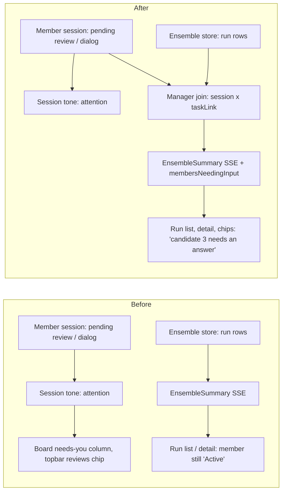

# Ensemble UX: the operator journey, its gaps, and three directions

Status: direction approved 2026-07-26 - phased composition (see Section 8). Date: 2026-07-26.
Basis: a full read of the shipped surfaces (`src/web/ensembles/*`, `src/web/workflows/EnsembleRuns.tsx` / `EnsembleDetail.tsx` / `EnsembleMembers.tsx` / `EnsembleArtifacts.tsx` / `EnsembleActions.tsx`, `session-bits.tsx`), the server lifecycle (`src/server/ensembles/*`), `docs/ensembles.md`, and the 31 `test/ensemble-*.test.ts` files.

This document maps the start-to-finish user story of the ensemble feature as it exists today, catalogs every gap that can leave the operator confused or lost, and proposes three separate solution directions. A rendered copy with mockups lives beside this file as `plan.html`.

---

## 1. The journey today, start to finish

### 1.1 Launching a run

The entry point is the Dispatch modal. A `Single | Ensemble` switch (new dispatches only - an existing backlog Task cannot be converted) swaps the form body for the ensemble dispatch form: a strategy segment (Best of N, Consensus, Panel vote), a candidate roster of 2-5 lanes (agent, model, effort, optional approach nudge), an optional evaluator Persona, judges for panel vote, and an optional Workflow to hand the winner to. A "Launch plan" strip previews the shape (pinned base, one dot per lane, "N comparison calls"). Launch is two-step: **Review launch** posts a side-effect-free preview and records a fingerprint; any edit invalidates it; **Launch N agents** creates the run idempotently and navigates to `#/workflows/ensembles/<runId>`.

This part of the journey is in good shape: descriptor-driven, previewed, idempotent, refusals routed per-field.

### 1.2 Tracking progress

Two places, loosely stitched:

- **The run detail** (`Workflows page -> Ensembles tab -> run`): a status pill; a facts list (Members `N / M max`, **Active stage as the raw `activeStageId` string in a `<code>` element**, base sha, elapsed, concurrency, review-call count and cost, aggregate candidate cost); a Members section grouped by wave, each card carrying status pill, agent/model/effort, attempt and artifact state histories, and a "Reported by member" vs "Observed by Mission Control" split; a Timeline of stage plans, stage attempts (driverKey, commandKey, errors), evaluations, decisions, and the raw event log. The detail refetches when that run's SSE `updatedAt` revises - no polling.
- **The fleet**: each member is an ordinary session (Cards, Console, Board) with an ensemble mark - `EnsembleChip` ("⧉ Best of N · working") on the card and console detail, `E 2 · working` tile flag on the board, a bare `E` glyph in the rail. All deep-link to the run. Nothing groups the siblings; the run's list row shows only `strategy · status word · relative time` plus an attention dot.

### 1.3 When a member needs the operator

A member asks a blocking question through the ordinary session channels: `request_input` over the mission MCP (becomes a `ReviewItem`, answered in the per-session `ReviewModal`), or a TUI/SDK dialog (becomes a `PaneDialog`, answered inline on the session card). The session's tone flips to `attention` ("needs you" board column, topbar "N reviews" chip).

**Nothing on the ensemble side changes.** `EnsembleMemberStatus` has no blocked value; `EnsembleSummary.attention` derives only from run status and `unreadable`; the run detail keeps showing the member as "Active" and the chip keeps saying "working". The two views literally disagree about the same agent.

### 1.4 The decision

When every live member settles and >= 2 (Consensus: >= 3) snapshots are ready, the anonymous comparison runs, the run parks at `awaiting_decision`, and an attention alert fires with a deep link. The strategy result renderers are genuinely strong here:

- **Best of N**: ranked scorecards (score /100, confidence, strengths, risks, rationale), a Recommended tag, an Evidence button per card, and a decision form (radio per candidate + No consensus, required rationale, destructive-confirm checkbox, override warning).
- **Panel vote**: aggregate ranking with Contested marks and per-judge rank strips, a disagreement figure, and every judge's full ballot in a collapsible section.
- **Consensus**: agreements, divergence questions with per-option votes and rationale, an answer form.

The judge's "why" exists and is preserved. What is missing is the material to check it against in one place: diffs render one-at-a-time in a separate Artifacts section; member claims live in the Members section; scores live in Result. Comparing candidates means scrolling among three sections and holding it in your head.

### 1.5 After

Finalization verifies the winner ref, restores or materializes the winner, reaps loser worktrees (never refs), runs the handoff or delivers a continuation, and completes. The outcome section records selected/retained/no-consensus, the materialized task, and the workflow handoff facts. Every artifact remains inspectable (Show diff) and restorable (Reset checkout). A decision is one-shot: a second `decide` is refused by `expectedStatus`. Delete is explicit, typed-id-confirmed, irreversible.

---

## 2. Gap catalog

Grouped by the question the operator is asking. Each entry: what happens today, why it leaves the user confused or lost, and where it lives.

### Group 1 - "Where is my ensemble?" (fleet visibility and orientation)

**G1. Member sessions are never grouped.** Five sibling sessions scatter through the grid, the rail, and across Board tone columns like unrelated work; the only tie is a small chip. There is no way to see "the ensemble" as a unit anywhere in the fleet, and on the Board the siblings can land in three different columns. (`GridView` / `BoardView` / `ConsoleView` have no ensemble input; `groupByTone` in `src/web/lib/tone.ts` knows nothing of runs.)

**G2. The live summary is broadcast but unused.** `EnsembleSummary` carries `readyArtifacts`, `launchedMembers`, `memberCount`, `outcomeKind` on every upsert - and no web surface renders any of them (grep-confirmed; only `launchedMembers` appears, in a tooltip). "3/5 submitted" exists on the wire and nowhere on screen. The run list row is `strategy · status word · time`.

**G3. The marks are state-poor.** The rail shows a bare `E`; the tile flag `E 2 · working`; the chip "⧉ Best of N · working". None carry run status, progress, or a blocked signal - a card that is red with a waiting question still wears a chip that says "working". (`session-bits.tsx:238-380`, `ensembleMemberStateLabel`.)

**G4. No persistent "a run needs you" indicator.** `awaiting_decision` fires one toast; the Ensembles tab has no badge; the topbar has no ensemble chip. Miss the toast and the decision sits silently - the list row's attention dot is visible only if you already navigated there. A `failed` run is deliberately info-severity, which is defensible per-event but combines with the missing badge into "failed overnight, discovered by accident".

**G5. The feature's home is another feature's page.** Ensembles live as a tab on the Workflows page (`#/workflows/ensembles`), and the launch entry is discoverable only through the Dispatch modal's mode switch (the list's empty-state sentence is the sole cross-reference). "Workflows -> Ensembles" also invites conflating two engines the architecture keeps deliberately separate.

### Group 2 - "What is it doing right now?" (progress comprehension)

**G6. Stage progress is spelled in internals.** The header prints `stage-2-review` in a `<code>`; the timeline names driverKeys (`comparative_review@1`) and commandKeys. There is no humanized pipeline (launch -> work -> review -> decide -> promote) even though the compiled plan's `driverKind` sequence expresses exactly that, strategy-agnostically.

**G7. `waiting` is never explained.** Barriers (`members_settled{minEligible: 2}`, `stages_succeeded`, `human_decision`) are not translated: the run says "waiting" without "waiting for 2 more submissions" or "waiting on you".

**G8. Member cards are records, not live views.** No current-activity line (the `report_status` one-liner and goal line exist on the session card but are not projected into the run detail), no per-member elapsed, no live cost before the at-submission freeze. Seeing what a member is doing means Open session and losing the run context.

**G9. A stalled-but-live member is invisible.** `budget.deadlineMs` is null in every shipped strategy; there is no idle/stall detection at the member level. An agent that silently wedged shows "Active" forever, and the only levers are withdraw or wait. (`engine.ts` `enforceDeadline` is the sole timer.)

**G10. Observed model never lands.** `TaskManagerGateway.observedModel()` returns null unconditionally ("a later phase"), so member cards can only ever show the configured model, not what actually ran.

### Group 3 - "Someone needs me" (blocking questions)

**G11. A blocked member does not exist in the ensemble vocabulary.** No member status, no summary field, no run attention, no event. The run detail shows "Active"; `ensembleNeedsAttention` reads only `{status, unreadable}` (`src/shared/ensemble.ts:1260`). An operator watching the run detail will never learn a question exists - a member's pending review does not revise the run row, so the detail does not even refetch.

**G12. Answering requires leaving.** The question is answerable only on the member's session surface (ReviewModal / PaneDialogPrompt), found via the board's needs-you column or the topbar reviews chip. The run detail offers no path to the question and no inline answer surface.

**G13. The answer surface hides the ensemble context.** The topbar chip, ReviewModal, and pane dialog do not say "this session is candidate 3 of 5 in run X". The operator answering cannot tell they are steering one competitor of a comparison - relevant both for fairness (nudging one candidate) and for effort (is this question worth answering, or should the member be withdrawn?).

### Group 4 - "Which one is better, and why?" (comparison and judge reasoning)

**G14. No side-by-side anything.** Diffs are one-at-a-time expandable rows that stack vertically; there is no two-pane diff, no file-touch matrix (which candidates touched which files), no diff-of-diffs.

**G15. Evidence is anchored to whole artifacts.** A scorecard's Evidence button scrolls to the artifact row; a rationale claim like "B missed the migration" cannot be checked against the specific file it is about without hand-searching the patch.

**G16. The comparative material is scattered across three sections.** Member claims + observed stats (Members), scores + rationale (Result), diffs (Artifacts) - nothing composes one comparative row per candidate: summary, diffstat, checks, cost, score, rank, confidence.

**G17. The decision is one-shot and the record is passive.** After finalization the scorecards and ballots persist, but there is no re-decide (by design - `expectedStatus` refuses), no post-hoc comparison workspace, and the fact that loser *refs* survive (restorable work!) is discoverable only by knowing what Reset checkout does. "What was at stake" is answerable but only by re-assembling it manually.

**G18. Judge disagreement is listed, not shown.** Panel vote has the pieces (disagreement figure, Contested tags, per-judge rank strips, full ballots) but no at-a-glance judges x candidates rank matrix and no surfaced dissent ("Risk judge ranked the winner last because ..."). Understanding *why the panel disagreed* means opening every ballot.

### Group 5 - lifecycle edges that surface as UX confusion

**G19. No path from an existing Task to an ensemble.** The mode switch renders only for new dispatches; a backlog task the operator wants to fan out must be retyped.

**G20. `manual` is the only source kind.** No agent-initiated or scheduled ensembles; not a UI gap per se, but it bounds the stories the UI can serve.

---

## 3. One prerequisite shared by every direction

Whichever direction is chosen, the blocked-member signal must reach the wire. Today the "needs you" facts (pending reviews, pane/driver dialogs) live on the *session*, and the ensemble summary is derived purely from run rows, so the fleet and the run views cannot agree about a blocked member.

The fix is a derivation, not a new persisted status (the member status tuple stays append-only and untouched): where session state and the task link meet - the `EnsembleManager`, which holds both the store and the registry (repository verification showed the store is DB-only and the registry is deliberately store-independent, so neither can host the join; see `phase-1-blocked-member-wire.md`) - fold "this member's session needs input" into the published projections:

- `EnsembleSummary` gains `membersNeedingInput: number` (and `attention` ORs it in),
- `TaskEnsembleLink` gains `needsInput: boolean` so the chip/flag/mark can say it,
- the run detail's refetch trigger already follows summary revisions, so publishing the summary on the review/dialog edge makes the detail update for free.

Flow change (before -> after):

This is one derived field in two shared shapes plus a publish edge - it does not add an event type, a table, or a Session field, and it respects the extension contract (no strategy branch, no new route family).

---

## 4. Solution A - "Fleet Lens": the ensemble becomes visible where you already look

**Thesis:** the operator already lives in the fleet (Cards / Console / Board). Make the ensemble legible *there*, and keep the run detail as the deep-dive it already is.

What ships:

1. **Ensemble clusters.** Member sessions render as a visible group: a slim header row with the run title, strategy, humanized stage word, progress dots (one per member: submitted / working / blocked / failed), aggregate cost, and an attention rollup, deep-linking to the run. *(Superseded detail - see `phase-3-fleet-lens.md`, which is authoritative: repository verification showed grid arrow-nav is geometric, so the GRID gets adjacency sorting only and no frame; Board clusters never cross tone boundaries - a blocked member sits in the attention column with the cluster header repeated, rather than dragging working siblings into "needs you".)* The console rail gets a section header per run above its member rows.
2. **State-rich marks.** The chip becomes stage- and state-aware: "⧉ Best of N · reviewing · 3/5 in", or "⧉ needs an answer" (attention-toned) when that member is blocked. The rail's bare `E` gains the same tone. Tile flags carry `E 3/5`.
3. **Progress where the summary already is.** The Ensembles tab gets an attention badge; the run list rows render the progress dots and `readyArtifacts/launchedMembers` counts that are already on the wire; the topbar gains an ensembles chip when any run needs attention (decision waiting or member blocked), clicking through to the run.
4. **Humanized stage vocabulary.** One shared function maps the compiled plan's `driverKind` sequence to operator words (launching, working, reviewing, waiting on you, promoting, done) - used by clusters, chips, list rows, and the run detail header (replacing the raw `activeStageId` code).

Gaps addressed: G1-G7 fully, G11 (visibility half), G13 (the cluster header and chip give the answerer context). Left open: inline answering from the run detail (G12 - still one click to the member card), the comparison workspace (G14-G18), member live views (G8-G10).

Effort: low-to-medium. Risk: Board clustering interacts with tone columns and arrow-nav (`groupByTone` feeds `moveSelection`); the cluster must be a rendering group, not a new tone, or keyboard order breaks.

---

## 5. Solution B - "Run Console": one page that answers everything about a run

**Thesis:** the run detail becomes a command center the operator can stay in - live members, inline questions, humanized pipeline, and a real comparison workspace. The fleet changes minimally (chip gains the blocked state).

What ships:

1. **Stage pipeline header.** A five-step strip derived from the compiled plan (Launch -> Work -> Review -> Decide -> Promote), each step with state and counts ("Work: 3/5 submitted, 1 blocked", "Review: attempt 1 of 3"). Replaces the raw stage id; `waiting` states name their barrier ("waiting for 2 more submissions").
2. **Live member lanes.** Each member card becomes a live view: session tone, the `report_status` activity line, goal line, elapsed, live cost, last transcript event - plus the existing attempt/artifact record behind a disclosure. **A blocked member's question renders inline in its lane**, reusing the existing `ReviewCard`/`DecisionForm`/`PaneDialogPrompt` components and resolving through the existing routes - the operator answers without leaving the run. The lane header labels it "candidate 3 asks:" so context is never lost (G13).
3. **Compare workspace.** A new section: pick any 2-3 ready artifacts -> side-by-side columns with a shared file list (a file-touch matrix: rows = files, columns = candidates, cells = +/- churn), synchronized per-file diff panes, and a claims strip per column (summary, checks, cost, and - once the review lands - score, rank, confidence). Scorecard rationale gets lightweight file anchors: when a rationale names a path present in the diff, it links into the matrix row.
4. **Judge reasoning panel.** For panel vote, a judges x candidates rank matrix with contested cells marked and per-judge dissent lines surfaced above the ballots; for best-of-n, the scorecards mount beside the compare columns instead of a separate Result silo.

Gaps addressed: G6-G18 head-on; G11/G12/G13 fully (with the shared prerequisite). Left mostly open: fleet-level orientation (G1-G5) beyond the enriched chip and the tab badge (which ride along cheaply).

Effort: high. Risk: the detail page must now also read the sessions/reviews maps from the existing SSE state (already in `MissionState` - no new wire), and the compare workspace needs a per-file diff cut of `materializeSnapshotDiff` (a `?path=` filter on the patch route, still byte-bounded).

---

## 6. Solution C - "Attention Inbox + Decision Dossier": design for the two moments that matter

**Thesis:** the operator's obligations are exactly two - answer a member's question, and make the final call. Build the best possible surface for each, and keep ambient monitoring light.

What ships:

1. **Attention inbox.** The topbar reviews chip generalizes into one attention queue: member questions (labelled with their run context: "Best of N 'fix scheduler flake' - candidate 3 asks ..."), decision requests ("needs your decision - 5 candidates ranked"), parked finalizations, gate decisions. Items are answerable inline (reusing `ReviewCard`) or deep-link. One place to drain; nothing depends on catching a toast (G4, G11-G13).
2. **Decision dossier.** When a run reaches `awaiting_decision`, its detail page leads with a purpose-built dossier: an "At stake" header (the intent, base, elapsed, total spend); one column per candidate (summary, observed diffstat, checks, cost, score, rank, confidence, strengths/risks, expandable diff); a judge-reasoning band (rank matrix, consensus statement, surfaced dissent quotes, disagreement figure); and the decision form last, with the override warning in context. After the decision the dossier persists read-only as the durable "why we picked B" record, with Restore actions beside each losing column (making ref retention discoverable, G17).
3. **Run strip on member cards.** Instead of full clustering, each member session card gains a one-line run strip under the title: "⧉ Best of N · candidate 3/5 · run: reviewing · 1 sibling blocked" - orientation without touching Board layout (partial G1, G3).

Gaps addressed: G4, G11-G18 strongly, G6 partially (the dossier humanizes the end; the in-flight middle stays as-is). Left open: true fleet grouping (G1), live member lanes (G8, G9), waiting explanations mid-run (G7).

Effort: medium-high. Risk: the inbox touches the topbar/overlay registry and must not become a second notifier (it is a rendering of existing `ReviewItem`s + ensemble summaries, honoring the shared alert engine boundary).

---

## 7. Comparing the three

| | A: Fleet Lens | B: Run Console | C: Inbox + Dossier |
|---|---|---|---|
| Core bet | You watch the fleet | You watch the run | You answer prompts |
| Grouping (G1-G5) | Full | Chip + badge only | Run strip only |
| Progress (G6-G10) | Vocabulary + counts | Full (live lanes, barriers) | End-of-run only |
| Blocking questions (G11-G13) | Visible, answered on card | Visible + answered in run | Visible + answered in inbox |
| Comparison (G14-G18) | Unchanged | Full workspace | Dossier (decision-time) |
| Effort | Low-medium | High | Medium-high |
| Main risk | Board nav complexity | Detail-page scope | Second-notifier temptation |

They are separable but not exclusive: A's shared stage vocabulary and the wire prerequisite (Section 3) are foundations either of B or C would also want. The phased composition below is the adopted road.

---

## 8. Adopted decisions (2026-07-26)

> **Where this section and a phase file disagree, the phase file wins.** The phase documents beside this plan (`phase-1-*.md` ... `phase-6-*.md`, indexed by `phased-plan.md`) were written after repository verification and record explicit reconciliations against this design record: the blocked-member join lives in `EnsembleManager` (not the registry or store), the grid gets adjacency sorting (never a frame), Board clusters never cross tone boundaries, and Phase 3 builds no topbar chip (the topbar surface belongs to Phase 4's inbox). Each reconciliation is logged in the owning phase's cross-phase audit record.

The open choices were put to the operator and resolved as follows:

1. **Direction: phased composition.** Build in this order, each phase shippable on its own:
   - **Phase 0 - wire prerequisite** (Section 3): derive `membersNeedingInput` into `EnsembleSummary` and `needsInput` into `TaskEnsembleLink` at the registry join; run `attention` ORs it in.
   - **Phase 1 - Fleet Lens** (Section 4): ensemble clusters in grid/Board, state-rich marks, tab badge + topbar chip, and the shared humanized stage vocabulary.
   - **Phase 2 - Attention Inbox + Decision Dossier** (Section 6): the unified attention queue and the decision-time dossier with rank matrix and surfaced dissent.
   - **Phase 3 - Run Console** (Section 5): live member lanes with inline question answering, the stage pipeline header with barrier explanations, and the compare workspace.
2. **The wire prerequisite ships first, regardless** - it is Phase 0, not folded into a later phase, so chips and list rows can use it immediately.
3. **Compare surface v1 is the full build: file-touch matrix plus synchronized side-by-side diff panes** (not the matrix-only reduced scope). This requires the per-file cut of the byte-bounded patch route (`?path=` filter on `GET /api/ensembles/:id/artifacts/:artifactId/patch`).
4. **Follow-up: a phased implementation plan** is to be produced from this document, with merge-aware phase docs and dependency-linked tasks.
