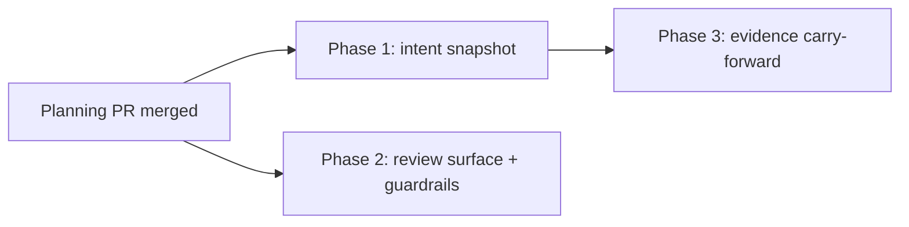

# Evidence preflight reliability fixes: phased implementation plan

Source plan: [plan.md](plan.md) (rendered: [plan.html](plan.html)).

## Incorporated decisions

The operator directed that the validated recommendation set from the evidence-preflight scout
investigation and its validation pass be planned and scheduled as implementation work. The resolved
decisions are recorded in the source plan's Decisions section; the load-bearing ones for phasing:

- The run-intent snapshot is the architecture fix and subsumes the origin-guard, run-keyed reuse,
  transcript-filter hardening, and goal-replacement assertion proposals.
- Snapshot freezing happens at run creation (`createInitialSubmission`), the earliest durable
  moment, as established by repository investigation.
- Coverage visibility ships as the Persona-prompt disclaimer, not the rendered coverage block.
- Evidence carry-forward drops the diff-path-intersection auto-expiry tier.
- Parking `criterion_mapped_v1` and the `captureAcceptedPrompt` origin guard are explicitly not
  scheduled.

## Investigated findings

All anchors verified at commit `4e0b70e7` (identical `src/` to the scout's `aa2412c7`):

- Runs insert inside `createInitialSubmission` (`src/server/workflows/store.ts:5316`); a second
  insert path exists near `store.ts:5480`. Both must freeze the snapshot.
- Live intent enters capture at `readWorkflowContextRaw` (`src/server/workflows/context.ts:918`,
  goal read at `:923`/`:971`, decisions at `:952`); `intentFingerprintFields` (`context.ts:201`) is
  both compaction prompt and fingerprint.
- Criteria reuse is gated to `evidence_preflight` segments (`src/server/workflows/manager.ts:6029`),
  so criteria recompact on every Persona round today.
- The Persona prompt renders raw goal and decisions as "# Original human intent"
  (`src/server/workflows/prompt.ts:61`, `:65`) and contains zero coverage references.
- Evidence staging no-op/throw at `store.ts:4621`/`:4623`; one-way reservation at
  `store.ts:8930-8971`; the unchanged-evidence guard compares repository fingerprints
  (`manager.ts:6194`).
- Preflight refinement segments are unbounded (`test/workflow-evidence-preflight.test.ts:280`
  drives fifteen).

## Sizing and phase count

Estimated non-test implementation lines, by phase (assumptions: Zod schemas and migrations counted;
comments counted; test files excluded):

| Phase | Estimate | Basis |
| --- | --- | --- |
| 1 Run intent snapshot | 220-320 | migration + two insert paths + capture rework + run-level criteria store and reuse |
| 2 Review surface and guardrails | 100-180 | one prompt sentence + disagreement event and surfacing + refinement cap |
| 3 Evidence carry-forward | 250-350 | inheritance + digest dedupe + re-staging semantics + marks + cleanup safety |

Total roughly 570-850 non-test lines. Above the 200-line one-shot threshold. Three phases rather
than one because: Phase 1 is a semantic architecture change whose review must not be diluted by
storage mechanics; Phase 3 is storage-heavy work that builds on Phase 1's stable-criteria contract
and rewrites the same `manager.ts` capture region, so serializing them removes a guaranteed
conflict; Phase 2 is independent of both, touches a different surface (prompt wording, verdict
handling, segmentation), and merging it into either neighbor would couple an unrelated review to a
riskier change. No smaller split survives the rubric: tests, migrations, and docs stay inside the
phase that introduces each behavior.

## Phases

| # | Phase | File | Direct prerequisites |
| --- | --- | --- | --- |
| 1 | Run intent snapshot and run-frozen criteria | [phase-1-run-intent-snapshot.md](phase-1-run-intent-snapshot.md) | planning PR merge |
| 2 | Review-surface honesty and loop bounds | [phase-2-review-surface-guardrails.md](phase-2-review-surface-guardrails.md) | planning PR merge |
| 3 | Evidence carry-forward and digest deduplication | [phase-3-evidence-carry-forward.md](phase-3-evidence-carry-forward.md) | Phase 1 |

## Dependency graph and concurrency

- Concurrency group 1: Phases 1 and 2 may run at the same time and merge in either order.
- Phase 3 starts only after Phase 1 merges.
- Every phase is a single-repository merge unit in this repository; no phase attaches another
  repository.

## Merge order

Any order satisfying the graph: {1, 2} in either order, then 3. No intermediate state is broken:
Phase 2's disclaimer and guardrails are correct with or without the snapshot; Phase 3 changes
nothing until it lands.

## Cross-phase contracts

- Phase 1 owns intent freezing, fingerprint semantics, and once-per-run compaction. Phases 2 and 3
  must not read the live Goal for review purposes or re-derive criteria.
- Phase 2 owns the Persona evidence-availability wording and the disagreement/cap event vocabulary.
- Phase 3 owns staging, reservation, freeze, and inheritance semantics, and must preserve the
  repository-fingerprint unchanged-evidence guard and Phase 1's criteria stability.

## Final verification

After all three phases merge: a full-suite `npm test`, `npm run typecheck`, `npm run lint`,
`npm run build`, `npm run smoke`; `npm run test:e2e` if Phase 2 added UI. A manual end-to-end check
against a live No-Mistakes Review v14 binding: pollute the session Goal with a packet mid-run and
confirm frozen intent, stable criteria, inherited evidence with marks, the disagreement signal on a
forced ready-then-fail, and the refinement cap blocking the third consecutive segment.

## Scheduled tasks

One Mission Control task per phase, created in topological order with `dependsOnCurrentSession`
set, so no phase dispatches before this plan's PR merges and Phase 3 additionally waits on
Phase 1's task. Task ids are recorded in the planning session's report and PR description.
