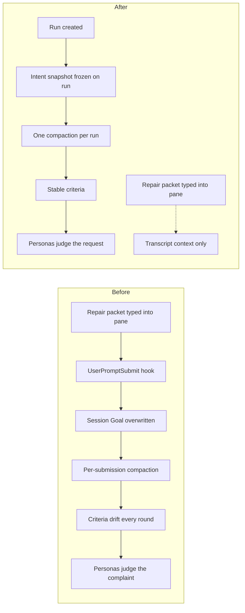

# Evidence preflight reliability fixes

Stop the No-Mistakes Review evidence-preflight repair loop at its root: reviews must be judged
against what the human asked for, not against text Mission Control typed into the session pane.
Alongside that architecture change, make the Persona review surface honest about coverage, carry
evidence forward across rounds instead of forcing re-collection, and add the guardrails that would
have surfaced the loop in one round instead of eight.

## Background

Two scout investigations (archives `d195dfe8-e744-45dc-9ea9-61c1660c7d2a` and its validation pass)
established the failure chain on run `55cdbfef`, which spent 8 repair rounds against a budget of 7
and 6.29 MB of Persona review input, with 6 of its 8 failing verdicts caused by evidence plumbing
rather than the code under review:

1. Workflow repair packets are typed into the pane; the Claude `UserPromptSubmit` hook reports them
   back and `captureHookGoalPrompt` overwrites the session Goal with them. The only guard is the
   launch-echo check (`src/server/registry.ts:7350`), and the goal pipeline never consults the
   injection-origin memory.
2. `readWorkflowContextRaw` reads that live Goal on every submission (`src/server/workflows/context.ts:971`),
   and `intentFingerprintFields` makes `{rawGoal, refinedGoal, decisions}` both the entire compaction
   prompt and the entire intent fingerprint (`context.ts:201`). From submission 3.1 onward the review
   judged the change against criteria distilled from its own complaint text.
3. Because the fingerprint moved every submission, `reuseWorkflowContextCriteria` never fired and
   criteria drifted 4, 3, 6, 5, 5, 5, 5, 7, 2 across the run. Reuse is additionally gated to
   `evidence_preflight` refinement segments (`src/server/workflows/manager.ts:6029`), so criteria
   were structurally recompacted on every Persona round regardless.
4. Repair packets also leaked into `humanDecisions` (7 of 8 decisions by round 8), and the Persona
   prompt renders the raw goal and decisions under "# Original human intent"
   (`src/server/workflows/prompt.ts:61`, `prompt.ts:65`). The validation pass established that this,
   not the rendered transcript, is how Personas learned the preflight's coverage vocabulary: all 11
   frozen transcripts contain zero packet text.
5. The Persona prompt renders no coverage data at all (zero references in `prompt.ts`), so
   `nmr-code-quality-judge` rejected five submissions for missing coverage that was frozen in
   `workflow_submission_evidence_coverage` (5 to 8 rows each time).
6. Evidence is consumed one way at capture (`staged` to `reserved`, `src/server/workflows/store.ts:8962`);
   re-staging an identical item is a silent no-op and re-staging under a reserved id throws
   (`store.ts:4621`), so agents mint fresh id prefixes every round. 41.6% of all evidence
   registrations in the live database are byte-identical duplicates; one 38,600-byte screenshot was
   registered nine times.

## Decisions

These were resolved by the operator's instruction to schedule the validation report's recommended
fix set, and by repository investigation during phasing:

- **Adopt the run-intent snapshot as the architecture fix.** It subsumes the origin-guard,
  run-keyed criteria reuse, fail-closed transcript matching, and mid-run goal-replacement assertion
  proposals from the original scout report: freezing intent once makes the mutable channel's
  cleanliness irrelevant to review correctness.
- **Snapshot at run creation, not at binding.** The repository resolves "binding time" to
  `createInitialSubmission` (`src/server/workflows/store.ts:5316`): a run does not exist until its
  first submission triggers, and that is the earliest moment the store can own a durable snapshot.
  On the observed run the goal was still clean at that point (pollution began at submission 3.1).
- **Mid-run human input does not amend intent.** Review answers and later human turns still reach
  Personas as transcript and prior-feedback context, labeled as what they are. An explicit operator
  intent-amendment event is future work, out of scope here.
- **Coverage visibility uses the disclaimer option.** Tell Personas that coverage declaration is
  validated before review and is not theirs to judge, next to the existing later-stages sentence at
  `prompt.ts:81`. Rendering the full coverage block to Personas is a possible follow-up, not part of
  this plan.
- **Evidence carry-forward drops the diff-intersection tier.** Artifacts do not reliably declare
  which paths they demonstrate, so auto-expiry by changed-path intersection is guesswork. Staleness
  is covered by inherit-and-mark (origin round plus repository fingerprint, judged by Personas) and
  by the existing unchanged-evidence guard, which compares repository fingerprints
  (`manager.ts:6194`) and is not defeated by inheritance.
- **Transcript-filter hardening is demoted, not scheduled.** The validation pass showed the rendered
  transcript did not leak in the observed run; the leak was into decisions, which the snapshot
  removes from review intent. Hardening remains available as future defense in depth.
- **Parking `criterion_mapped_v1` is not scheduled.** Reverting the built-in to `off` is an operator
  stopgap that these fixes make moot; workflow versions are append-only, so parking would burn a
  version for a temporary state. The operator can still choose it manually at any time.
- **The origin-guard on `captureAcceptedPrompt` is not scheduled.** Under the snapshot it is
  dashboard hygiene, not review correctness; it can ride along with future Goal-pipeline work.

## Design

### 1. Run intent snapshot

Freeze the review's intent once, when the run is created, and derive everything downstream from the
frozen copy:

- `workflow_runs` gains a persisted intent snapshot: the raw goal, refined goal, and human decisions
  as they stood at run creation, plus the fingerprint computed from them. Migration follows the
  addColumn-next-to-upgrade-path convention in `src/server/db.ts`.
- `readWorkflowContextRaw` populates `primaryGoal` and `humanDecisions` from the run snapshot
  instead of the live Goal and live decision extraction. The transcript, diff, standards, and
  evidence remain live per-submission reads; only intent is frozen.
- Canonical criteria are compacted once per run, from the snapshot, and stored on the run. Every
  submission reuses them; the per-submission reuse gate and its fingerprint comparison become
  unnecessary. Coverage reconciliation (`reconcileWorkflowCriterionMappings`) keeps running per
  submission against the stable criteria.
- The Persona prompt's "# Original human intent" section therefore always renders the human's
  request. No repair packet can reach it regardless of hook, attribution, or delivery behavior.

Flow change (before and after):

### 2. Review-surface honesty and loop bounds

- Add one sentence to the Persona evidence-availability contract in `prompt.ts`: coverage
  declaration is validated by the preflight before review and its presence or absence is not a
  Persona concern. This alone addresses five of the eight failing verdicts on the observed run.
- Emit a durable, operator-visible disagreement signal when a Persona fails a submission whose
  readiness evaluation reported `ready`. The plan at
  `docs/plans/criterion-mapped-evidence-preflight/plan.md` already names this metric; it fired five
  consecutive times unobserved.
- Cap consecutive `evidence_preflight` refinement segments per round (they are effectively unbounded
  today; the regression test drives fifteen). After the cap, block the run for the operator instead
  of looping.

### 3. Evidence carry-forward

- An `evidence_preflight` refinement child inherits its parent submission's frozen evidence and
  coverage wholesale. A preflight refinement is a mapping repair, not a re-measurement; on the
  observed run the round-1 screenshot vanished at 2.0/2.1 and a Persona rejected the submission for
  its absence.
  - **Amended 2026-09-09, by operator decision during Phase 3 implementation.** "Wholesale" is
    bounded by the aggregate evidence limits, and cannot be otherwise. Coverage is wholesale
    within the frozen-coverage limit: every parent claim is retained, and only a link whose
    evidence is absent is dropped. That limit binds only when a parent already at `maxClaims`
    meets a child that declared claims of its own, because `listSubmissionCoverage` reads the
    table through a schema capped at `maxClaims` and exceeding it would make the submission's
    coverage unreadable rather than larger. Reaching it is recorded as
    `evidence_carry_truncated`. Evidence cannot be, because `WORKFLOW_IMAGE_LIMITS.maxCount` is
    `LLM_IMAGE_LIMITS.maxCount`, the number of images a single model call accepts, enforced by
    `validateDescriptorSet`; a submission carrying a ninth image cannot be sent to the Persona
    that has to read it. The same counts cap the frozen arrays in `WorkflowContextSnapshotSchema`,
    so an unbounded carry fails the capture as `stale_capture` and loses every item rather than
    the few at the margin, and giving the parent absolute priority instead starves the child's
    repair evidence so the refinement can never succeed. Both were measured. At the cap the carry
    gives up the oldest ancestry first and never an item the previous submission captured itself,
    and records `evidence_carry_truncated` naming what it refused.
- Registering evidence whose `sha256` already exists frozen for the same note reuses the frozen
  blob instead of copying it, and re-staging a byte-identical item becomes attachable to the next
  submission rather than a silent no-op. This removes the minted-id-per-round pattern and the 41.6%
  duplication.
- Across Persona repair rounds, evidence inherits with a mark: origin round and the repository
  fingerprint it was captured at, visible in the Persona manifests, so a reviewer can judge whether
  a two-round-old artifact still proves the current tree.

## Verification

- Unit coverage in `test/` for: snapshot freezing and reuse across submissions, packet-polluted
  goals never reaching frozen intent, criteria stability across rounds, preflight-child evidence
  inheritance, digest-based reuse, the refinement cap, and the disagreement event.
- Any new operator-facing UI for the disagreement signal requires a Playwright spec in `e2e/` per
  repository policy.
- `npm run typecheck`, `npm run lint`, `npm test` for every phase; `npm run build` and
  `npm run smoke` where runtime surfaces change.

## Out of scope

- Rendering full coverage data to Personas (follow-up option).
- An explicit operator intent-amendment event for mid-run scope changes.
- Transcript-attribution hardening (`attributeWorkflowContextTranscript` fallback matching).
- An injection-origin guard in `captureAcceptedPrompt`.
- Reverting or appending built-in workflow versions to park `criterion_mapped_v1`.
