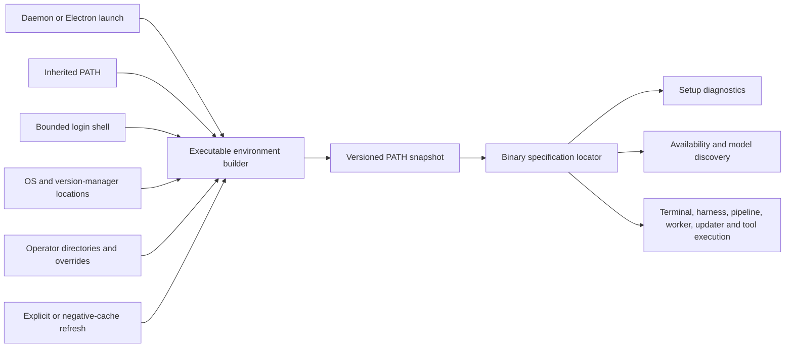

# Executable environment and locator

**Status:** Approved by the task brief
**Date:** 2026-09-04
**Scope:** Executable discovery and child-process environment consistency only. Pi completion events, the work-queue bridge, and broader Pi RPC parity are excluded.

## Outcome

Mission Control will have one daemon-owned executable environment and one binary locator. Every configurable integration declares a binary specification. Discovery, diagnostics, and execution resolve that specification to the same absolute path and launch with the same PATH snapshot. An adopted daemon can refresh its own snapshot without being restarted.

The supported-user contract is deterministic: a configurable tool is discoverable when it is explicitly overridden, located in an operator search directory, inherited on PATH, exposed by a bounded login-shell probe, present in a supported version-manager directory, or installed in a supported OS location. No branch performs an unbounded filesystem scan.

## Boundaries

- The daemon owns the authoritative snapshot, cache, refresh lifecycle, and diagnostics.
- Electron initializes the same environment builder before it starts daemon, Foreman, updater, or integration children. An adopted daemon remains authoritative for its own later children.
- Existing `MISSION_`, `FLEET_`, and `HARNESS_` agent and tool overrides remain valid. Raw historical terminal overrides remain valid.
- `MISSION_EXECUTABLE_PATHS`, with the historical prefix fallbacks, is the explicit ordered list of custom search directories. Absolute per-tool overrides remain the strongest tool-specific input.
- Login-shell discovery is bounded, coalesced, and failure-tolerant. It is not the only source.
- Mise, asdf, and Volta locations remain supported, including `XDG_DATA_HOME`, `MISE_DATA_DIR`, `MISE_SHIMS_DIR`, `ASDF_DATA_DIR`, and `VOLTA_HOME`.
- Fixed OS utilities use explicit absolute-path specifications. Repository and Workflow commands are operator-authored commands resolved only inside the declared child environment.
- There is no recursive or home-directory scan.

## Architecture

The locator never returns a bare configurable command. Its successful result contains a built-in binary id or an explicit null operator-command identity, absolute path, provenance source, source detail, environment generation, and a child environment. Positive entries are revalidated before use. Negative entries share one cooldown and one in-flight refresh. A forced Setup refresh invalidates both positive and negative entries.

## Binary classes

| Class | Contract | Examples |
| --- | --- | --- |
| Configurable | Must declare a binary spec and resolve through the locator | Claude, Codex, Pi, GitHub CLI, Jira, Conductor, git, node, npm, tmux, cmux, terminal applications and desktop launchers |
| Fixed OS | Declared with an absolute path and never searched | `/bin/sh`, `/usr/bin/env`, `/usr/bin/osascript` |
| Operator command | Command comes from a repository or Workflow contract; argv is not added to the built-in catalog, but resolution and execution use the daemon snapshot | Workflow checks and configured setup/install commands |
| Runtime | Uses the already-running absolute executable | `process.execPath` and Electron-as-Node helpers |

## Resolution precedence

1. Tool-specific `MISSION_`, then `FLEET_`, then `HARNESS_` override, followed by retained raw legacy names.
2. Absolute candidates declared by the tool, including terminal application bundles.
3. Operator search directories from `MISSION_EXECUTABLE_PATHS`, then the older prefixes.
4. Inherited PATH entries.
5. Login-shell PATH entries.
6. Supported version-manager directories.
7. Supported OS defaults.

Duplicates retain the first source. Relative directory entries are ignored rather than interpreted against the daemon's working directory. A tool-specific bare override remains accepted for compatibility and is resolved through the same ordered directories.

## Implementation phases

### 1. Foundation and regression contract

- Add shared binary ids, provenance types, and the server-side exhaustive specification registry.
- Replace the mutable global PATH helper with a versioned executable-environment service.
- Cover minimal inherited PATH, login-shell success, noise, timeout and failure, custom directories, version-manager relocation, XDG behavior, absolute overrides, cache coalescing, install-after-start, and forced refresh.

### 2. Detection and execution identity

- Route `resolveBinPath`, `hasBin`, `run`, harness resolution, model discovery, terminal presence, terminal actuation, Setup, pipelines, task sources, open targets, and GitHub helpers through the locator.
- Remove module-load freezes of agent binaries. Each launch obtains one resolved identity and uses its environment.
- Retain app-bundle candidates and terminal-specific environment scrubbing.

### 3. Process-boundary initialization

- Initialize before daemon services start in CLI, LaunchAgent, and app-spawned modes.
- Initialize Electron before daemon, Foreman, updater, integration, and helper children.
- Initialize standalone Foreman before its first model subprocess.
- Ensure agent-isolation overlays preserve the executable snapshot while stripping state and pane identity.

### 4. Diagnostics and enforcement

- Extend Setup rows with resolved-path provenance and make Re-check force the daemon refresh before all probes.
- Add source enforcement that rejects undeclared literal external commands and configurable direct-spawn bypasses.
- Document the supported lookup contract, configuration escape hatches, fixed-utility class, and extension rules.

### 5. Verification

- Focused unit and integration suites prove environment construction, cache behavior, launch identity, terminal behavior, Setup diagnostics, and enforcement.
- Playwright proves that a minimal daemon PATH still exposes resolved path and source, and that Re-check discovers an installation made after startup.
- Run typecheck, lint, build, smoke, relevant Electron tests, the full unit suite, and UI E2E.

## Acceptance mapping

| Criterion | Proof |
| --- | --- |
| Every daemon launch mode initializes the contract | daemon and Electron launch tests plus production entry-point inspection |
| Minimal GUI or LaunchAgent PATH works | locator unit test and Playwright daemon fixture |
| Dead or timing-out login shells degrade | locator timeout/failure tests |
| Standard and custom version-manager paths, including XDG, work | table-driven locator tests |
| Adopted daemons and installs after startup refresh | forced-refresh integration and Playwright Re-check test |
| Overrides and custom terminal application locations work | registry and terminal resolution tests |
| Detection and execution are identical | one resolved-record integration test captures argv0 and PATH generation |
| New integrations cannot invent lookup rules | source enforcement test over production TypeScript |
| Diagnostics expose absolute path and source | Setup render/unit test and Playwright assertion |
| No Pi lifecycle/RPC work enters the diff | scoped diff inspection |

## Risks and mitigations

| Risk | Mitigation |
| --- | --- |
| Shell startup blocks launch | One bounded asynchronous probe with timeout and fallbacks |
| A stale positive path survives an uninstall | Revalidate executability before every cached positive use |
| Optional missing tools repeatedly fork a shell | One shared negative cooldown and one in-flight refresh |
| A child resolves a different binary than detection | Successful resolution returns the absolute argv0 and the environment as one record |
| Tests accidentally use operator tools | Existing fakes remain absolute overrides; test-state isolation remains unchanged |
| A new feature bypasses the contract | Exhaustive registry and source-level architecture test |

## Verify-claims ledger

- **Verified:** agent lookup already refreshes login-shell PATH asynchronously, while terminal presence reads `process.env.PATH` synchronously. Basis: `src/server/util/exec.ts`, `src/server/util/path-env.ts`, and `src/server/terminal/bin.ts` on 2026-09-04.
- **Verified:** model discovery and headless LLM runners can resolve or freeze agent binaries independently. Basis: harness model modules, `src/server/claude-cli.ts`, and `src/server/llm/codex.ts`.
- **Verified:** Electron, Foreman, updater, open targets, pipelines, Setup, and terminal adapters contain distinct executable seams. Basis: production source inventory on 2026-09-04.
- **Confirmed input:** comprehensive scope, deterministic discovery sources, no unbounded scan, diagnostics, refresh, and Pi RPC exclusions are stated directly in the task brief.
- **Assumptions:** none remain load-bearing. Configuration precedence and fixed-utility classification are decisions recorded in this plan.
