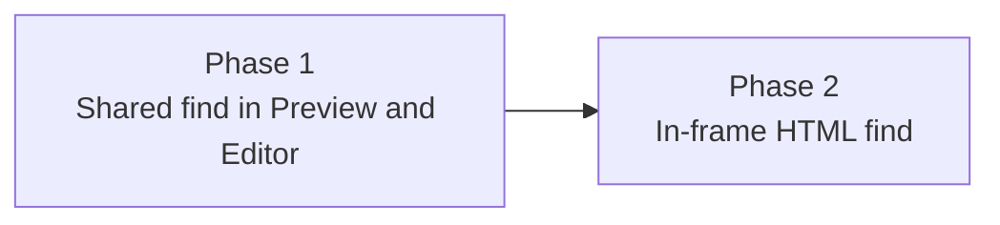

# Phased implementation - Find in a document

Source plan: [`plan.md`](plan.md) (rendered: `plan.html`).

## Incorporated decisions

Submitted by the human on the source plan's review, and treated here as requirements rather
than options:

| Decision | Selection | Where it is owned |
| --- | --- | --- |
| Approach | **Option C** - character-accurate find in Markdown preview and Editor now; HTML preview reveals the block containing the match; the hashed in-frame bridge lands later as its own change | Phase 1 (find, plus the HTML block reveal), Phase 2 (the bridge) |
| CodeMirror's built-in search panel | **Replaced** by the shared bar; `searchKeymap`'s Mod-f dropped | Phase 1 |
| Chord registration | **Contextual claim** by the Files workspace; no new `ActionId`, no Keyboard panel row | Phase 1 |

The human chose "in the same change" for the HTML block reveal, so it sits in Phase 1 with
the rest of the first landing rather than being split out for tidiness.

## Findings that changed the plan

Investigated against the checkout before phasing. Each is recorded in the phase that owns it.

1. **Ctrl+F does not work today and would not have.** `chordFromEvent` emits `cmd` for
   `metaKey` and `ctrl` for `ctrlKey`, with no platform normalization, and the default binding
   is the literal `cmd+f`. The ask names both keys, so Phase 1 accepts the resolved chord or
   the platform pair. The source plan did not say this; it now does, by way of the phase file.
2. **App needs no edit to stop hijacking the chord.** Its handler returns early on
   `e.defaultPrevented`, and `FileWorkspace` already owns a capture-phase window listener that
   runs first. What looked like a change to global key routing is a change inside one
   component.
3. **The editor theme already styles CodeMirror's search classes.** Reusing
   `cm-searchMatch` and `cm-searchMatch-selected` for the new decorations means the editor
   needs no new CSS, and the replaced panel leaves no dead styling behind.
4. **`Markdown` is memoized by an explicit comparator** whose own comment warns that a prop
   missing from it is "a silently ignored prop". The find prop must be added there, and the
   nested `rehypePlugins` ternaries need restructuring rather than a fourth level.
5. **Highlighting inside the HTML preview may not insert elements.** The comment bridge
   addresses blocks by indexing element children from `document.body`, so inserting `mark`
   elements would shift those indices and make comments anchor to neighbours. Phase 2
   therefore uses the CSS Custom Highlight API and mutates nothing - a design constraint the
   source plan had not surfaced.
6. **The frame must report its own count.** Phase 1 counts HTML matches over source text,
   which can include matches the rendered page never shows. Phase 2 replaces that number with
   the frame's, so Phase 1's bar takes the count as a supplied value from the start.
7. **A text-node walk is not a rendered-text walk, and geometry cannot finish the job.**
   `title`, `style`, `script`, `template` and hidden subtrees are all text nodes, and
   `inlinePreviewStyles` puts an inlined checkout stylesheet's text wherever its `link` sat -
   including the body. Phase 2's count therefore passes candidates through three gates:
   container, then visibility with `checkVisibility`'s flags spelled out (its default ignores
   `visibility: hidden` and `opacity: 0`), then a client-rects check. The last one proves a box
   exists, not that anything is painted - hidden and fully transparent text is laid out and
   returns rects - so it is the backstop, never the whole rule.

## Sizing

Estimated **650 to 1000 non-test implementation lines** across the whole feature, split
roughly:

| Area | Estimate |
| --- | --- |
| `documentFind.ts` core and the `find.ts` split | 90-150 |
| `FindBar` extraction and the conversation wrapper | 120-170 |
| `rehypeFindMarks` plugin | 90-140 |
| `Markdown.tsx` wiring (prop, comparator, plugin array) | 40-70 |
| `FileEditor.tsx` (find field, decorations, Mod-f claim, scroll) | 110-170 |
| `FileWorkspace.tsx` (session, chord, bar, mode persistence, HTML reveal) | 180-280 |
| `styles.css` | 30-60 |
| Phase 2: bridge script, CSP hash, parent message plumbing | 120-200 |

Assumptions: the conversation's find primitives are moved rather than rewritten; the bar is
extracted rather than redesigned; no results rail; the HTML reveal reuses the existing
endpoint, nonce guard and target-message plumbing rather than adding its own.

## Phase count rationale

Two phases.

**Why Phase 1 is not split further.** The requirement is one find whose query and count are
the same in both modes, which is only demonstrable with both adapters present. A core-plus-bar
phase would ship a find bar with nothing to search - a dead surface - and splitting the two
adapters would put the find session's query and index in two places at once, which is the
temporary second source of truth the phasing rules warn against. It is a large slice, and it
is one slice.

**Why Phase 2 is separate.** It edits the dashboard's one sandboxed preview boundary, shared
with Scouts: a fourth hash-pinned script and a CSP `script-src` change, verified by a test
that recomputes every hash. Its risk, its review specialty and its verification are different
in kind from the rest, the human explicitly deferred it, and Phase 1 is fully operable without
it - HTML previews get the block reveal rather than a broken half-feature.

## Phases

| # | Phase | File | Depends on | Delivers |
| --- | --- | --- | --- | --- |
| 1 | Shared find in Preview and Editor | [`phase-1-shared-find-preview-and-editor.md`](phase-1-shared-find-preview-and-editor.md) | - | Cmd+F / Ctrl+F over a document: shared core, shared bar, Markdown marks, Editor decorations replacing CodeMirror's panel, contextual chord, HTML block reveal |
| 2 | Character-accurate find inside the HTML preview | [`phase-2-html-preview-in-frame-find.md`](phase-2-html-preview-in-frame-find.md) | Phase 1 | Hash-pinned in-frame highlight bridge, frame-reported count, chord forwarded out of the sandbox |

## Dependency graph

Concurrency: none. Phase 2 consumes Phase 1's core, bar contract and session ownership, so
the two are strictly ordered. Merge order is 1 then 2.

## Cross-phase contracts

- **One matcher, applied per surface to the string that surface renders.** `documentFind.ts`
  owns literal matching, hit keys and the ring. The Editor searches source; Markdown preview's
  hits are the marks the rehype plugin produced; Phase 2's frame reports what it can highlight.
  Three surfaces, one policy for what counts as a match, and never one hit list shared by two
  surfaces showing different text - a markdown link destination is a source occurrence that
  renders to nothing, so a shared count would offer a match nothing can reach.
- **Hit keys are namespaced by surface**, so a rendered key and a source key can never be
  mistaken for one another, and position crosses the Preview/Editor toggle by source line
  rather than by a character mapping that the markdown transform does not preserve. Every
  rendered hit therefore reports the source line range of its block, because a key alone says
  nothing about where in the source it came from.
- **A match is a logical hit over rendered runs, not a per-node scan.** Both rendered surfaces
  join eligible text nodes within a block before matching, so `foo<strong>bar</strong>` searched
  for `foobar` is one hit - and one hit is one number in the count however many fragments or
  client rects it takes to draw. Runs never cross a block boundary, skip text that occupies no
  space, and break at text that occupies space but is hidden.
- **The bar takes supplied numbers.** Count and current position are props, so the source of
  the HTML count can move from source text (Phase 1) to the frame's report (Phase 2) without
  touching `FindBar`.
- **One session owner.** `FileWorkspace` holds the find session and claims the chord in both
  phases, including inside the extracted `FileWindow` overlay.
- **The preview boundary is Phase 2's alone.** Phase 1 touches neither
  `src/web/lib/htmlPreview.ts` nor the CSP; Phase 2 adds exactly one script and one hash and
  changes no existing script body.
- **The block reveal survives as a fallback.** Phase 2 keeps it for the window before the
  find bridge announces its own readiness - never another script's - and permanently in a frame
  whose readiness declares it cannot highlight. Capability is declared on the ready message;
  incapacity is never reported as a count of zero.
- **A chord is only taken by a surface that can answer it.** The Mod-f claim is installed only
  where a caller supplies a find owner, so the three `FileEditor` hosts without one - Persona,
  Session action, Foreman profile - keep exactly the behaviour they have today rather than
  losing the chord to a bar that does not exist.
- **A reported count equals what was highlighted.** Wherever a count comes from, it may only
  include matches that surface renders. Phase 1 keeps HTML honest with a note because its
  count is source-derived; Phase 2 earns the number by counting only paintable ranges.

## Final verification strategy

- Unit tests in `test/` for the core, the rehype plugin and the editor decorations; the CSP
  hash test extended in Phase 2.
- One Playwright spec, `e2e/specs/file-find-in-document.spec.ts`, created in Phase 1 and
  extended in Phase 2, covering: the chord not stealing the Conversation tab, count and
  marks in Markdown preview, the ring stepping, the query and case flag surviving the
  Preview/Editor toggle with each surface's count re-derived over what it shows, a query
  matching only a link destination counting 0 in Preview and 1 in the Editor, and (Phase 2) an
  HTML document where the query also appears in an attribute, a body `style`, a `script`, the
  `title` and hidden subtrees, counted only where it is visible.
- `npm run typecheck`, `npm run lint`, `npm test`, and `npm run build && npm run test:e2e` on
  both phases, per the repository's definition of done.

## Scheduling status

**The phase tasks are not created yet, and creating them now would strand them.** A phase task
carries paths rather than content, so the artifacts have to be committed, pushed and reachable
on the default branch before an agent can act on one.

This planning turn is explicitly not permitted to commit, push, or open a pull request -
Mission Control owns what happens after the plan is delivered. So the artifacts exist in the
worktree, the phase briefs are ready, and the two task creations (Phase 2 depending on Phase 1,
both depending on this planning session) are the first step of the publication follow-up, not
of this turn.
