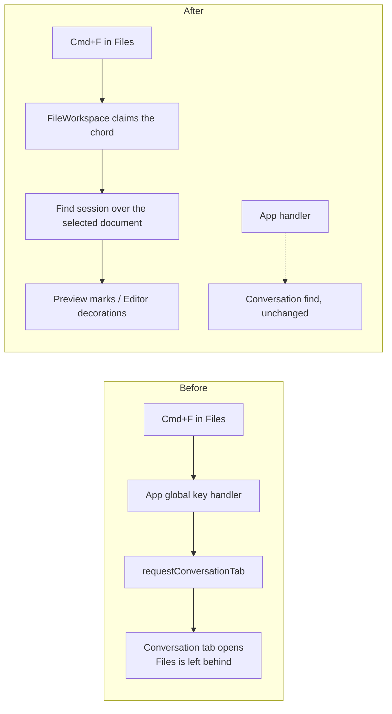
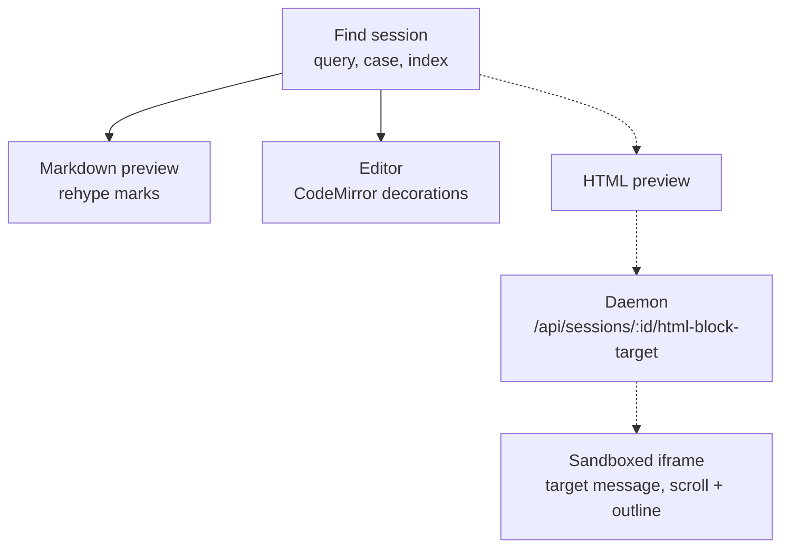

# Find in a document: Cmd+F / Ctrl+F in the Files workspace

## The ask

A person reading a document in the Files tab's **Preview** should be able to press
Cmd+F (Ctrl+F) and search that document, step between matches, and see the count -
the gesture every reader already has in their fingers. The same find must be the same
find in **Editor** mode, not a second one that looks and counts differently.

Rendered page: `docs/plans/files-find-in-document/plan.html`.

## Decisions adopted

| Question | Decision |
| --- | --- |
| Approach | **Option C** - character-accurate find in Markdown preview and Editor now, HTML preview jumps to the containing block through the endpoint that already exists, the hashed in-frame bridge lands later as its own change |
| CodeMirror's built-in search panel | **Replaced** by the shared find bar. Every panel-opening binding `searchKeymap` carries is claimed, not just Mod-f, so the app has exactly one find; find-next and find-previous step the shared ring |
| Chord registration | **Contextual claim.** The Files workspace takes `cmd+f` while a document is on screen; no new `ActionId`, no new Keyboard panel row |

## What is on screen today

The Files workspace (`src/web/components/FileWorkspace.tsx`) renders one of five
surfaces for the selected file, and the Preview/Editor toggle chooses between the first
four:

| Surface | What it is | Searchable today |
| --- | --- | --- |
| HTML preview | sandboxed `srcdoc` iframe, CSP pins three script hashes | no |
| Markdown preview | `Markdown.tsx` (react-markdown + rehype plugins) | no |
| Image preview | `` | nothing to search |
| Editor | CodeMirror 6 via `basicSetup` | accidentally, see below |
| Compare (conflict) | two `<pre>` panes | no |

Three verified facts shape the work.

**1. Cmd+F in the Files tab currently pulls you out of the document.** `App.tsx`'s global
key handler binds `cmd+f` to `findInConversation`. The detail tabs are conditionally
mounted (`tab === "conversation" && <TranscriptPanel .../>`), so while Files is open no
transcript is mounted, no find handle is registered, and the handler falls through to
`conversationReveal` -> `requestConversationTab(sel.id)`. Pressing Cmd+F while reading a
plan in Preview therefore **switches the detail away from Files to Conversation** and
opens find there. This is the first thing the work has to fix.

**2. Edit mode already has a find, and it is not ours.** `basicSetup` from the
`codemirror` package includes `@codemirror/search` (6.7.1 in `package-lock.json`), whose
`searchKeymap` binds Mod-f - and find-next, find-previous and go-to-line besides, each of which
can open that panel too. `App.tsx` returns early on `isTypingTarget` before it reaches
the `findInConversation` branch, and CodeMirror's `.cm-content` is `contentEditable`, so
with the caret in the editor Cmd+F opens CodeMirror's own panel: different chrome,
different count, different behaviour from anything else in the app, and invisible to the
Preview surface beside it. That panel is being replaced rather than left in place.

**3. The conversation already solved the model half of this.** `src/web/lib/find.ts`
holds `buildMatcher`, `matchesIn`, `hitsInWindow`, `stepIndex` and `splitForHighlight` -
pure, DOM-free, unit-tested (`test/conversation-find-model.test.ts`), and built on one
stated invariant: **every counted match is a match a person can see and jump to.** The
chrome (`ConversationFind.tsx`) and the highlight styling (`mark.find-hit`,
`mark.find-hit.is-current` in `styles.css`, already element-scoped and reusable) exist
too. Nothing here grows a second search model.

## What the work must deliver

- Cmd+F over a document searches **that document** and never navigates away from Files.
- One query and one case-sensitivity flag, surviving the Preview <-> Editor toggle, so
  switching modes keeps your search instead of restarting it. The **count is per surface**,
  because the two surfaces show different strings: a markdown document's rendered text has
  fewer occurrences than its source (a link destination in `[label](matching-url)` renders to
  nothing), and a shared count would offer the reader matches Preview cannot highlight or step
  to. Position crosses the toggle by source line - the same neighbourhood, not the same
  character.
- Enter / Shift+Enter step the ring and wrap, Escape closes, reopening keeps the last
  query. The conversation's bar already behaves this way and is the reference.
- Works in the extracted Files window (`FileWindow.tsx`). That window is an `Overlay`,
  and `App.tsx` stands every session chord down while any overlay is open, so the chord
  is owned by the workspace rather than by App.
- A Playwright spec in `e2e/`, per the repository's UI rule.

## The plan

### 1. Shared find core

Split `find.ts`: the generic primitives move into a `documentFind.ts`-style module with a
`FindSession` (query, case flag, index - and deliberately **no hit list**, because each
surface searches the string it renders and therefore has its own hits). `collectHits` and the
conversation scopes stay conversation-specific, so the transcript's behaviour does not change.

### 2. Shared chrome

Extract the bar from `ConversationFind.tsx` into a reusable `FindBar` (input, count, Aa
toggle, prev/next, close) and keep `ConversationFindBar` as a thin wrapper so the
transcript's markup and its specs are untouched. Documents get the bar only, no results
rail: a rail is a conversation affordance (dozens of turns by several authors), and a
document reader wants the count and the ring. `.find-bar` is currently positioned inside
`.find-logwrap`, so the file content area needs its own anchor for the same bar.

### 3. Markdown preview adapter - character-accurate

A `rehypeFindMarks` rehype plugin beside the existing `rehypeWorkspacePaths` and
`rehypeDiagramFences`, splitting hast text nodes into
`<mark class="find-hit" data-find-key>` with the current hit carrying `is-current`, then
`scrollIntoView` on the current key. React keeps owning the nodes, which is the reason
`find.ts` returns data instead of walking the DOM.

It matches over **rendered text**, joined into runs within a block so a hit split by inline
markup (`foo**bar**` searched for `foobar`) is one hit, and broken at every visible
separation - a `br`, a nested block, a table cell edge. It is therefore Preview's model as
well as its renderer: it reports one record per logical hit, with the source line range of
the block it sits in, and the bar's count is that number.

### 4. Editor adapter - character-accurate, and it replaces CodeMirror's panel

Compute matches over the buffer text and paint them with a CodeMirror decoration
`StateField` - the pattern `FileEditor.tsx` already uses for comment markers. Claim every
panel-opening binding `searchKeymap` carries, not just Mod-f - its find-next and find-previous
chords open the panel too when no query is set - so the app has one find and one look. Find-next
and find-previous are repurposed to step our ring rather than deadened. Installed only where a
caller supplies a find owner, so the three other `FileEditor` hosts keep the behaviour they have
today.

The Editor searches **source**, which is what it shows, so its count can legitimately differ
from Preview's on the same file: a link destination is one occurrence here and none there.
One matcher, applied per surface to the string that surface renders - never one hit list
shared by two surfaces showing different text.

### 5. HTML preview - block reveal now, character-accurate later

Phase 1 reuses two paths that already ship: a hit's source line goes to the daemon's
`resolveHtmlBlockTarget` (`/api/sessions/:id/html-block-target`), which returns a
structural block path, and `HTML_PREVIEW_TARGET_MESSAGE` makes the iframe scroll to that
block and outline it. **No new iframe script and no CSP change.** The bar says plainly
that HTML matches are located by block, because the count is taken over source text and
can include matches the rendered page does not show.

Phase 2, as its own scoped change: a fourth hash-pinned bridge script that highlights
inside the frame, reports its own count, and forwards Cmd+F out of the frame - a keystroke
inside the iframe never reaches the parent today, since the keyboard bridge only forwards
Tab, Escape, u and d. That change edits `src/web/lib/htmlPreview.ts`, the CSP hash
allowlist, and `test/html-preview.test.ts`, which recomputes the hashes - a controlled
security boundary shared with Scouts, and the reason it is not rushed into phase 1.

### 6. Ownership and the chord

`FileWorkspace` owns the find session and claims `cmd+f` ahead of App's
`findInConversation`, which is what makes it work in the extracted window and in the
console and board details alike. No new `ActionId`: the ids key persisted overrides in
`app_config.ui.keybindings` and are append-only, and one chord meaning "find in what I am
reading" needs no second row in the Keyboard panel.

The editor adapter is reusable rather than automatic. The Persona, Session action and Foreman
profile editors all host `FileEditor`, so the same find can be given to them later - but each
needs a find owner of its own (a session and a bar), and until it has one it keeps exactly the
behaviour it has today. The Mod-f claim is therefore installed only where a caller supplies
that owner: a chord taken by a surface that cannot answer it is worse than an unstyled panel,
because it leaves those three editors with no find at all.

## Alternatives considered

- **Option A, everything at once.** Same design, but the hashed iframe bridge and the CSP
  edit land in the first change. Rejected as sequencing, not as design - phase 2 above is
  exactly this, taken on its own.
- **Option B, source search with block reveal everywhere.** About half the work and no
  sandbox edit, but Markdown and Editor would both lose character-accurate highlighting,
  and a count taken over source includes matches that are not on screen - a word inside
  `
`, a markdown link target, a front-matter key - which breaks the
  invariant the conversation's find rests on. Kept only where it is the honest best
  available, which is the opaque iframe.
- **Option D, the platform's find.** `webContents.findInPage` in the Electron shell with
  native find in the browser build. Cheapest, and it searches iframes for free. Rejected
  because it searches the whole dashboard - file list, rails, toolbar - rather than the
  document; because CodeMirror only builds DOM for its rendered viewport, so matches below
  the fold do not exist for native find, making edit mode quietly wrong; and because
  nothing about it is assertable from a Playwright spec.

## Verification

- `test/`: the find core over document text (counts, wrap, case, zero-length guard,
  offsets), the rehype mark plugin's output shape via `renderToStaticMarkup`, and the
  editor decoration ranges.
- `e2e/`: a new spec that opens Files on a markdown fixture, presses Cmd+F, types, asserts
  the count, steps with Enter, asserts the current mark moved, switches to Editor and
  asserts the same query and count survive, and asserts the Conversation tab did **not**
  steal the keystroke.
- `test/html-preview.test.ts` recomputes the CSP script hashes; the phase 2 bridge lands
  with that test green.

## Flows this changes

Where the Cmd+F keystroke goes, before and after:

How a match reaches each surface. Solid is phase 1 in the browser; dashed is the HTML
block reveal, the one path that asks the daemon to resolve a source line into a rendered
block:

