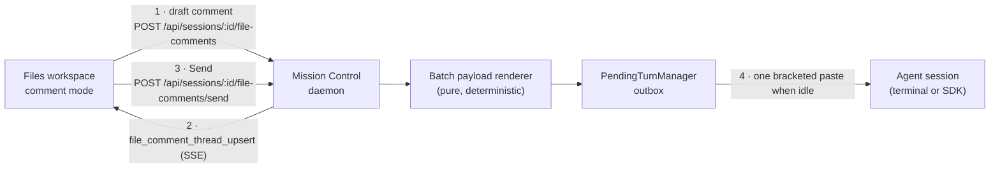
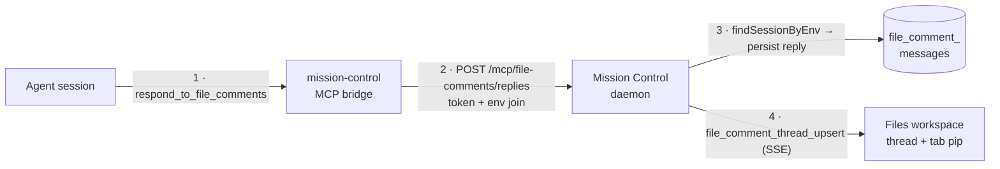

# Line comments in the Files workspace

**Status:** Proposed - awaiting review

**Date:** 2026-08-21

**Owner:** Mission Control web dashboard and daemon

## The problem

You are reading a spec the agent just wrote - `docs/plans/x/plan.md`, or its rendered
`plan.html` - in the Files tab. Line 84 is wrong, the table three screens down is missing a
column, and the diagram contradicts the paragraph above it.

The only way to say so is to leave the file, go to the Conversation, and retype where you
were. The location is translated twice: you turn a position into prose, and the agent turns
your prose back into a position. A pass over one spec produces a dozen of those, so you
either send twelve messages that each interrupt a working agent, or one message that has to
re-establish twelve locations in words.

Every other review surface in this product already knows better. The Inspector anchors its
findings to `path:line` and dedupes them by a fingerprint that deliberately excludes the
line number. The workflow feedback renderer composes many findings into one deterministic
packet and delivers it as a single turn. The Files tab, which is where a human actually
reads a document, has no line-level concept at all.

## Recommendation

Add a **comment mode** to the Files workspace. While it is on, any line of the source or
any block of the rendered document takes a comment. Comments accumulate as a **draft
batch** rather than sending one at a time, and one Send delivers all of them to the session
as a single turn carrying each comment's file, line range, and quoted anchor text.

After sending, each comment collapses to a **marker on its line** - a small pill showing
the reply count. Expanding it opens the thread. The agent answers a thread through a new
Mission Control MCP tool, and the answer lands **in that thread**, on that line, not
somewhere in the scrollback. You reply back in the thread, and your reply joins the next
batch.

Three decisions carry the design:

1. **An anchor is `(path, line range, quoted text)`, not a line number.** The agent is
   about to edit the file the comments are attached to. A line number alone is wrong the
   moment it does. The quoted text re-anchors the thread after an edit, and a thread whose
   text has gone is marked **outdated** rather than silently pointing at a stranger's line.
   This is the Inspector's rule - the fingerprint excludes the line - applied to a live
   working file.

2. **Sending is an ordinary human turn.** The batch is rendered into one text payload and
   delivered through `POST /api/sessions/:id/inject` with `origin: "human"`, which is
   already the dashboard's reply path. That buys the whole existing outbox for free: the
   turn queues in `PendingTurnManager` until the session is observably idle, it is
   editable and recallable before it lands, `canMessage` refuses cleanly when the session
   cannot take it, and the delivery is one bracketed paste rather than keystrokes whose
   newlines would submit early.

3. **A thread is drawn from durable state, never from the transcript.** An MCP tool result
   cannot render itself - every harness parser drops a user turn that is purely a tool
   result as machine noise, which is why `ReviewAnswerCard` exists and is woven in by
   timestamp. Comment threads follow that precedent: rows in the database, a `*_upsert`
   server event, and a UI that reads the rows.

## Open decisions

Four choices below change what gets built, and they are asked as selectable options in the
Mission Control dashboard rather than settled here. This document records the
recommendation for each; the approved answers get written back into this file before any
implementation phase is scheduled.

| # | Decision | Recommendation |
|---|---|---|
| 1 | Which viewer surfaces accept comments in v1 | Editor + Markdown Preview + HTML Preview |
| 2 | What a thread belongs to, and how long it lives | The checkout and the path, not the session |
| 3 | How the agent's reply gets back into the thread | A new MCP tool, with a transcript fallback |
| 4 | What one Send delivers | Every pending comment in the session, grouped by file |

## Scope and effort

This is a large feature. It is not a one-pull-request change and should not be planned as
one.

| Area | Expected scope |
|---|---|
| Production code | About 2,600 to 3,200 non-test lines |
| Tests | About 800 to 1,100 lines across seven unit layers, plus two or three Playwright specs |
| Delivery estimate | About 12 to 18 engineering days across 5 phases |
| Persistence | Two new tables, one `docs/sqlite-database.html` catalog entry each, and the table count in `test/db-shell.test.ts` |
| Wire protocol | Two new `ServerEvent` variants, one new snapshot-adjacent collection, new Zod schemas |
| Agent surface | One new MCP tool, its entry in `MISSION_MCP_TOOLS`, and a `/mcp/*` route bound by `findSessionByEnv` |
| Security-relevant | One new hashed bridge script in the shared HTML preview sandbox (decision 1 only) |
| Main uncertainty | Re-anchoring quality on a file the agent is actively rewriting |

Dropping HTML Preview from decision 1 removes roughly 2 to 3 days, the third bridge script,
and the security review of `src/web/lib/htmlPreview.ts`. Dropping the MCP reply tool from
decision 3 removes roughly 2 days but leaves the agent unable to answer a specific thread,
which is most of the point.

## Repository findings

Everything below was checked against this checkout rather than assumed.

**The viewer is three unrelated renderers behind one toolbar.**
`src/web/components/FileWorkspace.tsx:446-486` branches on `buffer.document.kind`: HTML goes
to a sandboxed `srcDoc` iframe, Markdown goes to `Markdown.tsx`, images go to an ``,
and everything else falls through to `FileEditor.tsx`. Comment mode therefore needs three
anchor implementations, not one.

**The Editor is CodeMirror 6 with real line numbers already on.**
`src/web/components/FileEditor.tsx:98-138` builds an `EditorView` with `basicSetup`, which
supplies the line-number gutter. A gutter marker and a block widget under a line are the
idiomatic CodeMirror extensions for this and need no new dependency. One hazard: the
external-value sync at `FileEditor.tsx:155-162` dispatches a whole-document replace, which
destroys position-mapped decorations - comment decorations must be rebuilt from the anchor
model after any such sync rather than mapped through it.

**Markdown Preview can map a rendered block back to exact source lines.** Verified in this
checkout by running the same plugin chain the Files preview uses
(`remark-parse` → `remark-gfm` → `remark-rehype` → `rehype-highlight`): every top-level
hast element carries `position.start.line` and `position.end.line`, and `rehype-highlight`
does not strip them.

```
h1         1 -> 1
p          3 -> 3
pre        5 -> 7
table      9 -> 11
blockquote 13 -> 13
```

`react-markdown@10` passes that node to a custom component as `node?: Element`
(`react-markdown/lib/index.d.ts:63`), so the anchor is available without a second parser.
This was the single largest risk in the design and it is now settled.

**The HTML preview sandbox already has the bridge pattern this needs.**
`src/web/lib/htmlPreview.ts` pins `sandbox="allow-scripts"` with no `allow-same-origin`, and
a CSP whose `script-src` names exactly two SHA-256 hashes - a scroll bridge and a link
bridge. The document's own JavaScript is blocked by the hash allowlist, not by the sandbox.
A comment bridge is a third hashed script following the same rule; it is a real change to a
controlled security module and is the reason decision 1 exists.

**Anchored comments have a precedent with a stated rule.** `inspector_comments`
(`src/server/db.ts:1798-1817`) carries `path`, `line`, `title`, `body`, `severity`,
`status` (`drafted | posting | open | resolved`), `replies`, and `answered_comment_id`, keyed
uniquely by `(pr_key, fingerprint)`. The comment above it states the principle this plan
adopts wholesale:

> The fingerprint deliberately excludes the line number, so a push that shifts code down
> doesn't re-raise everything.

`fingerprint()` (`src/server/inspector/marker.ts:140-148`) is
`sha1(path + "\n" + normalized title)` truncated to 12 hex characters, computed on the
server and never supplied by a model. `snapToLine` (`src/server/inspector/verdict.ts:179-192`)
repairs a line that is not valid by taking the nearest one that is, because *"a made-up
number is not"* honest and a rejected anchor discards the whole review. Both are the right
shape for this feature; neither is directly reusable, because both operate on a diff rather
than a whole file.

**What the Inspector does not have is a re-anchor pass.** Its answer to "the code moved" is
identity without location: the fingerprint survives, and GitHub itself renders the thread as
outdated. There is no local staleness flag and no re-anchor code anywhere in
`src/server/inspector/`. A comment on a live working file has no GitHub to delegate that to,
so the re-anchoring in section 1 is genuinely new code rather than a port.

**Nothing in the product lets a human write a line-anchored comment today.** The only writer
of `inspector_comments` is `upsertInspectorComment`, and its only callers are the model-driven
worker and the operator's resolve action - there is no insert route. `InspectorComment` never
crosses the wire either; the browser receives counts only. So the thread UI is greenfield,
with no existing component to extend. The strategic neighbour is
[`docs/plans/pre-pr-inspector/plan.md`](../pre-pr-inspector/plan.md), which moves review
before the pull request; this plan moves it before the diff.

**There are two outboxes, and picking the wrong one is a design error.** Human-typed turns go
through `PendingTurnManager` and the `pending_turns` table (`db.ts:1680-1695`), keyed by
`noteKey` rather than a transient pane id, with states `queued | sending | uncertain`, and
they are recallable and editable while queued. Agent-directed system packets - Inspector
findings among them - go through the workflow delivery ledger and
`WorkflowManager.deliverPrepared` (`manager.ts:5305`), which carries a `payloadSha256`, a
consent gate, and a `prepared → sending → confirmed` state machine. A comment batch is a
person talking, so it belongs in the first.

**Composing many findings into one turn has a mature renderer.**
`src/server/workflows/feedback.ts:296` (`renderInspectorFeedback`) dedupes by fingerprint,
sorts deterministically, bounds each field, and emits `Location: src/foo.ts:42` blocks under
a header, returning `{ payload, payloadSha256, truncated }`. The comment payload should be a
sibling in that family so the agent reads a familiar shape and the renderer stays pure and
testable.

**Delivery must be `/inject`, not `/send`.** `TranscriptPanel.tsx:767-776` states why:
`/send` types character by character, so every newline lands as an Enter and submits early.
A multi-line payload has to arrive as one bracketed paste. `/inject` with `origin: "human"`
and `buffer: true` is additionally intercepted at `routes.ts:3332` into `PendingTurnManager`,
which is the durable, editable, recallable outbox that delivers when the session is idle -
and which already refuses with a clean error when `canMessage(session)` is false
(`src/server/pending-turns.ts:233`).

**An MCP tool binds to a session without knowing its id.** Every `/mcp/*` route is
token-guarded by `authed(c)` and resolves the caller with
`registry.findSessionByEnv(env, sessionId, cwd)` - pane token, then agent session id, then a
unique working-directory match (`src/server/routes.ts:2704, 2732, 2749`). A new
`/mcp/file-comments` route is the same three lines.

**A tool result cannot draw itself in the conversation.** The header comment on
`src/web/components/ReviewAnswer.tsx:8-13` records that every harness parser drops a user
turn that is purely a tool result. Anything the agent sends back has to be persisted and
rendered by the dashboard from its own state.

**Deep-linking to a line is half-built.** `workspaceFileTarget`
(`src/web/lib/workspaceLinks.ts:66-116`) already parses `path:line[:column]` and `#L12C3`,
but `App.tsx:1345-1372` discards `target.line` and nothing ever scrolls the viewer to it.
Opening a thread from elsewhere needs that last mile finished.

**The Files tab already has an unused attention pip.** `detailTabs()`
(`src/web/lib/detailTabs.ts:44-50`) is a pure function over an input bag, with `pip: 0`
hard-coded for Files. An unread agent reply is exactly what that pip is for.

## User-visible contract

1. **A Comment control appears in the file toolbar**, beside Preview and Editor, whenever a
   text file is open. It toggles comment mode for that workspace. It carries a tab-local
   chord alongside the existing `p` and `e`.

2. **In comment mode, the Editor gutter takes a comment on any line.** Clicking a line
   number, or pressing the chord with the cursor on a line, opens a composer under that
   line. A selection spanning several lines anchors to the whole range.

3. **In Markdown Preview, any rendered block takes a comment.** Hovering a paragraph,
   heading, list, table, code block, or diagram reveals a margin control; the comment
   anchors to that block's exact source line range, and the block is outlined while its
   composer is open.

4. **In HTML Preview, any block-level element takes a comment** on the same interaction,
   with the anchor resolved back to the source line by matching the block's text in the
   file. Where the text cannot be located uniquely, the thread still carries the exact
   quoted text and reports its line as approximate rather than inventing one.

5. **Comments accumulate as a draft batch, not as messages.** The toolbar shows the pending
   count and a Send control. Nothing reaches the agent until Send.

6. **Send delivers one turn.** The payload names the repository-relative path, the line
   range, the quoted anchor text, and the comment, for every pending comment, grouped by
   file and ordered by path then line. It ends with a single instruction naming the tool the
   agent answers with.

7. **Sending respects the session's state.** If the session cannot take a message the Send
   control says so and the batch is kept, not lost. If the session is busy, the turn waits
   in the existing outbox and is visible and recallable there like any other reply.

8. **A sent comment collapses to a marker on its line**, showing the thread's reply count
   and whether it is awaiting an answer. The marker is a real button with an accessible
   name, reachable by keyboard.

9. **Expanding a marker opens the thread**: the original comment, every agent reply, every
   later human reply, in time order, with a reply box.

10. **A human reply in a thread joins the next batch.** It is a draft until the next Send,
    exactly like a new comment, and the pending count includes it.

11. **The agent's reply appears in the thread it answers**, live, without a refresh, and
    raises the Files tab's attention pip until the thread is read.

12. **A thread survives the file changing under it.** When the file's revision moves, each
    thread re-anchors by its quoted text. A thread that moved shows its new line silently. A
    thread whose text is gone is marked **outdated**, keeps its quote and its last known
    line, and stops claiming a position it no longer has.

13. **A human resolves a thread.** The agent may mark a thread addressed, which shows as a
    suggestion on the thread; only a person closes it. Resolved threads collapse out of the
    gutter behind a "show resolved" toggle.

14. **Comment mode changes nothing about editing.** The Editor still edits and saves the
    exact source; Preview still renders it. Turning comment mode off leaves every thread in
    place, just without the add-comment affordances.

## Flows

Two arrows change in this system. Both cross a component boundary, and neither is legible
from prose alone.

### Sending a batch

The batch is composed in the browser, rendered by the daemon, and delivered through the
reply path that already exists.



### The agent answering a thread

The reply is not a transcript message. It is a durable row that the thread draws itself
from, on the same channel every other agent-initiated interaction already uses.



## Proposed design

### 1. The anchor

One shared, pure module - `src/shared/file-comment-anchor.ts`, browser-safe and with no
`node:` imports - owns the whole anchor question.

An anchor is:

| Field | Meaning |
|---|---|
| `path` | Repository-relative, exactly as the Files tab lists it |
| `startLine`, `endLine` | 1-based, inclusive, in the file's source |
| `quote` | The anchored source text, bounded |
| `quoteHash` | `sha256(path + "\n" + normalized quote)`, excluding the line numbers, exactly as the Inspector's `fingerprint()` excludes them |
| `revision` | The `SessionFileDocument.revision` the anchor was taken against |
| `surface` | `editor`, `markdown`, or `html` - which renderer produced it |

Re-anchoring runs on every load and on every revision change:

- **Revision unchanged** - the lines are exact, nothing to do.
- **Quote found exactly once** - move the anchor to it. Silent.
- **Quote found several times** - take the occurrence nearest the previous line. Silent.
- **Quote not found** - mark the thread `outdated`. It keeps its quote and its last known
  line and is drawn detached at the top of the file's thread list rather than on a line it
  no longer owns.

This is a pure function over `(anchor, newText)` with no I/O, which makes it the cheapest
part of the feature to test exhaustively and the part most worth testing that way.

### 2. Comment mode on three surfaces

**Editor.** A CodeMirror extension supplying a gutter marker for every line that owns a
thread, and a block widget rendered below the anchored line for an open thread or composer.
Decorations are derived from the anchor model each time the model or the document changes,
never mapped through a whole-document replace, because the external sync at
`FileEditor.tsx:155-162` would discard mapped positions.

**Markdown Preview.** `Markdown.tsx` gains one more opt-in prop, in the same shape as the
existing `diagramRenderers` opt-in that `FileWorkspace` alone passes: a block-anchor
callback. When present, block-level components read `node.position` and wrap their output in
an anchor host that carries the line range. Every other caller of `Markdown` - conversations,
shared plans, Foreman briefs, Personas, workflow actions, scout reports - passes nothing and
renders byte-for-byte as it does today. That containment is the same rule the Mermaid work
established and the same reason it exists.

**HTML Preview.** A third hashed bridge script in `src/web/lib/htmlPreview.ts`. It is inert
until the parent enables comment mode over the existing `postMessage` channel; while
enabled, a click reports the nearest block-level ancestor's bounded `textContent` and its
structural index path. It gains no capability the two existing bridges do not already have -
it reads the document it is inside and posts to the parent that sent it - and it never gets
`allow-same-origin`. The parent resolves the reported text to a source line by searching the
file, and falls back to an approximate anchor when the text is not unique. The constant
stays a single exported value so no call site can add a token, exactly as the sandbox
attribute does today.

Images have no lines and take no comments. The control is disabled with a reason rather than
hidden.

### 3. Data model

Two tables, following the house conventions: `TEXT PRIMARY KEY` from `randomUUID()` at the
call site, epoch-millisecond `INTEGER NOT NULL` timestamps, `created_at` and `updated_at` on
both, indices declared beside the table, and relations by convention rather than a
`REFERENCES` clause.

```
file_comment_threads
  id            TEXT PRIMARY KEY
  scope_key     TEXT NOT NULL   -- the checkout this thread belongs to
  path          TEXT NOT NULL   -- repository-relative
  start_line    INTEGER NOT NULL
  end_line      INTEGER NOT NULL
  quote         TEXT NOT NULL
  quote_hash    TEXT NOT NULL   -- sha256(normalized quote); excludes the line
  revision      TEXT            -- file revision the anchor was last valid against
  surface       TEXT NOT NULL   -- editor | markdown | html
  status        TEXT NOT NULL   -- draft | sent | answered | outdated | resolved
  sent_at       INTEGER
  resolved_at   INTEGER
  created_at    INTEGER NOT NULL
  updated_at    INTEGER NOT NULL

file_comment_messages
  id            TEXT PRIMARY KEY
  thread_id     TEXT NOT NULL
  author        TEXT NOT NULL   -- human | agent
  session_id    TEXT            -- the session that wrote or received it
  body          TEXT NOT NULL
  delivered_at  INTEGER         -- when it reached the agent; NULL while drafted
  created_at    INTEGER NOT NULL
```

`scope_key` is what decision 2 settles. The recommendation is the resolved checkout root, so
a thread outlives the session that started it and a new session opened on the same worktree
inherits the conversation - which is what "iterate on a spec" means in practice, since
sessions get restarted and the spec does not. Threads are removed when their worktree is,
through the existing worktree removal path, not by inferring anything from a session's exit
state.

Drafts are persisted from the moment they are written rather than kept in browser state.
Two `FileWorkspace` instances can be live at once - the integrated tab and the extracted
window - and they converge only through the daemon; a draft that lived in one component's
state would be invisible in the other and gone on reload.

### 4. The batch and its payload

A pure renderer in the `src/server/workflows/feedback.ts` family: deterministic ordering by
path then start line, bounded fields, a stable header, and a `payloadSha256`. It renders
roughly:

```
The human left 3 comments on files in this checkout.

--- docs/plans/x/plan.md ---

[MC-a41f] Lines 84-86
> the paragraph as it currently reads, quoted exactly
Comment: This contradicts the diagram above it.

[MC-9c02] Line 140
> | Delivery estimate | About 3 to 5 engineering days |
Comment: Where does this number come from?

--- src/server/routes.ts ---

[MC-77e1] Lines 3120-3124
> app.post("/api/sessions/:id/send", async (c) => {
Comment: Should this be /inject instead?

Answer each comment with mcp__mission-control__respond_to_file_comments, quoting
its bracketed id. Replies land in the thread on that line in the Files tab.
```

The renderer is server-side so the agent's copy and the dashboard's record cannot drift, and
pure so it is tested without a session, a pane, or a database.

Decision 4 settles whether one Send covers every pending comment in the session across every
file, or only the file on screen. The recommendation is across files, grouped by file: a
review pass over a spec that spans three documents is one thought, and three turns would
interrupt the agent three times.

### 5. The agent's reply

A new tool in `src/mcp/server.ts`, added to `MISSION_MCP_TOOLS` in
`src/server/mission-mcp.ts` - the list a test already cross-checks against the server's own
`registerTool` calls, so drift fails the build.

```
respond_to_file_comments({
  replies: [{ commentId: "MC-a41f", body: "...", addressed?: boolean }]
})
```

Non-blocking, `share_plan`-shaped rather than `request_plan_decisions`-shaped: the agent
posts and carries on. The route is `POST /mcp/file-comments/replies`, token-guarded, session
resolved by `findSessionByEnv`. Each reply is persisted, the thread's status moves to
`answered`, and one `file_comment_thread_upsert` event carries the whole thread to every
connected dashboard.

Two limits worth stating rather than discovering:

- **A tool is not universally reachable.** Mission Control's MCP server reaches sessions the
  dashboard launched, and sessions on a machine where the Claude integration was installed.
  A session an operator started themselves without that integration has no such tool. That
  is what the transcript fallback in decision 3 is for: each comment's payload carries a
  short bracketed id, and an assistant turn that opens with that id is filed into the thread
  by the transcript reader. It is less precise than the tool and it is the only thing that
  works everywhere.
- **v1 ships one tool, not two.** There is no `list_file_comments` read tool; the delivered
  payload is the read path. If an agent that has lost scrollback needs to re-read open
  threads, that is a second release.

### 6. Thread lifecycle

```
draft ──Send──▶ sent ──agent reply──▶ answered ──human resolves──▶ resolved
  │                │                     │
  └────────────────┴─────────────────────┴──── file text moves ───▶ outdated
```

`outdated` is orthogonal to the rest and reversible: if the quoted text comes back, the
thread re-anchors and returns to whatever it was. A human reply on an `answered` thread puts
it back to `draft` for its new message while the thread keeps its history.

### 7. Keyboard and accessibility

The comment control joins the existing tab-local `p` and `e` handling in
`FileWorkspace.tsx:129-156` - capture-phase, suppressed while typing and while an overlay is
open. Markers are buttons with accessible names naming their line and reply count. Thread
composers are ordinary textareas with labels. Nothing here uses `data-testid`; the
Playwright specs select by role, label, and placeholder, as `e2e/README.md` requires.

## What v1 does not do

Stated so the review is about what ships rather than what was imagined:

- No comments on images, binary files, or files the editor refuses to open.
- No comment on a diff hunk. The Diff tab has its own reader and its own Open in Files door;
  extending this to it is a later change.
- No cross-file threads, no thread mentions, no reactions, no editing a sent comment.
- No suggested-edit blocks the agent can apply. The agent edits the file the way it always
  does.
- No comments in the Scouts report viewer, which shares the HTML preview boundary but not
  the checkout write model.
- No settings toggle. Comment mode is a per-workspace mode, not a preference.
- No `list_file_comments` read tool.

## Risks and assumptions

| Claim | Basis | Confidence | If wrong |
|---|---|---|---|
| Markdown block elements carry exact source line ranges through this repo's plugin chain | Verified by running the chain in this checkout | 99% | Markdown Preview falls back to Editor-only commenting |
| A third hashed bridge grants the HTML preview sandbox no new capability | Inferred from `htmlPreview.ts:1-82`; the two existing bridges already read the document and post to the parent | 90% | Decision 1 drops HTML Preview; nothing else changes |
| `/inject` with `origin: "human"` gives the batch the outbox, idle delivery, and clean refusal for free | Verified at `routes.ts:3332` and `pending-turns.ts:220-240` | 95% | The batch needs its own delivery and refusal handling, adding ~1 day |
| Text-matching resolves an HTML preview block to a source line often enough to be useful | Inferred; not measured | 65% | The anchor still carries the exact quote, and the line is reported as approximate - the payload stays usable |
| Re-anchoring by quote holds up while an agent rewrites the file | Inferred from the Inspector's fingerprint rule holding across pushes | 70% | More threads go `outdated` than expected; they stay readable and keep their quote |
| Rebuilding CodeMirror decorations from the anchor model survives the whole-document sync | Inferred from `FileEditor.tsx:155-162` | 85% | The sync path needs an explicit decoration rebuild hook |

The two 65-70% rows are the ones worth watching. Neither can break the feature - both
degrade to "the comment still carries its exact quoted text, which an agent can find" - but
both should be measured on a real spec during the first phase rather than assumed.

## Testing

Following this repository's layering, and its rule that every UI change carries a Playwright
spec:

| Layer | File | Covers |
|---|---|---|
| Pure | `test/file-comment-anchor.test.ts` | Re-anchoring: exact, moved, duplicated, gone, reversible |
| Pure | `test/file-comment-payload.test.ts` | Deterministic ordering, bounding, grouping, the rendered shape |
| Schema | `test/file-comment-contracts.test.ts` | Zod bounds and refusals |
| Store | `test/file-comments-store.test.ts` | SQL, status transitions, scope keying |
| Migration | `test/file-comments-migration.test.ts` | Upgrade from a hand-written pre-feature database |
| Routes | `test/file-comments-http.test.ts` | Every route through `buildApp()`, including the `/mcp/*` env join |
| Events | `test/file-comments-sse.test.ts` | Snapshot and incremental convergence |
| Browser | `e2e/specs/file-line-comments.spec.ts` | Comment in the Editor, batch, Send, marker collapses, thread expands |
| Browser | `e2e/specs/file-comment-reply.spec.ts` | A faked agent reply lands in the thread and raises the tab pip |

The e2e specs spend no model tokens: agent binaries are already redirected by
`e2e/fixtures/fake-agents.ts`, and the reply arrives through the daemon's own MCP route
rather than from a model.

Two obligations that are easy to miss and fail the suite: `docs/sqlite-database.html`
catalogs every table exactly once, including its family's `N tables` count, and
`test/db-shell.test.ts:58` hard-codes the total at 74 - which becomes 76.

The reply spec seeds threads straight into the daemon's database with `withDaemonDb`, the way
`e2e/specs/inspector-resolve-findings.spec.ts` already seeds `inspector_comments`, and then
asserts the same fact twice: once through the DOM and once against the daemon's own route.

## Documentation

- `docs/ui.md` - the Files workspace section, comment mode, the chord, and the thread
  contract.
- `docs/event-stream.md` - the new event variants and what bounds the collection.
- `docs/sessions.md` - what a comment batch looks like as a turn, and where it queues.
- `docs/sqlite-database.html` - the two new tables in their family.
- `e2e/README.md` - only if a new fixture is added.

## Delivery shape

Five phases, each independently mergeable and each leaving the product working:

1. **The anchor and the model.** The shared anchor module, both tables, the store, the
   routes, the events, and the schemas. No UI. Ends with a database that can hold threads
   and a route suite that proves it.
2. **Comment mode in the Editor.** The toolbar control, the CodeMirror gutter and widget,
   drafting, and the thread UI. Ends with comments that persist and render but do not send.
3. **The batch and its delivery.** The payload renderer, the Send control, the outbox path,
   and the refusal states. Ends with a batch that reaches a real session as one turn.
4. **The agent's reply.** The MCP tool, the `/mcp` route, live thread updates, the tab pip,
   and the transcript fallback. Ends with a round trip.
5. **Preview surfaces.** Markdown block anchors and the HTML preview bridge, subject to
   decision 1. Ends with the feature on every surface it was asked for.

The real phase documents, their merge order, and their scheduled tasks come from the
phased-plan step, not from this list.
