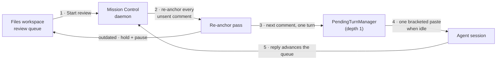
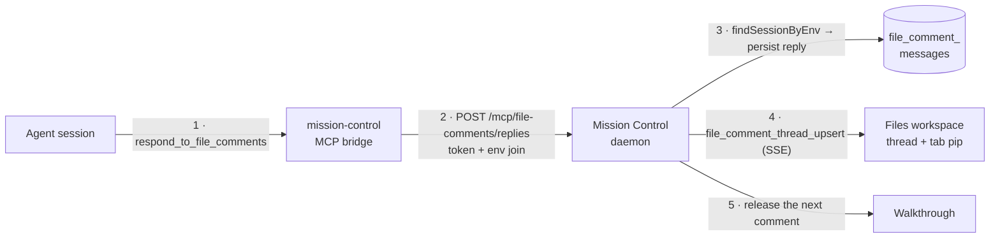

# Line comments in the Files workspace

**Status:** Approved - decisions recorded, phasing next

**Date:** 2026-08-21

**Owner:** Mission Control web dashboard and daemon

## The problem

You are reading a spec the agent just wrote - `docs/plans/x/plan.md`, or its rendered
`plan.html` - in the Files tab. Line 84 is wrong, the table three screens down is missing a
column, and the diagram contradicts the paragraph above it.

The only way to say so is to leave the file, go to the Conversation, and retype where you
were. The location is translated twice: you turn a position into prose, and the agent turns
your prose back into a position. A pass over one spec produces a dozen of those, so you
either send twelve messages that each interrupt a working agent, or one message that has to
re-establish twelve locations in words.

Every other review surface in this product already knows better. The Inspector anchors its
findings to `path:line` and dedupes them by a fingerprint that deliberately excludes the
line number. The workflow feedback renderer composes many findings into one deterministic
packet. The Files tab, which is where a human actually reads a document, has no line-level
concept at all.

## Recommendation

Add a **comment mode** to the Files workspace. While it is on, any line of the source or
any block of the rendered document takes a comment. Comments accumulate as an ordered
**review queue**, and the queue is delivered to the session **one comment at a time**: send
the first, wait for the agent to answer it, then send the next.

Each comment arrives as its own turn carrying its file, line range, quoted anchor text, and
its position in the review. The agent answers a comment through a new Mission Control MCP
tool, and the answer lands **in that thread**, on that line, not in the scrollback. You reply
back in the thread, and your reply re-enters the queue.

Because you see each answer before the next comment goes, the queue stays editable the whole
time: reorder it, rewrite a comment, drop one the agent has already made moot, or pause the
walkthrough entirely.

Four decisions carry the design:

1. **An anchor is `(path, line range, quoted text)`, not a line number.** The agent edits the
   file between deliveries, so a line number is stale by the time the next comment goes. The
   quoted text re-anchors the thread; a thread whose text is gone is marked **outdated**
   rather than silently pointing at a stranger's line. This is the Inspector's rule - the
   fingerprint excludes the line - applied to a live working file.

2. **The queue is re-anchored before every send, not once at the start.** This is the price
   of one-at-a-time and the single most important mechanic in the plan. See
   [The walkthrough](#3-the-walkthrough) below.

3. **Mission Control owns the queue; the existing outbox delivers it, one turn outstanding.**
   The threads table is the queue. Each send is an ordinary human turn through
   `POST /api/sessions/:id/inject` with `origin: "human"`. Exactly one is ever in flight.

4. **A thread is drawn from durable state, never from the transcript.** An MCP tool result
   cannot render itself - every harness parser drops a user turn that is purely a tool result
   as machine noise, which is why `ReviewAnswerCard` exists and is woven in by timestamp.

## Settled decisions

Every open choice has been answered. These are recorded here because the rest of the document
is written against them.

| # | Decision | Answer |
|---|---|---|
| 1 | Which viewer surfaces accept comments in v1 | **Editor + Markdown Preview + HTML Preview** |
| 2 | What a thread belongs to, and how long it lives | **The session.** Threads end with the session that owns them |
| 3 | What the walkthrough does when the agent does not answer | **Auto-advance after a grace window**, marking the thread unanswered |
| 4 | How the review is delivered | **One comment at a time**, not one batch |
| 5 | How the agent's reply returns | **A new MCP tool**, with a transcript-id fallback |

Decision 2 went the other way from the recommendation this document originally carried, and it
simplifies more than it costs. A session-scoped thread has one unambiguous owner, so
the threads table keys on `session_id` directly, the one-in-flight index is naturally
per-session, and cleanup rides the existing `session_remove` path rather than needing a
worktree hook of its own. What
it gives up is stated as a risk below: a review interrupted by a session ending does not
survive it.

## Scope and effort

This is a large feature. It is not a one-pull-request change and should not be planned as one.

| Area | Expected scope |
|---|---|
| Production code | About 2,700 to 3,300 non-test lines |
| Tests | About 900 to 1,200 lines across eight unit layers, plus three Playwright specs |
| Delivery estimate | About 13 to 19 engineering days across 5 phases |
| Persistence | Two new tables, plus the `docs/sqlite-database.html` catalog and the table count in `test/db-shell.test.ts` |
| Wire protocol | Two new `ServerEvent` variants, new Zod schemas |
| Agent surface | One new MCP tool, its entry in `MISSION_MCP_TOOLS`, and a `/mcp/*` route bound by `findSessionByEnv` |
| Security-relevant | One new hashed bridge script in the shared HTML preview sandbox |
| Main uncertainty | How often the agent's own edits invalidate the comments still queued behind them |

One-at-a-time costs about a day more than a batch would, not less: the payload renderer gets
simpler, but the walkthrough state machine, the re-anchor-before-send pass, and the queue
controls are all new work a batch would not need.

## Repository findings

Everything below was checked against this checkout rather than assumed.

### The viewer

**Three unrelated renderers behind one toolbar.** `src/web/components/FileWorkspace.tsx:446-486`
branches on `buffer.document.kind`: HTML goes to a sandboxed `srcDoc` iframe, Markdown goes to
`Markdown.tsx`, images go to an ``, and everything else falls through to `FileEditor.tsx`.
Comment mode needs three anchor implementations, not one.

**The Editor is CodeMirror 6 with real line numbers already on.**
`src/web/components/FileEditor.tsx:98-138` builds an `EditorView` with `basicSetup`, which
supplies the line-number gutter. A gutter marker and a block widget under a line are the
idiomatic CodeMirror extensions for this and need no new dependency. One hazard: the
external-value sync at `FileEditor.tsx:155-162` dispatches a whole-document replace, which
destroys position-mapped decorations - comment decorations must be rebuilt from the anchor
model after any such sync rather than mapped through it. That path fires on every agent edit,
so in a walkthrough it fires constantly.

**Markdown Preview can map a rendered block back to exact source lines.** Verified in this
checkout by running the same plugin chain the Files preview uses
(`remark-parse` → `remark-gfm` → `remark-rehype` → `rehype-highlight`): every top-level hast
element carries `position.start.line` and `position.end.line`, and `rehype-highlight` does not
strip them.

```
h1         1 -> 1
p          3 -> 3
pre        5 -> 7
table      9 -> 11
blockquote 13 -> 13
```

`react-markdown@10` passes that node to a custom component as `node?: Element`
(`react-markdown/lib/index.d.ts:63`), so the anchor is available without a second parser. This
was the single largest risk in the design and it is now settled.

**The HTML preview sandbox already has the bridge pattern this needs.**
`src/web/lib/htmlPreview.ts` pins `sandbox="allow-scripts"` with no `allow-same-origin`, and a
CSP whose `script-src` names exactly two SHA-256 hashes - a scroll bridge and a link bridge.
The document's own JavaScript is blocked by the hash allowlist, not by the sandbox. A comment
bridge is a third hashed script following the same rule; it is a real change to a controlled
security module, and decision 1 approved it as part of the feature's v1 surface.

### Anchoring

**Anchored comments have a precedent with a stated rule.** `inspector_comments`
(`src/server/db.ts:1842-1861`) carries `path`, `line`, `title`, `body`, `severity`, `status`
(`drafted | posting | open | resolved`), `replies`, and `answered_comment_id`, keyed uniquely
by `(pr_key, fingerprint)`. The comment above it states the principle this plan adopts:

> The fingerprint deliberately excludes the line number, so a push that shifts code down
> doesn't re-raise everything.

`fingerprint()` (`src/server/inspector/marker.ts:140-148`) is
`sha1(path + "\n" + normalized title)` truncated to 12 hex characters, computed on the server
and never supplied by a model. `snapToLine` (`src/server/inspector/verdict.ts:179-192`) repairs
an invalid line by taking the nearest valid one, because a made-up number is worse than none.

**What the Inspector does not have is a re-anchor pass.** Its answer to "the code moved" is
identity without location: the fingerprint survives, and GitHub renders the thread as outdated.
There is no local staleness flag and no re-anchor code anywhere in `src/server/inspector/`. A
comment on a live working file has no GitHub to delegate that to, so re-anchoring is new code.

**Nothing in the product lets a human write a line-anchored comment today.** The only writer of
`inspector_comments` is `upsertInspectorComment`, whose only callers are the model-driven worker
and the operator's resolve action - there is no insert route. `InspectorComment` never crosses
the wire either; the browser receives counts only. The thread UI is greenfield.

### Delivery and queueing

**Delivery must be `/inject`, not `/send`.** `TranscriptPanel.tsx:767-776` states why: `/send`
types character by character, so every newline lands as an Enter and submits early. A multi-line
payload has to arrive as one bracketed paste.

**`PendingTurnManager` already gives strict one-at-a-time FIFO, and it is still the wrong place
to hold the queue.** `pending_turns` (`db.ts:1724-1739`) enforces single-flight three times over
- a partial unique index `ON pending_turns(note_key) WHERE state = 'sending'`, a
`state <> 'queued'` guard inside the claim transaction, and in-process drain guards - so
submitting N turns really does deliver them one at a time in `seq` order. But:

- **Only the tail row can be recalled.** `recallPendingTurn` re-checks server-side that the id
  is the `MAX(seq)` row and returns 409 otherwise; `test/pending-turn-db.test.ts:51` pins it as
  *"an older row cannot jump the stack."*
- **There is no edit and no reorder at any layer.** The routes are `/recall`, `/retry`,
  `/resolve`. The only edit is recall-then-resubmit, tail only.
- **An `uncertain` row wedges the whole queue** until a human presses Retry or Mark sent,
  because the claim refuses while any row for that conversation is non-`queued`. On terminal
  sessions `uncertain` is common: any paste without a verified submit, or a 15s pickup timeout.
- **The advance signal is an observed settled idle transition, not a completion.**
  `DEFAULT_IDLE_SETTLE_MS` is 1,500ms; the wait is unbounded while the agent works; nothing
  reports "I finished that comment". If two live sessions share a `noteKey`,
  `sessionForNoteKey` returns undefined and the drain stops silently.
- **There is no correlation id.** The row is `id, note_key, seq, text, state, revision,
  timestamps, claimed_at, last_error`. Binding a delivery back to a thread is a schema change
  touching five places.

Queueing twelve comments there would therefore deliver them one at a time *and* remove the
ability to revise comments 3-12 after reading the answer to comment 1 - which is the entire
reason to walk through them one at a time. **Keeping exactly one turn outstanding avoids every
one of these limits**, because a queue of depth one has no tail to be blocked behind, nothing
to reorder, and nothing stranded when a row goes `uncertain`.

**The Work queue is the wrong shape for a conversation.** `foreman_queue_items`
(`db.ts:1762-1784`) already does one-at-a-time with a `one_inflight_per_queue` partial unique
index (`db.ts:2758`), and `docs/work-queues.md` describes exactly the loop this feature wants.
It is still wrong here, for five reasons that are each disqualifying:

- **The verifier is not optional.** An item reaches `verified` - and only then releases the
  next - through a fresh tool-less model call reading the item's diff and a 48-turn transcript
  window against `AGENTS.md` (`src/server/foreman/queue-verify.ts`, `worker.ts:1618-1745`).
  That is a model call per comment, answering *"was the thing you asked for actually done?"* -
  the wrong question for "why is this estimate 3 to 5 days?".
- **From round 1 on it stops sending your text.** `payloadFor`
  (`queue-machine.ts:556-558`) returns `renderFixPrompt(item)`, a template of machine-authored
  gaps, not the comment you wrote.
- **Draining fires the wrap-up trigger** (`queue-machine.ts:374-453`), raising a Ship it? card
  or, in live and allowlisted repos, typing a pull-request instruction. Finishing a spec
  conversation should not do that.
- **It needs Foreman invited plus hook pickup and completion signals.** Claude must report
  installed hooks, Codex needs launch-scoped hooks, and **Pi is unsupported**
  (`docs/work-queues.md:174-177`, `harness-capabilities.ts:915-922`).
- **Items are `intent TEXT` and nothing else.** `AddWorkItemSchema` has exactly one field
  (`protocol.ts:2892`); there is no foreign key on the table at all.

**Two independent outboxes already share one pane, with no arbiter.** `PendingTurnManager` is
event-driven with a 1,500ms settle; the Foreman queue polls every 4s with a 10,000ms settle. A
pending turn therefore almost always wins the race, and its delivery moves `lastActivity`, which
re-blocks the queue for a fresh settle window. Adding a third scheduler onto the same pane would
be the first one without that accidental separation.

### Where this lands in the UI

**Deep-linking to a line is half-built.** `workspaceFileTarget`
(`src/web/lib/workspaceLinks.ts:66-116`) already parses `path:line[:column]` and `#L12C3`, but
`App.tsx:1345-1372` discards `target.line` and nothing ever scrolls the viewer to it. A
walkthrough that moves the reader to the comment being sent needs that last mile finished.

**The Files tab already has an unused attention pip.** `detailTabs()`
(`src/web/lib/detailTabs.ts:44-50`) is a pure function over an input bag, with `pip: 0`
hard-coded for Files. **It counts agent replies you have not read** - not the open queue depth,
which is your own work and needs no badge. That is also why it stays at zero until the reply tool
exists.

**A tool result cannot draw itself in the conversation.** The header comment on
`src/web/components/ReviewAnswer.tsx:8-13` records that every harness parser drops a user turn
that is purely a tool result. Anything the agent sends back has to be persisted and rendered by
the dashboard from its own state.

## User-visible contract

1. **A Comment control appears in the file toolbar**, beside Preview and Editor, whenever a
   text file is open. It toggles comment mode for that workspace and carries a tab-local chord
   alongside the existing `p` and `e`.

2. **In comment mode, the Editor gutter takes a comment on any line.** Clicking a line number,
   or pressing the chord with the cursor on a line, opens a composer under that line. A
   selection spanning several lines anchors to the whole range.

3. **In Markdown Preview, any rendered block takes a comment.** Hovering a paragraph, heading,
   list, table, code block, or diagram reveals a margin control; the comment anchors to that
   block's exact source line range.

4. **In HTML Preview, any block-level element takes a comment** on the same interaction, with
   the anchor resolved back to the source line by matching the block's text in the file. Where
   the text is not unique the thread still carries its exact quote and reports its line as
   approximate rather than inventing one.

5. **Comments accumulate as an ordered review queue.** The toolbar shows the queue depth and a
   **Start review** control. Nothing reaches the agent until you start.

6. **Starting the review sends the first comment only.** One turn, carrying that comment's
   path, line range, quoted anchor text, and its position in the review ("comment 3 of 12"),
   with an instruction to answer this one and expect the rest to follow.

7. **The next comment goes when the agent answers the current one.** An answer through the
   reply tool advances the queue immediately. The Files tab shows which comment is outstanding
   and how many remain.

8. **The queue stays yours while it runs.** Reorder it, edit any comment that has not been sent,
   drop one the agent has already made moot, or **Pause** the walkthrough. Pausing takes effect
   after the outstanding comment resolves; it never recalls a comment already delivered.

9. **Every remaining comment is re-anchored against the file before the next one is sent.** A
   comment whose anchor moved is sent with its new line, silently. A comment whose quoted text
   the agent has since deleted is marked **outdated** and **held rather than sent**, with the
   walkthrough paused and the reason shown - because sending a comment about text that no
   longer exists is how a review goes wrong quietly.

10. **A sent comment collapses to a marker on its line** showing its state - awaiting an answer,
    answered with a reply count, unanswered, or resolved - with the outdated flag shown alongside
    whichever of those it is. The marker is a real button with an
    accessible name, reachable by keyboard.

11. **Expanding a marker opens the thread**: the original comment, every agent reply, every
    later human reply, in time order, with a reply box.

12. **A human reply in a thread re-enters the queue** at the end, and is delivered in its turn
    exactly like a new comment.

13. **The agent's reply appears in the thread it answers**, live, without a refresh, and raises
    the Files tab's attention pip.

14. **A human resolves a thread.** The agent may mark a thread addressed, which shows as a
    suggestion; only a person closes it. Resolved threads collapse out of the gutter behind a
    "show resolved" toggle.

15. **The walkthrough stops rather than guesses.** A session that cannot take a message, a file
    that has left the checkout, or a queue that has gone entirely outdated pauses the review and
    says which, keeping every unsent comment for as long as the session lives.

16. **Comment mode changes nothing about editing.** The Editor still edits and saves the exact
    source; Preview still renders it. Turning comment mode off leaves every thread in place.

## Flows

Two arrows change in this system. Both cross a component boundary, and neither is legible from
prose alone.

### The walkthrough

The queue lives in Mission Control's own table, so it stays editable while it drains. Only one
turn is ever outstanding, which is what keeps the existing outbox's tail-only recall and
head-of-line blocking out of the picture.



### The agent answering a comment

The reply is not a transcript message. It is a durable row that the thread draws itself from,
and it is also the walkthrough's advance signal - a real completion rather than the idle proxy
the existing outboxes have to infer.



## Proposed design

### 1. The anchor

One shared, pure module - `src/shared/file-comment-anchor.ts`, browser-safe and with no `node:`
imports - owns the whole anchor question.

| Field | Meaning |
|---|---|
| `path` | Repository-relative, exactly as the Files tab lists it |
| `startLine`, `endLine` | 1-based, inclusive, in the file's source |
| `quote` | The anchored source text, bounded |
| `quoteHash` | `sha256(path + "\n" + normalized quote)`, excluding the line numbers, exactly as the Inspector's `fingerprint()` excludes them |
| `revision` | The `SessionFileDocument.revision` the anchor was last valid against |
| `surface` | `editor`, `markdown`, or `html` - which renderer produced it |

Re-anchoring is a pure function of `(anchor, newText)`:

- **Revision unchanged** - the lines are exact, nothing to do.
- **Quote found exactly once** - move the anchor to it. Silent.
- **Quote found several times** - take the occurrence nearest the previous line. Silent.
- **Quote not found** - set `outdated`. Keep the quote, the last known line, and the status.

No I/O, which makes it the cheapest part of the feature to test exhaustively and the part most
worth testing that way.

### 2. Comment mode on three surfaces

**Editor.** A CodeMirror extension supplying a gutter marker for every line that owns a thread,
and a block widget below the anchored line for an open thread or composer. Decorations are
derived from the anchor model whenever the model or the document changes, never mapped through
a whole-document replace, because the external sync at `FileEditor.tsx:155-162` discards mapped
positions - and in a walkthrough that sync fires on every agent edit.

**Markdown Preview.** `Markdown.tsx` gains one more opt-in prop, in the same shape as the
existing `diagramRenderers` opt-in that `FileWorkspace` alone passes: a block-anchor callback.
When present, block-level components read `node.position` and wrap their output in an anchor
host carrying the line range. Every other caller - conversations, shared plans, Foreman briefs,
Personas, workflow actions, scout reports - passes nothing and renders byte-for-byte as today.
That containment is the rule the Mermaid work established.

**HTML Preview.** A third hashed bridge script in `src/web/lib/htmlPreview.ts`, inert until the
parent enables comment mode over the existing `postMessage` channel. While enabled, a click
reports the nearest block-level ancestor's bounded `textContent` and its structural index path.
It gains no capability the two existing bridges lack - it reads the document it is inside and
posts to the parent that sent it - and it never gets `allow-same-origin`. The parent resolves
the reported text to a source line by searching the file, falling back to an approximate anchor
when the text is not unique. The sandbox constant stays a single exported value so no call site
can add a token.

Images have no lines and take no comments. The control is disabled with a reason rather than
hidden.

### 3. The walkthrough

This is the part one-at-a-time adds, and the part most likely to be got wrong.

**The queue is the threads table**, ordered by `queue_seq`. Because Mission Control owns it, it
supports what `pending_turns` refuses: reorder any position, edit any unsent comment, drop one
in the middle, pause and resume.

**Exactly one comment is outstanding.** The walkthrough submits a single `/inject` human turn
and does not submit another until that one resolves. Queue depth in `pending_turns` is
therefore never more than one, which is what keeps tail-only recall, head-of-line blocking
behind an `uncertain` row, and the missing correlation id from ever mattering.

**Before each send, re-anchor every unsent comment** against the file's current bytes. This is
the mechanic the whole approach rests on: the agent has just edited the file, so the anchors
taken when you wrote the review are measured against a document that has moved. Three outcomes:

| Outcome | What happens |
|---|---|
| Anchor unchanged or moved | Send with the current line range. Silent. |
| Anchor outdated, and the next comment is the outdated one | Hold it, pause the walkthrough, and say the agent's own edit removed the text. |
| Anchor outdated, further down the queue | Mark it outdated in place and carry on; you will meet it when it reaches the head. |

Holding rather than sending is deliberate. A comment quoting text the agent has already deleted
is either done or now wrong, and delivering it produces the confused exchange the feature exists
to prevent.

**Advance signals**, in order of strength:

1. **A reply through the tool for the outstanding thread.** The good path, and a real
   completion signal rather than an inference.
2. **The session settles idle with no reply.** The agent answered in prose, or edited without
   answering. Per decision 3 the walkthrough waits out a grace window, moves the thread
   from `awaiting` to `unanswered`, and sends the next comment - because a walkthrough that needs a click per
   comment is not a walkthrough. The thread is not lost: it keeps its anchor and its marker,
   and the absence of a reply is what the marker shows.
3. **Nothing.** The session is working, blocked on you, or gone. The walkthrough waits, and
   `canMessage` refusing is a pause with a reason, not a lost comment.

**Everything is durable.** The walkthrough's state is columns on the queue, not memory, so a
daemon restart resumes rather than re-sends. A send that lands in `uncertain` pauses the
review and surfaces the existing Retry / Mark sent controls rather than inventing a second
recovery path.

### 4. Data model

Three tables, following the house conventions: `TEXT PRIMARY KEY` from `randomUUID()` at the call
site, epoch-millisecond `INTEGER NOT NULL` timestamps, `created_at` and `updated_at` on both,
indices declared beside the table, and relations by convention rather than a `REFERENCES` clause.

```
file_comment_threads
  id           TEXT PRIMARY KEY
  short_id     TEXT NOT NULL     -- MC-a41f; what the payload cites and a reply quotes
  session_id   TEXT NOT NULL     -- the session this thread belongs to (decision 2)
  path         TEXT NOT NULL     -- repository-relative
  start_line   INTEGER NOT NULL
  end_line     INTEGER NOT NULL
  quote        TEXT NOT NULL
  quote_hash   TEXT NOT NULL     -- sha256(path + LF + normalized quote); excludes the line
  revision     TEXT              -- file revision the anchor was last valid against
  surface      TEXT NOT NULL     -- editor | markdown | html
  status       TEXT NOT NULL     -- draft|queued|sending|awaiting|answered|unanswered|resolved|orphaned
  outdated     INTEGER NOT NULL  -- 1 when the quote no longer resolves; not a status
  queue_seq    INTEGER           -- position in the review; NULL once terminal
  delivery_id  TEXT              -- the pending_turns row currently carrying it
  sent_at      INTEGER
  answered_at  INTEGER
  addressed_at INTEGER           -- the agent's "I handled this"; never a closure
  resolved_at  INTEGER
  created_at   INTEGER NOT NULL
  updated_at   INTEGER NOT NULL

file_comment_messages
  id            TEXT PRIMARY KEY
  thread_id     TEXT NOT NULL
  author        TEXT NOT NULL    -- human | agent
  session_id    TEXT             -- the session that wrote or received it
  body          TEXT NOT NULL
  delivered_at  INTEGER          -- when it reached the agent; NULL while queued
  created_at    INTEGER NOT NULL

file_comment_reviews
  session_id    TEXT PRIMARY KEY -- one review per session, per decision 2
  state         TEXT NOT NULL    -- idle | running | paused
  pause_reason  TEXT             -- why it stopped; NULL unless paused
  started_at    INTEGER
  updated_at    INTEGER NOT NULL
```

A partial unique index on `(session_id)` where `status IN ('sending', 'awaiting')` enforces
one-comment-outstanding at the database rather than by convention, mirroring
`idx_pending_turns_sending` and `one_inflight_per_queue`. **The predicate covers every
outstanding status, not just `sending`.** A comment is outstanding from the moment it is handed
to the outbox until the agent answers it, and `awaiting` is by far the longer half of that -
an index naming only `sending` would let a second start or a resume open a new delivery while
the first comment is still unanswered, which is the one thing one-at-a-time exists to prevent.
Build it from the TypeScript tuple the way `inFlightIndexSql` builds
`one_inflight_per_queue` from `IN_FLIGHT_ITEM_STATES`, so the enforcement and its readers cannot
drift.

**This is why `unanswered` is a status of its own.** Decision 3 auto-advances after a grace
window, which means the walkthrough sends comment 2 while comment 1 has still never been
answered. If the abandoned thread stayed `awaiting` it would remain in the outstanding set and
the index would refuse the next delivery - the guarantee would deadlock the queue it exists to
protect. Timing out therefore moves `awaiting` to `unanswered`, which is outside the tuple. The
thread keeps its anchor, its marker and its place in the file; what it does not keep is the
turn. Because decision 2 scopes a thread to a session, that index is exactly the invariant the
walkthrough needs and nothing broader.
`delivery_id` is the correlation `pending_turns` cannot carry: it lives here instead, so that
table needs no new column.

**The review's run state is a table, not a derived value.** "Paused" and "never started" are the
same set of rows - everything `queued`, nothing outstanding - so the walkthrough cannot tell them
apart by looking at threads, and between two comments the outstanding set is briefly empty, which
would make a derived "running" flicker. `file_comment_reviews` is one row per session holding the
state and, when paused, the reason a human needs to see. It is keyed by `session_id` because
decision 2 already scoped a review to exactly one.

**`outdated` is a column, not a status.** A thread whose quote has stopped resolving is still
queued, or still awaiting, or still answered - losing that is losing its place in the review, and
the flag is reversible where a status transition would not be. Any thread can carry it; the
walkthrough's re-anchor pass is simply the thing that sets it most often, because it runs over
every unsent comment before each send. Two dimensions, so two columns. `orphaned`
*is* a status, and a terminal one: it is what a thread becomes when the session that owns it
goes away, and there is nothing left to be in the middle of.

**Threads end with their session.** On `session_remove` that session's threads are settled to
`orphaned` by UPDATE - not deleted, and never keyed on `state === "exited"`, which is the
standing rule for durable cleanup in this repository and the reason there is no second eviction
path here. Two mechanisms complete it, both copied from `ReviewManager` rather than invented: a
reconciliation arm for sessions that went away while the daemon was down, and a throttled prune
that finally deletes settled rows whose session key is gone. A session that is merely idle,
disconnected, or restarting keeps every thread it owns.

Drafts are persisted from the first keystroke rather than kept in browser state: the integrated
tab and the extracted Files window are two live `FileWorkspace` instances that converge only
through the daemon.

### 5. The payload

A pure renderer in the `src/server/workflows/feedback.ts` family - bounded fields, a stable
shape, a `payloadSha256`. One comment per turn:

```
Comment 3 of 12 on this review.

docs/plans/x/plan.md, lines 84-86:

> the paragraph as it currently reads, quoted exactly

This contradicts the diagram above it.

Answer with mcp__mission-control__respond_to_file_comments quoting id MC-a41f.
Answer this comment only - the remaining 9 follow one at a time, so do not
restructure beyond what this one asks for.
```

`MC-a41f` is the thread's `short_id`: a stable, human-quotable handle minted beside the row's
UUID and unique per session. The payload cites it, the reply tool takes it, and the transcript
fallback matches it out of free text - which a UUID is too long and too easy to mangle for.

The position line and the closing instruction are the mitigation for the one thing a batch does
better: an agent that knows nine more comments are coming will not restructure the whole document
on comment three.

The renderer is server-side so the agent's copy and the dashboard's record cannot drift, and pure
so it is tested without a session, a pane, or a database.

### 6. The agent's reply

A new tool in `src/mcp/server.ts`, added to `MISSION_MCP_TOOLS` in `src/server/mission-mcp.ts` -
the list a test already cross-checks against the server's own `registerTool` calls, so drift
fails the build.

```
respond_to_file_comments({ commentId, body, addressed? })
```

Non-blocking, `share_plan`-shaped rather than `request_plan_decisions`-shaped: the agent posts
and carries on. The route is `POST /mcp/file-comments/replies`, token-guarded, session resolved
by `findSessionByEnv`. The reply is persisted, the thread moves to `answered`, one
`file_comment_thread_upsert` event carries it to every dashboard, and the walkthrough releases
the next comment.

`commentId` stays required even though only one comment is outstanding. It costs one field and
it is what stops a late reply - the agent answering comment 3 after the walkthrough moved to
comment 5 - from being misfiled onto the wrong thread.

Two limits worth stating rather than discovering:

- **A tool is not universally reachable.** Mission Control's MCP server reaches sessions the
  dashboard launched, and sessions on a machine where the Claude integration was installed. A
  session an operator started themselves without it has no such tool. The fallback is the
  bracketed id in the payload: an assistant turn opening with `MC-a41f` is filed into that
  thread by the transcript reader. Less precise, and the only thing that works everywhere.
- **v1 ships one tool, not two.** There is no `list_file_comments` read tool; the delivered
  payload is the read path.

### 7. Thread lifecycle

```
draft ──queue──▶ queued ──send──▶ sending ──delivered──▶ awaiting
                    ▲                                        │
                    │                                   agent replies
              human replies                                  │
                    │                                        ▼
                    └──────────────────────────────────── answered ──human resolves──▶ resolved

awaiting ──grace window expires──▶ unanswered        (decision 3: auto-advance)
unanswered ──human replies──▶ queued                 (the thread is not lost)

any status ──its session is removed──▶ orphaned (terminal)

outdated is a flag beside the status, not one of its values:
any thread ──the file moved under it──▶ outdated = 1 ──the quote returns──▶ outdated = 0
```

`outdated` is orthogonal and reversible, which is why it is a column: a thread that goes
outdated keeps the status it had, and if the quoted text comes back it re-anchors and clears the
flag. A human reply on an `answered` thread puts it back in the queue with its history intact.
`orphaned` is the one status reached without a human or an agent doing anything.

### 8. Keyboard and accessibility

The comment control joins the existing tab-local `p` and `e` handling in
`FileWorkspace.tsx:129-156` - capture-phase, suppressed while typing and while an overlay is
open. Markers are buttons with accessible names naming their line and state. The queue's
position is announced through a live region as the walkthrough advances, so a screen-reader user
is not left guessing which comment is outstanding. Thread composers are ordinary textareas with
labels. Nothing uses `data-testid`; the Playwright specs select by role, label, and placeholder,
as `e2e/README.md` requires.

## What v1 does not do

- No comments on images, binary files, or files the editor refuses to open.
- No comment on a diff hunk. The Diff tab has its own reader and its own Open in Files door.
- No batch mode. One-at-a-time is the only delivery.
- No cross-file threads, mentions, reactions, or editing a comment after it is sent.
- No suggested-edit blocks the agent can apply.
- No comments in the Scouts report viewer, which shares the HTML preview boundary but not the
  checkout write model.
- No settings toggle. Comment mode is a per-workspace mode, not a preference.
- No `list_file_comments` read tool.

## Risks and assumptions

| Claim | Basis | Confidence | If wrong |
|---|---|---|---|
| Markdown block elements carry exact source line ranges through this repo's plugin chain | Verified by running the chain in this checkout | 99% | Markdown Preview falls back to Editor-only commenting |
| Keeping one turn outstanding avoids tail-only recall, head-of-line blocking, and the missing correlation id | Verified against `pending_turns` schema, `recallPendingTurn`, and `claimNextPendingTurn` | 95% | The walkthrough needs its own delivery path rather than the outbox |
| A third hashed bridge grants the HTML preview sandbox no new capability | Inferred from `htmlPreview.ts:1-82`; the two existing bridges already read the document and post to the parent | 90% | HTML Preview drops back to a later phase and the sandbox is left alone |
| Rebuilding CodeMirror decorations from the anchor model survives the whole-document sync | Inferred from `FileEditor.tsx:155-162` | 85% | The sync path needs an explicit decoration rebuild hook |
| The reply tool is a reliable advance signal on the happy path | Inferred from the tool being named in the payload the agent just read | 80% | The decision 3 idle fallback carries more of the traffic than expected |
| Session-scoped threads are the right lifetime for a spec conversation | Decided by the human in review; the conversation being had is with a particular session | 75% | Threads need re-parenting to the checkout, which is a `session_id` to `scope_key` migration plus a worktree cleanup hook |
| Re-anchoring keeps most of the queue valid while the agent edits between comments | Inferred; not measured, and one-at-a-time makes this materially harder than a batch | 60% | More comments are held as outdated, so the review needs more of your attention than "start and walk away" implies |
| An agent told "answer this one only, 9 more follow" will not over-scope | Inferred from prompt-instruction behavior generally; untested here | 60% | Early comments get over-broad edits, invalidating more of the queue behind them |

**The two 60% rows are the risk of this approach**, and they compound: an agent that over-scopes
comment 3 invalidates more of the queue behind it, which is the same failure the re-anchor pass
is trying to absorb. Neither can break the feature - a held comment is still readable and still
carries its exact quote - but together they decide whether a twelve-comment review is one
unattended walkthrough or six interruptions. **Phase 3 should measure both on a real spec before
phase 5 is scheduled**, by recording how many comments in a real review reach the head still
anchored.

## Testing

| Layer | File | Covers |
|---|---|---|
| Pure | `test/file-comment-anchor.test.ts` | Re-anchoring: exact, moved, duplicated, gone, reversible |
| Pure | `test/file-comment-payload.test.ts` | The single-comment payload: bounding, position line, id |
| Pure | `test/file-comment-walkthrough.test.ts` | The advance state machine: reply, idle fallback, hold-on-outdated, pause, resume, restart |
| Schema | `test/file-comment-contracts.test.ts` | Zod bounds and refusals |
| Store | `test/file-comments-store.test.ts` | SQL, status transitions, `queue_seq` rewrites, the single-flight index |
| Store | `test/file-comments-lifecycle.test.ts` | `session_remove` orphans this session's threads by UPDATE; `state === "exited"` alone changes nothing; the prune deletes only settled rows |
| Migration | `test/file-comments-migration.test.ts` | Upgrade from a hand-written pre-feature database |
| Routes | `test/file-comments-http.test.ts` | Every route through `buildApp()`, including the `/mcp/*` env join |
| Events | `test/file-comments-sse.test.ts` | Snapshot and incremental convergence |
| Browser | `e2e/specs/file-line-comments.spec.ts` | Comment in the Editor, queue it, marker collapses, thread expands |
| Browser | `e2e/specs/file-comment-walkthrough.spec.ts` | Start review sends one comment; a faked reply releases the next; reorder and pause hold |
| Browser | `e2e/specs/file-comment-outdated.spec.ts` | An edit that deletes a queued comment's text holds it and pauses with a reason |

The e2e specs spend no model tokens: agent binaries are already redirected by
`e2e/fixtures/fake-agents.ts`, and replies arrive through the daemon's own MCP route rather than
from a model.

Two obligations that are easy to miss and fail the suite: `docs/sqlite-database.html` catalogs
every table exactly once, including its family's `N tables` count, and `test/db-shell.test.ts:58`
hard-codes the total at 75 - which becomes 78.

The walkthrough specs seed threads straight into the daemon's database with `withDaemonDb`, the
way `e2e/specs/inspector-resolve-findings.spec.ts` already seeds `inspector_comments`, and assert
each durable claim twice: once through the DOM and once against the daemon's own route.

## Documentation

- `docs/ui.md` - the Files workspace section, comment mode, the chord, and the walkthrough.
- `docs/work-queues.md` - a short pointer saying what the review queue is *not*, so the two
  one-at-a-time mechanisms are not confused for each other.
- `docs/event-stream.md` - the new event variants and what bounds the collection.
- `docs/sessions.md` - what a comment looks like as a turn, and where it queues.
- `docs/sqlite-database.html` - the two new tables in their family.

## Delivery shape

Five phases, each independently mergeable and each leaving the product working:

1. **The anchor and the model.** The shared anchor module, all three tables, the store, the routes,
   the events, and the schemas. No UI. Ends with a database that can hold a queue and a route
   suite that proves it.
2. **Comment mode in the Editor.** The toolbar control, the CodeMirror gutter and widget,
   drafting, queueing, and the thread UI. Ends with comments that persist and render but never
   send.
3. **The walkthrough.** The single-comment payload, the advance state machine, the
   re-anchor-before-send pass, the queue controls, and the pause and refusal states. Ends with a
   review that reaches a real session one comment at a time, and with the measurement the two
   60% assumptions need.
4. **The agent's reply.** The MCP tool, the `/mcp` route, live thread updates, the tab pip, and
   the transcript fallback. Ends with the reply advancing the queue instead of the idle fallback.
5. **Preview surfaces.** Markdown block anchors and the HTML preview bridge. Ends with the
   feature on every surface decision 1 approved.

The real phase documents, their merge order, and their scheduled tasks come from the phased-plan
step, not from this list.
