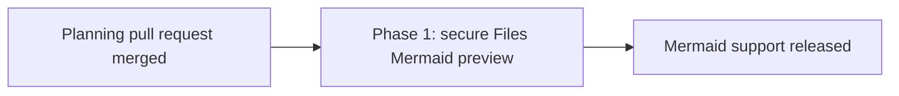

# Files Mermaid diagrams: phased implementation plan

**Status:** Approved for implementation

**Date:** 2026-08-17

**Source plan:** [`plan.md`](plan.md)

## Approved direction

The first release supports only fenced `mermaid` blocks and only inside Markdown files in
the Files workspace's Preview mode. Other Markdown surfaces continue to show Mermaid source as
code. Graphviz DOT, Nomnoml, WaveDrom, Markmap, Vega-Lite, D2, PlantUML, and Kroki remain future
candidates and are not implementation scope.

The human selected a phased implementation follow-up. Repository investigation shows that the
smallest safe merge unit is one vertical phase, so this plan schedules one implementation task.

## Investigated findings

- The existing file API already returns Markdown text and needs no route, database, protocol,
  migration, or event-stream change.
- `FileWorkspace.tsx` already delegates preview rendering to the shared `Markdown.tsx`. Because
  that renderer has ten callers, diagram handling must be an explicit Files-only opt-in and its
  memo comparator must include any new stable capability input.
- `htmlPreview.ts` is a useful security precedent, but not a component to loosen or overload. Its
  Content Security Policy authorizes only the existing HTML preview bridge, while Mermaid requires
  an executable renderer entry. The new entry inherits the no-network and opaque-origin invariants
  without changing the HTML preview contract.
- Vite currently builds one HTML entry. The implementation must add and prove a stable renderer
  entry under `dist/web`; the daemon's generic static handler can serve it without a new server
  route. `electron-builder.yml` already packages `dist/**/*`, so release configuration must not
  change.
- A sandbox without `allow-same-origin` can make module-script loading browser-dependent. Prove the
  renderer shape first. If the module entry cannot execute from an opaque origin, emit one classic
  renderer asset while retaining the same sandbox and Content Security Policy.
- Markdown preview accepts files up to 5 MiB, so the browser layer must separately enforce the
  approved 50,000-character per-diagram and 32-diagram per-document bounds.
- The app is dark-only and the renderer iframe cannot inherit parent CSS variables. The parent must
  pass a fixed, validated palette derived from existing computed tokens.
- The built-dashboard Playwright suite is the integration proof for static serving, user behavior,
  and network isolation. A build smoke assertion must also fail if the renderer entry disappears or
  resolves to the SPA fallback.
- Mermaid remains a direct, pinned dependency. Implementation should begin with 11.16.x or newer,
  verify the selected release contains the referenced 2026 security fixes, and record its MIT
  license through normal package metadata.

## Sizing and phase count

Expect about **340 to 520 non-test implementation lines**, excluding the lockfile. This includes a
dedicated renderer document and bridge, the bounded host component, a stable shared-Markdown opt-in,
Files integration, styles, build configuration, smoke coverage, and documentation. Tests are
expected to add roughly 200 to 320 more lines.

This is above the automatic one-phase threshold, but it remains one phase. Splitting the sandbox
entry from the Files integration would land an unreachable foundation with no user value, make the
security boundary difficult to verify end to end, and force two changes through the same Vite,
Markdown, and packaging contracts. One vertical pull request is more achievable and reviewable than
that temporary split.

## Phase table

| Phase | Merge unit | Outcome | Direct prerequisite | Execution group |
|---|---|---|---|---|
| 1 | [`phase-1-secure-files-mermaid-preview.md`](phase-1-secure-files-mermaid-preview.md) | Files Preview safely renders bounded Mermaid fences while every other Markdown surface remains unchanged | This planning pull request merged | A |

## Dependency graph

There are no implementation-task prerequisites because there is one phase. Its task depends on the
active planning session so it remains backlogged until these paths are published on the default
branch.

## Concurrency and merge order

Execution group A contains Phase 1 only. No implementation work may start before the planning pull
request merges. Phase 1 then opens one pull request in this repository; no other repository is
involved.

## Cross-phase contracts

There are no consumer phases, but the following contracts define the feature boundary and any
future engine work must preserve them:

- Fenced-diagram rendering is capability-based and disabled by default in the shared Markdown
  renderer.
- The renderer owns only canonical fence tags. Unknown, untagged, inline, excessive, and unsupported
  blocks remain readable source.
- Diagram-controlled markup never enters the dashboard DOM. Execution stays in a no-network iframe
  without `allow-same-origin`, and parent/child messages are source- and token-validated.
- Per-block failures, timeouts, and stale completions cannot blank or replace the surrounding
  Markdown document.
- The Editor remains the exact-source editing and recovery path.
- `dist/` is generated output and is never hand-edited or committed. Existing HTML preview and
  Electron packaging policy remain unchanged.

## Final verification strategy

Phase 1 owns focused render and bridge tests, a built-dashboard Playwright spec, full repository
gates, a build-output audit, and packaged-Electron verification. The final review must trace every
acceptance criterion in `plan.md` to one of those proofs, confirm Mermaid stays out of the initial
dashboard path, and confirm no network request is possible from diagram-controlled content.

## Final cross-phase audit

Completed on 2026-08-17 against the approved source plan and current repository. Every approved
Mermaid-only requirement is owned by Phase 1. No requirement is deferred to undocumented cleanup,
there is no migration or API consumer to sequence, and the single phase leaves the repository
operable when merged. The task publication edge is the planning-session dependency, not a hidden
code dependency.
