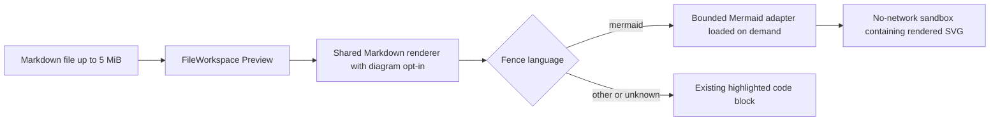

# Automatic Mermaid diagrams in the Files preview

**Status:** Approved

**Date:** 2026-08-17

**Owner:** Mission Control web dashboard

## Recommendation

Ship Mermaid as the only diagram engine in the first release, and render it only when a
Markdown file is open in the Files workspace's Preview mode. Keep the shared Markdown
renderer opt-in so conversations, shared plans, Foreman briefs, Personas, workflow actions,
and scout reports continue to show fenced source exactly as they do today.

Use a small fence-to-renderer registry from the start, with `mermaid` as its only registered
tag. That gives future engines a deliberate extension point without paying the dependency,
security, bundle, and testing cost of several engines before there is demand.

## Approved decisions

- The first release supports Mermaid only. Graphviz DOT and every other engine remain future
  candidates and do not expand this implementation task.
- The approved plan will be decomposed into merge-aware implementation phases and scheduled as
  dependency-linked Mission Control work.

Implementation package: [`phased-plan.md`](phased-plan.md) with its rendered
[`phased-plan.html`](phased-plan.html) review page.

## Scope and effort

This is a medium browser feature and should fit in one focused implementation pull request.

| Area | Expected scope |
|---|---|
| Production code | About 250 to 450 non-test lines, plus generated lockfile changes |
| Tests | About 150 to 250 lines across focused unit tests and one Playwright spec |
| Delivery estimate | About 3 to 5 engineering days, including security and packaged-build verification |
| Backend and persistence | None: no route, database, shared protocol, migration, or SSE change |
| Main uncertainty | Proving the isolated renderer entry works in Vite development, the built daemon, and packaged Electron without weakening its sandbox |

Adding Graphviz DOT in the same release would add roughly 1 to 2 days, a WebAssembly asset,
another error and sizing path, and a second security and packaging review. A broad
multi-engine service would be a separate project.

## Repository findings

- `src/server/session-files.ts` already classifies `.md`, `.markdown`, and `.mdown` as
  Markdown and permits preview-only files up to 5 MiB. The daemon already returns all text
  needed by this feature.
- `src/web/components/FileWorkspace.tsx` sends Markdown Preview through
  `src/web/components/Markdown.tsx`. There is no second parser to replace.
- `Markdown.tsx` is intentionally shared by ten surfaces. A global Mermaid behavior there
  would silently expand this request into conversations, shared plans, Foreman output,
  Personas, workflow actions, and Scouts.
- `react-markdown` supports replacing fenced `code` elements with a React component while
  leaving ordinary and inline code alone. That is the smallest integration seam.
- HTML files already render inside a no-network sandbox owned by
  `src/web/lib/htmlPreview.ts`. Checkout Markdown is equally untrusted, so generated diagram
  markup needs an isolation contract at least as strict.
- The dashboard is dark-only and already exposes its palette as CSS custom properties.
  Diagram colors can derive from those tokens rather than introduce a second theme.
- Every visible UI change requires a Playwright spec. The existing
  `e2e/specs/file-default-view.spec.ts` supplies the fixture and navigation pattern for a
  Markdown file opened in Preview.

## User-visible contract

1. A fenced block tagged exactly `mermaid` renders automatically in a Markdown file opened
   in Files Preview.
2. The Preview and Editor toggle does not change. Editor continues to show and save the exact
   Markdown source; returning to Preview renders the latest buffer.
3. Untagged fences, unknown tags, inline code, and every non-`mermaid` language keep the
   existing `<pre><code>` rendering and syntax highlighting.
4. Multiple Mermaid blocks can render independently in one document. A bad block shows a
   local, readable error and its source while the rest of the document continues rendering.
5. Rendering is local. Diagram source, labels, URLs, and assets never leave the machine and
   never gain access to the dashboard origin.
6. Diagrams use Mission Control's palette, fit the preview width, preserve readable labels,
   and expose an accessible name such as `Mermaid diagram 2`.
7. The first release does not add zoom, pan, export, copy-as-image, diagram links, custom
   Mermaid configuration, or a settings toggle.

## Render flow

Today every fence ends as code. The new branch exists only for Files Preview and only for a
registered fence tag.



## Proposed design

### 1. Make fenced diagrams an explicit Markdown capability

Extend `Markdown.tsx` with an explicit opt-in for fenced diagram renderers. Build its
`components` map from stable inputs so the existing memoization and anchor identity rules do
not regress. `FileWorkspace` opts in; every other caller passes nothing and therefore retains
byte-for-byte source fences.

The integration recognizes the normalized language class that `react-markdown` already puts
on block code. It never guesses from source text. The registry owns canonical tags and any
future aliases, for example `dot` and `graphviz`, rather than scattering tag checks through
React components.

### 2. Render Mermaid in an isolated browser entry

Add a dedicated Vite renderer entry and load it only from Mermaid fence hosts. Each host uses
an iframe with `sandbox="allow-scripts"` and never adds `allow-same-origin`. The isolated page
loads the pinned Mermaid package, receives one bounded source string and palette over
`postMessage`, renders inside its own document, and posts back only status and measured
height. Parent messages are matched by `event.source` and an instance token so one open Files
window cannot settle another's diagram.

The renderer document carries a Content Security Policy before any diagram-controlled bytes:

- `default-src 'none'` and `connect-src 'none'`;
- only its built script may execute;
- inline Mermaid-generated styles are allowed, but remote styles, fonts, images, forms, and
  navigation are blocked;
- no Mermaid interaction binding is installed, so diagram clicks and scripts stay inert.

Initialize Mermaid with its strict security level and lock security-sensitive configuration
keys against diagram front matter. The iframe remains the real boundary because Mermaid's
own maintainers state that sanitizing every generated path is difficult, and recent security
work specifically calls out external image requests. Do not inject Mermaid SVG into the
dashboard DOM.

The first implementation step proves this renderer entry in Vite development, the production
daemon build, and packaged Electron. If module loading from the opaque origin fails, bundle
the renderer as one classic asset. The fallback may change the build shape, but it may not add
`allow-same-origin`, permit network access, or move Mermaid execution into the parent page.

### 3. Bound work and make async state honest

- Load the Mermaid renderer only when a visible Markdown preview contains a `mermaid` fence.
- Keep Mermaid's 50,000-character source ceiling and enforce it before starting a render.
- Render at most 32 diagram fences per document. Later fences remain readable code with a
  bounded-limit notice rather than creating unbounded iframe and layout work from a 5 MiB
  Markdown file.
- Defer off-screen diagrams until they approach the viewport.
- Key each render to its file, fence position, source, and instance token. Ignore late results
  after edits, file switches, mode switches, or unmounts.
- Reserve a small loading height to avoid document jumps. Let the child report the final
  height, clamp pathological dimensions, and keep oversized diagrams scrollable inside their
  own frame.
- Catch import, parse, render, timeout, and sandbox-message failures per block. No diagram
  failure may reject or blank the parent Markdown tree.

### 4. Match the existing visual and accessibility system

Read the current CSS tokens from the parent and pass a fixed palette into Mermaid's `base`
theme. Style the host in the Markdown section of `src/web/styles.css`, using the existing
border, surface, foreground, muted, working, idle, attention, danger, purple, and type-accent
tokens.

Render a `figure` with an accessible label and status text. Loading, source-too-large,
unsupported-limit, and syntax-error states must be distinguishable in text, not color alone.
The ordinary Editor toggle remains the path to correcting source, so no diagram-only toolbar
is needed in this release.

### 5. Add the dependency and document its boundary

Add the current patched Mermaid 11.x release as a direct dependency and commit the generated
lockfile. At implementation time, start from 11.16.x or newer and verify that the selected
version includes the May 2026 security fixes. Record the dependency's MIT license through the
repository's normal package metadata; do not use a CDN.

Update `docs/ui.md` to document the `mermaid` fence, Files-only scope, automatic rendering,
Editor fallback, invalid-diagram behavior, local-only execution, and the fact that other tags
remain code.

## Open-source engine assessment

| Engine or format | Fence tags | Browser fit | Recommendation |
|---|---|---|---|
| Mermaid | `mermaid` | First-party JavaScript renderer, broad flowchart, sequence, class, state, ER, Gantt, mind map, and chart coverage; MIT | Ship first |
| Graphviz DOT through Viz.js | `dot`, `graphviz` | Mature directed-graph layout through a WebAssembly build; Viz.js is MIT and Graphviz is EPL-2.0 | Best second engine when real examples appear |
| Nomnoml | `nomnoml` | Small JavaScript and SVG UML renderer; MIT | Good lightweight UML candidate, but narrower and less standard than Mermaid |
| WaveDrom | `wavedrom` | JavaScript and SVG timing diagrams from WaveJSON; MIT | Add only for hardware-heavy repositories |
| Markmap | `markmap` | JavaScript and SVG mind maps from Markdown; MIT | Useful specialty view, mostly overlaps Mermaid mind maps |
| Vega-Lite | `vega-lite`, `vegalite` | Browser-native declarative data visualization; BSD-3-Clause | Treat as a future chart feature, with external data loaders disabled |
| D2 | `d2` | Strong architecture-diagram language, but the official renderer is Go and CLI oriented; MPL-2.0 | Revisit when there is a stable first-party browser package or local service appetite |
| PlantUML | `plantuml`, `puml` | Very broad UML, but normal rendering needs a JVM or an HTTP server | Do not send private checkout text to a public renderer; consider only with an explicit local runtime |
| Kroki | engine-specific tags | Unified open-source HTTP API for many formats | Not a v1 dependency: a public service violates local-only behavior and self-hosting adds deployment and operations |

The registry is intentionally not a promise that every row will ship. Each engine still owes
its own dependency, license, no-network policy, resource limits, packaging proof, fallback,
and browser test.

## Verification plan

### Focused unit and render tests

- Extend `test/markdown-render.test.ts` or add a focused companion test proving that a
  `mermaid` block becomes a diagram host only when the capability is enabled.
- Prove the default `Markdown` call still emits source code for Mermaid, protecting every
  non-Files caller.
- Prove unknown, untagged, inline, oversized, and over-count fences degrade to ordinary
  readable code or a local error without throwing.
- Pin the sandbox token set, Content Security Policy ordering, message-source and instance
  checks, maximum source size, maximum diagram count, and stale-result rejection in focused
  pure tests.
- Add a package/build assertion if the renderer entry needs special Vite output, so a future
  bundler change cannot silently point the iframe at the SPA fallback.

Run focused Node tests with the repository preload, for example:

```sh
node --test --import ./test/setup-state.mjs --import tsx test/markdown-render.test.ts
```

### Browser end-to-end coverage

Add `e2e/specs/file-mermaid-preview.spec.ts`, reusing the Files fixture pattern. Seed a
Markdown file containing:

- a valid Mermaid flowchart;
- a normal tagged code block;
- a malformed Mermaid block followed by ordinary prose;
- a diagram that attempts an external image or link to a sentinel origin;
- a second valid diagram to prove blocks settle independently.

The spec asserts that the file opens in Preview, the valid diagrams become labelled rendered
graphics, normal code remains code, the malformed block reports locally without hiding later
prose, no request reaches the sentinel origin, and Editor shows the exact original fence. It
then edits a label, returns to Preview, and proves the new diagram wins over any stale render.

### Repository gates

Run:

```sh
npm run typecheck
npm run lint
npm test
npm run build
npm run smoke
npm run test:e2e
```

Also inspect the production build output to confirm Mermaid lives outside the initial
dashboard entry and that both the built daemon and packaged Electron can load the renderer
entry without network access.

## Acceptance criteria

- Files Preview renders a valid `mermaid` fence automatically and Editor preserves its exact
  source.
- All existing Markdown surfaces outside Files retain code fences.
- Invalid, oversized, excessive, slow, and stale diagrams fail per block and never blank the
  document.
- Diagram rendering executes outside the dashboard origin, with no `allow-same-origin`, no
  network access, no active links, and no injected SVG in the parent DOM.
- Mermaid is absent from the initial dashboard path when no Mermaid fence is viewed.
- Visuals and textual states are usable in the integrated and extracted Files workspaces.
- Focused tests, typecheck, lint, the full unit suite, build, smoke, and browser end-to-end
  tests pass.
- `docs/ui.md` matches the shipped behavior and supported fence tag.

## Sources

- [Mermaid usage, render API, security levels, and Tiny guidance](https://github.com/mermaid-js/mermaid/blob/develop/packages/mermaid/src/docs/config/usage.md)
- [Mermaid MIT license](https://github.com/mermaid-js/mermaid/blob/develop/LICENSE)
- [Mermaid security advisories](https://github.com/mermaid-js/mermaid/security)
- [Mermaid external-image isolation discussion](https://github.com/mermaid-js/mermaid/issues/7645)
- [GitHub fenced Mermaid support](https://docs.github.com/en/get-started/writing-on-github/working-with-advanced-formatting/creating-diagrams)
- [`react-markdown` custom component and security documentation](https://github.com/remarkjs/react-markdown)
- [Viz.js browser API](https://viz-js.com/api/)
- [Graphviz license](https://graphviz.org/license/)
- [D2 repository and license](https://github.com/terrastruct/d2)
- [WaveDrom browser renderer](https://github.com/wavedrom/wavedrom)
- [Markmap browser renderer](https://github.com/markmap/markmap)
- [Vega-Lite documentation](https://vega.github.io/vega-lite/docs/)
- [PlantUML server options](https://plantuml.com/server)
- [Kroki supported engines and deployment model](https://docs.kroki.io/kroki/)
