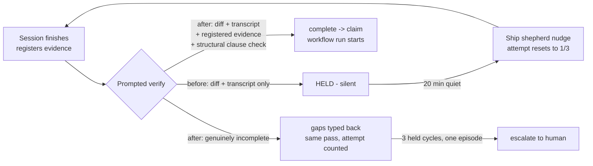

# Foreman completion judgment and recovery fixes

Source finding: `docs/reports/foreman-completion-detection-stall/report.html` (2026-08-24).
That scout report traced why finished ship-task work never reaches its bound workflow: the
completion signal works, but the judgment and recovery layers around it fail in three
compounding ways. This plan turns the report's recommendations into an implementable design.

## Problem

A dispatched ship task finishes, reports completion, and registers verification evidence.
Foreman detects the completion within seconds and runs its completion verifier - and the
verifier holds, because:

1. **It cannot see command output.** The transcript renderer emits tool inputs only
   (`src/server/foreman/prompt.ts:604-628`; `ToolCall` in `src/shared/types.ts:3126` has no
   output field). The verifier can see `npm test` start and can never see it pass.
2. **It cannot see registered evidence.** `VerifyInput`
   (`src/server/foreman/queue-prompt.ts:26-65`) has no evidence field, so the
   `workflow_evidence_staging` rows carrying exactly the missing proof are invisible to it.
3. **The contract makes it judge what it cannot observe.** The ship completion contract
   (`src/shared/task-completion.ts:64-90`) requires "the focused tests and verification the
   change requires have been run" and "evidence registration the task asked for is done" -
   the first is only observable through command output, the second is a database fact.

A held verdict is then silent by design (`planPromptedWrapup`,
`src/server/foreman/prompted-wrapup.ts:309-359`), so the only recovery is the pre-PR ship
shepherd after 20 minutes of quiet (`src/server/foreman/ship-shepherd.ts:124`). Each nudge
produces a new work-cycle generation, which resets both the verifier's gap memory (every
prompted verify runs `round: 0, priorGaps: []`, `src/server/foreman/worker.ts:1991-2022`)
and the shepherd's 3-attempts-then-escalate budget (`recoveryStateMatches` keys on the
generation, `ship-shepherd.ts:71-87`). The loop neither converges nor escalates. Observed:
4 completions, 4 holds, 3 nudges ~23 minutes apart, 0 workflow runs; fleet-wide, 15 of 31
sessions with a prompted-completion decision currently sit on `held`.

A delivered policy contradiction compounds it: the repository standing instruction tells a
re-submitting session **not** to rerun the full test suite, while the verifier holds each
re-submission for lack of fresh full-suite proof.

## Goal

- A completion whose registered evidence covers the required verification is claimed into
  its bound workflow on the first verify - no held loop.
- A genuinely incomplete managed ship completion gets its gap feedback within one worker
  pass (seconds), not after a 20-minute backstop.
- A session that stays held across repeated cycles of one intent episode reaches a human
  after a bounded number of attempts.
- Human-driven (non-task) sessions keep today's behavior exactly: the prompted trigger
  remains a silent bystander on hold.

## Non-goals

- No change to workflow internals, the drain/queue-item path semantics, or dispatch.
- No new UI surface. Episodes recorded by this work reuse existing situations so the
  Foreman drawer renders them unchanged.
- No relaxation of the injection-safety architecture: child-authored text stays inside the
  untrusted evidence fence; consume-before-type ordering is preserved.

## Design

### Phase 1 - Evidence-grounded verification

The judgment layer learns to see the proof that already exists.

**Structural pre-check.** Before the LLM call on the prompted verify path for a task-bound
session, the worker fetches the session's registered evidence through a new
`client.workflowEvidence(sessionId)` against the existing daemon route
`GET /api/sessions/:id/workflow-evidence` (`src/server/routes.ts:1973`). "Evidence
registration ... is done" becomes a computed fact, not a model judgment:

- Rows exist for this note key: the contract clause is satisfied. The verify prompt states
  it as trusted policy (beside the completion contract block) and instructs the verifier
  not to raise an evidence-registration gap.
- No rows exist and the objective demands registration: stated as trusted policy the other
  way. The verifier still judges intent satisfaction; it does not have to infer the
  database's contents from prose.

**Evidence in the prompt.** `VerifyInput` gains a `registeredEvidence` list (display name,
kind, source locator/command, generation, created-at, byte size). Server-derived metadata -
counts, timestamps, states - renders above the evidence fence as trusted context.
Child-authored fields - captions, command text - render inside the untrusted fence, exactly
as the transcript does, with per-item and total caps.

**Policy alignment.** The verify POLICY (`queue-prompt.ts:67`) already says the No-Mistakes
workflow runs tests and lint and the verifier's job is intent satisfaction. The prompt is
extended to say explicitly: when registered command evidence covers the verification the
change requires, absence of test output in the transcript is not a gap; and prior-generation
evidence remains valid for a re-submission (which resolves the standing-instruction
contradiction without touching the instruction).

**Auto-submit fallback for verification-evidence-only holds** *(adopted decision,
2026-08-24)*. The gap vocabulary gains an explicit evidence-class marker (an additive
`kind` value in `GapSchema`, `queue-prompt.ts`/`queue-verify.ts`, prompted by the POLICY as
"the change itself looks done; only proof of verification is missing"). When a
`foreman_complete` binding exists and a verdict is otherwise complete but every blocking
gap carries that marker, the worker claims the workflow instead of holding: the bound
workflow runs the real suite, so submitting is strictly safer than stalling. With no
binding to run the tests, the hold stands as today. The claim summary records that the
fallback fired, so the audit trail distinguishes it from a clean complete verdict.

Touches: `src/server/foreman/queue-prompt.ts`, `src/server/foreman/queue-verify.ts`,
`src/server/foreman/worker.ts`, `src/server/foreman/client.ts`. Tests in `test/` (prompt
builder rendering, fencing and caps; worker decision path with and without evidence rows;
fallback fires only when all blocking gaps are evidence-class and a binding exists). No UI
change.

### Phase 2 - Immediate gap delivery for managed ship tasks

The recovery layer stops waiting 20 minutes to say what it already knows.

When `planPromptedWrapup` returns `hold` and the session is a managed ship task that the
shepherd would eventually nudge anyway - Foreman invited, live and allowlisted, hooked,
pane available, no human owner, no queue items or pending turns, no active workflow, no
task-owned open PR (the same gates `decideShipShepherd` applies,
`ship-shepherd.ts:93-210`) - the worker delivers the held-gaps payload immediately in the
same pass, reusing the shepherd's `structuralPayload` wording and its
`promptedRecovery`/episode accounting so the attempt counts once, wherever it is delivered
from. Consume-before-type ordering is preserved (mirror of `worker.ts:2144-2165`).

The 20-minute shepherd remains unchanged as the backstop for sessions that could not take
immediate delivery (no pane at that moment, transient failures, daemon restarts).
Authority *(adopted decision, 2026-08-24)*: the existing `keepShipTasksMoving` config flag
governs both, since this is the same feature moving earlier - no new knob.

Touches: `src/server/foreman/worker.ts`, `src/server/foreman/prompted-wrapup.ts` (plan
vocabulary), `src/server/foreman/ship-shepherd.ts` (payload reuse). Tests: pure policy
table for who qualifies; worker integration test that a hold on a managed session injects
in-pass and writes one recovery attempt; a human-owned session still gets silence.

### Phase 3 - Convergence and escalation across generations

The loop terminates: either the work converges or a human hears about it.

**Gap strikes survive the generation bump.** The previous held decision's gaps (already
persisted in `foreman_queues.prompted_decision`) are fed into the next prompted verify for
the same intent episode as `priorGaps` with live strike counts, and strike counts are
persisted beside the gaps. The verifier's existing REUSE-GAP-IDS machinery then works
across cycles, making a stuck demand visible instead of eternally fresh.

**Attempt budget keyed on the episode, not the generation.** Ship-recovery attempt
counting moves from (task, logicalKey, generation, reason) to (task, intent episodeKey,
reason): a nudge-response's new generation continues the same budget, and attempt 4
escalates through the existing escalation path. A new accepted human prompt advances the
episode key and correctly resets the budget. Persisted-state change is confined to the
`prompted_recovery` / `prompted_decision` JSON columns; old rows must keep parsing
(compatibility pinned in tests), and the change contracts on append-only identifiers are
untouched.

Touches: `src/server/foreman/ship-shepherd.ts`, `src/server/foreman/worker.ts`,
`src/shared/types.ts` (recovery state shape), `src/server/db.ts` only if a JSON shape
version marker is needed. Tests: table-driven escalation policy (three held cycles across
three generations escalate; a new episode resets); old-JSON parse compatibility.

### Adopted decisions (2026-08-24 plan review)

- **Auto-submit on verification-evidence-only holds: included in Phase 1.** The reviewer
  chose the belt-and-suspenders reading of report recommendation 3: the No-Mistakes
  workflow runs the real suite, so holding finished work out of the stage that runs the
  tests is the worse failure. Design above.
- **Phase 2 authority: reuse `keepShipTasksMoving`.** No new config knob; existing
  installs get immediate delivery without touching settings.
- **Follow-up: phased implementation.** This plan proceeds to merge-aware phases and
  dependency-linked Mission Control tasks via the phased-plan process.

## Flow change

Before, the left loop is the only path a held completion can take and it has no exit.
After, a complete-and-evidenced handoff claims immediately; an incomplete one gets its
feedback in-pass; and a stuck episode escalates instead of looping.

## Phasing and dependencies

Phases land in order - all three touch `src/server/foreman/worker.ts`, and Phase 2's
attempt accounting is what Phase 3 re-keys.

1. Phase 1: evidence-grounded verification (highest leverage; removes the false-hold class).
2. Phase 2: immediate gap delivery (cuts cycle latency from ~23 min to one pass).
3. Phase 3: cross-generation convergence and escalation (bounds the loop).

## Success criteria

- A worker test proves: completion with registered evidence covering required verification
  is claimed on first verify; the same completion without evidence rows still verifies on
  intent alone and can hold.
- A worker test proves: a verdict whose blocking gaps are all evidence-class claims the
  bound workflow (with the fallback recorded in the claim summary); one carrying any other
  blocking gap holds; with no binding, the evidence-class hold stands.
- A worker test proves: a held managed ship completion receives gap text in the same pass;
  a held human-driven session receives nothing.
- A policy test proves: three held cycles across three generations of one intent episode
  escalate; a new human prompt resets the budget.
- `npm run typecheck`, `npm run lint`, and the affected `test/` files pass; no UI change,
  so no new `e2e/` spec is required.
