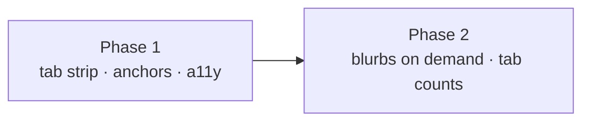

# Phased implementation - Foreman settings, grouped tabs

Source plan: [`plan.md`](plan.md) ([rendered](plan.html)) · mockups:
[`index.html`](index.html) (all six options) and
[`option-b-tabs.html`](option-b-tabs.html) (the adopted design, interactive).

## Incorporated human decisions

These are requirements, not open questions.

| Decision | Answer | Owned by |
| --- | --- | --- |
| Which of the six mocked options to build | **Option B, grouped tabs.** Four groups - Posture, Models, Launches, Safety - behind a tab strip, with the posture line and the read-only cards outside it. | Phase 1 |
| Whether Foreman gets a Trust group | **No.** Foreman cannot edit the repo allowlist; it shows a read-only count and links into the Trust category. No tab may contain a repository editor. | Phase 1 |
| After the plan | Create the phased implementation plan and schedule dependency-linked tasks. | this document |

## What the repository confirmed

Read against the working tree before the phases were drawn. Two findings changed the design;
the rest changed the size of the work.

- **Inactive tab panels cannot unmount.** Two node tests require every Foreman anchor to be
  present in a single `renderToStaticMarkup` call with no interaction possible:
  `test/foreman-console.test.ts:190-209` asserts eleven literal anchors and a count of seven
  model anchors, and `test/settings-search.test.ts:106-114` asserts every indexed control's
  anchor is one the default render produces. Four of the five indexed Foreman anchors live in
  three different groups, so no single paint can show them all if inactive panels unmount.
  Both tests protect something real, so the design satisfies them: **all four panels render and
  the inactive ones carry `hidden`**, which keeps them in the document and out of layout.
- **`hidden` alone breaks every deep link, silently.** `SettingsPage.tsx:292-293` finds an
  anchor with a document-wide `querySelector`, so it would find the hidden element and call
  `scrollIntoView` on a `display: none` node - a no-op with an invisible flash. Its
  `MutationObserver` fallback (`:310-325`) waits 5s and then gives up with no error, by design
  (`:299-309`). The fix is ordering, not new machinery: React commits a child's render before
  running a parent's effect, so the panel selects the owning tab **during render** and the
  element is visible by the time the flash effect runs. An e2e case proves it rather than
  trusting it.
- **The blurb is already in a tooltip, and rendered twice.** `ModelField.tsx:91-107` wraps every
  model select in `<Tooltip label={spec.blurb}>` *and* prints
  `<p className="settings-hint foreman-model-blurb">{spec.blurb}</p>`. Seven of the eleven
  Foreman settings are `ModelField`s, so most of the prose work is deleting a duplicate rather
  than building a hover.
- **`Tooltip` already covers focus and screen readers.** `Tooltip.tsx:154-190` merges `onFocus`
  and `onBlur` as well as the pointer handlers, and `:32-40` always renders the label into a
  visually-hidden portal that `aria-describedby` points at - explicitly so a hover-only label
  remains assertable in a repository with no jsdom. So prose moved into a tooltip is not hidden
  from tests or from assistive technology.
- **`ModelField` is shared by four panels** (`ForemanSettingsPanel`, `InspectorSettingsPanel`,
  `LlmSettingsPanel`, `workflows/PersonaEditor`), so suppressing the visible blurb must be
  opt-in with today's behaviour as the default.
- **Everything in `settings-console.tsx` has three or more consumers.** `ConsoleCard`,
  `ConsoleState` and `ConsoleStrip` are used across Foreman, Inspector, Shipping and Workflows,
  so the tab strip is a new leaf beside them and `ConsoleCard` gains no tab awareness.
- **The tab pattern to copy already exists.** `SettingsPage.tsx:507-553` plus `onTablistKey` at
  `:380-408` is the repository's only full roving-tabindex implementation and is already pinned
  by `test/settings-sidebar-render.test.ts:349-395`. `src/web/lib/detailTabs.ts:19-52` is the
  precedent for keeping the tab table as a pure exported value, testable without a DOM.
- **`.sc-seg` is not a tab strip.** It is a radio group in a `<fieldset>`, pinned as such by
  `test/settings-console.test.ts:269-277`. The cheap-tier control keeps it; the tab strip needs
  its own class.
- **Two e2e specs assume a click-free pane.**
  `e2e/specs/dispatch-and-converse.spec.ts:472-503` navigates straight to the category and
  asserts both safeguard checkboxes are visible, so it must select the Safety tab first.
  `e2e/specs/foreman-decision-ledger.spec.ts:175-181` expects the ledger, which stays outside
  the strip and is expected to keep passing untouched.
- **No Electron geometry test touches this pane.** The only laid-out height budget for it is
  `e2e/specs/foreman-decision-ledger.spec.ts:320-323`
  (`scrollHeight - innerHeight < 2000`), which this change can only improve.

### Discrepancies recorded against the source plan

1. **The plan implies building a focus-reveal for the blurbs.** It says each blurb "moves to a
   hover affordance and prints in full under whichever field currently has focus". The
   repository disproves the need: `Tooltip` already fires on focus and already renders a hidden
   portal copy. Phase 2 removes a duplicate instead of adding a mechanism. The user-visible
   outcome is what the plan asked for.
2. **The plan's requirement 6 is not a property of the tab strip.** Stating each tab's settings
   count is presentation of the prose work, so it is owned by Phase 2 rather than Phase 1. Phase
   1's audit record notes the deferral explicitly.
3. **The mockup's "Safety" tab carries a status dot.** Nothing in the data model backs a
   safeguard status, so the dot is dropped; the count from requirement 6 takes its place.

## Phases

| # | Phase | File | Direct prerequisites |
| --- | --- | --- | --- |
| 1 | The tab strip, the group table, and the deep-link contract | [`phase-1-tab-strip-and-anchors.md`](phase-1-tab-strip-and-anchors.md) | - |
| 2 | The prose stops being printed twice | [`phase-2-blurbs-on-demand.md`](phase-2-blurbs-on-demand.md) | Phase 1 |

### Dependency graph



Phase 1 &rarr; Phase 2. **Nothing runs concurrently.** Phase 2 edits the same JSX Phase 1
regroups and adds a count to the tab labels Phase 1 creates; splitting them to run in parallel
would mean two agents rewriting one component.

**Merge order:** Phase 1, then Phase 2.

Phase 1 is deliberately the larger and riskier unit. It carries the anchor contract, the
accessibility semantics, and both e2e updates, because those are what a reviewer needs to see
together. Phase 2 is small, low-risk, and independently valuable - if it never merged, the
panel would still be short and correct, just as wordy as it is today.

## Cross-phase contracts

Phase 1 establishes these; Phase 2 consumes them and must not change their shape.

| Contract | Shape | Notes |
| --- | --- | --- |
| `FOREMAN_SETTINGS_TABS` | ordered `as const` array of `{ id, label, anchors }` in `src/web/lib/foreman-settings-tabs.ts` | The one group table. Phase 2 adds the settings count off it. Ids and order are append-only; no anchor moves between groups. |
| `foremanTabForAnchor(anchor)` | `(anchor: string) => ForemanSettingsTabId \| null` | The single answer to "which tab owns this anchor". `null` for the three deliberate outsiders: `foreman/live-repos`, `foreman/health`, `foreman/episodes`. |
| `jumpAnchor` on `ForemanSettingsPanel` | `string \| null`, passed from `SettingsPage`'s existing `pending` state, resolved to a tab **during render** | The deep-link contract. Converting it to an effect reintroduces the silent-flash bug. |
| Tab panel mounting | all four rendered, inactive carry `hidden` | Load-bearing for two node tests and for every deep link. Not an optimisation to revisit. |
| Outside the strip | the posture line, Live repositories, Right now, the ledger | The posture line because a dead worker must never be a click away; Live repositories because Foreman cannot edit it. |
| `ModelField.blurb` | `"block" \| "hover"`, default `"block"` | Introduced in Phase 2. The default preserves Inspector, the LLM panel and the persona editor unchanged. |

## Final verification

Each phase runs its own verification. Across both, the definition of done is the repository's:

```sh
npm run typecheck
npm run lint
npm test
npm run build && npm run smoke
npm run test:e2e
```

`npm run test:e2e` needs `npm run build` first and `npx playwright install chromium` once per
machine. README and this plan directory must match the implementation when Phase 2 merges.

The one verification neither phase may waive: **a deep link into a tab that is not selected
must open that tab, scroll to the control, and flash it.** That is the single behaviour this
refactor can silently destroy, and `SettingsPage` gives up on a missing anchor without an
error.

## Cross-phase audit record

- **After Phase 1 was written.** Confirmed Phase 1 leaves the repository valid on its own: the
  column is short, the strip is keyboard operable, every anchor still renders, and every deep
  link resolves. Confirmed the two static-render anchor tests pass unchanged rather than being
  rewritten, and that both e2e updates live inside Phase 1 rather than being deferred.
  Confirmed the phase touches no export of `settings-console.tsx` and no CSS rule shared by
  three or more panels.
- **After Phase 2 was written.** Re-read the source plan and Phase 1. Confirmed Phase 2 adds no
  anchor, moves none between groups, and does not touch the mounting strategy or `jumpAnchor`.
  Confirmed the `ModelField` change is opt-in so its three other consumers are unaffected, and
  that the two group intro paragraphs Phase 2 keeps are exactly the two the existing tests
  assert by name - so no test needs rewriting in either phase. Moved requirement 6 into Phase 2
  and recorded the deferral in Phase 1's audit record.
- **Final pass over both.** Every source-plan requirement is owned by exactly one phase:
  requirements 1-5 and 8-10 by Phase 1, requirements 6 and 7 by Phase 2. Both recorded human
  decisions are owned by Phase 1. The dependency direction is single and forward, there are no
  concurrency claims to check, and no phase depends on a later phase to repair a knowingly
  broken intermediate state.
