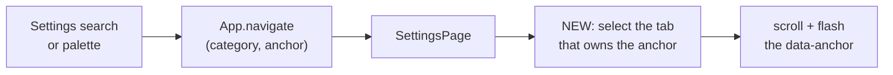

# Foreman settings: group the control column behind tabs

The Foreman settings pane's left control column is 2.3 screens tall beside a ledger that
never grows. This plan adopts **Option B, grouped tabs**, from the six alternatives mocked
up in this directory.

Mockups: [`index.html`](index.html) (all six, with the measurements) ·
[`option-b-tabs.html`](option-b-tabs.html) (the adopted design, interactive).

## The problem, measured

Taken from the live pane at an 849px viewport, against the running daemon.

| | |
| --- | --- |
| Control column (`.sc-controls`) | **1988px** - 2.3 screens |
| Interactive elements in it | **14**, across **11** distinct settings - roughly one every 142px |
| Ledger beside it | **597px**, and it scrolls inside itself, so it never grows |
| Ledger's `Asked` column | **366px**, truncating the `purpose` line on nearly every row |

Two facts explain the length:

- **Seven of the eleven settings are model dropdowns** - the provider, four Foreman roles,
  three backlog harnesses. They are set once and then never touched, and they occupy about
  900px, roughly 45% of the column.
- **Most of the pixels are prose.** Every field carries a two-to-three line blurb that is
  load bearing the first time it is read and noise every time after.

Everything past the first screenful is form on the left and dead space on the right.

## The decision

Six alternatives were built as interactive mockups and measured. **Option B, grouped tabs,
is adopted.** The others are recorded in [`index.html`](index.html) with their measurements
and trade-offs, and are not revisited here.

Option B was chosen because it is the only option that fixes the length while changing no
control, no copy and no deep-link anchor, and it leaves the two sibling console panels
(Inspector and Shipping) untouched. It is explicitly **not** the option that produces the
shortest column - A (digest rows) reaches 553px and E (the config as a sentence) reaches
325px - and that trade is accepted: this change buys a shorter panel at a known, reversible
cost rather than buying the shortest panel at the cost of the shared console layout.

## What Option B is

The stacked `ConsoleCard`s in the control column become four groups behind a tab strip, so
the column's height is the tallest group rather than the sum of all of them.

| Tab | Settings | Contents |
| --- | --- | --- |
| Posture | 1 | The cheap tier segmented control |
| Models | 5 | Provider, then the four Foreman roles - Review, Verify, Triage, Backlog |
| Launches | 3 | The three per-harness backlog launch models - Claude, Codex, Pi |
| Safety | 2 | The two completion safeguards |

Two things stay outside the tabs, permanently visible:

- **The posture line** (`ConsoleState`) sits above the tab strip in every tab. It is a
  reading rather than a setting, and it is the one thing on the panel that must never be a
  click away: `Live`, and especially *"Enabled, but no worker is running"*, are exactly the
  states a tab could hide.
- **Live repositories and Right now.** Both are read-only. See the correctness note below.

The second half of the fix is the prose. A three-line blurb under every dropdown is what
turned 11 settings into 1988px, so each field's blurb moves to a hover affordance and prints
in full under whichever field currently has focus. No sentence is deleted; it is spent when
asked for rather than always.

### Measured result

From the interactive mockup, read off the laid-out page rather than asserted:

| Tab | Group card | Whole control column |
| --- | --- | --- |
| Posture | 207px | 557px |
| Models | 380px | **729px** (worst case) |
| Launches | 307px | 657px |
| Safety | 369px | 718px |

1988px becomes 557-729px depending on the tab. The column stops being the reason the page
scrolls.

## Correctness: Foreman has no Trust setting

An earlier draft of the mockups gave Foreman a fifth "Trust" tab. That invented a control
the panel does not have, and it must not be built.

Foreman cannot edit the repo allowlist. `TrustGrantSummary` renders a read-only count and a
`settings-link` that navigates to the separate Trust settings category, which is where the
grant is edited. The Live repositories card therefore stays outside the tab strip as a
sentence that links out, and **no tab may contain a repository editor**.

Two related facts the implementation must preserve:

- **The model lists are provider-scoped.** Changing the provider clears all four role
  overrides, and the option list re-lists for the newly selected provider. A Claude model id
  is not interchangeable with a Codex one.
- **The ledger's Cheap-tier column is keyed on the Shadow posture only.** It is not part of
  this change and its existing condition stays exactly as it is.

## The one flow this changes: the deep-link jump

Everything else here is layout. The one path that genuinely changes is how a deep link
reaches a control, because a tab can make the target absent from the DOM.

Today the settings search resolves a hit to a category plus an anchor, `App` navigates to
the category, and `SettingsPage` scrolls the `data-anchor` element into view and flashes it.
Every anchor is always mounted, so the scroll always finds its target.

After this change, four of the anchors live inside a tab panel that may not be rendered. The
jump therefore gains one step: resolve which tab owns the anchor, select that tab, and only
then scroll and flash. An anchor whose tab is not selected first would scroll to nothing and
flash nothing - silently, which is the failure mode this plan is most concerned with.



## Requirements

1. The four groups above, behind a tab strip, with the stated membership.
2. The posture line renders above the tab strip in every tab.
3. Live repositories and Right now stay outside the tab strip and stay read-only.
4. Every existing `data-anchor` deep link still resolves. A jump to an anchor inside a tab
   that is not open must switch to that tab before scrolling and flashing the target.
5. The tab strip is keyboard operable and correctly announced: `role="tablist"` /
   `role="tab"` / `role="tabpanel"`, `aria-selected`, roving tab index, and arrow-key
   movement.
6. Each tab states how many settings it holds, so an unopened tab still says how much is
   behind it.
7. Every field's blurb remains reachable - on hover and on focus - and none is deleted.
8. No control is added, removed, or changed in what it writes.
9. Inspector and Shipping are not modified.
10. No `data-testid`. Selection is by role, label, or placeholder.

## Non-goals

- Changing the ledger, its columns, its strip, or its filtering.
- Changing what any setting does, its persisted shape, or any server route.
- Changing the Inspector or Shipping panels, or the shared `sc-split` layout itself.
- Adding a repository editor to Foreman under any tab.
- Persisting the selected tab across sessions. The tab resets to Posture on mount; deep
  links select a tab for the duration of the visit.

## Verification

Per the repository's definition of done, and because this is a UI change it requires a
Playwright spec in `e2e/`:

```sh
npm run typecheck
npm run lint
npm test
npm run build && npm run smoke
npm run test:e2e
```

The e2e spec must cover, at minimum: each tab reveals its own group and hides the others;
the posture line is visible in every tab; a deep link into a closed tab opens that tab and
lands on the control; and Live repositories renders as a link rather than an editor.
