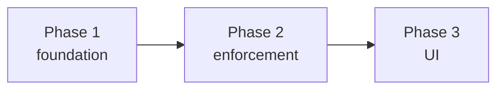

# Foreman invites - phased implementation plan

Source plan: [plan.md](plan.md) (rendered: [plan.html](plan.html)). This index splits
the approved plan into three merge units and records the contracts between them. Each
phase file stands alone for the agent implementing it.

## Incorporated human decisions (submitted 2026-08-09)

1. **Dispatched terminals are auto-invited** (`source='dispatch'`) - phase 1.
2. **An operator invite grants everything except backlog assignment**; the autopilot
   assigns only into `"sdk"`/`"dispatch"` sessions - phase 2.
3. **Withdraw lives in the Foreman drawer header** - phase 3.
4. **Phased implementation with dependency-linked tasks** - this document.

## Investigation findings that shaped the phases

The repository was verified before decomposition (three deep passes: server
foundation, Foreman worker, UI/e2e). The findings that changed the source plan and
their dispositions, all reconciled into `plan.md`:

- Only `pending_turns` auto-rekeys on agent-session binding; notes and goals strand
  their rows. An invite must move on key rotation or dispatched sessions silently
  lose Foreman when hooks land → the registry moves the row at its existing rotation
  detection points (phase 1).
- The dispatcher has no db access; the SDK dispatch branch never reaches the
  terminal-dispatch wait → invites write through a new `Registry` method; SDK
  sessions are invited by default with no row (phase 1).
- Note and queue-state writes carry no actor marker (shared human/foreman routes) →
  the daemon backstop gates only the marker-carrying typing routes: inject,
  select-option, submit-options, review resolve (phase 2).
- The invite check belongs in `foremanTriageAuthorized` (four call sites move
  atomically, including the dashboard's needs-you badge), not in
  `foremanAutomationAuthorized` (a capability predicate mirrored browser-side and
  pinned by an invariant test) (phase 2).
- E2E cannot produce a discovered session (discovery is deliberately hard-off; all
  e2e sessions are SDK) → the `withdrawn` tombstone makes withdrawal authoritative
  even over the implicit SDK grant, which both closes a real gap (you could not kick
  Foreman out of an SDK session) and makes the full invite cycle e2e-testable with
  zero fixture changes (phases 1 and 3).
- Neither invite route needs a body → no `protocol.ts` schema changes at all
  (phase 1).

## Phases

| # | File | Delivers | Direct prerequisites |
| --- | --- | --- | --- |
| 1 | [phase-1-invite-foundation.md](phase-1-invite-foundation.md) | `foreman_invites` table, `Session.foremanInvite`, registry resolution + key-rotation move, dispatcher auto-invite, invite/withdraw routes, fixtures | none |
| 2 | [phase-2-foreman-enforcement.md](phase-2-foreman-enforcement.md) | Worker gates (triage, tick, PR follow-through, backlog), daemon 403 backstops, README behavior update - **the phase that stops the interruptions** | Phase 1 |
| 3 | [phase-3-invite-ui.md](phase-3-invite-ui.md) | Three-state rail control (＋ Invite foreman), drawer Withdraw invite, `not-invited` explanations, e2e spec | Phase 2 |

## Dependency graph and merge order

Strictly serial: 1 → 2 → 3. No concurrency group exists - phase 2 consumes phase 1's
field and routes, and phase 3 depends on phase 2 (not merely 1) so the UI never claims
"Foreman is not in this session" while the worker still acts there. Each phase leaves
the repository operable: after 1, the field is visible with zero behavior change;
after 2, Foreman is quiet on uninvited sessions with an API-only invite (short-lived,
documented); after 3, the full approved plan is live.

## Cross-phase contracts

| Id | Contract | Owner | Consumers |
| --- | --- | --- | --- |
| C1 | `Session.foremanInvite: "sdk" \| "dispatch" \| "operator" \| null`; `'withdrawn'` resolves to `null`, never surfaces | 1 | 2, 3 |
| C2 | `foreman_invites(note_key PK, source, created_at)`; source domain append-only; rotation/reset/prune lifecycle | 1 | 2, 3 |
| C3 | `POST` / `DELETE /api/sessions/:id/foreman-invite`; body-less; POST is restore-then-elevate (no-op when invited, tombstone deletion resumes implicit grants, `'operator'` only from null); DELETE is tombstone withdrawal; emits `session_upsert` | 1 | 3 |
| C4 | `Registry.setForemanInvite` / `withdrawForemanInvite` are the only write doors; worker and dispatcher never touch SQLite | 1 | 2 |
| C5 | `mkSession` defaults `foremanInvite: "dispatch"`; uninvited tests declare `null` | 1 | 2, 3 |
| C6 | Worker acts only when invite non-null; backlog assigns only `"sdk"\|"dispatch"`; human paths never invite-gated; daemon 403s Foreman-marked typing into uninvited sessions | 2 | 3 |
| C7 | Review follow-through refusal reason contains "not invited" | 2 | 3 |

## Final verification strategy

After phase 3 merges: `npm run typecheck && npm run lint && npm test && npm run build
&& npm run smoke && npm run test:e2e` on main, plus the live check from phase 2
section 7 (a personal terminal session next to a dispatched one under a running
Foreman worker: the former untouched and explained in the UI, the latter tracked). The
source plan's Compatibility section is the release note: pre-existing terminal
sessions start uninvited after upgrade.
