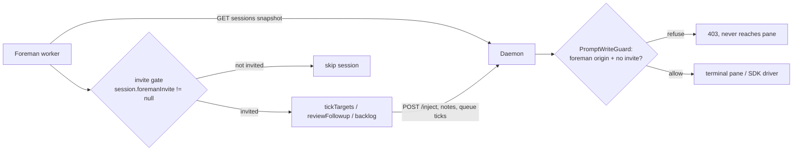
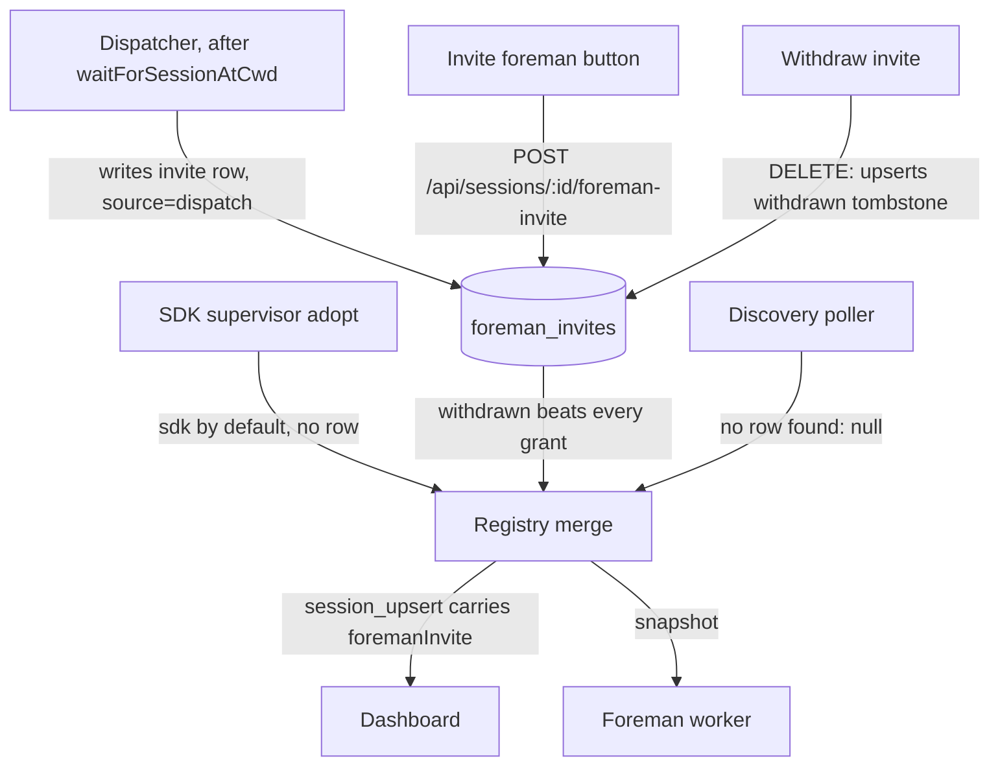

# Foreman invites: keep Foreman out of sessions Mission Control did not create

## Problem

Foreman currently tracks and types into every session it can see, including personal
Claude chats the operator started by hand. The system has no concept of session origin,
and the one authorization predicate it does have uses hook visibility as a proxy for
"we launched it". Claude's hooks are machine-scoped, so every personal Claude session
on the machine passes that check.

Three Foreman action paths reach sessions, and only one is gated at all:

| Path | Where | Gate today |
| --- | --- | --- |
| Triage / needs-you and work-queue ticks | `tickTargets`, `src/server/foreman/queue-machine.ts:210` | `foremanTriageAuthorized` on the needs-you half only; the work-queue and prompted-wrapup half checks only harness capability |
| PR follow-through ("create a PR", "follow CI") | `runReviewFollowup`, `src/server/foreman/worker.ts:796` | none - iterates every session with an open PR |
| Backlog autopilot (assigns whole tasks) | `agentIsFree`, `src/server/foreman/backlog-machine.ts:198` | mode + allowlist; explicitly counts hand-started terminals |

The PR follow-through path is the one interrupting personal sessions with instructions
to create a PR.

## Design: Foreman participation is an invite

One mechanism replaces origin inference everywhere: **Foreman may only act in a session
that holds an invite.** A session's invite state is a new field on the shared `Session`
record:

```
foremanInvite: "sdk" | "dispatch" | "operator" | null
```

- `"sdk"` - embedded SDK sessions. Mission Control created them by definition; they are
  invited by default, no row stored.
- `"dispatch"` - Mission Control dispatched this terminal session for a task. The
  dispatcher writes the invite automatically once discovery confirms the spawn.
- `"operator"` - a human clicked **Invite foreman** on the session.
- `null` - every other discovered session, and any session whose invite was withdrawn.
  Foreman does not track it, does not write notes or goals for it, does not tick its
  queue, does not follow its PRs, and the daemon refuses Foreman-origin writes into it.

Auto-discovered sessions therefore default to Foreman-off, and the invite is the single
explicit way back in. Withdrawal is authoritative for every session: a `withdrawn`
tombstone row beats even the implicit SDK grant, so the operator can kick Foreman out
of any session, embedded ones included, and invite it back later.

### Why an invite table and not an origin flag

MC-dispatched terminal sessions re-enter the registry through the same TTY discovery
scan as personal sessions (`Dispatcher.dispatch` spawns, then waits for the poller via
`waitForSessionAtCwd`, `src/server/dispatcher.ts:267`), and the task linkage that could
distinguish them is pruned when the task finishes. Session ids are synthetic
(tty+pid+start) and re-mint on restart. The codebase already solves durable per-session
state with `note_key` rows (`noteKeyFor = agentSessionId ?? id`, `registry.ts:5654`) -
`session_notes`, `session_goals`, and `skills_acks` all key this way. Invites join that
pattern instead of inventing a parallel one.

## Flow change: Foreman targeting



The worker gates itself on the snapshot field (it never touches SQLite - the daemon
stays the only database writer), and the daemon independently refuses Foreman-origin
writes into uninvited sessions, so the worker gate cannot be bypassed by a stale or
buggy worker.

## Flow change: how a session becomes invited (or uninvited)



## Data model and server changes

1. **`foreman_invites` table** (`src/server/db.ts`, beside `session_goals` and
   `skills_acks`):

   ```sql
   CREATE TABLE IF NOT EXISTS foreman_invites (
     note_key   TEXT PRIMARY KEY,   -- noteKeyFor(s), same key as session_notes
     source     TEXT NOT NULL CHECK (source IN ('dispatch','operator','withdrawn')),
     created_at INTEGER NOT NULL
   );
   ```

   One row per key holds the latest explicit state; `'withdrawn'` is the tombstone
   that overrides the implicit SDK grant.

   New-table creation is safe on existing databases; no column migration needed.
   Key rotation must be handled explicitly: only `pending_turns` auto-rekeys today
   (`PendingTurnManager.moveConversationKey`, `pending-turns.ts:387`); notes and goals
   strand their rows, which for an invite would silently kick Foreman off a dispatched
   session the moment its hooks land. The registry owns the invite cache (loaded at
   boot like notes, `registry.ts:595`), so it moves the row and cache entry at all
   four of its noteKey-rotation points - the cost-recompute comparisons at
   `registry.ts:1596`, `1829`, `3550`, and `bindLaunchedAgentSession`
   (`registry.ts:1933`), the Pi-dispatch rebind that would otherwise strand a freshly
   dispatched Pi session's invite - and session reset (`reset.ts:117-124`) moves
   the invite to the post-reset key rather than dropping it - an invite belongs to the
   pane, not the conversation. A `pruneForemanInvites` sweep follows the
   `pruneSessionGoals` pattern for hygiene.

2. **`Session.foremanInvite`** (`src/shared/types.ts`, beside `runtime`), plus the
   compiler-forced comparator entry in `SESSION_FIELD_COMPARATORS`
   (`src/server/registry.ts:5808`, `byValue`).

3. **Registry** resolves the field at merge time from one rule: a `'withdrawn'` row
   means `null`; otherwise `registerSdkSession` resolves `"sdk"`, and `mergeDiscovered`
   resolves `"dispatch"`, `"operator"`, or `null` from the cached invite map (in
   memory like notes). Field changes emit the usual `session_upsert` - no new server
   event type, so `useEventStream.ts` needs only the type update.

4. **Dispatcher** writes the `source='dispatch'` invite immediately after
   `waitForSessionAtCwd` succeeds (`dispatcher.ts:267`), next to the existing
   `terminalResourceId` patch - through a new `Registry.setForemanInvite` method, since
   the dispatcher deliberately has no db access. The embedded SDK dispatch branch
   returns earlier and needs no row: SDK sessions default to `"sdk"`.

5. **Routes** (`src/server/routes.ts`; both body-less, matching every existing
   DELETE):
   - `POST /api/sessions/:id/foreman-invite` - invite, **restore-then-elevate**: a
     no-op when already invited; otherwise it deletes a `'withdrawn'` tombstone so
     runtime-implied grants resume - a withdrawn SDK session gets `"sdk"` back,
     backlog eligibility included, rather than a permanent invisible `"operator"`
     downgrade - and writes `source='operator'` only when the state would otherwise
     stay `null`. One documented residue: a withdrawn, previously dispatched
     terminal re-invites as `"operator"` (the tombstone replaced its `'dispatch'`
     row) until a fresh dispatch restores `"dispatch"`.
   - `DELETE /api/sessions/:id/foreman-invite` - withdraw: upsert the `'withdrawn'`
     tombstone, so the withdrawal also beats the implicit SDK grant and survives
     restarts. The verb still removes the resource (the invite); the tombstone is how
     removal stays authoritative for sessions that would otherwise re-derive one.

## Foreman worker gating

The invite check lands inside `foremanTriageAuthorized`
(`src/server/foreman/authorization.ts:9`), not inside `foremanAutomationAuthorized`:
the latter is mirrored browser-side by `workQueueBlockedReason`
(`src/shared/harness-capabilities.ts:711`) and `test/queue-apply-sdk.test.ts` pins the
two in agreement, so widening it would force the capability mirror to learn invite
policy. Placing it in `foremanTriageAuthorized` covers four call sites at once: the
`tickTargets` needs-you half, `processSession` (`worker.ts:1690`), `decideQueueTick`
(`queue-machine.ts:326`), and `countNeedsYou` (`foreman/config.ts:218`) - the dashboard
badge that must stay in lockstep with the worker or it counts sessions the worker will
never process. The remaining selection sites get explicit gates:

- `tickTargets` rest half (`queue-machine.ts:214-220`) - a new invite conjunct beside
  the `workQueue` capability check; the two halves cannot share one call site because
  the rest half must stay reachable for hookless sessions with open work.
- `decideReviewFollowup` (`review-followup.ts:134`) - a new early `skip` refusal in the
  ordered gate list, covering both the initial decision and the freshness re-decision
  in `runReviewFollowup`.
- `agentIsFree` (`backlog-machine.ts:198`) - the backlog autopilot only assigns tasks
  into sessions whose invite is `"sdk"` or `"dispatch"`. An `"operator"` invite grants
  triage, wrapup, and PR follow-through but never backlog assignment - inviting Foreman
  to help with current work must not let the autopilot drop new tasks into a personal
  chat. The deliberate drag-assign asymmetry (documented at `backlog-machine.ts:162`
  and `234`, enforced server-side in `TaskManager.assign`, `tasks.ts:1376`) stays: a
  human dragging a task onto a session is always allowed; only the background loop is
  gated. `activeAgentCount` keeps counting uninvited sessions toward `maxSessions` -
  that cap is a claim about machine load, not participation.

The daemon-side backstop gates the routes whose payloads already carry an actor
marker: `/inject` (`origin: "foreman"`, refused through the existing
`PromptWriteGuard` hook, `actions.ts:346`), `/select-option` and `/submit-options`
(`by: "foreman"`), and review resolution. Those cover every typing act, including the
worker's submitted `sendText`, which delegates to inject. The note and queue-state
writes carry no actor marker (`SetNoteSchema` has no actor field) and stay ungated:
they are bookkeeping downstream of a typing act the selection gates already refused,
and widening their schemas is not worth the churn.

## UI changes

### The Invite foreman button

The far-right rail slot in the detail tab strip (`ConsoleDetail.tsx:390-401`) currently
renders **Foreman intent** (or **Foreman · N** once episodes exist), gated on
`episodes.length > 0 || session.goal`. It becomes a three-state control:

1. **Uninvited, live session**: renders **＋ Invite foreman** in the same slot and
   silhouette, accented with the Foreman purple (`--foreman`) so it reads as an action
   rather than a status. Tooltip: "Foreman is not in this session. Invite it to triage,
   wrap up, and follow PRs here." Click posts the invite; the resulting
   `session_upsert` swaps the button in place. No confirm step - the action is cheap
   and reversible.
2. **Invited, no history**: renders **Foreman intent** exactly as today, and now always
   (not only when a goal exists), so the slot never goes empty right after an invite
   and the drawer is reachable to capture an objective or withdraw the invite.
3. **Invited, with episodes**: **Foreman · N** with the attention dot, unchanged.

Withdrawing the invite lives in the Foreman drawer header as a small **Withdraw
invite** action, between the title and the pinned close button
(`ForemanDrawer.tsx:65-86`); the drawer's props widen to carry the session, which
deliberately breaks its render-test helper so every fixture states the new input. On
withdrawal the rail returns to state 1 - for every session, embedded SDK ones
included, since the tombstone beats the implicit grant. Both new buttons get their own
`Tooltip` wrapper: the tooltip-coverage scan walks every component under `src/web`.

### Honest silence everywhere else

`ForemanSendBlock` (`src/web/lib/foreman.ts:34`) gains `"not-invited"`, branching after
`"foreman-off"` and before `"drafts-only"` - an uninvited session is skipped regardless
of mode, so mode must not be the explanation. `foremanSendBlock` gains an `invited`
input (it is called directly by the work-queue panel, so the plain function needs the
field, not just `sessionSendBlock`). One new case in the shared `DraftHint`
(`foreman-bits.tsx:130`) covers the console strip and the grid card at once; the
work-queue panel's `QueueHint` gains the same case, and its render gate widens so the
sentence also shows on an empty queue - today the hint only renders with open items,
which would leave an uninvited empty-queue session unexplained. The sentence points at
the rail button: "Foreman is not in this session. Invite it from the rail above." The
grid `SessionCard` needs no new control in v1: uninvited sessions simply stop receiving
notes, and any pre-existing note still renders and resolves.

## Mockup

The rendered plan (`plan.html` beside this file) embeds a pixel-styled mockup of the
detail tab strip in the app's real palette, showing: state 1 (＋ Invite foreman, purple
accent, with tooltip), state 2 (Foreman intent after the click), state 3 (Foreman · 3
with the attention dot), the work-queue explanation line for an uninvited session, and
the drawer header with the Withdraw invite action.

## Compatibility and rollout

- On upgrade the invite table is empty, so every already-running terminal session -
  including previously dispatched ones - starts uninvited. Foreman goes quiet on them
  until the next dispatch or a manual invite. SDK sessions are unaffected. This is a
  release-note item, not a migration.
- The fleet-wide Foreman config (enabled, mode, repo allowlist) is untouched and still
  gates on top of invites.
- `test/helpers/session-fixture.ts` defaults `foremanInvite: "dispatch"` - true to
  what the fixture models (a dispatched worktree session), and it preserves the meaning
  of every test written under participate-always semantics. Tests exercising the new
  gating declare `foremanInvite: null` explicitly. A `null` default was considered and
  rejected: the rail renders in nearly every ConsoleDetail test (the fixture's goal is
  non-null), so a `null` default would churn unrelated render tests into the invite
  state.
- README's Foreman section and the change-contracts doc are updated in the same change.

## Tests

- **Unit** (`test/`): `foremanTriageAuthorized` matrix; `tickTargets` skips an uninvited
  session on both halves (mirroring the existing hook-authorization case at
  `test/queue-machine.test.ts:408`); `decideReviewFollowup` first-refusal;
  `agentIsFree` refusal; dispatcher writes the invite row
  (`test/dispatch.test.ts` family); invite rekey on agent-session binding;
  `foremanSendBlock` ordering; `renderToStaticMarkup` for the three rail states.
- **E2E** (`e2e/`, required for the UI change): discovery is deliberately hard-off in
  the e2e fixture (`MISSION_POLL_MS=0` - it would adopt the developer's real
  sessions), so the spec exercises the cycle on a dispatched session, which the
  tombstone makes possible: dispatch through the real modal, open the Foreman drawer,
  Withdraw invite, assert the rail flips to ＋ Invite foreman and the work-queue tab
  explains the silence, then Invite and assert the rail returns to Foreman intent.
  All three rail states, both routes, and the new reason, with zero fixture changes.
  Selected by role and accessible name, no test ids, fake agents only.

## Resolved decisions

Reviewed and decided 2026-08-09:

1. **Dispatched terminals are auto-invited** (`source='dispatch'`). The Foreman
   autopilot keeps working on task sessions unchanged.
2. **An operator invite grants everything except backlog assignment**: triage, wrapup,
   and PR follow-through. The backlog autopilot assigns tasks only into `"sdk"` and
   `"dispatch"` sessions.
3. **Withdraw lives in the Foreman drawer header**, returning the rail to the Invite
   foreman state.

## Out of scope

- An invite affordance on the grid `SessionCard` (the console and board drill-in share
  `ConsoleDetail`, which covers both detail surfaces).
- Any change to how a human manually messages, drags tasks onto, or reviews a session.
- Per-repo or fleet-wide invite defaults beyond the existing allowlist.

## Effort

| Chunk | Files | Size |
| --- | --- | --- |
| `foreman_invites` table + rekey + registry resolution + comparator | `db.ts`, `registry.ts`, `types.ts` | M |
| Dispatcher auto-invite + invite routes + protocol schemas | `dispatcher.ts`, `routes.ts`, `protocol.ts` | S |
| `foremanTriageAuthorized` widening + call-site gates + daemon backstop | `foreman/*`, `routes.ts` | M |
| Rail button three states + drawer withdraw + send-block reason | `ConsoleDetail.tsx`, `ForemanDrawer`, `lib/foreman.ts`, `styles.css` | M |
| Unit + e2e tests, fixture default flip | `test/`, `e2e/` | M |

Roughly 1.5 to 2 days of focused work. Ships as one PR, or two (server invite model,
then worker gating + UI) if a smaller review is preferred - the second half is the one
that stops the interruptions and depends on the first.
